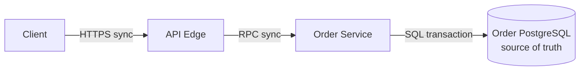

# Building the HLD Incrementally

## Rule

Every box must be introduced by a requirement, invariant, bottleneck, or failure boundary. Start with a working vertical slice and evolve it; do not reveal a memorized final diagram.

## Version 1 — prove function

Draw client → edge → named domain service → authoritative store. Label protocol, owner, commit, and response semantics. Add an external dependency only if the critical journey requires it.



Trace one success and one timeout after possible commit before scaling.

## Version 2 — fix the first bottleneck

Use estimation. Add one of: cache for repeated reads; partition routing for write/data volume; queue for slow/bursty work; object store/CDN for large immutable blobs; search index for text/geospatial access; connection gateway for realtime. State the new failure and consistency cost.

## Version 3 — resilience or geography

Add replicas, multi-zone placement, failover, backups, admission control, or a region strategy only for a stated target. Define write authority, replication lag/conflict semantics, RPO/RTO, and degraded behavior.

## Whiteboard layout

- left: clients and trust boundary;
- top/centre: synchronous critical path;
- bottom: async topics/queues and workers;
- right: authoritative and derived stores;
- margin: assumptions, invariants, metrics, rejected alternatives;
- numbered solid arrows = sync; dashed arrows = async.

Use meaningful labels: `Payment Command Topic`, not `stream`; `Trip PostgreSQL`, not `database`; `Current Driver Location Redis`, not `cache`.

## Diagram legend

```text
→ synchronous request/response   ⇢ asynchronous event/job
[(...)] authoritative durable store   [(derived ...)] rebuildable view
```

## Narration pattern

“Client sends X over HTTPS. Service Y validates Z and atomically writes A. That commit is the user-visible acceptance point. Outbox event B is relayed asynchronously to worker C. Store D is derived and may lag by the agreed bound.”

## Common mistakes

Crossing arrows, unlabeled protocols, cache hiding its source, queue without producer/consumer/key, replica with no lag semantics, multi-region with no writer, component per noun, and adding Kubernetes as an architecture responsibility.

## Follow-ups

Show what changes if load is 100×, if a dependency fails, if strong consistency is required, or if cost dominates. Change the smallest branch and restate the new trade-off.

## Five-minute revision

V1 working slice → numbered critical flow → commit/owner → first bottleneck → V2 targeted component → new failure → V3 resilience/region only if required.

Related: [[HLD Drawing Checklist]] · [[Finding Bottlenecks]] · [[45-Minute System Design Playbook]].

