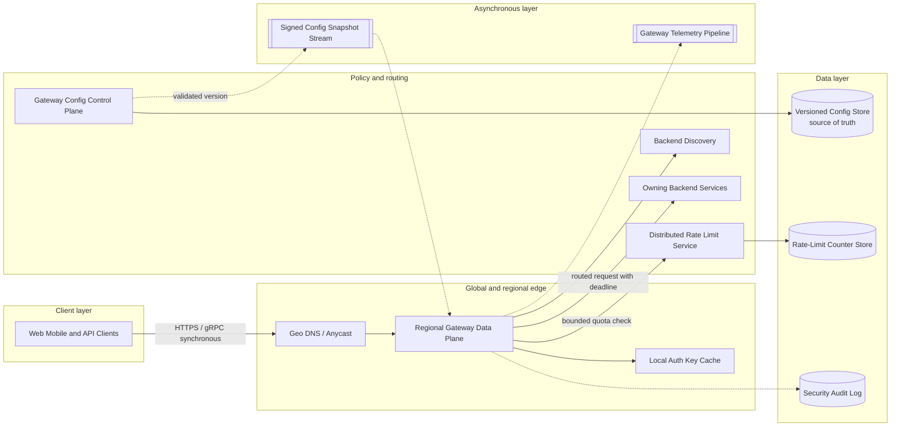

# API Gateway System

## 0. Interview classification

- **Primary challenge:** apply authentication, routing, policy, and overload protection on every request without becoming a global bottleneck or single failure domain.
- **Secondary challenges:** configuration propagation, rate limits, retries, protocol translation, canary routing, tenant isolation, and observability.
- **Patterns exercised:** [[Rate Limiting Pattern]], [[Retry Timeout and Deadline Pattern]], [[Circuit Breaker Pattern]], [[Bulkhead Pattern]], [[Backpressure and Load Shedding]].
- **Expected interview level:** Senior Backend / Senior Golang; Staff signals come from narrowed guarantees and operational judgment.
- **Recommended prerequisites:** [[Load Balancing]], [[Stateless and Stateful Services]], [[Security Abuse and Privacy]], [[Observability and SLOs]], [[Consistency Models]].
- **Candidate design disclaimer:** “An interview-oriented candidate design based on public information and distributed-systems principles, not a claim about the company’s exact internal implementation.”

## 1. How to approach this problem

- **First questions:** Is the gateway north-south, internal, or both? Which policies are mandatory? What scale and latency budget? How is configuration changed? Should the gateway retry?
- **Hidden complexity:** apply authentication, routing, policy, and overload protection on every request without becoming a global bottleneck or single failure domain; make the invariant and failure boundary visible.
- **What not to over-design:** business workflow orchestration, arbitrary response composition, internal service-mesh sidecars, identity-provider internals, and replacing application authorization
- **What the interviewer is testing:** bounded scope, ownership, complete flow, causal scaling, and explicit trade-offs.
- **Mental model:** derive authority and commit point first; add components only when a requirement or bottleneck forces them.
- **Expected deep-dive branches:** Configuration safety; Hierarchical rate limiting; Safe retries and deadlines.

## 2. Interview timeline for this system

- **0–3:** restate a globally deployed, regional API gateway data plane plus safe configuration control plane for public HTTP and gRPC APIs; park business workflow orchestration, arbitrary response composition, internal service-mesh sidecars, identity-provider internals, and replacing application authorization
- **3–7:** clarify NFRs and calculate the dominant rate, data, and skew.
- **7–12:** state invariants, entities, APIs, keys, and source of truth.
- **12–22:** draw Version 1 and trace the critical flow.
- **22–32:** ask the interviewer to select Configuration safety, Hierarchical rate limiting, Safe retries and deadlines.
- **32–39:** address Compute: TLS, authentication, compression, and policy filters; use session reuse/hardware support and keep filters bounded., Network: gateway carries every byte; streaming and zero-copy paths matter, while large uploads may use signed object-store URLs., Hot keys: global quota descriptors; hierarchical token allocation prevents one atomic counter hotspot. and failure controls.
- **39–43:** make decisions from the trade-off table; add region/security only where relevant.
- **43–45:** summarize guarantees, relaxed state, risks, and next validation.

## 3. Requirements clarification

| Candidate question | Possible interviewer answer |
| --- | --- |
| Is the gateway north-south, internal, or both? | Public north-south HTTP/gRPC ingress; service mesh is out of scope. |
| Which policies are mandatory? | TLS termination, authentication, authorization hooks, routing, rate limits, request limits, and observability. |
| What scale and latency budget? | 2M requests/s peak globally; gateway adds less than 10 ms p99 in-region. |
| How is configuration changed? | Versioned control plane with validation, staged rollout, and fast rollback. |
| Should the gateway retry? | Only safe/idempotent operations, once, within caller deadline and retry budget. |

**Selected scope:** a globally deployed, regional API gateway data plane plus safe configuration control plane for public HTTP and gRPC APIs

**Explicit non-goals:** business workflow orchestration, arbitrary response composition, internal service-mesh sidecars, identity-provider internals, and replacing application authorization

## 4. Functional requirements

- Terminate TLS and authenticate callers.
- Route by host/path/method/version to healthy backends.
- Enforce request size, quotas, local and distributed rate limits.
- Apply bounded timeouts, safe retries, circuit breakers, and load shedding.
- Support canary/weighted routes and protocol translation where explicit.
- Emit access, policy, latency, and trace telemetry.
- Distribute validated configuration and roll it back safely.

## 5. Non-functional requirements

- Interview assumption: 2M peak requests/s globally across ten regions.
- Gateway-added p99 latency below 10 ms in a region.
- 99.99% regional availability; one region can drain to another under capacity policy.
- No cross-tenant policy leak and fail-closed for authentication uncertainty.
- Config propagation p99 under 30 seconds with last-known-good data plane behavior.
- Stateless request workers; durable control-plane configuration.

## 6. Back-of-the-envelope estimation

> [!important] Interview assumptions
> These values size a candidate design. They are not company or production facts.

At 2M peak requests/s across ten equally loaded regions, plan 200k/s per region, but 3× geographic skew means a hot region needs 600k/s. If one gateway instance safely handles 20k/s at target tail latency, 30 active instances plus 50% headroom gives 45 per hot region. At 2 KB average request and 8 KB response, 600k/s moves roughly 6 GB/s payload before TLS/protocol overhead. A 60-second local rate-limit bucket for 10M active principals cannot store full counters on every proxy; partition global quota state and keep bounded local token leases.

## 7. Core invariants

- Every accepted request is associated with an authenticated principal or explicitly public route.
- Route and policy decisions come from one internally consistent configuration snapshot/version.
- The gateway never retries a non-idempotent request unless an application-provided idempotency contract permits it.
- End-to-end deadline decreases at each hop; gateway work cannot outlive the caller budget.
- Tenant and route limits bound CPU, connections, bytes, and downstream concurrency.
- If control plane fails, data plane continues on validated last-known-good config.
- Application resource authorization remains with the owning service, not inferred solely at the edge.

## 8. Core entities

| Entity | Ownership and lifecycle |
| --- | --- |
| RouteConfig | Control plane owns host/path/method match, backend cluster, policy chain, timeout, retry, and rollout weights. |
| Principal | Identity verifier derives subject, tenant, scopes, credential type, and expiry from trusted authentication. |
| RateLimitPolicy | Policy service owns descriptors, capacity, refill, burst, scope, and failure mode. |
| BackendCluster | Discovery owns endpoints, locality, health, protocol, and capacity hints. |
| RequestContext | Data plane owns request ID, principal, config version, deadline, route, attempt, and trace context for one request. |
| Certificate | Certificate manager owns domains, key references, validity, deployment version, and renewal state. |

## 9. API design

| Method | Path or RPC | Request | Response | Authentication | Idempotency | Pagination | Error behaviour |
| --- | --- | --- | --- | --- | --- | --- | --- |
| ANY | /{configured path} | headers/body under route schema | backend response plus gateway headers | JWT/API key/mTLS/anonymous per route | Required for retried unsafe methods | Backend-defined | 400/401/403/404/413/429/502/503/504 |
| POST | /v1/routes | route spec, expected config version | candidate version, validation | platform admin mTLS | request_id | N/A | 400 conflict/unsafe; 409 version; 403 |
| POST | /v1/config/{version}:promote | stage, percent, health gates | rollout state | platform admin + approval | request_id | N/A | 409 failed validation; 422 gate failure |
| POST | RateLimit.Check | tenant, route, principal, cost | allow, remaining, reset | gateway workload mTLS | request_id within window | N/A | timeout follows route fail-open/closed policy |
| GET | /v1/config/status | region, version | ack/health by fleet | operator role | N/A | Opaque cursor for instances | 403 |

## 10. Data model

| Table/store | Primary key | Partition key | Important indexes | Source of truth | Retention | Consistency | Access pattern |
| --- | --- | --- | --- | --- | --- | --- | --- |
| Config store | config_version | global/region | route host/path; status | Gateway control plane | Full audit history | strong publication state | version fetch and rollback |
| Snapshot distribution | region + version | region | checksum | Control plane-derived | Last several versions | immutable signed snapshot | data-plane watch |
| Rate-limit counters | descriptor + window/epoch | hash(descriptor) | expiry | Rate-limit service | Window plus grace | atomic increment/token allocation | quota check |
| Endpoint registry | cluster + endpoint | cluster/region | health/locality | Service discovery | Current plus short history | eventual health, versioned config | backend selection |
| Audit log | request/config event ID | date/tenant | principal, route, decision | Security/platform | Policy-defined | append-only | investigation/compliance |
| Certificate metadata | domain | region/domain | expiry/status | Certificate manager | Certificate lifecycle | strong desired state | TLS selection/renewal |

## 11. First working design

### HLD: API Gateway System — candidate design



### ASCII fallback

```text
[Clients] --HTTPS/gRPC--> [Geo DNS/Anycast] --> [Regional Gateway Data Plane]
                                                       |--> [Local auth-key cache]
                                                       |--> [Distributed rate limits] --> [Counter Store]
                                                       |--> [Discovery] --> [Owning Backend]
                                                       +--async--> [Telemetry / Audit]
[Config Control Plane] --> [Versioned Config Store: source of truth] --signed snapshots--> gateways
```

**Legend:** solid arrow = synchronous request/response or direct state access; dashed arrow = asynchronous event/job. “Source of truth” owns authoritative state; “derived” can rebuild.

## 12. Complete critical flow

1. Client connects over TLS; global routing selects a healthy region and regional load balancer selects a gateway instance.
2. Gateway pins one validated config snapshot for the request, assigns request/trace ID, enforces byte/header/decompression limits, and matches route.
3. Authentication verifies credential using locally cached, expiry-bounded keys and creates a trusted principal; route-level coarse authorization is evaluated.
4. Gateway spends a local token lease or calls distributed RateLimit.Check under a small deadline; rejection returns 429 with retry metadata.
5. Backend discovery selects a healthy locality-aware endpoint; gateway forwards protocol, principal context, trace context, and a reduced deadline.
6. If a safe attempt fails before response and retry budget permits, gateway makes at most one retry to another endpoint; otherwise maps a precise 502/503/504.
7. Response limits/headers apply, access telemetry emits asynchronously, and business authorization/result remain owned by backend.

## 13. Evolve the design under scale

### Version 1

One stateless reverse proxy with static routes, TLS, auth, and backend health checks serves a regional API.

### Version 2

Dynamic routes and quotas require a versioned control plane, local config cache, distributed rate-limit state, and safe staged rollout; data plane keeps last-known-good.

### Version 3

Deploy independent regional fleets behind geo routing, signed delta snapshots, local authentication key caches, hierarchical token buckets, locality-aware failover, per-route bulkheads, canary routing, and config health gates.

**Partition and routing:** Request data plane scales statelessly by region. Rate-limit descriptors hash across counter shards; hot global tenants receive split or leased token allocations. Configuration is immutable by version and distributed to every region rather than sharded on request path.

## 14. Deep dive

### 1. Configuration safety

**Problem and alternatives:** A bad route can take down every API. Alternatives are direct mutable config, pull polling, or validated immutable snapshots with staged promotion.

**Selected design and detailed flow:** Control plane validates schema, route ambiguity, policy references, and safety limits; writes candidate version; canaries selected instances/traffic; promotes only on health gates; every request pins one snapshot and rollback republishes prior version.

**Trade-offs and failure handling:** Propagation is eventually consistent across instances, but each request is internally consistent. Expired/invalid snapshots are rejected; control-plane outage leaves data plane on last-known-good with staleness alerts.

### 2. Hierarchical rate limiting

**Problem and alternatives:** One global counter call per request adds latency and becomes a bottleneck. Alternatives are local-only limits, centralized atomic counters, or distributed token leases.

**Selected design and detailed flow:** Enforce cheap local connection/instance limits first. Regional rate service allocates bounded token leases from global/tenant/route budgets to gateways; strict scarce quotas can require synchronous shard checks.

**Trade-offs and failure handling:** Leases permit bounded overshoot equal to outstanding tokens. If limiter fails, security/expensive routes fail closed; low-risk routes may use conservative local fail-open budget.

### 3. Safe retries and deadlines

**Problem and alternatives:** Retries can duplicate effects and amplify overload. Alternatives are no gateway retries or policy-aware bounded retries.

**Selected design and detailed flow:** Route defines total timeout, per-attempt timeout, retryable status/reset conditions, idempotent methods or required key, and shared retry budget. Gateway retries once only if enough deadline remains and backend has not committed a visible response.

**Trade-offs and failure handling:** Some transient failures become user errors, but overload is contained. Attempt count and idempotency key propagate to backend; retry storm signals can disable retries dynamically.

## 15. Detailed success flow

1. Client calls POST /v1/orders with JWT and Idempotency-Key order-77 under config version 501.
2. Gateway validates 8 KB body, route, token signature/expiry, tenant scope, and spends one regional token in 2 ms.
3. Discovery selects order-api endpoint in the same zone; gateway forwards principal, key, trace, attempt 1, and 900 ms remaining deadline over gRPC.
4. Backend authorizes the specific account, persists order, and returns 201 in 80 ms.
5. Gateway applies response headers, returns within 86 ms, and emits route/config/principal/outcome telemetry asynchronously.
6. If telemetry is briefly unavailable, request still succeeds while bounded buffer/drop policy records the loss.

## 16. Detailed failure flows

### Failure 1 — Authentication key provider is unavailable

- **Detection:** JWKS refresh fails and key-cache expiry approaches.
- **Immediate behaviour:** Use unexpired cached keys; reject tokens needing unknown/expired keys rather than bypass verification.
- **Retry policy:** Refresh retries use jitter and circuit breaker outside the request path.
- **Idempotency/deduplication:** Token ID/cache lookup makes repeated validation harmless.
- **Recovery:** Provider recovers and keys refresh; emergency rollover follows audited control procedure.
- **User-visible outcome:** Existing valid cached-key tokens work; unknown-key callers receive 401/503 as policy states.
- **Observability:** key age, refresh errors, unknown kid rate, authentication SLO.

### Failure 2 — Rate-limit service times out

- **Detection:** Quota-check deadline and service error rate trigger.
- **Immediate behaviour:** Apply route-specific conservative local policy: fail closed for costly/security endpoints, bounded fail-open for low-risk reads.
- **Retry policy:** One short retry only if deadline budget permits; otherwise circuit break.
- **Idempotency/deduplication:** Request ID avoids double charging where supported; token leases avoid per-request call.
- **Recovery:** Reconcile token allocation after service recovery and reduce local leases during uncertainty.
- **User-visible outcome:** Some requests receive 429/503 or bounded extra traffic passes.
- **Observability:** limiter availability, local-fallback count, quota overshoot estimate, downstream saturation.

### Failure 3 — Bad configuration reaches canary

- **Detection:** Route 5xx, auth denials, or latency regress against health gates by version.
- **Immediate behaviour:** Freeze rollout and automatically return canaries to last-known-good snapshot.
- **Retry policy:** Do not retry promotion; require corrected version.
- **Idempotency/deduplication:** Immutable version and request pinning prevent mixed in-request policy.
- **Recovery:** Audit diff, repair candidate, validate and canary again.
- **User-visible outcome:** Only canary fraction affected for a short window.
- **Observability:** metrics by config version, rollback time, fleet acknowledgement, policy diff.

### Failure 4 — Backend overloads or times out

- **Detection:** Endpoint saturation, 503/reset, and deadline metrics rise.
- **Immediate behaviour:** Circuit-break unhealthy endpoints, enforce concurrency limit, shed low-priority traffic, and preserve capacity for critical routes.
- **Retry policy:** Only safe request gets one budgeted retry with jitter/alternate endpoint.
- **Idempotency/deduplication:** Idempotency key and backend ownership protect side effects.
- **Recovery:** Backend recovers; probes close breaker gradually and queues remain bounded.
- **User-visible outcome:** Explicit 503/504; no hanging connections.
- **Observability:** per-route inflight, retry ratio, backend p99, breaker/load-shed counters.

## 17. Bottlenecks and scalability

- Compute: TLS, authentication, compression, and policy filters; use session reuse/hardware support and keep filters bounded.
- Network: gateway carries every byte; streaming and zero-copy paths matter, while large uploads may use signed object-store URLs.
- Hot keys: global quota descriptors; hierarchical token allocation prevents one atomic counter hotspot.
- Connection count: event-driven I/O, per-client/route caps, and idle timeouts.
- Config fan-out: immutable delta/snapshot distribution and staged rollouts.
- Downstream contention: per-route concurrency bulkheads and load shedding protect services.
- Regional concentration: capacity plans include traffic shift and deny unsafe failover when destination lacks headroom.
- Telemetry cardinality: never label raw path/user IDs; route templates and sampling bound cost.

**Partitioning unit and routing strategy:** Request data plane scales statelessly by region. Rate-limit descriptors hash across counter shards; hot global tenants receive split or leased token allocations. Configuration is immutable by version and distributed to every region rather than sharded on request path.

## 18. Reliability and recovery

- Run stateless gateway instances across zones behind health-aware load balancing.
- Keep last-known-good config and bounded local authentication/rate state for control-plane failures.
- Propagate end-to-end deadlines and use route-aware bounded retries/circuit breakers.
- Bulkhead tenants/routes/backends; shed low-priority and oversized work before resource exhaustion.
- Use connection draining and config rollback during deployments.
- Replicate control-plane store and audit log; regularly restore configuration history.
- During region failure, shift only within capacity and preserve tenant/data residency constraints.

## 19. Observability

- **Key metrics:** requests, gateway-added p99, TLS/auth/policy time, status, bytes, inflight, retries, limiter decisions, config versions, backend saturation.
- **Logs:** sampled access and policy decision with request ID, route template, principal/tenant, config version, attempt; redact tokens/body.
- **Traces:** gateway server span and backend client attempt with auth/rate events.
- **SLI/SLO candidates:** 99.99% regional gateway availability; p99 added latency under 10 ms; valid config propagation under 30 seconds.
- **Dashboards:** regional/route golden signals, config-version comparison, auth/limiter health, backend capacity.
- **Alerts:** multi-window availability/latency burn, unknown-key spike, config regression, limiter fallback, regional capacity.
- **Business-level signals:** valid API success, abusive traffic blocked, backend load avoided, rollout safety.

## 20. Security and abuse

- TLS with modern policy; automate certificate rotation and protect private keys.
- Authenticate at edge, but backend owns resource-level authorization and distrusts spoofable headers.
- Strip hop-by-hop/untrusted identity headers; sign or use mTLS for propagated identity.
- Cap body/header/decompression, connection, and request rates; validate protocols to reduce request smuggling.
- Redact credentials/PII from logs and propagate privacy/data-residency policy.
- Audit config changes and sensitive decisions; separate control-plane duties.

## 21. Explicit trade-off table

| Decision | Selected option | Alternative | Why selected | Cost or weakness | When alternative wins |
| --- | --- | --- | --- | --- | --- |
| Data plane | Regional stateless proxies | One global proxy fleet | Low latency and blast radius | Config must propagate | Small single-region system |
| Config | Immutable versioned snapshots | Mutable shared records | Consistent request view and rollback | Eventual fleet convergence | Instant tiny config |
| Rate limits | Hierarchical token leases | Central check every request | Lower latency and scalable | Bounded quota overshoot | Strict low-volume quota |
| Auth keys | Expiry-bounded local cache | Identity call per request | Removes dependency latency | Revocation/key freshness window | Immediate introspection mandatory |
| Retries | One policy-safe retry | Retry all failures | Handles transient reset without storms | Some recoverable errors surface | Read-only low-load backend |
| Authorization | Coarse gateway plus resource owner | All at gateway | Correct ownership and reusable edge | Two enforcement layers | Gateway owns resource state |
| Failure mode | Per-route fail closed/open | One global policy | Matches risk | Policy complexity | Uniform risk |
| Canary | Weighted staged rollout | Fleet-wide push | Limits bad-config blast radius | Slower deployment | Emergency well-tested rollback |
| Protocol | HTTP/gRPC pass-through by default | Transform everything | Lower CPU and semantic risk | Clients/backends coordinate versions | Legacy integration requires mediation |
| Global failover | Capacity-gated routing | Always redirect | Avoids cascading destination failure | Some regional unavailability | Excess global headroom exists |

## 22. Technology choices

| Technology | Role | Why it fits | Viable alternative | Operational cost | When choice changes |
| --- | --- | --- | --- | --- | --- |
| Envoy | Gateway data-plane proxy | HTTP/gRPC, filters, xDS, observability | NGINX/HAProxy | Config/filter fleet operations | Simpler HTTP-only needs |
| Kubernetes Gateway API | Declarative route model | Portable typed resources | Cloud-native gateway config | Controller maturity/operations | Non-Kubernetes fleet |
| etcd/PostgreSQL | Control-plane config authority | Transactions/version history | Consul | Quorum/backup operations | Existing config platform |
| Redis | Distributed quota counters/token authority | Atomic operations and TTL | DynamoDB | Hot-key/failover operations | Managed global counters preferred |
| OpenTelemetry | Gateway traces/metrics | Standard context and signal export | Vendor SDK | Cardinality discipline | Single vendor mandated |
| Geo DNS/Anycast | Regional entry routing | Latency and health steering | CDN edge | Failover/capacity management | Provider edge already supplies gateway |

## 23. Interviewer follow-up questions

| Likely follow-up | Concise strong answer | Diagram change | Trade-off |
| --- | --- | --- | --- |
| What if the control plane fails? | Data planes keep last-known-good signed snapshot and alert on age; config changes pause. | Emphasize snapshot stream/cache. | Freshness versus availability. |
| Can the gateway guarantee exact quotas? | Only synchronous authority can be strict; token leases trade bounded overshoot for latency/availability. | Show token hierarchy. | Strictness versus scale. |
| Where should authorization live? | Gateway checks coarse scopes; resource-owning service makes state-dependent decision. | Label ownership at backend. | Central consistency versus domain correctness. |
| How do you handle a region failure? | Health routing shifts traffic only to regions with capacity and legal access; otherwise shed explicitly. | Add regional fleets/traffic manager. | Availability versus cascading overload/residency. |

## 24. What a weak candidate does

- Puts business orchestration and resource authorization entirely in the gateway.
- Retries every request without idempotency or deadline.
- Calls the rate limiter on one global Redis key per request.
- Ignores bad config as a failure mode.
- Assumes control plane must be up for requests.
- Does not budget gateway-added latency or network capacity.

## 25. What a strong senior candidate demonstrates

- Separates control and data planes and defines last-known-good behavior.
- Pins a policy version per request and stages changes by measurable gates.
- Uses hierarchical protection: connection, local, regional/global, downstream concurrency.
- Propagates deadlines and narrows retry semantics.
- Keeps domain authorization with state owner and makes identity propagation trustworthy.
- Plans region failover against capacity rather than drawing an unconditional arrow.

## 26. Five-minute revision

- **Requirements:** TLS/auth/routing/rate limit/protect/observe public APIs.
- **Critical invariant:** one config snapshot per request; no unsafe retry; backend owns resource authorization.
- **Core HLD:** global routing → regional gateway → auth/rate/discovery → backend; control plane streams signed config.
- **Most important data model:** immutable RouteConfig version and partitioned rate descriptors.
- **Critical flow:** pin config, validate/auth, quota, route with deadline, emit telemetry.
- **Three bottlenecks:** TLS/bytes, hot counters, connection/downstream saturation.
- **Three trade-offs:** regional planes, token leases, policy-safe retry.
- **Three failures:** key provider, limiter, bad config/backend overload.
- **Likely deep dive:** configuration safety.

## 27. Blank-page practice prompt

Design a globally deployed API gateway handling two million requests per second. It must terminate TLS, authenticate, route HTTP/gRPC, enforce quotas and request limits, protect backends, support canary configuration, and add less than ten milliseconds p99 in-region. Explain control-plane failure, retries, rate-limit consistency, and regional failover.

## 28. Adversarial variations

- Traffic grows 100× and one tenant owns 40%.
- Configuration must propagate in under one second.
- A global identity provider is down for 20 minutes.
- One backend is non-idempotent but clients retry aggressively.
- A region fails with no full spare capacity.
- Quota enforcement must become mathematically strict.
- Large uploads grow to multi-gigabyte objects.

## 29. Practice and re-test history

- [ ] Untimed reconstruction — date/result:
- [ ] 45-minute mock — score/date:
- [ ] Follow-up round — variation/result:
- [ ] One-day review — date/result:
- [ ] Three-day review — date/result:
- [ ] Seven-day review — date/result:
- [ ] Fourteen-day review — date/result:

Personal readiness remains `not-started` until evidence is recorded in [[System Design Practice Tracker]].

## 30. Related internal notes and verified external references

**Internal:** [[Load Balancing]] · [[Rate Limiting Pattern]] · [[Retry Timeout and Deadline Pattern]] · [[Circuit Breaker Pattern]] · [[Bulkhead Pattern]] · [[Security Abuse and Privacy]] · [[Observability and SLOs]]

**Verified external references (checked 2026-07-17):**

- [Envoy architecture overview](https://www.envoyproxy.io/docs/envoy/latest/intro/arch_overview/arch_overview) — concrete data-plane proxy concepts.
- [Kubernetes Gateway API](https://gateway-api.sigs.k8s.io/) — typed route and gateway resources.
- [RFC 9110: HTTP semantics](https://www.rfc-editor.org/rfc/rfc9110) — method, status, and protocol semantics.
- [AWS Builders Library: Timeouts, retries, and backoff with jitter](https://aws.amazon.com/builders-library/timeouts-retries-and-backoff-with-jitter/) — retry amplification and deadline design.
- [OpenTelemetry observability primer](https://opentelemetry.io/docs/concepts/observability-primer/) — telemetry vocabulary.

