# API Gateway System

> [!summary] What are we designing?
> An API gateway is the shared front door for a group of backend APIs. A client sends a request to one public endpoint. The gateway verifies that the request is acceptable, applies common traffic policies, selects the correct backend, forwards the request, and returns the backend's response. The backend still owns the business operation and its data.

This distinction matters in an interview. The gateway is not the order service, payment service, or user service. It should understand enough about HTTP, identity, routes, and traffic policy to protect those services, but it should not become a second home for their business logic.

## A plain-English mental model

Imagine an office building with many teams inside it. Visitors do not walk directly into any room. They enter through reception, where someone checks their identity, confirms which team they may visit, prevents the lobby from overcrowding, and gives them directions. Reception does not approve a loan or ship an order; the team that owns that work makes the final decision.

An API gateway plays that reception role for network requests:

- **A load balancer** decides which healthy instance should receive traffic. It may operate at the network or HTTP layer.
- **A reverse proxy** receives a request on behalf of servers that remain behind it and forwards that request upstream.
- **An API gateway** is usually built on reverse-proxy and load-balancing capabilities, but it also applies API-aware policies such as authentication, per-client quotas, route matching, versioning, request validation, and observability.
- **A service mesh** mainly governs east-west traffic between internal services. This design focuses on north-south traffic entering from external clients.

The most important architectural split is between two planes:

- The **data plane** is the fleet of gateway instances that handles live requests. It must be fast, horizontally scalable, and able to keep serving traffic when management systems are temporarily unavailable.
- The **control plane** accepts route and policy changes, validates them, creates immutable configuration versions, rolls them out, and rolls them back. It is not called for every user request.

If you remember only one sentence, remember this: **the control plane tells gateways what to do; the data plane does it for every request.**

## 0. Interview classification

The central problem is easy to state but difficult to execute safely: every request must pass through the gateway, so the gateway must enforce authentication, routing, quotas, and overload protection without becoming a global bottleneck or a single failure domain.

- **Primary challenge:** Keep the mandatory request path fast and available while applying the correct policy to every request.
- **Secondary challenges:** Distribute configuration safely, enforce limits across many instances, retry without duplicating side effects, isolate tenants, support canary routing, and produce useful telemetry.
- **Patterns exercised:** [[Rate Limiting Pattern]], [[Retry Timeout and Deadline Pattern]], [[Circuit Breaker Pattern]], [[Bulkhead Pattern]], and [[Backpressure and Load Shedding]].
- **Expected interview level:** A senior candidate should make request ownership and failure behavior explicit. Staff-level signals come from narrowing guarantees, controlling blast radius, and explaining operational trade-offs rather than listing more components.
- **Recommended prerequisites:** [[Load Balancing]], [[Stateless and Stateful Services]], [[Security Abuse and Privacy]], [[Observability and SLOs]], and [[Consistency Models]].

> [!note] Candidate-design disclaimer
> This is an interview-oriented design based on public documentation and distributed-systems principles. It is not a claim about any company's private implementation.

## 1. How to approach this problem

Start by defining which traffic the gateway owns. “Design an API gateway” can mean a public edge gateway, an internal gateway, a backend-for-frontend, or a managed cloud product. Those designs have different responsibilities.

A good opening sounds like this:

> “I will design a globally deployed gateway for public HTTP and gRPC APIs. It will terminate TLS, authenticate callers, enforce coarse API policy and quotas, route to healthy regional backends, and protect those backends from overload. I will separate the request-serving data plane from the configuration control plane. Business workflows, resource-level authorization, and service-mesh traffic are out of scope.”

Ask these questions before drawing boxes:

1. Is this public north-south traffic, internal east-west traffic, or both?
2. Which policies are mandatory on every request?
3. What peak request rate, payload size, connection count, and latency budget must the gateway support?
4. How are route and security changes published, and how quickly must they propagate?
5. May the gateway retry requests, or must retry behavior remain with clients and services?
6. Are quotas approximate under partition, or must a global limit be strict?

The hidden complexity is not drawing a proxy between clients and services. It is defining what the proxy may decide, what state it depends on, and what it does when that state is stale or unavailable.

Do not over-design business workflow orchestration, arbitrary response composition, identity-provider internals, or internal service-mesh sidecars unless the interviewer explicitly adds them. Each of those responsibilities increases latency, coupling, and blast radius.

## 2. Interview timeline for this system

Use the timeline as a conversation guide, not as a script to recite.

- **Minutes 0–3:** Confirm that the scope is a public, globally deployed HTTP/gRPC gateway. State the control-plane/data-plane split and name the business responsibilities that remain outside the gateway.
- **Minutes 3–7:** Clarify peak traffic, payloads, latency, availability, configuration propagation, quota strictness, and retry semantics.
- **Minutes 7–12:** State the safety invariants, define the route and policy entities, and sketch the public and administrative APIs.
- **Minutes 12–22:** Draw one regional request path and walk a single request from TLS connection to backend response. Add a separate configuration publication path.
- **Minutes 22–32:** Deep-dive into configuration safety, hierarchical rate limiting, or safe retries and deadlines. Ask the interviewer which branch is most valuable.
- **Minutes 32–39:** Use the scale assumptions to discuss TLS CPU, bandwidth, connection count, hot quota keys, downstream overload, and telemetry cardinality.
- **Minutes 39–43:** Compare the important alternatives: local versus global limits, cached versus online authentication, regional versus global data planes, and strict versus available behavior.
- **Minutes 43–45:** Summarize the guarantees, the deliberately relaxed guarantees, the largest failure risk, and how the system recovers.

## 3. Requirements clarification

The table shows both the question and why its answer changes the design.

| Candidate question | Assumed interviewer answer | Why the answer matters |
| --- | --- | --- |
| Is the gateway north-south, internal, or both? | It is the public north-south entry point for HTTP and gRPC. A service mesh is out of scope. | This keeps public-edge policy separate from internal service-to-service policy. |
| Which policies are mandatory? | TLS termination, authentication, coarse authorization, routing, request limits, rate limits, backend protection, and telemetry. | Anything mandatory becomes part of the latency and availability budget. |
| What scale and latency should we design for? | Assume 2 million requests/s at global peak, and less than 10 ms p99 gateway-added latency inside a region. | These numbers force regional fleets, local policy evaluation, and careful bandwidth planning. |
| How is configuration changed? | Through a versioned control plane with validation, staged rollout, fleet acknowledgement, and fast rollback. | A bad route or auth rule can otherwise break every API at once. |
| Should the gateway retry? | It may retry one explicitly safe request if enough caller deadline and retry budget remain. | Unbounded or semantically unsafe retries can duplicate effects and amplify overload. |
| Must global quotas be exact? | Most quotas may have bounded overshoot; a small number of scarce operations require strict checks. | Strict global coordination costs more latency and reduces availability during partitions. |

**Selected scope:** A globally deployed set of regional gateway data planes plus a safe configuration control plane for public HTTP and gRPC APIs.

**Explicit non-goals:** Business workflow orchestration, arbitrary multi-service response composition, internal service-mesh traffic, the internals of the identity provider, and state-dependent business authorization.

## 4. Functional requirements

The gateway must provide the following behavior:

1. **Accept secure connections.** It terminates TLS for configured domains and may require client certificates on routes that use mTLS.
2. **Identify the caller.** It validates a JWT, API key, or client certificate according to the matched route and creates trusted identity context.
3. **Route the request.** It matches host, path, HTTP method, and API version, then selects a healthy endpoint from the configured backend cluster.
4. **Protect shared capacity.** It rejects oversized or malformed requests, limits connections and concurrency, and enforces tenant, principal, route, and global quotas.
5. **Bound downstream work.** It forwards a decreasing deadline, applies circuit breakers and load shedding, and performs only explicitly safe retries.
6. **Support controlled releases.** It can split traffic by weight for backend canaries and can translate protocols only for routes that need it.
7. **Make decisions observable.** It emits request counts, latency, policy outcomes, backend attempts, configuration versions, logs, and trace context.
8. **Change safely.** It receives only validated configuration, reports whether a version was accepted, and can quickly return to the last-known-good version.

## 5. Non-functional requirements

These are interview assumptions, not production claims:

- The system handles **2 million requests/s at global peak** across ten regions, with enough spare capacity for geographic skew and partial failover.
- The gateway adds **less than 10 ms p99 latency** in-region. Backend processing time is measured separately.
- A healthy region targets **99.99% gateway availability**. Region failover is allowed only when the destination has capacity and satisfies residency policy.
- Authentication fails closed when the gateway cannot establish identity. A tenant's configuration or identity must never leak into another tenant's request.
- A valid configuration reaches 99% of healthy gateway instances within **30 seconds**. A control-plane outage does not stop gateways that already hold a valid configuration.
- Request workers remain stateless between requests. Durable configuration lives in the control plane; bounded caches and token leases are disposable data-plane state.

The latency and availability goals shape the architecture. If authentication, routing, service discovery, and rate limiting each required a cross-region call, the gateway could not meet them. The common path therefore uses local, versioned, expiry-bounded state wherever the guarantee allows it.

## 6. Back-of-the-envelope estimation

> [!important] Interview assumptions
> These values size a candidate design. They must be replaced by benchmarks and observed traffic before production capacity is chosen.

### Request rate and instance count

Two million requests/s divided evenly across ten regions gives 200,000 requests/s per region. Traffic is rarely even, so assume a hot region receives three times the average:

```text
hot-region peak = 200,000 × 3 = 600,000 requests/s
```

Suppose a gateway instance sustains 20,000 requests/s while still meeting the p99 latency target. This is a benchmark assumption, not a fixed property of Envoy or any other proxy.

```text
instances needed at peak = 600,000 / 20,000 = 30
with 50% operating headroom = 30 × 1.5 = 45 active instances
```

The design should autoscale before reaching the per-instance limit and should spread instances across zones. CPU is not the only scaling signal; active connections, memory, bandwidth, and upstream concurrency may saturate first.

### Bandwidth

With a 2 KB average request and an 8 KB average response, the hot region carries roughly:

```text
600,000 × (2 KB + 8 KB) ≈ 6 GB/s of payload
```

TLS, HTTP framing, retransmission, and telemetry add overhead. Because the gateway carries every byte, large file uploads should usually bypass it through short-lived signed object-storage URLs after authorization.

### Rate-limit state

If 10 million principals can be active in a minute, keeping every principal's full global counter on every gateway would waste memory and create inconsistent duplicate state. Counter ownership must be partitioned, while gateways keep only bounded local tokens for the principals they are currently serving.

## 7. Core invariants

An invariant is a property the design must preserve on both success and failure paths.

1. **Every accepted request has a known access mode.** It is either associated with a verified principal or matched to a route explicitly declared public.
2. **One request uses one policy view.** Route matching, timeout, authentication, and retry decisions come from one internally consistent configuration version pinned for the lifetime of that request.
3. **The gateway does not invent retry safety.** It never retries a non-idempotent operation unless the owning application exposes a tested idempotency contract for that operation.
4. **Work cannot outlive the caller's patience.** The remaining end-to-end deadline decreases at every hop and includes time spent on gateway filters and retries.
5. **Every shared resource has a bound.** Tenant and route policies limit bytes, connections, request rate, and downstream concurrency so one workload cannot consume the whole fleet.
6. **The request path does not require a live control plane.** If configuration publication stops, the data plane continues with a validated last-known-good version and raises staleness alerts.
7. **Business authorization stays with the state owner.** The gateway may verify identity and coarse scopes, but the service that owns an order, document, or account decides whether that principal may access that specific resource.

## 8. Core entities

| Entity | What it represents | Owner and lifecycle |
| --- | --- | --- |
| `RouteConfig` | A host/path/method match plus backend, filters, timeout, retry policy, and rollout weight. | The gateway control plane versions, validates, publishes, and retires it. |
| `PolicySnapshot` | An immutable, internally consistent bundle of routes, policies, clusters, and key references. | The control plane signs it; each gateway accepts or rejects it as a unit and retains recent good versions. |
| `Principal` | The trusted identity derived from a JWT, API key, or client certificate: subject, tenant, scopes, credential type, and expiry. | The data plane derives it for one request from configured trust material. |
| `RateLimitPolicy` | A limit descriptor, capacity, refill rate, burst size, scope, cost, and failure mode. | The platform policy owner configures it; the rate-limit service owns distributed budget state. |
| `BackendCluster` | A logical backend plus its endpoints, protocol, locality, health, and capacity hints. | Service discovery and health systems update it; gateways consume a local versioned view. |
| `RequestContext` | Request ID, trace ID, principal, route, config version, deadline, attempt number, and policy decisions. | One gateway instance owns it for one request, then discards it after telemetry emission. |
| `Certificate` | Domain, validity period, key reference, deployment version, and renewal state. | A certificate manager rotates it; the control plane publishes only valid references. |

## 9. API design

There are two distinct API surfaces. The **traffic API** is whatever public API the backend exposes through the gateway. The **management API** changes gateway configuration and must be isolated from public request traffic through stronger authentication, authorization, and audit controls.

| Method | Path or RPC | Purpose and request | Response | Authentication | Idempotency and errors |
| --- | --- | --- | --- | --- | --- |
| Any | `/{configured path}` | Carry a client request whose size and schema are bounded by the matched route. | The backend response plus safe gateway headers. | JWT, API key, mTLS, or explicitly anonymous. | Backend-defined semantics. Gateway may return 400, 401, 403, 404, 413, 429, 502, 503, or 504. |
| POST | `/v1/routes` | Submit a route specification with the expected base configuration version. | A candidate version and validation result. | Platform administrator over mTLS. | `request_id` deduplicates submission; 409 reports concurrent version change. |
| POST | `/v1/config/{version}:promote` | Promote a validated version to a stage or traffic percentage with health gates. | Rollout state and fleet acknowledgement summary. | Platform administrator plus required approval. | `request_id` deduplicates the command; 409/422 reports invalid state or failed gates. |
| POST | `RateLimit.Check` | Check a descriptor such as tenant + route + principal with a request cost. | Allow/deny, remaining budget, and reset information. | Gateway workload identity over mTLS. | A request ID can prevent double charge within a short window; timeout follows the route's fail-open/fail-closed rule. |
| GET | `/v1/config/status` | Read rollout status for a version and region. | Accepted/rejected counts, health, and instance acknowledgement pages. | Read-only operator role. | Read-only; instance results use an opaque cursor. |

Do not put a generic `200` around every backend outcome. A gateway should preserve meaningful application status codes and use gateway-generated codes consistently: for example, `401` when credentials are invalid, `429` when a known limit rejects the request, `502` for an invalid upstream response, `503` when no safe capacity is available, and `504` when the upstream deadline expires.

## 10. Data model

The gateway does not store orders, payments, or user profiles. Its durable data is configuration and audit state; its high-write operational data is short-lived quota and discovery state.

| Store | Key and partitioning | Source of truth and consistency | Retention | Main access pattern |
| --- | --- | --- | --- | --- |
| Configuration store | Primary key `config_version`; optionally scoped by environment or region. Index host/path and publication status. | The control plane is authoritative. Publication metadata requires strong consistency so two versions are not simultaneously declared current for the same stage. | Keep full audit history or the policy-required history. | Create candidate, validate, publish, and roll back by version. |
| Snapshot distribution | Key `region + version`, with checksum/signature. | Derived immutable bundle. Gateways must verify integrity and either accept the bundle or keep the last valid one. | Keep the current and several previous versions. | Watch a stream or fetch a referenced version. |
| Rate-limit state | Key `descriptor + epoch/window`, partitioned by a hash of the descriptor. | The rate-limit service owns token allocation. Atomicity is required within the chosen shard; global behavior depends on the selected strict or leased model. | Expire after the window plus reconciliation grace. | Spend a token, refill a bucket, or allocate a bounded lease. |
| Endpoint registry | Key `cluster + endpoint`, partitioned by cluster and region. | Service discovery is authoritative for desired membership; health is intentionally fresh and eventually consistent. | Current membership plus short diagnostic history. | Select a healthy, locality-aware endpoint. |
| Security audit log | Key event ID, partitioned by date and tenant. Index actor, route, config version, and decision. | Append-only evidence for sensitive configuration and policy events. | Follow security and compliance policy. | Investigation, review, and change attribution. |
| Certificate metadata | Key domain, optionally partitioned by region. Index expiry and status. | Certificate manager owns desired state; gateways receive valid key references. | Certificate lifecycle plus required audit period. | Select a certificate during TLS and monitor renewal. |

## 11. First working design

Start with one complete regional path. Multi-region deployment repeats this unit and places a global traffic director in front of it.

### HLD: API Gateway System — candidate design

```mermaid
flowchart LR
  Client[Web Mobile and API Clients]

  subgraph Global[Global edge]
    GTR[Geo DNS / Anycast Traffic Director]
    WAF[DDoS Protection / WAF]
  end

  subgraph Region[One regional data plane]
    RLB[Regional Load Balancer]
    GW[Stateless Gateway Fleet]
    Local[(Local Config Auth-Key and Token Caches)]
    RL[Regional Rate-Limit Service]
    Discover[Local Service Discovery]
    Backend[Owning Backend Services]
  end

  subgraph Control[Configuration control plane]
    Admin[Platform Admin / CI]
    CP[Validation and Rollout Service]
    ConfigDB[(Versioned Config Store - source of truth)]
    Stream[[Signed Snapshot Stream]]
  end

  subgraph Signals[Operational signals]
    Telemetry[[Metrics Logs and Traces Pipeline]]
    Audit[(Security Audit Log)]
  end

  Client -->|HTTPS or gRPC| GTR
  GTR --> WAF
  WAF --> RLB
  RLB --> GW
  GW --> Local
  GW -->|only when local lease cannot decide| RL
  GW --> Discover
  GW -->|request plus reduced deadline| Backend
  GW -.-> Telemetry
  GW -.-> Audit

  Admin -->|proposed change| CP
  CP --> ConfigDB
  CP -->|validated immutable version| Stream
  Stream -.-> Local
```



### ASCII fallback

```text
Clients
  -> Geo DNS / Anycast
  -> DDoS protection / WAF
  -> Regional load balancer
  -> Stateless gateway fleet
       -> local config and auth-key cache
       -> local token lease or regional rate-limit service
       -> local discovery -> owning backend service
       -> asynchronous metrics, logs, traces, and audit events

Admin / CI -> validation and rollout control plane -> versioned config store
                                              \-> signed snapshots -> gateway caches
```

Solid arrows are synchronous request or state-access paths. Dashed arrows are asynchronous distribution or telemetry paths. The versioned configuration store is authoritative; gateway caches and snapshot streams are derived and can be rebuilt.

### Why each component exists

- The **global traffic director** sends a client to a healthy nearby region. It does not blindly fail traffic into a region that lacks spare capacity.
- The **regional load balancer** distributes connections across gateway instances and removes unhealthy instances from rotation.
- The **gateway fleet** evaluates request policy. Instances are stateless with respect to business data, so capacity can be added horizontally.
- The **local cache** keeps the hot path independent of the control plane and identity provider. Its content is versioned, integrity-checked, and expiry-bounded rather than silently trusted forever.
- The **rate-limit service** coordinates budgets that cannot be decided by one instance alone. Local leases keep most requests from paying a network round trip.
- **Service discovery** supplies a local view of healthy backend endpoints. The gateway load-balances within the chosen cluster; it does not query a central registry across regions for each request.
- The **control plane** turns human or automated intent into safe data-plane configuration. Validation, canary rollout, acknowledgement, and rollback reduce the blast radius of a bad change.
- The **telemetry pipeline** is asynchronous because an unavailable logging system must not stop healthy customer requests. Buffers remain bounded so telemetry failure cannot exhaust gateway memory.

## 12. Complete critical request flow

Trace one request all the way through the system. This is the clearest way to show that every box has a purpose.

1. A client resolves the API domain and connects to a healthy region through the global traffic director. The regional load balancer selects a live gateway instance.
2. The gateway completes TLS using the certificate selected by the requested domain. It rejects unsupported protocol versions, invalid certificates where mTLS is required, or connections that exceed configured limits.
3. At the start of request processing, the gateway pins its current validated `PolicySnapshot`. A concurrent configuration update may affect the next request, but it cannot change policy halfway through this one.
4. Before expensive work, the gateway assigns request and trace IDs and enforces header count, header size, body size, decompression ratio, and total request timeout limits.
5. The gateway matches host, path, method, and API version. No match returns a controlled `404`; an ambiguous route should have been rejected by the control plane before publication.
6. The route tells the gateway how to authenticate. The gateway verifies the credential with locally cached trust material and constructs a trusted `Principal`. It strips any client-supplied internal identity headers before creating new trusted context.
7. The gateway applies coarse route authorization and rate policy. It first checks cheap local connection and concurrency limits, then spends from a local token lease or performs a bounded call to the regional rate-limit service.
8. The gateway reads its local discovery view, selects a healthy backend endpoint in the same zone when possible, and opens or reuses an upstream connection.
9. It forwards the request with the trusted principal context, trace context, configuration version, attempt number, and a deadline reduced by time already spent at the edge.
10. If the attempt fails, the gateway consults the route's retry policy. It retries at most once only when the operation is explicitly safe, the failure is declared retryable, a different healthy endpoint exists, and enough deadline and retry budget remain.
11. The gateway returns the backend response after applying safe response-header and size policy. It records latency and policy outcomes asynchronously. Resource-level business authorization and the business result remain the backend's responsibility.

## 13. Evolve the design under scale

Do not begin an interview with the final diagram. Evolve the design when a requirement creates pressure.

### Version 1: one regional gateway

A single stateless reverse-proxy service provides static routes, TLS, basic authentication, and health-aware load balancing. This version is appropriate for a small regional system, but configuration changes still require a deployment and rate limits are only local.

### Version 2: dynamic policy and shared quotas

As teams and APIs grow, add a versioned control plane, immutable local configuration, a service-discovery feed, and a distributed rate-limit service. The gateway keeps the last-known-good configuration so a control-plane failure does not become a traffic outage.

### Version 3: global scale and independent failure domains

Repeat the data plane in several regions behind health- and capacity-aware global routing. Add signed or integrity-checked delta snapshots, local authentication-key caches, hierarchical token buckets, per-route concurrency bulkheads, weighted canaries, and automatic configuration health gates.

Request processing scales horizontally by region. Rate-limit descriptors hash across counter shards, while hot tenants receive bounded token allocations rather than forcing every request through one global counter. Configuration is versioned and distributed to gateways; it is never fetched from the authoritative database in the request path.

## 14. Deep dives

### 14.1 Configuration safety

**Why this deserves a deep dive:** A configuration change can affect more traffic than a code deployment. One bad wildcard route, invalid certificate reference, or reversed authorization rule can break every request in a fleet.

There are three broad approaches:

1. Directly mutate shared records that gateways read. This is simple, but gateways can observe a partially updated set of routes and policies.
2. Let every gateway poll several independent configuration objects. This scales reads, but related objects may arrive at different times unless the protocol handles dependency ordering.
3. Build an immutable, validated snapshot and promote it in stages. This uses more control-plane machinery but gives each request a coherent policy view and makes rollback explicit.

Choose immutable snapshots for this design. The publication flow is:

1. An administrator or CI job submits a change with the base configuration version.
2. The control plane validates syntax, duplicate or ambiguous routes, missing policy references, unsafe retry combinations, certificate validity, tenant ownership, and resource bounds.
3. It compiles the accepted input into a new immutable snapshot, calculates a checksum, records the author and diff, and signs or otherwise protects the artifact's integrity.
4. A small canary group receives the version. Each gateway validates it locally and reports ACK or NACK without discarding its current good version.
5. The rollout service compares canary latency, `4xx`/`5xx`, authentication denials, route misses, and process health with the previous version.
6. If health gates pass, the rollout expands by region or percentage. If they fail, distribution stops and the canary group returns to the previous snapshot.
7. Every request pins one accepted snapshot until that request finishes. Gateways may converge at different times, but no individual request sees half of two versions.

If the control plane is unavailable, existing gateways continue on the last-known-good snapshot. New configuration changes pause. Operators alert on snapshot age and fleet divergence rather than turning a management outage into a customer outage.

### 14.2 Hierarchical rate limiting

**Why this deserves a deep dive:** A gateway fleet needs both fast local protection and fair global policy. A single global counter call for every request adds latency and turns the rate limiter into the next gateway bottleneck.

A token bucket is a useful mental model. Tokens enter a bucket at a configured rate up to a burst capacity. A request must spend one or more tokens. If none are available, the request is rejected rather than forwarded to an already protected backend.

Use a hierarchy of increasingly expensive checks:

1. **Connection and byte limits on the instance** stop obviously abusive work before authentication or buffering consumes more resources.
2. **Per-instance or per-process limits** protect one gateway from local overload.
3. **Tenant, principal, and route budgets** provide fairness across the regional fleet.
4. **A global budget** is used only where the product promise truly spans regions.
5. **Downstream concurrency limits** protect a backend whose capacity is measured better by in-flight work than by request rate.

For common quotas, the regional rate-limit service obtains or owns a share of the global budget and grants small token leases to gateways. A gateway spends those tokens locally until the lease is empty. The lease size bounds the possible overshoot: if ten gateways each hold 100 unused tokens when communication fails, the theoretical overshoot is at most 1,000 tokens.

This design deliberately trades perfect precision for lower latency and higher availability. A scarce operation that must never exceed an exact global count cannot use that relaxed path; it needs a synchronous strongly consistent authority, reservation workflow, or serialization point and must accept the availability cost.

Failure behavior is part of the policy. Expensive writes and security-sensitive endpoints normally fail closed if their strict limiter cannot decide. Low-risk reads may receive a small conservative local emergency budget so a limiter outage does not remove the whole API.

### 14.3 Safe retries and deadlines

**Why this deserves a deep dive:** A timeout means the caller stopped waiting; it does not prove the backend did no work. A blind retry can create a duplicate order, and many simultaneous retries can increase load on a backend that is already failing.

Every route defines a total timeout and, when retries are allowed, a smaller per-attempt timeout. For a request with a 1-second caller deadline, the gateway might spend 20 ms on edge work, allow 700 ms for the first backend attempt, and reserve the remaining time for response handling or one short retry. It must not start a 700 ms retry when only 200 ms remain.

A retry is allowed only when all of these conditions hold:

- The route explicitly permits it.
- The operation is naturally idempotent, or the backend explicitly supports a stable idempotency key for this operation.
- The failure type is safe to retry, such as a connection reset before a response, and is named by policy.
- The shared retry budget is not exhausted. This prevents retries from becoming a large fraction of normal traffic.
- Enough end-to-end deadline remains for another useful attempt.

For unsafe methods such as `POST`, merely seeing an `Idempotency-Key` header is not enough. The owning service must actually store and enforce that key for the operation. The gateway forwards the stable key and attempt number; it does not claim that it can deduplicate the business effect itself.

## 15. Detailed success flows

### 15.1 A client request

Assume a client calls `POST /v1/orders` with a JWT and `Idempotency-Key: order-77` while configuration version 501 is active.

1. The gateway pins version 501, matches the order route, and verifies that the 8 KB request is below the route's size limit.
2. It validates the JWT signature, issuer, audience, expiry, and tenant using cached trust material. It creates trusted principal context and removes any spoofed internal identity headers.
3. It checks the tenant's coarse `orders:create` scope and spends one regional quota token. These policy checks consume 2 ms of the request budget.
4. Local discovery selects a healthy `order-api` endpoint in the same zone. The gateway forwards the request over a pooled gRPC connection with the principal, idempotency key, trace context, attempt number 1, and 900 ms remaining deadline.
5. The order service performs resource and business validation, atomically enforces the idempotency key, persists the order, and returns `201 Created` in 80 ms.
6. The gateway applies configured response headers and returns the result in about 86 ms. It asynchronously emits the route template, tenant, configuration version, status, attempt count, and latency without logging the token or body.
7. If the telemetry pipeline is temporarily unavailable, the customer request still succeeds. The gateway uses a bounded buffer and records dropped-signal counters rather than allowing an unbounded logging queue to exhaust memory.

### 15.2 A configuration change

1. A platform engineer proposes routing 5% of `GET /v1/catalog` traffic to backend version 2 and submits the expected current configuration version.
2. The control plane rejects stale concurrent edits, validates the route and backend reference, and creates immutable version 502.
3. A small gateway canary group receives version 502, verifies it, warms required clusters and certificates, then acknowledges readiness.
4. The rollout begins at 1%. Metrics are compared by configuration version so a new route error is not hidden inside fleet-wide averages.
5. Healthy gates allow the rollout to move to 5%, then larger stages. A regression freezes the rollout and reactivates version 501 for affected gateways.
6. The audit log retains the proposed diff, validation output, approver, rollout result, and rollback if one occurred.

## 16. Detailed failure flows

### Failure 1: The authentication key provider is unavailable

The gateway detects failed key refreshes and increasing cache age. It continues verifying tokens whose signing keys are already cached and still valid. It does not accept a token signed by an unknown key or keep expired trust material indefinitely.

Refresh retries happen outside the user request path with exponential backoff, jitter, and a circuit breaker. A malformed or expired credential receives `401`; a request that cannot be verified because required trust material is temporarily unavailable may receive `503`, depending on the public contract. The important guarantee is that verification uncertainty never becomes an authentication bypass.

Recovery occurs when the provider becomes reachable and a valid key set refreshes. Operators watch refresh failures, oldest key age, unknown key-ID rate, and authentication success by issuer.

### Failure 2: The distributed rate-limit service times out

The gateway's small quota-check deadline expires before the overall request deadline. Gateways with an unexpired local token lease continue spending within that bounded allocation. When no lease remains, the route's declared failure mode decides the outcome.

Security-sensitive or expensive operations fail closed with `429` or `503`. Low-risk reads may use a conservative emergency allowance. The gateway does not repeatedly call a failing limiter for every request; it opens a circuit and probes recovery gradually. Metrics estimate fallback traffic and possible quota overshoot.

After recovery, new leases are issued conservatively and any supported accounting is reconciled. Operators monitor limiter availability, fallback decisions, token-lease exhaustion, overshoot estimates, and the downstream saturation that the limiter was meant to prevent.

### Failure 3: A bad configuration reaches the canary

Metrics grouped by configuration version show a rise in route misses, authentication denials, `5xx`, or latency for the canary. The rollout service freezes promotion immediately and commands affected gateways to reactivate their last-known-good snapshot.

Promotion itself is not blindly retried because the candidate content is still unsafe. The immutable version, recorded diff, and per-instance ACK/NACK make the event diagnosable. Operators fix the candidate, create a new version, validate it, and canary again. Only the small canary fraction should see the faulty behavior.

### Failure 4: A backend overloads or times out

The gateway sees rising in-flight requests, endpoint latency, resets, and `503` responses. It stops sending work to clearly unhealthy endpoints, caps concurrency to the backend, sheds low-priority traffic, and preserves bounded capacity for critical routes.

Only explicitly safe requests receive one budgeted retry to a different healthy endpoint. Other callers receive a prompt `503` or `504` instead of holding connections indefinitely. As the backend recovers, probes close the circuit gradually so the full queued load does not return at once.

The gateway records backend latency, in-flight work, retry ratio, breaker state, load-shed count, and deadline exhaustion by route and cluster.

### Failure 5: A complete region fails

Global health checks stop sending new connections to the failed region. Before shifting traffic, the traffic director considers spare capacity, tenant residency, and whether the destination's backends are healthy. If another region cannot safely absorb all traffic, the system preserves critical routes and rejects lower-priority traffic instead of creating a second regional failure.

Clients may need to reconnect because active connections in the failed region are lost. The data plane does not promise transparent completion of in-flight non-idempotent requests; clients use the backend API's idempotency and status contracts to resolve uncertain outcomes.

## 17. Bottlenecks and scalability

| Bottleneck | Why it appears | Design response and remaining limit |
| --- | --- | --- |
| TLS, authentication, compression, and filters | Every request pays this CPU cost. Expensive custom filters can dominate p99. | Reuse TLS sessions and upstream connections, use hardware support where justified, benchmark filter chains, and reject expensive malformed input early. CPU is still finite. |
| Network bandwidth | The gateway carries every request and response byte. | Stream rather than buffer, use efficient I/O, cap payloads, and use signed object-store URLs for large objects. Network interfaces and regional egress remain hard limits. |
| Global quota descriptors | One popular tenant or global key can concentrate writes on a counter shard. | Partition descriptors and allocate bounded regional or gateway token leases. Strict single-key quotas still have a coordination bottleneck. |
| Active connections | Slow clients consume file descriptors, memory, and connection state even at modest request rate. | Use event-driven I/O, idle timeouts, keepalive policy, and per-client/route connection caps. |
| Configuration fan-out | A fleet-wide update creates a burst of reads and validation work. | Distribute immutable snapshots or deltas through a hierarchy and roll out in stages. Propagation remains eventually convergent across instances. |
| Downstream saturation | A healthy gateway can forward more work than one backend can process. | Use per-cluster concurrency limits, circuit breakers, priority, and load shedding. The gateway cannot manufacture backend capacity. |
| Regional traffic concentration | Geographic events or failover can multiply one region's traffic. | Keep headroom, gate failover by capacity, and degrade non-critical routes. Full availability is impossible when remaining capacity is insufficient. |
| Telemetry cardinality | Raw paths, user IDs, or request IDs as metric labels create unbounded series. | Use route templates and bounded dimensions for metrics; keep high-cardinality identifiers in sampled logs or traces. |

## 18. Reliability and recovery

- Run stateless gateway instances across at least three failure zones behind health-aware regional load balancing.
- Keep the live request path independent of the control plane, configuration database, and identity provider by using validated, expiry-bounded local state.
- Drain connections during deployments so long-lived HTTP/2, gRPC, or WebSocket traffic is not dropped without notice.
- Use per-route deadlines, small retry budgets, circuit breakers, concurrency limits, and load shedding as one coordinated overload strategy.
- Isolate noisy tenants and fragile backends with separate quotas and concurrency bulkheads. A shared process without resource policy is not meaningful isolation.
- Replicate and back up the authoritative configuration store and audit log. Regularly prove that an older configuration can be restored and republished.
- Treat configuration rollback time, key-cache survival time, and regional spare capacity as tested recovery properties, not arrows on a diagram.
- Shift regional traffic only when health, capacity, and residency policy permit it. Otherwise fail explicitly and preserve the rest of the system.

## 19. Observability

Observability must answer three questions quickly: Did the gateway reject the request? Did the gateway fail to reach a backend? Or did the backend return the failure?

- **Metrics:** Record request rate, gateway-added latency, total latency, status source, TLS/auth/filter time, bytes, active connections, in-flight requests, retries, rate decisions, backend saturation, and active configuration version.
- **Logs:** Use sampled structured access and policy-decision logs containing request ID, route template, tenant or pseudonymous principal reference, configuration version, attempt, and outcome. Never log credentials or request bodies by default.
- **Traces:** Create a gateway server span and a client span for each backend attempt. Add bounded events for authentication and rate-limit decisions rather than placing sensitive tokens in trace attributes.
- **SLIs/SLOs:** Candidate SLIs include regional gateway availability, p99 gateway-added latency, valid configuration propagation time, and percentage of requests using emergency policy fallback.
- **Dashboards:** Separate gateway-generated `4xx/5xx` from backend responses, compare metrics by region and configuration version, and show auth, limiter, discovery, and backend capacity dependencies.
- **Alerts:** Use multi-window burn-rate alerts for availability and latency, plus targeted alerts for unknown signing keys, configuration regression, limiter fallback, version divergence, and regional headroom.

Avoid a common mistake: a `500` counter alone does not reveal ownership. Add an outcome dimension such as `gateway_policy`, `gateway_upstream`, or `backend_response` so the on-call engineer knows where to begin.

## 20. Security and abuse

The gateway is a security boundary, but it is not the only security boundary.

1. Terminate TLS with a modern policy, automate certificate renewal, and protect private keys through a dedicated secret or key-management path.
2. Authenticate at the edge, then propagate identity through mTLS and trusted, overwritten headers or signed context. Never forward a client-supplied internal identity header unchanged.
3. Keep resource-level authorization in the backend that owns the resource. The gateway usually lacks the current business state needed for that decision.
4. Limit headers, body size, decompression ratio, connection rate, request rate, and parsing time. These controls prevent cheap malicious input from consuming expensive work.
5. Normalize and validate HTTP carefully to reduce request smuggling and ambiguous routing between the gateway and backend.
6. Separate the management plane from the public traffic plane. Apply least privilege, approval, version checks, and immutable audit to route and security changes.
7. Redact credentials and sensitive data from telemetry, and keep tenant residency constraints in regional routing and log export policy.
8. Combine the gateway with upstream DDoS protection and a WAF where threat requirements justify them; application-aware authorization and validation still remain necessary.

## 21. Explicit trade-off table

| Decision | Selected option | Alternative | Why this design selects it | Cost or weakness | When the alternative wins |
| --- | --- | --- | --- | --- | --- |
| Data plane placement | Independent regional stateless fleets | One global proxy fleet | Keeps request latency and failure blast radius regional. | Configuration and policy state must propagate. | A small single-region product does not need global complexity. |
| Configuration model | Immutable versioned snapshots | Mutable shared records | Gives each request a coherent view and makes rollback deterministic. | Fleets converge eventually and the control plane is more complex. | Tiny static deployments can use reviewed config files and restarts. |
| Rate limiting | Hierarchical local and regional token leases | Central check for every request | Removes most network calls and partitions hot traffic. | Quotas can overshoot by the number of outstanding leased tokens. | A low-volume scarce operation requires strict global accounting. |
| Authentication keys | Expiry-bounded local cache | Call identity provider for every request | Removes identity-provider latency and request-path availability coupling. | Revocation and key freshness are bounded rather than immediate. | Online introspection is a mandatory security requirement and the availability cost is accepted. |
| Retry policy | At most one policy-safe retry within a shared budget | Retry every transient-looking failure | Recovers some connection failures without creating uncontrolled storms or duplicates. | Some recoverable failures reach clients. | Read-only, low-load operations may tolerate a slightly broader but still bounded policy. |
| Authorization ownership | Coarse route policy at gateway; resource decision at backend | Put all authorization in the gateway | Keeps state-dependent decisions with the service that owns current resource state. | Two layers must be configured and observed. | The gateway itself owns the resource and all required state. |
| Limiter failure mode | Explicit per-route fail-open or fail-closed behavior | One fleet-wide fallback | Matches availability behavior to the cost and security risk of each API. | More policy to test and review. | All routes truly have the same risk profile. |
| Rollout | Weighted staged rollout with health gates | Fleet-wide configuration push | Limits bad-configuration blast radius and provides evidence before expansion. | Safe rollout takes longer. | An emergency rollback to a previously proven snapshot may be immediate. |
| Protocol behavior | Pass through HTTP/gRPC by default | Transform or aggregate every request | Reduces CPU, semantic changes, and gateway business coupling. | Clients and backends must coordinate supported contracts. | A deliberate legacy adapter or backend-for-frontend needs composition. |
| Regional failover | Health-, capacity-, and residency-gated routing | Always redirect to any healthy region | Avoids cascading overload and illegal data movement. | Some requests remain unavailable when capacity is insufficient. | Every destination has proven excess capacity and equivalent policy. |

## 22. Technology choices

The interview should choose capabilities first and products second. These are concrete, defensible examples rather than mandatory selections.

| Technology | Role | Why it fits | Viable alternative | Operational cost and reason to change |
| --- | --- | --- | --- | --- |
| Envoy | Gateway data-plane proxy | Supports HTTP/gRPC, filters, service discovery, health checking, circuit breaking, observability, and dynamic xDS configuration. | NGINX or HAProxy | Envoy and custom filters require fleet and compatibility expertise. Choose a simpler proxy when HTTP routing needs are modest. |
| Kubernetes Gateway API | Typed declarative ownership for gateways and routes | Separates infrastructure, cluster, and application roles and supports portable route resources. | Cloud-specific gateway resources or a reviewed custom schema | Requires a mature controller and Kubernetes operations. Use another model outside Kubernetes. |
| PostgreSQL or etcd | Control-plane configuration authority | Supports transactional publication metadata, versioning, and durable history. | Consul or an existing configuration platform | Quorum, backup, migration, and restore operations are required. Prefer the platform already operated reliably. |
| Redis | Regional quota counters or token authority | Atomic operations and TTLs fit many window and token-bucket implementations. | DynamoDB or a purpose-built in-memory service | Hot keys, failover, scripting, and memory cost need active management. A managed global store may be better for its operating model. |
| OpenTelemetry | Trace and metric context across gateway and backend | Provides standard propagation and export across heterogeneous services. | A vendor SDK | High-cardinality discipline and collector capacity remain necessary. |
| Geo DNS or Anycast provider | Global entry and regional health steering | Sends clients to a nearby healthy regional data plane. | A CDN or cloud global load balancer | Failover speed, caching, capacity awareness, and provider dependency must be understood. |

## 23. Interviewer follow-up questions

| Likely follow-up | Strong answer | Diagram change | Trade-off being tested |
| --- | --- | --- | --- |
| What happens if the control plane fails? | Existing data planes keep their last-known-good snapshot and continue serving. Changes pause, snapshot age alerts fire, and a separate recovery path restores the control plane. | Emphasize the local snapshot and remove any control-plane arrow from the request path. | Configuration freshness versus request availability. |
| Can the gateway guarantee an exact global quota? | Yes only by paying for synchronous consistent authority, reservation, or serialization. Token leases deliberately allow bounded overshoot for lower latency and higher partition tolerance. | Show the strict authority beside the leased fast path. | Precision versus latency and availability. |
| Where does authorization belong? | The gateway verifies identity and coarse route scopes; the resource-owning backend makes the state-dependent decision. | Label trusted identity propagation and backend ownership. | Central policy convenience versus domain correctness. |
| How do you survive a region failure? | Route only to regions with proven capacity and permitted data access; preserve critical traffic and shed lower priority if spare capacity is insufficient. | Repeat the regional data-plane box and add a global director. | Availability versus cascading overload and residency. |
| Why not call the identity provider on every request? | That provides fresher central decisions but adds latency and makes its outage a gateway outage. Cached verification keys remove that coupling at the cost of a bounded freshness window. | Show local key cache and asynchronous refresh. | Freshness versus latency and availability. |
| Should the gateway aggregate responses from many services? | Only for an explicit client-facing use case, preferably in a separate BFF. General aggregation multiplies latency and failure combinations and moves business coupling into shared infrastructure. | Add a BFF behind the gateway, not more branches inside the common gateway path. | Client simplicity versus gateway coupling and blast radius. |

## 24. What a weak candidate does

- Draws “client → gateway → microservices” but cannot walk through authentication, route selection, deadline propagation, or a backend failure.
- Places business orchestration and all resource authorization in the gateway, turning shared infrastructure into a coupled monolith.
- Retries every failed request without defining idempotency, retryable failure types, attempt limits, or a shared deadline.
- Uses one global Redis key and one synchronous limiter call for every request without discussing hot-key throughput or limiter availability.
- Treats configuration as harmless metadata and ignores validation, staged rollout, request-level consistency, acknowledgement, and rollback.
- Requires the control plane or identity provider to be live for every request, then still claims four-nines availability without reconciling the dependency.
- Sizes only requests per second and forgets bytes, active connections, TLS CPU, downstream concurrency, and geographic skew.

## 25. What a strong senior candidate demonstrates

- Explains the gateway in plain language before introducing control-plane terminology.
- Separates live request serving from configuration management and states the last-known-good behavior.
- Walks one request from TLS through policy and routing to a backend response, including the source of every timeout and error.
- Protects resources in layers: connection and byte limits, local admission, tenant or route quota, and backend concurrency.
- Pins one policy version per request and stages configuration changes using measurable health gates.
- Narrows retries by operation semantics, failure type, shared retry budget, and remaining end-to-end deadline.
- Keeps state-dependent authorization with the backend while making propagated identity trustworthy.
- Treats regional failover as a capacity and policy decision rather than an unconditional arrow.
- Names what is approximate, such as leased quota enforcement, and calculates the bound on that approximation.

## 26. Five-minute revision

### Problem

The API gateway is a shared front door. It must apply common policy to every public request without becoming the slowest or least available part of the system.

### Core design

```text
client -> global routing -> regional load balancer -> stateless gateway -> owning backend
                                                |-> local config/auth cache
                                                |-> leased/distributed rate limit

admin -> versioned control plane -> validated staged snapshots -> gateways
```

### Request flow

Pin one configuration version → enforce cheap request bounds → match route → authenticate → apply coarse authorization and quota → choose healthy backend → forward a reduced deadline → perform only a safe budgeted retry → return response → emit bounded asynchronous telemetry.

### Invariants

- Every accepted request is authenticated or explicitly public.
- One request sees one internally consistent policy version.
- The gateway never invents idempotency and never lets work outlive the caller deadline.
- The control plane can fail without stopping a configured data plane.
- The backend owns resource-level authorization and business effects.

### Three deep dives

1. Immutable configuration snapshots, canary health gates, ACK/NACK, and last-known-good rollback.
2. Hierarchical local/regional/global rate limits with bounded token-lease overshoot.
3. End-to-end deadlines and at most one semantics-aware retry within a shared retry budget.

### Three likely bottlenecks

TLS and bytes through the gateway, hot quota descriptors, and backend or connection saturation.

### Three failure answers

Use unexpired cached auth keys but never bypass verification; use route-specific bounded limiter fallback; and stop or roll back bad configuration at the canary.

## 27. Blank-page practice prompt

Design a globally deployed API gateway handling two million requests per second. It must terminate TLS, authenticate callers, route public HTTP and gRPC requests, enforce quotas and request limits, protect backends from overload, support canary configuration, and add less than ten milliseconds p99 latency inside a region.

Your answer must explain:

1. the control-plane/data-plane split;
2. one complete successful request;
3. one complete configuration publication;
4. behavior when authentication keys, the rate limiter, a backend, or an entire region fails;
5. retry safety and end-to-end deadlines;
6. quota consistency and bounded overshoot;
7. capacity, bandwidth, connection, and hot-key bottlenecks; and
8. the responsibilities that remain with backend services.

## 28. Adversarial variations

Use these variations after completing the base design. For each one, say which assumption changed before changing the architecture.

- Traffic grows by 100× and one tenant produces 40% of all requests.
- Safety-critical configuration must propagate in under one second.
- The global identity provider is unavailable for 20 minutes.
- One backend is non-idempotent while clients retry aggressively.
- A region fails and no surviving region has enough capacity for all traffic.
- One product quota must become mathematically strict across every region.
- Large uploads grow from kilobytes to multi-gigabyte objects.
- A long-lived gRPC stream must survive routine gateway deployments.

## 29. Practice and re-test history

- [ ] Untimed blank-page reconstruction — date/result:
- [ ] Explain the complete request flow aloud without notes — date/result:
- [ ] 45-minute mock interview — score/date:
- [ ] Follow-up round using one adversarial variation — variation/result:
- [ ] One-day review — date/result:
- [ ] Three-day review — date/result:
- [ ] Seven-day review — date/result:
- [ ] Fourteen-day review — date/result:

Record only mistakes that actually occurred during practice. Do not infer a personal weakness from the “weak candidate” section.

Personal readiness remains `not-started` until evidence is recorded in [[System Design Practice Tracker]].

## 30. Related internal notes and verified external references

**Internal:** [[Load Balancing]] · [[Rate Limiting Pattern]] · [[Retry Timeout and Deadline Pattern]] · [[Circuit Breaker Pattern]] · [[Bulkhead Pattern]] · [[Backpressure and Load Shedding]] · [[Security Abuse and Privacy]] · [[Observability and SLOs]]

**Verified external references (checked 2026-07-18):**

- [ByteByteGo: API Gateway 101](https://bytebytego.com/guides/api-gateway-101) — a short plain-language gateway definition and teaching model.
- [Microsoft Azure Architecture Center: API gateways in microservices](https://learn.microsoft.com/en-us/azure/architecture/microservices/design/gateway) — gateway routing, aggregation, offloading, deployment choices, and change-management considerations.
- [Envoy architecture overview](https://www.envoyproxy.io/docs/envoy/latest/intro/arch_overview/arch_overview) — concrete data-plane capabilities including routing, discovery, health checks, circuit breaking, security filters, and observability.
- [Envoy xDS protocol](https://www.envoyproxy.io/docs/envoy/latest/api-docs/xds_protocol.html) — dynamic resource delivery, versioning, ACK/NACK behavior, delta updates, and eventual-consistency considerations.
- [Kubernetes Gateway API: roles and personas](https://gateway-api.sigs.k8s.io/docs/concepts/roles-and-personas/) — separation of infrastructure, cluster-operator, and application-developer ownership.
- [AWS Builders' Library: Timeouts, retries, and backoff with jitter](https://aws.amazon.com/builders-library/timeouts-retries-and-backoff-with-jitter/) — why timeouts bound resources, retries can amplify overload, and idempotency matters for side effects.
- [RFC 9110: HTTP Semantics](https://www.rfc-editor.org/rfc/rfc9110) — authoritative HTTP method and status semantics.
- [OpenTelemetry observability primer](https://opentelemetry.io/docs/concepts/observability-primer/) — metrics, logs, traces, and distributed context vocabulary.
