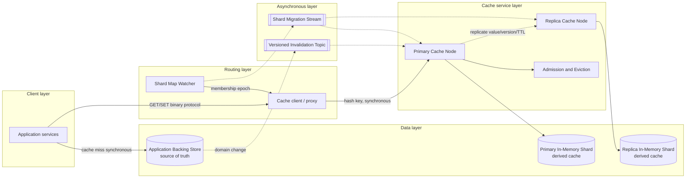

# Distributed Cache System

## 0. Interview classification

- **Primary challenge:** route each key to a bounded replica set while preserving low tail latency through membership change and node failure.
- **Secondary challenges:** consistent hashing, eviction, hot keys, replication, cache coherence, memory accounting, and overload control.
- **Patterns exercised:** [[Caching Pattern]], [[Cache Invalidation and Stampede]], [[Consistent Hashing Pattern]], [[Backpressure and Load Shedding]], [[Replication]].
- **Expected interview level:** Senior Backend / Senior Golang; Staff signals come from narrowed guarantees and operational judgment.
- **Recommended prerequisites:** [[Caching and CDN Fundamentals]], [[Consistent Hashing]], [[Partitioning and Sharding]], [[Consistency Models]], [[Observability and SLOs]].
- **Candidate design disclaimer:** “An interview-oriented candidate design based on public information and distributed-systems principles, not a claim about the company’s exact internal implementation.”

## 1. How to approach this problem

- **First questions:** Is this a cache or an authoritative database? Which operations are required? What object size and hit-rate target? What latency and availability? Can reads be stale?
- **Hidden complexity:** route each key to a bounded replica set while preserving low tail latency through membership change and node failure; make the invariant and failure boundary visible.
- **What not to over-design:** durable system of record, cross-region strong consistency, arbitrary queries, server-side computation, and exact invalidation delivery
- **What the interviewer is testing:** bounded scope, ownership, complete flow, causal scaling, and explicit trade-offs.
- **Mental model:** derive authority and commit point first; add components only when a requirement or bottleneck forces them.
- **Expected deep-dive branches:** Membership and shard migration; Eviction and admission; Hot keys and stampede.

## 2. Interview timeline for this system

- **0–3:** restate a regional multi-tenant key-value cache with TTL, eviction, replication, membership change, and failure recovery; park durable system of record, cross-region strong consistency, arbitrary queries, server-side computation, and exact invalidation delivery
- **3–7:** clarify NFRs and calculate the dominant rate, data, and skew.
- **7–12:** state invariants, entities, APIs, keys, and source of truth.
- **12–22:** draw Version 1 and trace the critical flow.
- **22–32:** ask the interviewer to select Membership and shard migration, Eviction and admission, Hot keys and stampede.
- **32–39:** address Compute: protocol parsing, hashing, compression, and eviction metadata; shard across cores and avoid stop-the-world work., Storage/memory: item overhead and fragmentation can dominate small values; enforce value size and track usable rather than installed RAM., Network: large values and replication saturate NICs; cap size, batch carefully, and avoid cross-region hot path. and failure controls.
- **39–43:** make decisions from the trade-off table; add region/security only where relevant.
- **43–45:** summarize guarantees, relaxed state, risks, and next validation.

## 3. Requirements clarification

| Candidate question | Possible interviewer answer |
| --- | --- |
| Is this a cache or an authoritative database? | Cache only; the backing store remains source of truth. |
| Which operations are required? | GET, SET with TTL, DELETE, and optional compare-and-set. |
| What object size and hit-rate target? | Median 1 KB, maximum 1 MB, target 95% hit rate. |
| What latency and availability? | p99 under 5 ms inside a region and 99.99% availability. |
| Can reads be stale? | Yes within TTL; explicit invalidation is best effort. |

**Selected scope:** a regional multi-tenant key-value cache with TTL, eviction, replication, membership change, and failure recovery

**Explicit non-goals:** durable system of record, cross-region strong consistency, arbitrary queries, server-side computation, and exact invalidation delivery

## 4. Functional requirements

- GET a value by key with hit/miss metadata.
- SET a bounded value with TTL and optional version.
- DELETE or invalidate a key.
- Distribute keys and replicas across cache nodes.
- Evict entries under memory pressure.
- Add, remove, and replace nodes without remapping every key.
- Expose tenant quotas and operational statistics.

## 5. Non-functional requirements

- Interview assumption: 5M GET/s, 500k writes/s, 50 TB usable memory.
- p99 GET under 5 ms within a region.
- 99.99% cache endpoint availability; misses remain correct via source of truth.
- Best-effort cache consistency bounded by TTL/version checks.
- Tenant isolation, encryption in transit, and memory/query quotas.
- Independent regional clusters; applications choose their consistency policy.

## 6. Back-of-the-envelope estimation

> [!important] Interview assumptions
> These values size a candidate design. They are not company or production facts.

At 5M GET/s and 95% hit rate, cache avoids 4.75M source reads/s; 250k misses/s still size the backing path. With 50 TB usable memory, 1 KB average values plus roughly 100 B metadata produce about 45 billion entries before replica overhead. Replication factor 2 requires about 100 TB raw RAM. At 50k GET/s per node, 100 nodes cover throughput but capacity dominates: 512 GB usable per node needs roughly 200 nodes for two copies, then provision 25% headroom. A 10 Gbit/s node serving 1 KB values caps near 1.25M GET/s before protocol overhead, so CPU and tail latency bind first.

## 7. Core invariants

- The backing data store, never the cache, owns truth.
- A key maps deterministically to a primary and distinct failure-domain replicas for a membership epoch.
- TTL never extends accidentally during read or replication.
- A versioned write or invalidation cannot be overwritten by an older cache mutation.
- Eviction may cause a miss but must not return another tenant's value.
- Memory is bounded; overload produces rejection or eviction, not process death.

## 8. Core entities

| Entity | Ownership and lifecycle |
| --- | --- |
| CacheEntry | Owning shard stores tenant-qualified key, value bytes, version, expiry, size, and frequency/recency metadata until expiry or eviction. |
| CacheNode | Membership service tracks node ID, zone, capacity weight, health, and epoch. |
| ShardAssignment | Control plane owns virtual shard to primary/replica mapping and staged migration state. |
| TenantPolicy | Control plane owns memory, request, value-size, and TTL limits. |
| InvalidationEvent | Application/source owner emits key or namespace version; cache consumers apply idempotently. |

## 9. API design

| Method | Path or RPC | Request | Response | Authentication | Idempotency | Pagination | Error behaviour |
| --- | --- | --- | --- | --- | --- | --- | --- |
| GET | /v1/cache/{namespace}/{key} | consistency option | value, version, ttl_remaining, hit | mTLS/service token | N/A | N/A | 404 miss; 429 quota; 503 no healthy owner |
| PUT | /v1/cache/{namespace}/{key} | value, ttl, version, request_id | stored version | mTLS/service token | request_id or key/version | N/A | 400 size/TTL; 409 stale version; 429; 503 |
| DELETE | /v1/cache/{namespace}/{key} | minimum_version, request_id | deleted/missing | mTLS/service token | request_id | N/A | 409 newer value exists; 503 |
| POST | Cache.BatchGet | qualified keys | per-key hit/value/error | mTLS/service token | N/A | Bounded batch continuation | partial per-key failures |
| GET | /v1/admin/shards | epoch, cursor | assignments, next_cursor | operator role | N/A | Opaque cursor | 403; 409 stale epoch |

## 10. Data model

| Table/store | Primary key | Partition key | Important indexes | Source of truth | Retention | Consistency | Access pattern |
| --- | --- | --- | --- | --- | --- | --- | --- |
| Node memory | tenant + namespace + key | virtual shard hash | expiry wheel; local hash index | Derived cache only | TTL/eviction | per-key version monotonic | GET/SET O(1) average |
| Shard map | epoch + virtual_shard | virtual_shard | node and zone | Membership control plane | Current plus rollout history | linearizable control update | client/proxy routing |
| Tenant policy store | tenant_id | tenant_id | namespace | Control plane | Account lifetime | strong for quota config | admission lookup |
| Invalidation topic | namespace + key + version | hash(qualified key) | event time | Backing-state owner | Short replay retention | per-key ordered, at-least-once | coherence updates |
| Backing store | application-defined key | application-defined | domain indexes | Application, not cache | Domain-defined | Domain-defined source of truth | cache miss fill |

## 11. First working design

### HLD: Distributed Cache System — candidate design



### ASCII fallback

```text
[Application] -> [Client/Proxy + Shard Map] --hash(key)--> [Primary Cache Node] --> [Primary RAM]
      | cache miss                                                    | --async replication-->
      +----------------------> [Backing Store: source of truth]       [Replica Cache Node] --> [Replica RAM]
                                      | --versioned invalidation--> [Invalidation Topic] --> cache nodes
[Membership Control Plane] --epoch--> clients; --migration plan--> old/new owners
```

**Legend:** solid arrow = synchronous request/response or direct state access; dashed arrow = asynchronous event/job. “Source of truth” owns authoritative state; “derived” can rebuild.

## 12. Complete critical flow

1. Application asks the cache client for tenant-qualified key profile:u-42; client reads local membership epoch and hashes it to virtual shard 801.
2. Client sends synchronous GET to the current primary; node checks tenant admission, hash index, expiry, and returns a hit with version 17 or a miss.
3. On miss, application reads the backing source of truth; cache infrastructure does not silently invent authority.
4. Application issues SET with value, TTL 300 seconds, version 17, and request ID; primary rejects versions below its current value.
5. Primary inserts through admission policy, updates expiry metadata, and asynchronously replicates value, version, and absolute expiry to a zone-separated replica.
6. A later domain update commits version 18 in the backing store and emits invalidation; cache node removes version 17 only if no newer entry exists.
7. If primary fails, router uses current shard map to read a replica or treats the operation as a miss; correctness falls back to backing truth.

## 13. Evolve the design under scale

### Version 1

Use one cache node with a hash map, TTL, and LRU to satisfy low load; applications own cache-aside miss behavior.

### Version 2

Memory and request rate exceed one node. Add virtual shards, consistent/rendezvous hashing, client-side routing, replica factor 2, and zone-aware placement.

### Version 3

Add a membership control plane, staged shard migration, admission policy, TinyLFU-style frequency protection, tenant quotas, hot-key replication, and independent regional clusters. Preserve a cache-miss escape hatch during control-plane failure.

**Partition and routing:** Hash the tenant-qualified key to many fixed virtual shards, then map each shard to weighted, zone-distinct nodes using rendezvous hashing. Clients cache an epoch-tagged map. During movement, new owner warms while old owner serves; a bounded dual-read/forward phase prevents a cold cliff.

## 14. Deep dive

### 1. Membership and shard migration

**Problem and alternatives:** Adding a node must not remap every key or create a full cold cache. Alternatives are modulo hashing, consistent-hash rings, or rendezvous hashing over virtual shards.

**Selected design and detailed flow:** Control plane publishes epoch N+1 with MOVING assignments. New owner copies still-live entries with absolute expiry and version, then marks ready; clients switch routing and old owner drains. Misses remain correct throughout.

**Trade-offs and failure handling:** Migration consumes network and can copy soon-expiring data, so prioritize hot/long-lived entries and rate limit. If movement fails, abort to the old epoch; maps are signed/versioned to avoid split routing.

### 2. Eviction and admission

**Problem and alternatives:** Pure LRU lets one scan evict the working set. Alternatives include random, LRU, LFU, segmented LRU, and TinyLFU admission.

**Selected design and detailed flow:** Maintain bounded per-shard metadata: expiry wheel plus sampled recency/frequency. Admit a candidate only when its estimated reuse beats the victim; enforce per-tenant memory budget before global eviction.

**Trade-offs and failure handling:** Frequency structures cost CPU and approximate counts. Under pressure, reject oversized/low-value writes and track evictions by tenant rather than allowing OOM.

### 3. Hot keys and stampede

**Problem and alternatives:** One popular key overloads its primary and simultaneous expiry floods the source. Alternatives include replication, request coalescing, stale-while-revalidate, or application precomputation.

**Selected design and detailed flow:** Detect per-key heavy hitters, replicate read-only hot values to more nodes, coalesce one refill per key, jitter TTL, and optionally serve stale within a declared window while refreshing.

**Trade-offs and failure handling:** Extra replicas complicate invalidation and may be stale. Never hide indefinite source failure; cap stale age and expose stale responses/metrics.

## 15. Detailed success flow

1. Client hashes product:p-9 to shard 801 under membership epoch 44 and sends GET to node c-17.
2. c-17 finds version 31 expiring at 12:05 and returns 900 bytes in 1.8 ms.
3. At 12:02 the source transaction creates version 32 and emits invalidation inv-32.
4. c-17 and replica c-42 consume inv-32, compare versions, and remove version 31; duplicate inv-32 is a no-op.
5. Next GET misses, application reads version 32 from the source, then SETs it with TTL 300 seconds.
6. Primary stores and replicates the absolute expiry; subsequent reads hit without changing the source of truth.

## 16. Detailed failure flows

### Failure 1 — Primary cache node fails

- **Detection:** Health probes, connection errors, and shard error rate identify node loss.
- **Immediate behaviour:** Router retries once to a healthy replica within the caller deadline or returns miss; it never loops across nodes.
- **Retry policy:** GET may try one replica; SET is retried only with request ID/version.
- **Idempotency/deduplication:** Version and request ID prevent an old retry overwriting newer data.
- **Recovery:** Control plane replaces the node and reassigns affected virtual shards; caches refill from source.
- **User-visible outcome:** Slight latency and hit-rate degradation, but correct source reads continue.
- **Observability:** node health, affected-shard miss rate, fallback load, p99 and remap progress.

### Failure 2 — Hot key expires during a traffic spike

- **Detection:** Heavy-hitter telemetry shows key QPS and miss coalescing waiters surge.
- **Immediate behaviour:** Allow one refresher; other callers wait briefly, receive bounded stale data, or miss according to policy.
- **Retry policy:** Refill uses a short timeout and jittered retry; no unbounded caller pile-up.
- **Idempotency/deduplication:** Singleflight key and source version make repeated fills harmless.
- **Recovery:** Refresh succeeds and replicas receive new absolute TTL; otherwise stale window expires and callers use source/load shedding.
- **User-visible outcome:** Some increased latency or explicitly stale response, never silently indefinite staleness.
- **Observability:** per-key QPS, coalesced waiters, stale-served count, source amplification.

### Failure 3 — Invalidation event is delayed or duplicated

- **Detection:** Consumer lag and version comparison reveal delayed delivery.
- **Immediate behaviour:** Duplicate is ignored; delayed version removes only entries not newer than itself.
- **Retry policy:** Consumer retries with bounded backoff and resumes from retained offset.
- **Idempotency/deduplication:** Key plus version is monotonic and processing is idempotent.
- **Recovery:** TTL bounds stale lifetime; replay catches up and removes obsolete entries.
- **User-visible outcome:** Reads may be stale within declared cache contract.
- **Observability:** invalidation lag, stale-read sampled rate, dedupe count, TTL age.

### Failure 4 — Membership maps disagree

- **Detection:** Requests arrive at non-owner nodes with older/newer epochs.
- **Immediate behaviour:** Node returns current epoch/redirect or forwards once; client refreshes map.
- **Retry policy:** One bounded retry after map refresh.
- **Idempotency/deduplication:** Versioned SET prevents dual-owner stale overwrite.
- **Recovery:** Complete or roll back staged migration and expire old map after grace period.
- **User-visible outcome:** One extra hop or miss.
- **Observability:** stale-epoch rate, forward count, dual-owner duration, migration SLO.

## 17. Bottlenecks and scalability

- Compute: protocol parsing, hashing, compression, and eviction metadata; shard across cores and avoid stop-the-world work.
- Storage/memory: item overhead and fragmentation can dominate small values; enforce value size and track usable rather than installed RAM.
- Network: large values and replication saturate NICs; cap size, batch carefully, and avoid cross-region hot path.
- Hot keys: detect heavy hitters and replicate/read-coalesce explicitly.
- Skew: tenant namespace and correlated keys can unbalance memory even with hash distribution; many virtual shards and weights help.
- Eviction: scan traffic can destroy hit rate; admission protects reuse.
- Membership churn: uncontrolled rebalancing creates cache-wide misses; stage and rate-limit movement.
- Backing-source capacity: it must withstand residual misses and planned cache degradation.

**Partitioning unit and routing strategy:** Hash the tenant-qualified key to many fixed virtual shards, then map each shard to weighted, zone-distinct nodes using rendezvous hashing. Clients cache an epoch-tagged map. During movement, new owner warms while old owner serves; a bounded dual-read/forward phase prevents a cold cliff.

## 18. Reliability and recovery

- Treat misses and node loss as normal; application source of truth preserves correctness.
- Replicate across zones when availability warrants the memory cost.
- Use short deadlines, at most one alternate-node retry, and circuit breakers to avoid retry storms.
- Reserve memory headroom and shed writes before OOM; bulkhead tenants and namespaces.
- Persist only membership configuration, not cache entries; rebuild after total loss.
- Test node/zone loss while measuring source fallback capacity.
- After recovery, warm gradually and reconcile maps before increasing admission.

## 19. Observability

- **Key metrics:** GET/SET rate, p50/p99, hit ratio, evictions, expirations, bytes, fragmentation, replication lag, hot keys, stale epochs, source fallback.
- **Logs:** sampled structured errors with tenant, namespace, shard, epoch, outcome and hashed key, never values.
- **Traces:** application cache span linked to source fallback and refill.
- **SLI/SLO candidates:** 99.99% requests return hit/miss/error within deadline; p99 GET under 5 ms; no cross-tenant value.
- **Dashboards:** latency/hit rate by shard and tenant, node memory/NIC, hot-key table, membership migration.
- **Alerts:** burn-rate latency/error alerts, low headroom, fallback overload, stuck migration, abnormal invalidation lag.
- **Business-level signals:** source reads avoided and cost/latency saved without violating freshness policy.

## 20. Security and abuse

- Tenant-qualified keys and authorization prevent cross-tenant reads.
- mTLS for clients/nodes and encryption on inter-node replication.
- Never log values; hash or truncate sensitive keys.
- Enforce value size, TTL, batch, QPS, and memory quotas.
- Authenticate and sign membership updates; restrict admin APIs.
- Avoid caching secrets/PII unless encryption, deletion, and retention requirements are explicit.

## 21. Explicit trade-off table

| Decision | Selected option | Alternative | Why selected | Cost or weakness | When alternative wins |
| --- | --- | --- | --- | --- | --- |
| Authority | Cache is derived | Cache as database | Misses stay correct and recovery is simple | Source must absorb misses | Durable low-latency KV is the product |
| Routing | Client/proxy rendezvous over virtual shards | Central lookup per request | No routing bottleneck | Map distribution complexity | Tiny deployment |
| Replication | Two zone-separated copies | No replica | Improves availability and hot reads | Doubles memory/write traffic | Source fallback is cheap |
| Write propagation | Asynchronous replica | Synchronous quorum | Lower write latency | Replica may be stale | Cache CAS semantics require fresher failover |
| Eviction | Admission plus sampled LFU/LRU | Pure LRU | Protects working set from scans | More metadata/CPU | Simple predictable workload |
| Invalidation | Versioned events plus TTL | TTL only | Faster freshness with bounded fallback | Consumer operations | Staleness is harmless |
| Failure read | Replica then miss | Retry many nodes | Bounded tail latency | More source load | Source cannot tolerate fallback |
| Migration | Staged warm and switch | Immediate remap | Avoids cold cliff | Temporary dual ownership | Small disposable cache |
| Regional model | Independent clusters | Global cache replication | Low local latency and small blast radius | Regional hit sets differ | Cross-region shared session is required |
| Hot keys | Selective extra replicas/coalescing | Uniform RF only | Targets actual skew | Coherence complexity | Keys have uniform demand |

## 22. Technology choices

| Technology | Role | Why it fits | Viable alternative | Operational cost | When choice changes |
| --- | --- | --- | --- | --- | --- |
| Redis Cluster | Reference implementation or backing cache | Mature TTL, eviction, replication | Memcached | Operational clustering and memory cost | Simple multithreaded cache with no rich types |
| Envoy/custom proxy | Routing and connection pooling | Centralizes client behavior | Language client library | Proxy hop and fleet operations | Teams can maintain consistent libraries |
| etcd | Small strongly consistent membership map | Watch and CAS semantics | Consul | Quorum operations | Existing control plane provides discovery |
| Kafka | Versioned invalidations | Partition ordering and replay | SNS/SQS | Cluster operations | Only best-effort invalidation is needed |
| OpenTelemetry | Cache/source trace correlation | Standard metrics and traces | Vendor SDK | Cardinality discipline | Single vendor mandated |
| Rendezvous hashing | Shard assignment algorithm | Simple weighted minimal movement | Consistent hash ring | Requires scoring candidates | Ring compatibility is needed |

## 23. Interviewer follow-up questions

| Likely follow-up | Concise strong answer | Diagram change | Trade-off |
| --- | --- | --- | --- |
| What happens if the whole cache is lost? | Correctness survives; protect the source with request coalescing, admission, warming, and load shedding. | Emphasize source fallback and warm path. | Availability versus source overload. |
| How do you prevent stale SET after invalidation? | Attach source versions; node rejects versions below current tombstone/value. | Add version/tombstone field. | Memory overhead versus freshness. |
| Why not use modulo hashing? | Node-count change remaps most keys; virtual shards plus rendezvous move only reassigned shards. | Change routing label. | Simplicity versus churn cost. |
| Can it support counters? | Only if the cache becomes temporary counter authority with clear loss semantics; otherwise update source and cache result. | Add counter owner boundary if accepted. | Performance versus durability. |

## 24. What a weak candidate does

- Calls Redis the source of truth without discussing durability or miss behavior.
- Says consistent hashing but cannot explain virtual shards, membership epochs, or failure domains.
- Ignores item overhead, hot keys, eviction, and backing-store fallback capacity.
- Retries every node and creates tail-latency amplification.
- Claims invalidation makes cache strongly consistent.
- Draws one cache box without ownership or data flow.

## 25. What a strong senior candidate demonstrates

- Starts with source-of-truth and staleness contract.
- Quantifies capacity, replication overhead, NIC/CPU, and residual misses.
- Explains deterministic routing, staged movement, versioned mutations, and bounded failure behavior.
- Protects both cache and source during cold starts and stampedes.
- Makes tenant isolation and observability first-class.
- Adapts replication/coherence to actual business guarantees.

## 26. Five-minute revision

- **Requirements:** regional GET/SET/DELETE cache with TTL, eviction, failure recovery.
- **Critical invariant:** cache is derived; a stale version cannot overwrite a newer one.
- **Core HLD:** client shard map → primary RAM → async replica; source fills misses and emits invalidations.
- **Most important data model:** entry key/value/version/absolute expiry plus epoch-tagged shard map.
- **Critical flow:** hash, hit or source read, versioned SET, replicate, invalidate.
- **Three bottlenecks:** hot keys, memory overhead, cache-loss source flood.
- **Three trade-offs:** client routing, async RF2, admission eviction.
- **Three failures:** node loss, stampede, delayed invalidation.
- **Likely deep dive:** membership and shard migration.

## 27. Blank-page practice prompt

Design a regional distributed cache serving five million reads per second with 50 TB of usable values, p99 reads below five milliseconds, TTL and eviction, node replacement, and zone failures. The backing database remains the source of truth. Explain routing, rebalancing, consistency, hot keys, and overload.

## 28. Adversarial variations

- Request volume grows 100× but memory does not.
- One celebrity key receives 20% of all reads.
- An entire zone fails and source capacity is only 2× normal misses.
- Staleness must shrink from five minutes to one second.
- Cost must fall by halving replication.
- Entries become 500 KB instead of 1 KB.
- A tenant runs a sequential scan that evicts popular values.

## 29. Practice and re-test history

- [ ] Untimed reconstruction — date/result:
- [ ] 45-minute mock — score/date:
- [ ] Follow-up round — variation/result:
- [ ] One-day review — date/result:
- [ ] Three-day review — date/result:
- [ ] Seven-day review — date/result:
- [ ] Fourteen-day review — date/result:

Personal readiness remains `not-started` until evidence is recorded in [[System Design Practice Tracker]].

## 30. Related internal notes and verified external references

**Internal:** [[Caching Pattern]] · [[Cache Invalidation and Stampede]] · [[Consistent Hashing Pattern]] · [[Caching and CDN Fundamentals]] · [[Partitioning and Sharding]] · [[Backpressure and Load Shedding]]

**Verified external references (checked 2026-07-17):**

- [Redis coding patterns](https://redis.io/docs/latest/develop/clients/patterns/) — established cache and data-structure interaction patterns.
- [Redis client-side caching](https://redis.io/docs/latest/develop/reference/client-side-caching/) — tracking and invalidation concepts.
- [Memcached protocol](https://github.com/memcached/memcached/wiki/Protocols) — concrete cache wire operations.
- [AWS Builders Library: Using load shedding to avoid overload](https://aws.amazon.com/builders-library/using-load-shedding-to-avoid-overload/) — overload protection.
- [OpenTelemetry observability primer](https://opentelemetry.io/docs/concepts/observability-primer/) — signals and telemetry model.
