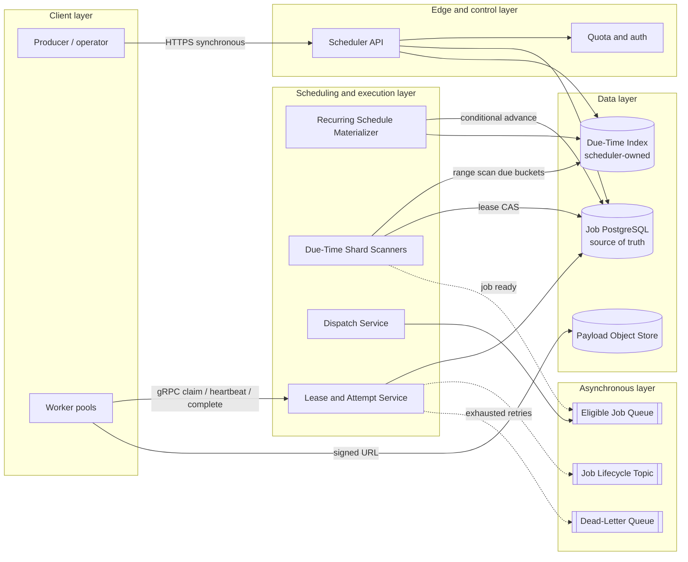

# Distributed Job Scheduler

## 0. Interview classification

- **Primary challenge:** durably schedule each job and ensure at-least-once execution without allowing stale workers to corrupt state.
- **Secondary challenges:** timer indexing, leases, retries, fairness, backpressure, dependency workflows, and regional recovery.
- **Patterns exercised:** [[Leader Election]], [[Distributed Locking]], [[Idempotency Pattern]], [[Retry Timeout and Deadline Pattern]], [[Backpressure and Load Shedding]], [[Deduplication and Inbox Pattern]].
- **Expected interview level:** Senior Backend / Senior Golang; Staff signals come from narrowed guarantees and operational judgment.
- **Recommended prerequisites:** [[Queues Streams and Pub Sub]], [[Consistency Models]], [[Partitioning and Sharding]], [[Observability and SLOs]].
- **Candidate design disclaimer:** “An interview-oriented candidate design based on public information and distributed-systems principles, not a claim about the company’s exact internal implementation.”

## 1. How to approach this problem

- **First questions:** Are jobs one-off, recurring, or workflow DAGs? What delivery guarantee is required? How precise must start time be? How long can jobs run? Must tenants be isolated?
- **Hidden complexity:** durably schedule each job and ensure at-least-once execution without allowing stale workers to corrupt state; make the invariant and failure boundary visible.
- **What not to over-design:** arbitrary user code sandboxing, exactly-once side effects, a full visual workflow language, and sub-second hard realtime
- **What the interviewer is testing:** bounded scope, ownership, complete flow, causal scaling, and explicit trade-offs.
- **Mental model:** derive authority and commit point first; add components only when a requirement or bottleneck forces them.
- **Expected deep-dive branches:** Lease expiry and fencing; Due-time indexing; Workflow dependencies.

## 2. Interview timeline for this system

- **0–3:** restate create, cancel, schedule, claim, execute, retry, and inspect background jobs with bounded start delay; park arbitrary user code sandboxing, exactly-once side effects, a full visual workflow language, and sub-second hard realtime
- **3–7:** clarify NFRs and calculate the dominant rate, data, and skew.
- **7–12:** state invariants, entities, APIs, keys, and source of truth.
- **12–22:** draw Version 1 and trace the critical flow.
- **22–32:** ask the interviewer to select Lease expiry and fencing, Due-time indexing, Workflow dependencies.
- **32–39:** address Compute: due scanners and dispatchers scale by logical shard, while fair queues prevent tenant monopolization., Storage: due indexes and attempt history grow quickly; bucket, archive, and compact without deleting authoritative hot state early., Network: large payloads bypass scheduler through signed object-store URLs. and failure controls.
- **39–43:** make decisions from the trade-off table; add region/security only where relevant.
- **43–45:** summarize guarantees, relaxed state, risks, and next validation.

## 3. Requirements clarification

| Candidate question | Possible interviewer answer |
| --- | --- |
| Are jobs one-off, recurring, or workflow DAGs? | Support one-off and recurring jobs; dependencies are a deep dive. |
| What delivery guarantee is required? | At-least-once dispatch; handlers must be idempotent. |
| How precise must start time be? | 99% start within 10 seconds of due time. |
| How long can jobs run? | Seconds to one hour; heartbeats extend a bounded lease. |
| Must tenants be isolated? | Yes; quotas and fair scheduling prevent one tenant monopolizing workers. |

**Selected scope:** create, cancel, schedule, claim, execute, retry, and inspect background jobs with bounded start delay

**Explicit non-goals:** arbitrary user code sandboxing, exactly-once side effects, a full visual workflow language, and sub-second hard realtime

## 4. Functional requirements

- Create one-off or recurring jobs with payload references.
- Cancel pending jobs and inspect status/history.
- Dispatch due jobs to eligible worker pools.
- Retry retryable failures with capped exponential backoff and jitter.
- Reclaim work when a worker lease expires.
- Enforce tenant and queue concurrency limits.

## 5. Non-functional requirements

- Interview assumption: 100M scheduled jobs/day and 5× peak.
- 99.9% scheduling API availability; 99.99% durable job metadata.
- 99% of eligible jobs start within 10 seconds.
- At-least-once execution; no promise of exactly-once external effects.
- Payloads encrypted and tenant-authorized.
- Single-region write authority initially; warm disaster-recovery region.

## 6. Back-of-the-envelope estimation

> [!important] Interview assumptions
> These values size a candidate design. They are not company or production facts.

100M jobs/day is about 1,160 creates/s average and 5,800/s peak. If due jobs follow the same peak and each dispatcher handles 200 claims/s, 30 dispatchers cover raw peak; provision 3× for skew and retries. At 1 KB metadata per job and 30-day hot retention, storage is about 3 TB before indexes and replication. A 1% retry rate adds 1M executions/day. Partition a due-time index into at least 128 logical shards so ownership can rebalance without scanning one global ordered table.

## 7. Core invariants

- A job state transition uses compare-and-set so a stale worker cannot complete a newer attempt.
- A claimed job has one current lease generation; every mutation carries its fencing token.
- A completed or cancelled job is never made pending by a late retry.
- Execution is at-least-once, so every side-effecting handler requires an idempotency key.
- Recurring occurrence identity is deterministic from schedule ID plus planned fire time.
- Tenant quotas bound admitted and running work.

## 8. Core entities

| Entity | Ownership and lifecycle |
| --- | --- |
| Job | Scheduler owns immutable job ID, tenant, payload reference, due time, policy, and current state until retention expiry. |
| Attempt | Execution service owns attempt number, fencing token, lease expiry, heartbeat, result, and error. |
| Schedule | Scheduler owns recurrence rule, timezone, next fire time, and pause state. |
| QueuePolicy | Control plane owns worker capability, priority, concurrency, retry, and tenant quota. |
| JobEvent | Append-only audit record owned by scheduler; retained longer than hot attempt state. |

## 9. API design

| Method | Path or RPC | Request | Response | Authentication | Idempotency | Pagination | Error behaviour |
| --- | --- | --- | --- | --- | --- | --- | --- |
| POST | /v1/jobs | queue, due_at, payload_ref, retry_policy, idempotency_key | job_id, state, version | tenant token | Required; same tenant/key returns original job | N/A | 400 invalid; 409 conflicting reuse; 429 quota; 503 unavailable |
| GET | /v1/jobs/{id} | job_id | state, attempt, timestamps, result_ref | tenant token | N/A | N/A | 404 hidden across tenants |
| POST | /v1/jobs/{id}:cancel | expected_version | state, version | tenant token | Request key recommended | N/A | 409 already running/completed or version mismatch |
| GET | /v1/jobs | state, queue, created range, cursor | jobs, next_cursor | tenant token | N/A | Opaque keyset cursor | 400 invalid cursor |
| POST | Worker.Claim | queue, capacity, worker_id | leased jobs, tokens, deadlines | mTLS worker identity | claim_id deduplicated | N/A | empty on no work; 429/503 on overload |
| POST | Worker.Complete | job_id, attempt, fencing_token, result_ref | accepted state | mTLS worker identity | job/attempt/token unique | N/A | 409 stale lease; 422 invalid transition |

## 10. Data model

| Table/store | Primary key | Partition key | Important indexes | Source of truth | Retention | Consistency | Access pattern |
| --- | --- | --- | --- | --- | --- | --- | --- |
| Job PostgreSQL | job_id | hash(job_id) | tenant_id + created_at; state + due_at | Scheduler | 30 days hot then archive | Serializable/CAS for transitions | point status and lifecycle updates |
| Due-index table | shard_id + due_bucket + due_at + job_id | shard_id | ordered due_at within bucket | Scheduler-derived but transactionally written | Until claimed/cancelled | read committed plus lease claim CAS | range scan due jobs |
| Attempt table | job_id + attempt_no | hash(job_id) | lease_expiry; worker_id | Execution service | 90 days | conditional updates with fencing token | heartbeat, completion, audit |
| Schedule table | schedule_id | hash(schedule_id) | next_fire_at + shard | Scheduler | Until deleted plus audit | conditional next-fire advance | recurrence materialization |
| Payload object store | payload_ref | bucket prefix | checksum metadata | Submitting tenant | policy-defined | read-after-write | large immutable job input/output |
| Job event stream | job_id + sequence | job_id | tenant + event time | Scheduler event log | 7 days stream; archive longer | per-job ordered, at-least-once | audit and downstream notifications |

## 11. First working design

### HLD: Distributed Job Scheduler — candidate design



### ASCII fallback

```text
[Producer] --HTTPS--> [Scheduler API] --> [Job PostgreSQL: source of truth]
                              |              --> [Due-Time Index]
[Materializer] --------------+                     |
[Shard Scanners] --range/CAS-----------------------+ --async--> [Eligible Job Queue]
                                                                      |
[Workers] <--gRPC claim/heartbeat--> [Lease Service] <----------------+
   |                                      | --async--> [Lifecycle Topic / DLQ]
   +--signed URL--> [Payload Object Store]
```

**Legend:** solid arrow = synchronous request/response or direct state access; dashed arrow = asynchronous event/job. “Source of truth” owns authoritative state; “derived” can rebuild.

## 12. Complete critical flow

1. Producer calls Scheduler API over HTTPS with tenant identity and idempotency key; API reads quota and writes Job plus due-index row in one transaction.
2. At due time, the scanner owning that logical shard range-reads the due bucket and conditionally changes PENDING to LEASED with attempt number and fencing token.
3. Scanner emits an eligible message asynchronously; if publishing uses an outbox, Job state and event intent commit atomically.
4. Worker claims through gRPC; Lease Service reads attempt state and returns payload reference, deadline, and token.
5. Worker reads immutable input from object storage, performs work, and heartbeats before lease expiry.
6. Worker completes with job ID, attempt, and token; conditional update accepts only the current lease and emits a lifecycle event.
7. If no completion arrives, expiry reaper schedules a new attempt with backoff; the old worker becomes fenced out.

## 13. Evolve the design under scale

### Version 1

One PostgreSQL database, periodic due-time query, one queue, and stateless workers satisfy modest scale; correctness comes from row-level conditional transitions.

### Version 2

Global due scans create index contention and polling load. Introduce time buckets, 128 logical shards, leased shard ownership, and adaptive scan cadence; keep job rows authoritative.

### Version 3

Split control and execution planes, isolate tenant queues, add regional schedulers with a single write home per job, replicate metadata, and rebuild queues from authoritative due/attempt state after regional failover.

**Partition and routing:** Hash stable job IDs for authoritative rows; partition scheduling work by logical shard and coarse due-time bucket. A shard-lease table assigns ranges to scanners, and rendezvous hashing minimizes movement. Never partition only by due second, which creates synchronized hot partitions.

## 14. Deep dive

### 1. Lease expiry and fencing

**Problem and alternatives:** A worker can pause beyond its lease while a replacement starts. Alternatives are database row locks, indefinite ownership, or bounded leases with generations.

**Selected design and detailed flow:** Lease Service increments attempt generation atomically when claiming. Every heartbeat, completion, and side-effect command carries that token; downstream state owners reject tokens older than the highest observed generation.

**Trade-offs and failure handling:** Leases enable recovery but can duplicate work. Clock skew is handled with server timestamps and generous lease margins; fencing protects scheduler state, while external effects still need idempotency.

### 2. Due-time indexing

**Problem and alternatives:** A single ordered table becomes a hot scan target. Alternatives include database delay queries, per-second queue delays, timing wheels, or bucketed indexes.

**Selected design and detailed flow:** Store due entries under logical shard plus minute bucket, ordered by due_at. Scanners prefetch a bounded horizon, claim using CAS, and use a timing heap only in memory; the database remains authoritative.

**Trade-offs and failure handling:** Buckets trade precision for fewer partitions. A scanner crash loses only memory; another owner rereads the bucket. Measure late-start distributions and split hot shards.

### 3. Workflow dependencies

**Problem and alternatives:** DAG jobs require advancing children exactly once after parents finish. Alternatives include custom counters or a workflow engine such as Temporal.

**Selected design and detailed flow:** Persist remaining-parent count and dependency edges; consume completion events through an inbox, decrement once per event ID, and make child eligible only on transition from one to zero.

**Trade-offs and failure handling:** Counters amplify writes and large fan-outs need chunking. Cycles must be rejected at submission; poison events go to quarantine without blocking unrelated workflows.

## 15. Detailed success flow

1. At 10:00:00, tenant acme submits job j-481 due 10:05 with key report-2026-07-17; API returns CREATED after Job and due row commit.
2. Shard 37 scanner reads the 10:05 bucket, changes j-481 to LEASED attempt 1 token 91 at 10:05:01, and publishes eligible event e-900.
3. Worker w-12 claims e-900, reads payload p-77, and heartbeats every 20 seconds against a 60-second lease.
4. At 10:05:42, w-12 completes with token 91 and result r-18; the conditional update changes state to SUCCEEDED.
5. Lifecycle event job.succeeded is emitted; status GET returns the durable result while asynchronous consumers update dashboards.

## 16. Detailed failure flows

### Failure 1 — Worker disappears after external side effect

- **Detection:** Lease expiry rises while downstream shows a side effect without completion.
- **Immediate behaviour:** Do not mark success; after expiry, schedule a retry and fence attempt 1.
- **Retry policy:** Retry after capped exponential backoff with jitter and a maximum-attempt policy.
- **Idempotency/deduplication:** Handler passes job ID or operation key to downstream so duplicate effect returns the original result.
- **Recovery:** Attempt 2 reconciles existing downstream result and completes; otherwise operator handles terminal uncertainty.
- **User-visible outcome:** Status stays RUNNING then RETRYING; no false success.
- **Observability:** lease_expired_total, duplicate_effect_reconciled_total, attempt age, and trace by job ID.

### Failure 2 — Eligible event is duplicated

- **Detection:** Consumer sees the same event ID or attempts the same lease transition.
- **Immediate behaviour:** Acknowledge duplicates after checking current Job/Attempt state.
- **Retry policy:** Transport redelivery is allowed; processing retry is bounded.
- **Idempotency/deduplication:** Inbox key event_id or conditional state transition makes duplicate a no-op.
- **Recovery:** Queue drains normally; no second active lease is created.
- **User-visible outcome:** No visible change.
- **Observability:** dedupe_hit_total, delivery count, and claim-conflict rate.

### Failure 3 — Scanner shard owner fails

- **Detection:** Shard lease expires and due-start latency grows for that shard.
- **Immediate behaviour:** Another scanner acquires a higher shard fencing token and rereads overdue buckets.
- **Retry policy:** Ownership acquisition uses jitter; due work itself is not blindly duplicated.
- **Idempotency/deduplication:** Job transition CAS ensures only one current attempt even if scanners overlap.
- **Recovery:** Backfill overdue jobs in bounded batches and shed low-priority work if necessary.
- **User-visible outcome:** Some jobs start late but remain durable.
- **Observability:** per-shard overdue count, p99 schedule delay, ownership churn, and alert on SLO burn.

### Failure 4 — Job database is unavailable

- **Detection:** Health checks and transaction errors spike.
- **Immediate behaviour:** Reject new schedules or buffer only if the durability contract permits; stop dispatch transitions.
- **Retry policy:** Short bounded retries under an end-to-end deadline, then circuit break.
- **Idempotency/deduplication:** Submission idempotency key makes client retry safe.
- **Recovery:** Fail over to promoted replica after fencing the old primary; rebuild due queues from state.
- **User-visible outcome:** 503 for new writes; running workers may finish locally but completion is retried.
- **Observability:** DB availability, replication lag, write ambiguity count, completion backlog.

## 17. Bottlenecks and scalability

- Compute: due scanners and dispatchers scale by logical shard, while fair queues prevent tenant monopolization.
- Storage: due indexes and attempt history grow quickly; bucket, archive, and compact without deleting authoritative hot state early.
- Network: large payloads bypass scheduler through signed object-store URLs.
- Hot partitions: synchronized cron schedules create minute-boundary bursts; jitter optional schedules and split buckets.
- Contention: lease/heartbeat writes can overload one job row; heartbeat attempt rows and batch extensions.
- Queue lag: admission control and concurrency budgets keep retry storms from consuming all workers.
- Regional concentration: each job has one write home; failover requires fencing before promotion.

**Partitioning unit and routing strategy:** Hash stable job IDs for authoritative rows; partition scheduling work by logical shard and coarse due-time bucket. A shard-lease table assigns ranges to scanners, and rendezvous hashing minimizes movement. Never partition only by due second, which creates synchronized hot partitions.

## 18. Reliability and recovery

- Use end-to-end deadlines, bounded retries with jitter, and circuit breakers for database and queue dependencies.
- Persist authority before dispatch; rebuild derived queues from due and attempt state.
- Use leases plus fencing tokens, not unbounded locks.
- Apply bulkheads by tenant, priority, and worker capability; shed optional low-priority work first.
- Replicate metadata across zones and test point-in-time restore plus queue reconstruction.
- Graceful degradation permits status reads while pausing new dispatch if authority is uncertain.
- After recovery, reconcile LEASED jobs whose expiry passed before resuming normal scans.

## 19. Observability

- **Key metrics:** schedule API rate/errors, due-to-start p50/p95/p99, running/late jobs, retry and terminal-failure rates, lease expiry, queue lag, shard skew, tenant quota rejects.
- **Logs:** structured transition logs with job_id, tenant_id, attempt, token, shard, reason, and never raw payload secrets.
- **Traces:** submission through scan, dispatch, claim, handler span link, and completion.
- **SLI/SLO candidates:** 99% eligible jobs start within 10 seconds; 99.9% valid creates succeed; no invalid state transitions.
- **Dashboards:** global SLO plus shard heatmap, tenant fairness, queue/worker saturation, retry cohorts.
- **Alerts:** multi-window burn rate for schedule delay and API success; paging for authority loss or growing overdue work.
- **Business-level signals:** jobs succeeded on time, recurring occurrences missed, and tenant completion rate.

## 20. Security and abuse

- Authenticate producers; authorize every job/status operation by tenant.
- Use mTLS and workload identity for workers; capabilities restrict queues they may claim.
- Encrypt metadata and objects; payload references use short-lived signed URLs.
- Redact payloads and result content from logs; apply retention and deletion policy.
- Quotas, payload limits, and rate limiting prevent scheduling and retry abuse.
- Sandboxing arbitrary code is out of scope; trusted worker pools still use least privilege.

## 21. Explicit trade-off table

| Decision | Selected option | Alternative | Why selected | Cost or weakness | When alternative wins |
| --- | --- | --- | --- | --- | --- |
| Delivery guarantee | At-least-once | Exactly-once | Survives crash boundaries with practical primitives | Handlers must be idempotent | All effects share one transactional authority |
| Due index | Bucketed shard index | One global due_at index | Parallel scans and bounded ranges | More routing and cleanup | Modest load and one database |
| Ownership | Leases plus fencing | Long-held lock | Failure recovery without permanent ownership | Duplicate execution remains possible | Very short in-DB work |
| Queue state | Derived from Job authority | Queue as sole authority | Can rebuild after loss | Extra database writes | Broker offers durable scheduling semantics required |
| Payloads | Object references | Inline queue payload | Keeps broker and DB small | Extra fetch and URL security | Payloads are tiny |
| Recurring jobs | Materialize each occurrence | Worker-side recurrence | Auditable deterministic identities | Materializer load | Best-effort periodic maintenance |
| Regional writes | Single home per job | Active-active any-region writes | Simpler order and fencing | Failover delay and home latency | Global write latency dominates and conflicts are defined |
| Fairness | Tenant concurrency budgets | Strict global FIFO | Prevents noisy neighbors | Not globally time ordered | Single trusted tenant |
| Retries | Capped exponential jitter | Immediate unlimited retry | Contains correlated failure | Longer recovery for transient errors | Hard realtime with controlled dependency |
| Dependency workflows | Persist counters and inbox | Recompute DAG on every event | Efficient progression | Write amplification and complexity | Small infrequent DAGs |

## 22. Technology choices

| Technology | Role | Why it fits | Viable alternative | Operational cost | When choice changes |
| --- | --- | --- | --- | --- | --- |
| PostgreSQL | Job, attempt, schedule authority | Transactions, conditional updates, indexes | DynamoDB | Partitioning and vacuum/index operations | Extreme key-value scale with simple access |
| Kafka | Eligible and lifecycle events | Replay, partitions, consumer groups | SQS | Cluster and partition operations | Managed queue semantics are enough |
| S3 | Large immutable payload/result objects | Durability and signed access | GCS | Lifecycle and egress cost | Cloud/provider changes |
| Temporal | Complex durable workflows alternative | Timers, retries, histories | Custom scheduler | Operational and conceptual footprint | Only simple independent jobs are required |
| Kubernetes | Elastic worker pools | Workload identity and autoscaling | VM autoscaling | Cluster operations | Jobs need strong isolation or specialized hosts |
| OpenTelemetry | Trace execution across async boundaries | Vendor-neutral context and signals | Vendor agent | Instrumentation discipline | Single vendor is mandated |

## 23. Interviewer follow-up questions

| Likely follow-up | Concise strong answer | Diagram change | Trade-off |
| --- | --- | --- | --- |
| Can you guarantee exactly once? | Not across arbitrary external effects; guarantee one accepted scheduler transition and require idempotent effects. | Annotate idempotency boundary at worker dependency. | Simplicity versus a shared transaction boundary. |
| What if 10M jobs are due at midnight? | Bucket and shard, prefetch horizon, tenant quotas, optional jitter, and measure lateness rather than scan one key. | Split due bucket and add admission queues. | Precision versus burst smoothing. |
| How do you cancel a running job? | Persist CANCEL_REQUESTED, signal cooperatively, and reject later completion unless policy permits; cannot safely kill unknown effects. | Add cancellation signal path. | Responsiveness versus effect safety. |
| How do regions fail over? | Fence the old home, promote durable replica, reacquire shard leases, then reconstruct due and leased work. | Add DR scheduler and replication arrow. | RTO versus split-brain risk. |

## 24. What a weak candidate does

- Claims exactly-once execution because a queue is durable.
- Uses one cron scanner over an unpartitioned timestamp index.
- Does not distinguish job authority, queue delivery, and external side effects.
- Retries without deadlines, caps, jitter, or tenant budgets.
- Uses locks without leases/fencing or ignores paused workers.
- Draws workers but cannot trace state transitions.

## 25. What a strong senior candidate demonstrates

- States the at-least-once boundary and handler idempotency immediately.
- Defines state machine, lease generation, and authoritative commit point.
- Evolves from a queryable table to bucketed shards because measured scans bottleneck.
- Explains fairness, retry budgets, queue reconstruction, and overload behavior.
- Separates control plane, execution plane, and payload path.
- Adapts precision, consistency, and regional choices to interviewer constraints.

## 26. Five-minute revision

- **Requirements:** durably schedule, cancel, execute, retry, and inspect jobs.
- **Critical invariant:** only the current fencing token may mutate an attempt; effects are idempotent.
- **Core HLD:** Scheduler API → Job DB/due index → scanners → eligible queue → leased workers.
- **Most important data model:** Job state/version plus Attempt token/lease.
- **Critical flow:** commit job, claim due row, dispatch, heartbeat, conditional complete.
- **Three bottlenecks:** midnight bursts, due-index scans, heartbeat/queue backlog.
- **Three trade-offs:** at-least-once, bucketed index, single job home.
- **Three failures:** worker pause, duplicate event, scanner/region authority loss.
- **Likely deep dive:** leases and fencing.

## 27. Blank-page practice prompt

Design a distributed scheduler for 100 million one-off and recurring background jobs per day. Jobs may run for up to one hour, must normally start within ten seconds of their due time, and can fail or be retried. Explain guarantees, APIs, storage, dispatch, worker failure, fairness, and regional recovery.

## 28. Adversarial variations

- Traffic and synchronized due-time bursts grow 100×.
- A worker performs an external payment and crashes before acknowledging.
- One scheduling shard becomes hot because of a large tenant.
- Start-time precision changes from ten seconds to 100 milliseconds.
- Cost must fall by moving old attempts to cheap storage.
- The primary region fails with millions of leased jobs.
- Recurring schedules must respect tenant timezones and daylight-saving changes.

## 29. Practice and re-test history

- [ ] Untimed reconstruction — date/result:
- [ ] 45-minute mock — score/date:
- [ ] Follow-up round — variation/result:
- [ ] One-day review — date/result:
- [ ] Three-day review — date/result:
- [ ] Seven-day review — date/result:
- [ ] Fourteen-day review — date/result:

Personal readiness remains `not-started` until evidence is recorded in [[System Design Practice Tracker]].

## 30. Related internal notes and verified external references

**Internal:** [[Leader Election]] · [[Distributed Locking]] · [[Idempotency Pattern]] · [[Retry Timeout and Deadline Pattern]] · [[Backpressure and Load Shedding]] · [[Queues Streams and Pub Sub]] · [[Observability and SLOs]]

**Verified external references (checked 2026-07-17):**

- [Temporal documentation](https://docs.temporal.io/) — durable execution and workflow semantics.
- [Kubernetes CronJob documentation](https://kubernetes.io/docs/concepts/workloads/controllers/cron-jobs/) — concrete recurring scheduling semantics and limitations.
- [PostgreSQL explicit locking](https://www.postgresql.org/docs/current/explicit-locking.html) — row-lock behavior and concurrency controls.
- [AWS Builders Library: Making retries safe with idempotent APIs](https://aws.amazon.com/builders-library/making-retries-safe-with-idempotent-APIs/) — idempotent request design.
- [OpenTelemetry signals](https://opentelemetry.io/docs/concepts/signals/) — metrics, logs, and trace correlation.

