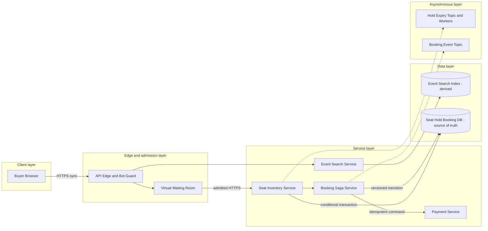

# Event Ticket Booking System

## 0. Interview classification

- **Primary challenge:** concurrent inventory reservation without overselling.
- **Secondary challenges:** bursty onsales, expiring holds, payment workflow, fairness, and stale search views.
- **Patterns exercised:** [[Idempotency Pattern]], [[Saga Pattern]], [[Rate Limiting Pattern]], [[Backpressure and Load Shedding]], [[Transactional Outbox Pattern]].
- **Expected interview level:** Senior Backend / Senior Golang; Staff signals come from narrowed guarantees and operational judgment.
- **Recommended prerequisites:** [[Consistency Models]], [[Partitioning and Sharding]], [[Payment System]].
- **Candidate design disclaimer:** “An interview-oriented candidate design based on public information and distributed-systems principles, not a claim about the company’s exact internal implementation.”

## 1. How to approach this problem

- **First questions:** Inventory granularity? User flow? Correctness? Scale?
- **Hidden complexity:** concurrent inventory reservation without overselling; make the invariant and failure boundary visible.
- **What not to over-design:** resale, dynamic pricing algorithms, venue scanning, promoter settlement, and recommendations.
- **What the interviewer is testing:** bounded scope, ownership, complete flow, causal scaling, and explicit trade-offs.
- **Mental model:** derive authority and commit point first; add components only when a requirement or bottleneck forces them.
- **Expected deep-dive branches:** Seat reservation; Hold expiry; Onsale fairness.

## 2. Interview timeline for this system

- **0–3:** restate Event discovery, authoritative seat availability, expiring holds, booking/payment confirmation, status, and safe release.; park resale, dynamic pricing algorithms, venue scanning, promoter settlement, and recommendations.
- **3–7:** clarify NFRs and calculate the dominant rate, data, and skew.
- **7–12:** state invariants, entities, APIs, keys, and source of truth.
- **12–22:** draw Version 1 and trace the critical flow.
- **22–32:** ask the interviewer to select Seat reservation, Hold expiry, Onsale fairness.
- **32–39:** address single hot event and seat inventory, multi-seat transaction contention, waiting-room and polling load and failure controls.
- **39–43:** make decisions from the trade-off table; add region/security only where relevant.
- **43–45:** summarize guarantees, relaxed state, risks, and next validation.

## 3. Requirements clarification

| Candidate question | Possible interviewer answer |
| --- | --- |
| Inventory granularity? | Assigned seats for one event; general admission is a follow-up. |
| User flow? | Browse, view seat map, hold seats for five minutes, pay, confirm, and inspect status. |
| Correctness? | A seat has at most one active booking owner; final hold/confirm is strongly consistent. |
| Scale? | Assume 100k concurrent users and 20k hold attempts/s on a hot event. |

**Selected scope:** Event discovery, authoritative seat availability, expiring holds, booking/payment confirmation, status, and safe release.

**Explicit non-goals:** resale, dynamic pricing algorithms, venue scanning, promoter settlement, and recommendations.

## 4. Functional requirements

- Search events and retrieve seat maps with freshness metadata.
- Atomically create a time-bounded hold for selected available seats.
- Pay and convert a valid hold to one booking idempotently.
- Expire abandoned holds, expose status, and release inventory safely.

## 5. Non-functional requirements

- Interview assumptions: hot event with 100k concurrent users, 20k hold attempts/s, 50k seats, five-minute hold.
- Browse p99 below 300 ms and admitted hold p99 below two seconds.
- Seat inventory never oversells; browsing can be stale but hold revalidates truth.
- Fair admission protects inventory/payment during bursts.
- Buyer authentication, anti-bot/rate controls, privacy, and auditable operator changes.

## 6. Back-of-the-envelope estimation

> [!important] Interview assumptions
> These values size a candidate design. They are not company or production facts.

A 50k-seat map at 50 bytes/seat is about 2.5 MB raw, so serve section snapshots/deltas. At 20k hold attempts/s with two seats each, 40k conditional seat mutations/s hit one event—a deliberate hotspot. A five-minute window can retain millions of attempts, so waiting-room admission must reduce demand before the inventory owner. Contention, not total storage, dominates.

## 7. Core invariants

- A seat is AVAILABLE, HELD by one hold until expiry, or BOOKED by one booking; ownership never overlaps.
- All requested seats are held atomically or the request fails.
- Confirmation requires the same unexpired hold and idempotent successful payment state.
- Expiry/release cannot overwrite a newer hold or booking; token/version fences stale workers.

## 8. Core entities

| Entity | Ownership and lifecycle |
| --- | --- |
| Event | Venue, sale window, status, and seat-map version. |
| SeatInventory | Event+seat authoritative state, version, and hold/booking owner. |
| Hold | Buyer, seat set, expiry, state, and fencing token. |
| Booking | Confirmed purchase and immutable price snapshot. |
| PaymentIntent | Payment-owned lifecycle linked to hold/booking. |
| AdmissionSession | Waiting-room position/token granting bounded access. |

## 9. API design

| Method | Path or RPC | Request | Response | Authentication | Idempotency | Pagination | Error behaviour |
| --- | --- | --- | --- | --- | --- | --- | --- |
| GET | /v1/events | query/cursor | events+freshness | public | read-only | cursor | 429; partial |
| GET | /v1/events/{id}/seats | section, version | snapshot/delta | public/session | read-only | section cursor | 404; 409 stale; 429 |
| POST | /v1/holds | eventId, seatIds, priceVersion | 201 holdId,expiresAt | buyer+admission | Idempotency-Key | n/a | 409; 410; 429; 503 |
| POST | /v1/holds/{id}/confirm | payment token, expectedVersion | 202 booking/state | hold owner | Idempotency-Key | n/a | 409; 410; 422 |
| GET | /v1/bookings/{id} | id | booking/payment state | owner | read-only | n/a | 403; 404 |

## 10. Data model

| Table/store | Primary key | Partition key | Important indexes | Source of truth | Retention | Consistency | Access pattern |
| --- | --- | --- | --- | --- | --- | --- | --- |
| events | event_id | event_id | sale time+venue | authoritative metadata | event+audit | strong update | browse |
| seat_inventory | event_id+seat_id | event+seat shard | state+section | authoritative inventory | event+audit | conditional/serializable | hold/confirm |
| holds | hold_id | event_id | buyer+expiry | authoritative | hold+audit | strong/versioned | confirm/expire |
| bookings | booking_id | event_id | buyer+created | authoritative | policy | strong create | status |
| search_index | event doc | query partition | text+geo+time | derived | rebuildable | eventual | discovery |
| admission_sessions | event+session | event_id | expiry+position | admission authority | short | bounded/fair | queue |

## 11. First working design

### HLD: Event Ticket Booking System — candidate design



### ASCII fallback

```text
Buyer --> Edge/Bot Guard --> Waiting Room --admitted--> Seat Inventory
Buyer --> Event Search --> Search Index [derived]
Seat Inventory --atomic hold--> Seat/Hold/Booking DB [truth] --async--> Expiry
Hold Confirm --> Booking Saga --> Payment --> versioned Booking transition
```

**Legend:** solid arrow = synchronous request/response or direct state access; dashed arrow = asynchronous event/job. “Source of truth” owns authoritative state; “derived” can rebuild.

## 12. Complete critical flow

1. Buyer browses derived search and section snapshot; displayed availability includes freshness/version and is advisory.
2. Waiting room issues a signed short-lived admission token and meters sessions to measured hold capacity.
3. Hold API validates sale, price, and admission then atomically changes every selected seat AVAILABLE→HELD with one hold/token/expiry.
4. Booking saga creates a payment intent with stable key; after success, confirm transaction validates token and changes HELD→BOOKED plus Booking.
5. Expiry worker conditionally releases only seats still HELD by that hold/token; events update search/cache/notification asynchronously.

## 13. Evolve the design under scale

### Version 1

One PostgreSQL transaction for event, seat, hold, and booking plus direct payment; correct at modest traffic.

### Version 2

Add waiting room, event-partitioned inventory owners, expiry workers, derived search/seat snapshots, and payment saga.

### Version 3

Sub-shard a hot event by section with explicit multi-seat coordination, use regional browse, one event write home, and reserved confirm capacity.

**Partition and routing:** Partition by event for locality but recognize the hot-event shard. Sub-shard by section/seat range; multi-section holds need a coordinator and ordered ownership or a product restriction. Keep final seat invariant under one authoritative boundary.

## 14. Deep dive

### 1. Seat reservation

**Problem and alternatives:** Options are pessimistic locks, serializable conditional batch, Redis lock, and inventory buckets.

**Selected design and detailed flow:** Use one authoritative conditional transaction: update all requested rows from AVAILABLE to HELD with one token and require affected count equals requested, else rollback.

**Trade-offs and failure handling:** Database contention is explicit but correctness is clear. Cache/lock is not truth. Section partitioning must preserve multi-seat atomicity.

### 2. Hold expiry

**Problem and alternatives:** Options are periodic DB sweep, delayed queue/timer wheel, and cache TTL.

**Selected design and detailed flow:** Persist expiry, send delayed/timer work, and keep indexed sweep for reconciliation. Worker releases only matching HELD token/version.

**Trade-offs and failure handling:** Timer may duplicate or be late; conditional fencing makes it safe. Confirm/expiry race is decided by one state transaction.

### 3. Onsale fairness

**Problem and alternatives:** Options are direct traffic, static rate limit, and signed virtual waiting room.

**Selected design and detailed flow:** Use waiting room to meter sessions to inventory capacity, rate-limit bots, and apply a declared fair/random policy.

**Trade-offs and failure handling:** Users wait and admission becomes a system, but it prevents inventory/payment collapse and retry storms.

## 15. Detailed success flow

1. Session s-7 is admitted to event e-9; buyer selects A12 and A13 from map version 41.
2. Transaction creates hold h-3 until 12:05 and marks both seats HELD by token 88; returns expiry.
3. Payment p-8 succeeds idempotently; confirm transaction validates h-3/token 88 and creates booking b-2. Later expiry is a safe no-op.

## 16. Detailed failure flows

### Failure 1 — Concurrent hold race

- **Detection:** Conditional update count/version conflict.
- **Immediate behaviour:** One wins; loser rolls back all seats and receives 409.
- **Retry policy:** Client may choose alternatives; same key returns existing hold.
- **Idempotency/deduplication:** Seat condition and idempotency key.
- **Recovery:** No repair; tune admission and offer current alternatives.
- **User-visible outcome:** Clear unavailable response, never hidden partial hold.
- **Observability:** conflict by event/seat and lock latency.

### Failure 2 — Payment succeeds after expiry

- **Detection:** Hold/payment mismatch.
- **Immediate behaviour:** Do not book another owner’s seat; start refund/void.
- **Retry policy:** Use same provider/refund identities.
- **Idempotency/deduplication:** Payment, confirm, refund keys, and hold token.
- **Recovery:** Refund then mark failed or compensation pending.
- **User-visible outcome:** No booking; truthful refund pending.
- **Observability:** late payment and refund age.

### Failure 3 — Expiry duplicate or late

- **Detection:** Duplicate timer or sweep.
- **Immediate behaviour:** Conditional release only matching HELD token.
- **Retry policy:** Safe retry.
- **Idempotency/deduplication:** Hold ID/token/version.
- **Recovery:** Sweep reconciles expired holds.
- **User-visible outcome:** No user error; map refreshes.
- **Observability:** expired-held count, timer lag, no-op rate.

### Failure 4 — Hot-event overload

- **Detection:** Waiting-room age, DB contention, 429, bot signals.
- **Immediate behaviour:** Slow admission; shed seat polling detail; reserve hold-confirm traffic.
- **Retry policy:** Clients get jittered poll/retry guidance.
- **Idempotency/deduplication:** Signed session/admission and request keys.
- **Recovery:** Scale event owner/sections and drain fairly.
- **User-visible outcome:** Users wait instead of seeing oversell/collapse.
- **Observability:** wait, holds/s, contention, fairness, bot blocks.

## 17. Bottlenecks and scalability

- single hot event and seat inventory
- multi-seat transaction contention
- waiting-room and polling load
- payment latency near expiry
- seat-map invalidation

**Partitioning unit and routing strategy:** Partition by event for locality but recognize the hot-event shard. Sub-shard by section/seat range; multi-section holds need a coordinator and ordered ownership or a product restriction. Keep final seat invariant under one authoritative boundary.

## 18. Reliability and recovery

- Admission before inventory/payment and reserved capacity for confirmations.
- Multi-AZ inventory DB, PITR/restore, single event write-home epoch; search/cache derived.
- Expiry uses delayed work plus DB reconciliation and token fencing.
- Payment unknown/refund behaviour follows [[Payment System]].
- Uncertain region authority pauses holds; browse can continue with stale labels.

## 19. Observability

- **Key metrics:** admission wait/drop, hold success/conflict/latency, active/expired holds, confirm/payment/refund, hot seats/events, search freshness.
- **Logs:** event, hold, booking, payment refs, seat IDs, versions; minimize PII.
- **Traces:** admission→hold transaction→payment→confirm/refund.
- **SLI/SLO candidates:** non-oversold hold/confirm latency for admitted users and zero inventory invariant violations.
- **Dashboards:** onsale admission, contention, holds/expiry, payment, search, bots.
- **Alerts:** oversell audit, expired-held leak, confirm burn, refund age, DB saturation.
- **Business-level signals:** seats available/held/booked, conversion, abandonment, fair admission, oversell.

## 20. Security and abuse

- Authenticate buyer and owner resources; sign short-lived admission/hold tokens.
- Use account/device/IP/risk anti-bot limits rather than IP only.
- Server owns price/version and validates every state transition.
- Protect payment token by reference; encrypt/minimize PII; audit operator seat changes.
- Prevent enumeration/scraping and isolate organizer tenants.

## 21. Explicit trade-off table

| Decision | Selected option | Alternative | Why selected | Cost or weakness | When alternative wins |
| --- | --- | --- | --- | --- | --- |
| Inventory truth | relational conditional transaction | Redis lock/cache | clear atomic invariant | contention | transactional KV at extreme scale |
| Admission | virtual waiting room | direct traffic | fair protection | wait/complexity | ordinary demand |
| Hold length | five minutes | longer/shorter | checkout vs turnover | abandonment/pressure | different payment latency |
| Browse | derived snapshot | truth every poll | scale/latency | staleness | small event |
| Partition | event then section | global hash | locality | hot event | uniform workload |
| Payment order | hold then pay | pay then hold | prevents paid-no-seat | inventory lock | abundant inventory |
| Expiry | timer+reconcile | cache TTL only | durable safe release | workers/index | never cache-only |
| Region | single event home | active-active | no oversell | failover pause | disjoint inventory |
| Conflict UX | 409+alternatives | retry same seats | reduces storm | client logic | low contention |

## 22. Technology choices

| Technology | Role | Why it fits | Viable alternative | Operational cost | When choice changes |
| --- | --- | --- | --- | --- | --- |
| PostgreSQL | seat/hold/booking truth | transactions/conditional updates | distributed SQL/DynamoDB transactions | contention/sharding | global scale |
| Redis | waiting room/session/snapshot cache | TTL and counters | in-memory service | cluster/eviction | small traffic |
| Kafka/SQS | expiry/booking events | durable async | DB scheduler | lag/duplicates | few timers |
| OpenSearch | event discovery | text/time/geo | PostgreSQL search | derived-index ops | small catalogue |
| Payment Service | intent/refund | reuses financial invariants | direct provider | integration | prototype |

## 23. Interviewer follow-up questions

| Likely follow-up | Concise strong answer | Diagram change | Trade-off |
| --- | --- | --- | --- |
| Prevent oversell? | One authoritative conditional transaction or owner; cache/search never confirms. | Highlight SeatDB. | availability vs correctness |
| Hot event? | Waiting room plus event owner; section shards need explicit multi-seat coordination. | Add section routing. | throughput vs atomicity |
| Late payment? | Never take another owner’s seat; refund/void with visible compensation. | Add refund state. | correctness vs UX |
| General admission? | Atomic remaining quantity and idempotent quantity hold; no seat rows. | Change data model. | simplicity vs seat choice |

## 24. What a weak candidate does

- Uses cache as inventory truth or a lease without fencing.
- Lets all buyers poll and hit the database.
- Holds seats one-by-one and leaks partial ownership.
- Ignores expiry/confirm and payment-after-expiry races.
- Claims active-active without ownership.

## 25. What a strong senior candidate demonstrates

- Starts with seat invariant and separates stale browse from strict hold.
- Uses admission/fairness rather than only replicas.
- Explains multi-seat atomicity and hot-event partition tension.
- Uses token-safe expiry and payment compensation.
- Measures inventory correctness as a business signal.

## 26. Five-minute revision

- **Requirements:** browse, seat map, hold, pay/confirm, expire/status.
- **Critical invariant:** one seat one owner; all seats atomically held; stale expiry fenced.
- **Core HLD:** edge/waiting room→Inventory→SeatDB; expiry async; Booking→Payment.
- **Most important data model:** seat state/hold/token/version, hold expiry, booking.
- **Critical flow:** admit→atomic hold→payment→atomic confirm or refund.
- **Three bottlenecks:** hot event; contention; polling/payment.
- **Three trade-offs:** DB/cache; waiting room/direct; event/section shard.
- **Three failures:** hold race; late payment; stale expiry.
- **Likely deep dive:** seat reservation and fairness.

## 27. Blank-page practice prompt

Design an assigned-seat event ticket-booking system with search, seat maps, temporary holds, payment, confirmation, and bursty onsales.

## 28. Adversarial variations

- One million buyers arrive simultaneously.
- The inventory region fails during onsale.
- A hold spans multiple sections.
- General admission replaces assigned seats.
- Bots rotate accounts and IPs.
- Payment latency exceeds hold duration.

## 29. Practice and re-test history

- [ ] Untimed reconstruction — date/result:
- [ ] 45-minute mock — score/date:
- [ ] Follow-up round — variation/result:
- [ ] One-day review — date/result:
- [ ] Three-day review — date/result:
- [ ] Seven-day review — date/result:
- [ ] Fourteen-day review — date/result:

Personal readiness remains `not-started` until evidence is recorded in [[System Design Practice Tracker]].

## 30. Related internal notes and verified external references

**Internal:** [[Payment System]] · [[Idempotency Pattern]] · [[Backpressure and Load Shedding]] · [[Rate Limiting Pattern]] · [[Consistency Models]]

**Verified external references (checked 2026-07-17):**

- [PostgreSQL transaction isolation](https://www.postgresql.org/docs/current/transaction-iso.html) — concurrency semantics.
- [AWS Builders’ Library: idempotent APIs](https://aws.amazon.com/builders-library/making-retries-safe-with-idempotent-APIs/) — duplicate-safe hold/confirm.

