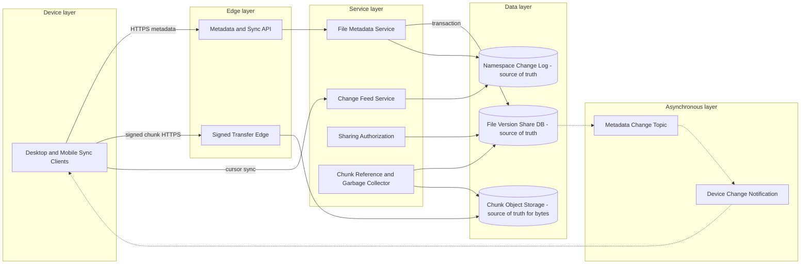

# File Storage and Synchronization System

## 0. Interview classification

- **Primary challenge:** durable chunked file storage with multi-device version and conflict handling.
- **Secondary challenges:** deduplication, resumable transfer, change propagation, offline edits, sharing, and large-scale metadata.
- **Patterns exercised:** [[Idempotency Pattern]], [[Transactional Outbox Pattern]], [[Deduplication and Inbox Pattern]], [[Caching Pattern]].
- **Expected interview level:** Senior Backend / Senior Golang; Staff signals come from narrowed guarantees and operational judgment.
- **Recommended prerequisites:** [[Blob Object and File Storage]], [[Consistency Models]], [[Multi-Region Design]].
- **Candidate design disclaimer:** “An interview-oriented candidate design based on public information and distributed-systems principles, not a claim about the company’s exact internal implementation.”

## 1. How to approach this problem

- **First questions:** File semantics? Offline conflicts? Sharing? Scale?
- **Hidden complexity:** durable chunked file storage with multi-device version and conflict handling; make the invariant and failure boundary visible.
- **What not to over-design:** Google Docs-style operation transforms/CRDT editing, antivirus internals, enterprise eDiscovery, or POSIX random-write semantics.
- **What the interviewer is testing:** bounded scope, ownership, complete flow, causal scaling, and explicit trade-offs.
- **Mental model:** derive authority and commit point first; add components only when a requirement or bottleneck forces them.
- **Expected deep-dive branches:** Offline conflicts; Chunk deduplication and GC; Change synchronization.

## 2. Interview timeline for this system

- **0–3:** restate Folder/file metadata, chunked resumable upload/download, versions, device delta sync, offline conflict, delete/restore, and sharing.; park Google Docs-style operation transforms/CRDT editing, antivirus internals, enterprise eDiscovery, or POSIX random-write semantics.
- **3–7:** clarify NFRs and calculate the dominant rate, data, and skew.
- **7–12:** state invariants, entities, APIs, keys, and source of truth.
- **12–22:** draw Version 1 and trace the critical flow.
- **22–32:** ask the interviewer to select Offline conflicts, Chunk deduplication and GC, Change synchronization.
- **32–39:** address object bytes and egress, large namespace change-log hotspot, chunk-manifest and small-object overhead and failure controls.
- **39–43:** make decisions from the trade-off table; add region/security only where relevant.
- **43–45:** summarize guarantees, relaxed state, risks, and next validation.

## 3. Requirements clarification

| Candidate question | Possible interviewer answer |
| --- | --- |
| File semantics? | Desktop/mobile sync of folders/files; whole-file versioning, not collaborative text editing. |
| Offline conflicts? | Detect with base version; create conflict copy or explicit resolution rather than silent overwrite. |
| Sharing? | Owner grants user/link access; metadata authorization is authoritative. |
| Scale? | Assume 100M users, 1B files, 10M file changes/day, average 10 MB, 4 MB chunks. |

**Selected scope:** Folder/file metadata, chunked resumable upload/download, versions, device delta sync, offline conflict, delete/restore, and sharing.

**Explicit non-goals:** Google Docs-style operation transforms/CRDT editing, antivirus internals, enterprise eDiscovery, or POSIX random-write semantics.

## 4. Functional requirements

- Create/update a file through chunked checksum-addressed upload and atomic version commit.
- List folders and fetch device changes from a monotonic cursor.
- Download authorized versions through scoped URLs and resume missing chunks.
- Resolve offline edit conflicts, propagate deletes, restore versions, and manage sharing.

## 5. Non-functional requirements

- Interview assumptions: 100M users, 1B files, 10M file changes/day, 10 MB average, 4 MB chunks, 30-day trash.
- Acknowledged version metadata and referenced chunks are durable; p99 metadata operations below 300 ms.
- Read-your-writes per user/device; cross-device propagation within seconds; conflicts are explicit.
- Global downloads, home-region metadata writes initially, efficient dedupe without cross-tenant privacy leakage.
- Strong access control, signed URLs, encryption, malware hook, audit, and deletion lifecycle.

## 6. Back-of-the-envelope estimation

> [!important] Interview assumptions
> These values size a candidate design. They are not company or production facts.

10M changes/day averages 116/s; at 10 MB average this is about 100 TB/day logical upload before dedupe. Four-megabyte chunks yield roughly 2.5 chunks/file average (real distribution is skewed). One billion 500-byte metadata records is about 500 GB raw; versions and indexes multiply it. Change-log entries at 10M/day require cursor retention/compaction. Bytes dominate; direct object transfer is mandatory.

## 7. Core invariants

- A committed FileVersion references a complete verified chunk manifest; partial upload is never visible as current.
- Directory name uniqueness and parent ownership follow defined case/path rules.
- Update compares expected base version; concurrent offline edits never silently overwrite each other.
- Authorization is checked against authoritative sharing metadata before issuing object access.
- Delete/version change uses tombstone/version so stale devices cannot resurrect data accidentally.

## 8. Core entities

| Entity | Ownership and lifecycle |
| --- | --- |
| FileNode | Stable file/folder ID, parent, name, owner, current version, delete state. |
| FileVersion | Immutable version, base version, size, content hash, chunk manifest. |
| Chunk | Content-addressed immutable bytes and ref/account ownership. |
| UploadSession | Expected base, uploaded chunk checksums, expiry, state. |
| ChangeEntry | Monotonic user/namespace cursor and metadata change/tombstone. |
| ShareGrant | Principal/link scope, permission, expiry, version/audit. |
| DeviceCursor | Last applied change and device identity. |

## 9. API design

| Method | Path or RPC | Request | Response | Authentication | Idempotency | Pagination | Error behaviour |
| --- | --- | --- | --- | --- | --- | --- | --- |
| POST | /v1/files/{id}/uploads | baseVersion,size,chunk hashes | uploadId,missing parts,signed URLs | owner/editor | Idempotency-Key | n/a | 403; 409 base conflict; 413 |
| POST | /v1/uploads/{id}:commit | manifest,baseVersion | 201 fileVersion,current state | owner/editor | Idempotency-Key | n/a | 409 conflict/incomplete; 422 checksum |
| GET | /v1/changes | cursor,limit | changes,nextCursor,hasMore | user/device | read-only | cursor | 410 cursor expired→snapshot |
| GET | /v1/files/{id}/download | version | manifest/signed URLs | authorized principal | read-only | chunk cursor | 403; 404; 410 |
| PUT | /v1/files/{id}/shares/{principal} | permission,expiry,expectedVersion | grant version | owner | Idempotency-Key | n/a | 403; 409 |

## 10. Data model

| Table/store | Primary key | Partition key | Important indexes | Source of truth | Retention | Consistency | Access pattern |
| --- | --- | --- | --- | --- | --- | --- | --- |
| file_nodes | file_id | namespace/user | parent+normalized name | authoritative metadata | active+trash/audit | strong/versioned | list/resolve |
| file_versions | file+version | file_id | created/content hash | authoritative version | policy | immutable | history/download |
| chunk_manifests | file+version+index | file/version | chunk hash | authoritative references | with version | immutable | assemble |
| chunks | tenant+content hash | hash prefix | ref lifecycle | object bytes truth | lifecycle | immutable | transfer |
| change_log | namespace+sequence | namespace | sequence | authoritative sync log | cursor horizon | ordered per namespace | delta sync |
| share_grants | resource+principal | resource | principal+expiry | authoritative auth | active+audit | strong/versioned | authorize |

## 11. First working design

### HLD: File Storage and Synchronization System — candidate design



### ASCII fallback

```text
Device --> Metadata/Sync API --> File+Version+Share DB [truth]
Device --signed multipart chunks--> Object Storage [bytes truth]
Commit --> atomic version pointer + Namespace Change Log [truth] --async notify--> Devices
Reconnect --> Change Feed(cursor) --> metadata; Download Auth --> signed chunk URLs
Garbage Collector: unreferenced manifests --> delayed chunk deletion
```

**Legend:** solid arrow = synchronous request/response or direct state access; dashed arrow = asynchronous event/job. “Source of truth” owns authoritative state; “derived” can rebuild.

## 12. Complete critical flow

1. Device hashes chunks and starts upload with baseVersion; Metadata Service authorizes and returns only missing chunk URLs within tenant-safe dedupe policy.
2. Device uploads missing immutable chunks with checksums directly to object storage.
3. Commit verifies every referenced chunk and in one metadata transaction compares base version, inserts immutable FileVersion/manifest, updates current pointer, and appends ChangeEntry.
4. Other devices receive best-effort notification then fetch authoritative changes after cursor; they never trust notification payload alone.
5. Download checks ShareGrant/current policy and returns scoped URLs. Delete writes tombstone/change; delayed GC removes unreferenced chunks after restore/reconciliation horizon.

## 13. Evolve the design under scale

### Version 1

Store whole files through one service and relational metadata; simple but bandwidth and resume are poor.

### Version 2

Direct chunk transfer, immutable versions/manifests, atomic pointer+change log, device cursors, explicit base-version conflicts.

### Version 3

Partition metadata/change logs by namespace, regional transfer/object replicas, home metadata authority, tenant-safe dedupe, tiered versions and scalable reference GC.

**Partition and routing:** Partition metadata and change log by user/team namespace so file operations and cursor order remain local. Large shared namespaces may subpartition by stable subtree and merge cursors, but cross-subtree rename becomes coordinated. Chunk objects partition by tenant+hash prefix.

## 14. Deep dive

### 1. Offline conflicts

**Problem and alternatives:** Options are last-write-wins, lock while offline, conflict copy, and CRDT/OT.

**Selected design and detailed flow:** Use expected base version. If current differs, preserve both immutable versions and create conflict copy or prompt merge; directories use deterministic normalized-name conflict rule.

**Trade-offs and failure handling:** This favors no data loss over seamless merge. CRDT/OT is a different collaborative-editing scope. User/device sees conflict with both versions.

### 2. Chunk deduplication and GC

**Problem and alternatives:** Options are whole-file objects, global content-addressed chunks, per-tenant chunks.

**Selected design and detailed flow:** Use tenant-scoped content hash to avoid cross-tenant existence leakage; manifests reference immutable chunks. Ref counts are advisory with mark/sweep reconciliation and delayed deletion.

**Trade-offs and failure handling:** Dedupe saves bandwidth/storage but adds hashing, manifest, tiny-object, and GC complexity. Encryption mode must preserve tenant isolation.

### 3. Change synchronization

**Problem and alternatives:** Options are per-device push queue, polling full tree, namespace append log plus notification.

**Selected design and detailed flow:** Append ordered namespace ChangeEntry in same transaction as metadata. Devices use cursor; push only wakes them. Expired cursor triggers compact snapshot then resumes.

**Trade-offs and failure handling:** One giant shared namespace is a hot ordered log; shard large organizations by subtree only with explicit cursor merge/rename semantics.

## 15. Detailed success flow

1. Device d1 updates file f-9 from v7; server reports chunks h1 and h3 already present, uploads h2, and commit verifies all.
2. Transaction inserts v8, updates f-9 currentVersion=8, and appends namespace sequence 501. d1 receives success only after commit.
3. Device d2 is notified, requests changes after 499, applies v8 by downloading missing h2, and advances cursor 501.

## 16. Detailed failure flows

### Failure 1 — Upload complete response lost

- **Detection:** Retry with same upload/commit key.
- **Immediate behaviour:** Return committed version or incomplete status.
- **Retry policy:** Same key and manifest only.
- **Idempotency/deduplication:** Upload session and version uniqueness.
- **Recovery:** Query session/version; orphan parts expire.
- **User-visible outcome:** No duplicate version; upload resumes.
- **Observability:** duplicate commit, orphan bytes, session age.

### Failure 2 — Concurrent offline edits

- **Detection:** baseVersion mismatch.
- **Immediate behaviour:** Preserve new bytes but do not replace current silently; create conflict flow.
- **Retry policy:** No blind overwrite retry.
- **Idempotency/deduplication:** base version and content/version IDs.
- **Recovery:** Create conflict copy/merge choice and emit changes.
- **User-visible outcome:** Both edits preserved, user resolves.
- **Observability:** conflict rate, device lag, merge outcome.

### Failure 3 — Lost device notification

- **Detection:** cursor lag, not delivery ack.
- **Immediate behaviour:** No correctness impact; device polls/reconnects change feed.
- **Retry policy:** Push retries best effort only.
- **Idempotency/deduplication:** Change log sequence dedupes.
- **Recovery:** Fetch after cursor; expired cursor gets snapshot.
- **User-visible outcome:** Delayed sync, no lost committed change.
- **Observability:** cursor lag, notification delivery, snapshot count.

### Failure 4 — GC deletes live chunk risk

- **Detection:** reference audit/checksum or missing object.
- **Immediate behaviour:** Use delayed quarantine, never immediate count-zero delete; stop GC on anomaly.
- **Retry policy:** GC work idempotent by generation.
- **Idempotency/deduplication:** Manifests/version references and object generation.
- **Recovery:** Restore versioned object, rebuild mark set, repair ref metadata.
- **User-visible outcome:** Download may temporarily fail; data restored if retention supports.
- **Observability:** missing-chunk invariant, GC candidates/deletes/restores.

## 17. Bottlenecks and scalability

- object bytes and egress
- large namespace change-log hotspot
- chunk-manifest and small-object overhead
- reference GC at scale
- sharing/auth cache invalidation and cross-region metadata

**Partitioning unit and routing strategy:** Partition metadata and change log by user/team namespace so file operations and cursor order remain local. Large shared namespaces may subpartition by stable subtree and merge cursors, but cross-subtree rename becomes coordinated. Chunk objects partition by tenant+hash prefix.

## 18. Reliability and recovery

- Checksummed immutable chunks, object versioning/replication, metadata PITR/restore, and manifest integrity scans.
- Metadata pointer and change entry commit atomically; notifications are disposable.
- Upload sessions and orphan chunks expire; GC uses delayed mark/sweep with repair.
- Home-region metadata authority with fenced failover; object transfer/read can be regional.
- Graceful offline operation and conflict preservation; auth/share revocation uses short signed URLs and version checks.

## 19. Observability

- **Key metrics:** upload/download bytes and success, dedupe ratio, commit latency/conflicts, cursor lag, missing chunks, object errors, GC backlog, share auth/revoke.
- **Logs:** file/version/upload/device/namespace IDs, chunk hashes protected; never signed URLs/content.
- **Traces:** upload session→object parts→commit→change sync and download auth.
- **SLI/SLO candidates:** durable version commit, device sync freshness, successful authorized download, zero missing referenced chunks.
- **Dashboards:** metadata, transfer, sync cursors, conflicts, storage/dedupe, GC, sharing, region.
- **Alerts:** commit burn, cursor backlog, missing chunk, GC anomaly, revoke lag, object-region failure.
- **Business-level signals:** active files, logical/physical bytes, conflicts resolved, restore/delete, sharing use.

## 20. Security and abuse

- Authenticate devices, authorize resource and namespace on every metadata/download operation.
- Return short-lived object-scoped signed URLs; keep object origin private.
- Use tenant-scoped dedupe to reduce content-existence side channels; encrypt and manage keys.
- Malware/content scanning hooks and file size/type/rate limits; do not block metadata truth silently.
- Audit sharing/admin access; propagate revoke/delete to tokens, caches, versions, and backups per policy.

## 21. Explicit trade-off table

| Decision | Selected option | Alternative | Why selected | Cost or weakness | When alternative wins |
| --- | --- | --- | --- | --- | --- |
| Transfer | direct chunks | proxy whole file | resume/bandwidth/dedupe | manifest complexity | small files |
| Version | immutable versions+pointer | overwrite object | conflict/recovery/cache safety | storage | ephemeral files |
| Conflict | preserve conflict copy | last-write-wins | no silent loss | user complexity | state known single writer |
| Dedupe | tenant-scoped | global | privacy isolation | less saving | trusted single tenant |
| Sync | cursor log+push wakeup | push payload only | durable catch-up | log retention | tiny online-only app |
| GC | delayed mark/sweep | immediate ref count | safe against races | storage lag/cost | proven transactional reference |
| Region | home metadata+regional bytes | active-active metadata | simple version order | write latency/failover | CRDT metadata/disjoint namespace |
| Chunk size | 4 MB variable/fixed | whole file/tiny chunks | resume and manageable metadata | small-file overhead | different workload |
| Sharing auth | metadata check+short URL | long public link | revocation/control | extra auth latency | truly public immutable file |

## 22. Technology choices

| Technology | Role | Why it fits | Viable alternative | Operational cost | When choice changes |
| --- | --- | --- | --- | --- | --- |
| S3/GCS | immutable chunks | multipart, durability, lifecycle | distributed file store | egress/requests | POSIX/random writes |
| PostgreSQL/distributed SQL | metadata/version/share/change | transactions/constraints | DynamoDB | sharding/connections | massive exact-key namespace |
| Kafka/Pub/Sub | change notifications/scanning | async replay | database notify | lag/ops | small scale |
| Redis | metadata/auth/session cache | low latency TTL | local cache | invalidation/eviction | DB direct |
| KMS/secret manager | encryption keys/signing | managed lifecycle | application keys | cost/dependency | special sovereignty |

## 23. Interviewer follow-up questions

| Likely follow-up | Concise strong answer | Diagram change | Trade-off |
| --- | --- | --- | --- |
| Concurrent edits? | Compare base version and preserve both; collaborative merge is a different CRDT/OT scope. | Add conflict branch. | simplicity vs seamless merge |
| Global dedupe? | Prefer tenant-scoped to avoid existence leakage and encryption conflicts; quantify saving. | Annotate chunk key. | storage vs privacy |
| Rename folder with millions? | Use stable IDs and parent pointer rather than rewriting descendants; path is derived. | Change metadata model. | lookup complexity vs update cost |
| Region failure? | Bytes remain readable if replicated; promote fenced metadata home from known position and reconcile uploads. | Add home epoch. | write availability vs conflicts |

## 24. What a weak candidate does

- Stores bytes in relational rows or proxies all large uploads.
- Uses last-write-wins and loses offline edits.
- Treats push notification as durable sync state.
- Deletes chunks immediately from ref count without race/restore plan.
- Issues long-lived public object URLs.

## 25. What a strong senior candidate demonstrates

- Separates immutable bytes from authoritative metadata/version.
- Uses base-version conflict handling and cursor sync.
- Explains tenant-safe dedupe and delayed GC.
- Commits pointer and change log atomically.
- Defines sharing revocation and regional authority.

## 26. Five-minute revision

- **Requirements:** chunk upload/download, version, device cursor sync, conflict, share/delete.
- **Critical invariant:** current version references complete chunks; no silent overwrite; authorized download only.
- **Core HLD:** device→metadata DB/change log; direct chunks→object store; async wakeup/GC.
- **Most important data model:** file node/currentVersion, immutable version/manifest, chunks, change sequence, share.
- **Critical flow:** hash/start→upload missing→atomic commit+change→device catch-up.
- **Three bottlenecks:** bytes; namespace log; GC/manifests.
- **Three trade-offs:** chunks/whole; conflict/LWW; tenant/global dedupe.
- **Three failures:** lost commit response; offline conflict; GC race.
- **Likely deep dive:** conflict and chunk lifecycle.

## 27. Blank-page practice prompt

Design a Dropbox-like file storage and multi-device synchronization system with resumable upload, versions, offline conflicts, sharing, and deletion.

## 28. Adversarial variations

- A shared folder has ten million files.
- Two devices edit the same file offline.
- Storage cost must fall through dedupe.
- Global writes are required.
- Share revocation must take effect in seconds.
- A metadata region fails during upload commit.

## 29. Practice and re-test history

- [ ] Untimed reconstruction — date/result:
- [ ] 45-minute mock — score/date:
- [ ] Follow-up round — variation/result:
- [ ] One-day review — date/result:
- [ ] Three-day review — date/result:
- [ ] Seven-day review — date/result:
- [ ] Fourteen-day review — date/result:

Personal readiness remains `not-started` until evidence is recorded in [[System Design Practice Tracker]].

## 30. Related internal notes and verified external references

**Internal:** [[Blob Object and File Storage]] · [[Consistency Models]] · [[Idempotency Pattern]] · [[Multi-Region Design]] · [[Security Abuse and Privacy]]

**Verified external references (checked 2026-07-17):**

- [Amazon S3 multipart upload](https://docs.aws.amazon.com/AmazonS3/latest/userguide/mpuoverview.html) — chunk/resume mechanics.
- [Amazon S3 object integrity](https://docs.aws.amazon.com/AmazonS3/latest/userguide/checking-object-integrity-upload.html) — checksum verification.

