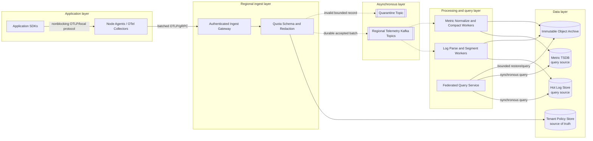

# Logging and Metrics Pipeline

## 0. Interview classification

- **Primary challenge:** ingest bursty telemetry without blocking applications, preserve tenant isolation, and serve both recent interactive queries and cheap long-term retention.
- **Secondary challenges:** schema evolution, cardinality, partitioning, sampling, backpressure, stream replay, storage tiers, and regional isolation.
- **Patterns exercised:** [[Queues Streams and Pub Sub]], [[Backpressure and Load Shedding]], [[Bulkhead Pattern]], [[Retry Timeout and Deadline Pattern]], [[Deduplication and Inbox Pattern]].
- **Expected interview level:** Senior Backend / Senior Golang; Staff signals come from narrowed guarantees and operational judgment.
- **Recommended prerequisites:** [[Observability and SLOs]], [[Partitioning and Sharding]], [[Blob Object and File Storage]], [[Security Abuse and Privacy]].
- **Candidate design disclaimer:** “An interview-oriented candidate design based on public information and distributed-systems principles, not a claim about the company’s exact internal implementation.”

## 1. How to approach this problem

- **First questions:** Which signals are in scope? What is the ingest scale? How fresh must queries be? What retention? Can telemetry be dropped?
- **Hidden complexity:** ingest bursty telemetry without blocking applications, preserve tenant isolation, and serve both recent interactive queries and cheap long-term retention; make the invariant and failure boundary visible.
- **What not to over-design:** application-specific alert rules, full distributed tracing backend, SIEM detection content, and unlimited arbitrary-label queries
- **What the interviewer is testing:** bounded scope, ownership, complete flow, causal scaling, and explicit trade-offs.
- **Mental model:** derive authority and commit point first; add components only when a requirement or bottleneck forces them.
- **Expected deep-dive branches:** Durable ingest and backpressure; Metric cardinality control; Hot, warm, and archive query.

## 2. Interview timeline for this system

- **0–3:** restate collect, authenticate, buffer, validate, route, transform, store, query, and retain multi-tenant logs and metrics; park application-specific alert rules, full distributed tracing backend, SIEM detection content, and unlimited arbitrary-label queries
- **3–7:** clarify NFRs and calculate the dominant rate, data, and skew.
- **7–12:** state invariants, entities, APIs, keys, and source of truth.
- **12–22:** draw Version 1 and trace the critical flow.
- **22–32:** ask the interviewer to select Durable ingest and backpressure, Metric cardinality control, Hot, warm, and archive query.
- **32–39:** address Compute: parsing, compression, index creation, and metric aggregation; split independent pipelines., Storage: index amplification and replicas dominate logs; restrict indexed fields and tier aggressively., Network: ingest and replication bandwidth; batch/compress near source. and failure controls.
- **39–43:** make decisions from the trade-off table; add region/security only where relevant.
- **43–45:** summarize guarantees, relaxed state, risks, and next validation.

## 3. Requirements clarification

| Candidate question | Possible interviewer answer |
| --- | --- |
| Which signals are in scope? | Application logs and metrics; traces are referenced but not fully designed. |
| What is the ingest scale? | 10 TB/day compressed with 5× bursts. |
| How fresh must queries be? | Recent telemetry searchable within 30 seconds. |
| What retention? | Seven days hot, 90 days searchable warm, one year object archive. |
| Can telemetry be dropped? | Debug logs and excess high-cardinality series may be sampled; security/audit classes follow stricter policy. |

**Selected scope:** collect, authenticate, buffer, validate, route, transform, store, query, and retain multi-tenant logs and metrics

**Explicit non-goals:** application-specific alert rules, full distributed tracing backend, SIEM detection content, and unlimited arbitrary-label queries

## 4. Functional requirements

- Accept logs and metric points through agents/collectors.
- Batch, compress, authenticate, and locally buffer telemetry.
- Validate schemas, enforce label/cardinality and tenant quotas.
- Durably buffer regional ingress and replay processing.
- Store recent logs and metrics in query-optimized stores.
- Archive immutable segments to object storage.
- Query by time, indexed fields, labels, and aggregates.

## 5. Non-functional requirements

- Interview assumption: 10 TB/day compressed, 5× burst, 2M active metric series.
- Application export must not add more than a small bounded latency or unbounded memory.
- 99.9% accepted-ingest durability after acknowledgement.
- 95% of accepted data queryable within 30 seconds.
- Tenant isolation, encryption, retention, deletion, and access auditing.
- Regional ingestion continues independently; global query can fan out or use replicated archive.

## 6. Back-of-the-envelope estimation

> [!important] Interview assumptions
> These values size a candidate design. They are not company or production facts.

10 TB/day compressed is about 116 MB/s average and 580 MB/s peak. At 1 MB compressed batches, peak is roughly 580 batches/s; provision at least 2× for replay. Seven hot days are 70 TB compressed before index amplification and replicas; if log indexes add 1.5× and RF2, hot physical storage approaches 350 TB. Two million active metric series at one point/10 seconds produce 200k points/s average; 5× peak is 1M/s. A 15-second buffer for 580 MB/s requires about 8.7 GB per regional collector tier, while agents need bounded disk spool sized by local outage tolerance.

## 7. Core invariants

- Application business work never blocks indefinitely on telemetry export.
- An accepted batch has durable ownership in the regional stream or explicitly documented loss semantics.
- Tenant identity is assigned from authenticated transport, never trusted from payload alone.
- A tenant cannot consume unbounded ingest, label cardinality, query CPU, or retention.
- Event time, receive time, schema version, and unique batch identity remain distinguishable.
- Audit/security telemetry is never silently sampled by a generic debug-log policy.
- Archived segments are immutable and checksummed; deletion policy is auditable.

## 8. Core entities

| Entity | Ownership and lifecycle |
| --- | --- |
| TelemetryBatch | Collector owns batch ID, authenticated tenant, signal, time range, encoding, checksum, and acknowledgement state. |
| LogRecord | Log pipeline owns event/receive time, severity, body reference, resource attributes, and indexed fields. |
| MetricSeries | Metric pipeline owns tenant plus metric name plus normalized label set; points evolve until compaction. |
| SchemaPolicy | Control plane owns allowed fields, redaction, label budget, sampling, retention, and routing. |
| StorageSegment | Storage service owns immutable time/tenant shard, checksum, min/max indexes, tier, and lifecycle. |
| Query | Query service owns principal, tenant scope, expression, time range, resource budget, and audit outcome. |

## 9. API design

| Method | Path or RPC | Request | Response | Authentication | Idempotency | Pagination | Error behaviour |
| --- | --- | --- | --- | --- | --- | --- | --- |
| POST | /v1/telemetry/batches | compressed OTLP/log batch, batch_id | accepted count, rejected reasons | mTLS/workload token | batch_id required | N/A | 400 schema; 413; 429 quota; 503 no durable buffer |
| POST | OTLP Export | resource logs/metrics | partial success and rejected count | mTLS/workload token | batch identity extension/retry-safe points | N/A | deadline/partial rejection semantics |
| GET | /v1/logs:search | query, time range, limit, cursor | records, next_cursor, partial flag | user/service authorization | N/A | Opaque time/shard cursor | 400 expensive; 403; 429 budget; 206 partial |
| POST | /v1/metrics:query_range | expression, start, end, step | series/matrix, warnings | user/service authorization | N/A | Series bounded by query | 400; 422 cardinality; 429; 503 |
| GET | /v1/ingest/status | tenant, region | lag, rejection, freshness | operator role | N/A | N/A | 403 |

## 10. Data model

| Table/store | Primary key | Partition key | Important indexes | Source of truth | Retention | Consistency | Access pattern |
| --- | --- | --- | --- | --- | --- | --- | --- |
| Regional ingest stream | tenant + signal + time bucket | tenant hash plus shard | batch_id | Ingest service | 24–72 hour replay | per-partition ordered, at-least-once | durable handoff and replay |
| Hot log store | tenant + day + segment | tenant/time shard | selected fields, event time | Log storage service | 7 days | eventual indexing; immutable segments | recent filtered search |
| Metric TSDB | series fingerprint + time block | tenant + fingerprint | metric name/labels | Metrics storage service | 30–90 days | per-series append and block compaction | range/aggregate queries |
| Warm segment catalog | segment_id | tenant + time | field min/max, tier | Storage catalog | 90 days or policy | strong metadata pointer | query pruning |
| Object archive | tenant/date/segment checksum | tenant/date prefix | checksum and schema | Archive service | 1 year policy | immutable read-after-write | restore/compliance queries |
| Policy store | tenant_id + policy_version | tenant_id | signal/retention | Control plane | Version history | strong config | ingest and query admission |

## 11. First working design

### HLD: Logging and Metrics Pipeline — candidate design



### ASCII fallback

```text
[Apps] --nonblocking--> [Agents/OTel Collectors + disk spool] --OTLP--> [Ingest Gateway]
                                                                     --> [Quota/Schema/Redaction] --> [Policy Store]
                                                                                 |
                                                                                 +--async--> [Regional Kafka]
                                                                                               |--> [Log Workers] --> [Hot Log Store]
                                                                                               |                 +--> [Object Archive]
                                                                                               +--> [Metric Workers] --> [Metric TSDB]
[Users] --query--> [Federated Query Service] ---------------------------------------> stores/archive
```

**Legend:** solid arrow = synchronous request/response or direct state access; dashed arrow = asynchronous event/job. “Source of truth” owns authoritative state; “derived” can rebuild.

## 12. Complete critical flow

1. Application emits a log or metric to a local nonblocking SDK queue; node collector enriches resource identity, batches, compresses, and persists temporarily if the network is unavailable.
2. Collector exports over mTLS OTLP/gRPC with batch ID; Gateway authenticates workload and derives tenant independently of payload.
3. Validator loads versioned tenant policy, enforces size/rate/label budget, redacts configured fields, and returns partial rejection details for invalid records.
4. Gateway acknowledges only after the valid batch is durably appended to the regional telemetry topic; producers use bounded retries with jitter.
5. Log and metric consumers process at-least-once: batch/record identity prevents duplicate segment rows or metric points.
6. Log workers build immutable time/tenant segments and indexes; metric workers normalize series and compact time blocks; both write archive segments with checksums.
7. Query Service authenticates the user, estimates cost, fans out only to relevant tenant/time shards, merges results, and marks partial responses if a shard misses its deadline.

## 13. Evolve the design under scale

### Version 1

Agents send batches directly to one ingest API that writes logs and metrics to separate databases; enough for a small regional fleet.

### Version 2

Bursts and storage outages back up applications. Add bounded agent disk spool, regional durable stream, independent log/metric consumers, and immutable object archive.

### Version 3

Partition by tenant/time, isolate heavy tenants, introduce schema/redaction control plane, hot/warm tiers, block/segment compaction, query admission and caching, regional ingest autonomy, and federated global queries.

**Partition and routing:** Partition ingress by authenticated tenant hash plus signal and rotating shard, preserving useful local order without one large tenant owning one partition. Store/query shards use tenant plus time; metric series fingerprint adds distribution. Very large tenants receive dedicated partitions and quotas.

## 14. Deep dive

### 1. Durable ingest and backpressure

**Problem and alternatives:** Direct writes couple applications to storage outages. Alternatives are in-memory buffers, local disk spool, managed queue, or replayable log.

**Selected design and detailed flow:** SDK queues are bounded and drop only per policy; node collector batches to disk spool. Gateway acknowledges after Kafka append. Consumer lag slows admission, triggers sampling of allowed classes, and never expands memory without bound.

**Trade-offs and failure handling:** Disk and stream add latency/operations. If all buffers fill, return 429/503 and apply priority: preserve audit/errors, sample debug and high-volume metrics according to explicit policy.

### 2. Metric cardinality control

**Problem and alternatives:** Unbounded labels create millions of series and expensive queries. Alternatives are trust producers, central allowlists, or per-tenant budgets with preaggregation.

**Selected design and detailed flow:** Normalize labels, reject forbidden/unbounded dimensions, estimate new-series cardinality, enforce tenant/metric budgets, and provide exemplar/log links instead of putting IDs in labels.

**Trade-offs and failure handling:** Rejecting labels can lose diagnostic detail, so surface partial errors and dashboards. Existing excessive series expire normally; emergency policies are versioned and audited.

### 3. Hot, warm, and archive query

**Problem and alternatives:** One store cannot cheaply serve seconds-old queries and one-year retention. Alternatives are one large cluster or tiered immutable segments.

**Selected design and detailed flow:** Hot stores serve recent indexed data; compacted segments move to warm/object tiers with catalog min/max/bloom metadata. Query planner prunes time/fields and can restore bounded archive segments asynchronously.

**Trade-offs and failure handling:** Tiering makes old queries slower and partial. Cap query range/parallelism, expose estimated cost, and audit restores; catalog loss is rebuilt by scanning object manifests.

## 15. Detailed success flow

1. Service checkout emits 1,000 records and metric points; collector creates compressed batch b-81 for tenant shop.
2. Gateway authenticates checkout workload, policy v12 redacts payment fields and rejects one forbidden metric label while accepting 999 records.
3. Kafka acknowledges b-81; gateway returns partial success with rejected reason in 120 ms.
4. Log consumer writes segment shop/10:00/s-4 and archive object checksum c-10; metric consumer writes points to series fingerprints.
5. At 10:00:20, an engineer queries errors for checkout; planner touches only tenant shop and two recent log shards.
6. Query returns records plus warning about the rejected label; query and access are audit-logged.

## 16. Detailed failure flows

### Failure 1 — Regional stream is unavailable

- **Detection:** Produce latency/errors and collector spool depth increase.
- **Immediate behaviour:** Gateway stops acknowledging; collectors use bounded local disk spool and applications follow signal priority/drop policy.
- **Retry policy:** Collectors retry with exponential backoff and jitter under a fixed deadline/budget.
- **Idempotency/deduplication:** Batch ID makes resend safe after recovery.
- **Recovery:** Recover broker quorum, drain spools gradually with admission so replay does not starve live traffic.
- **User-visible outcome:** Business requests continue; low-priority telemetry may be explicitly lost, and freshness degrades.
- **Observability:** spool bytes/oldest age, export failures, dropped records by class, stream health.

### Failure 2 — Consumer duplicates a batch after crash

- **Detection:** Existing segment/record or metric point identity is found.
- **Immediate behaviour:** Skip already committed output and advance offset only after durable storage.
- **Retry policy:** Redelivery is normal; processing retries are capped for poison data.
- **Idempotency/deduplication:** Batch/record ID and immutable segment manifest provide inbox semantics.
- **Recovery:** Resume from stream offset; quarantine deterministic bad record without blocking partition.
- **User-visible outcome:** No duplicate query result.
- **Observability:** dedupe hit, redelivery count, poison records, partition lag.

### Failure 3 — One tenant creates cardinality explosion

- **Detection:** New-series rate and active-series budget spike for tenant/metric.
- **Immediate behaviour:** Reject or aggregate offending label set; preserve other tenants with bulkhead quotas.
- **Retry policy:** No blind retry for policy rejection; producer must change labels.
- **Idempotency/deduplication:** Series fingerprint prevents duplicate creation races.
- **Recovery:** Expire old series, deploy policy update, and supply diagnostic sampled logs/exemplars.
- **User-visible outcome:** Tenant receives partial rejection; other tenants stay healthy.
- **Observability:** active/new series, rejected labels, memory/query CPU by tenant.

### Failure 4 — Hot log shard is unavailable

- **Detection:** Query shard errors and ingest segment flush failures occur.
- **Immediate behaviour:** Buffer completed segments in stream/object store; queries return partial with missing shard declared.
- **Retry policy:** Storage writes retry with jitter; query has one bounded alternate-replica attempt.
- **Idempotency/deduplication:** Immutable segment ID prevents duplicate flush.
- **Recovery:** Repair/replace shard and replay stream/object manifests.
- **User-visible outcome:** Recent queries may be partial; accepted data is not lost.
- **Observability:** freshness lag, partial query rate, replica health, replay ETA.

## 17. Bottlenecks and scalability

- Compute: parsing, compression, index creation, and metric aggregation; split independent pipelines.
- Storage: index amplification and replicas dominate logs; restrict indexed fields and tier aggressively.
- Network: ingest and replication bandwidth; batch/compress near source.
- Hot partitions: large tenants and synchronized metrics; dedicated shards and rotating subshards.
- Skew/cardinality: unbounded labels create memory and query explosion; admission at ingest.
- Queue lag: per-signal/tenant lag drives autoscaling and sampling/load shedding.
- Large records: cap size and place large payloads in object storage with references.
- Query fan-out: time/tenant pruning and cost admission prevent scatter across all shards.

**Partitioning unit and routing strategy:** Partition ingress by authenticated tenant hash plus signal and rotating shard, preserving useful local order without one large tenant owning one partition. Store/query shards use tenant plus time; metric series fingerprint adds distribution. Very large tenants receive dedicated partitions and quotas.

## 18. Reliability and recovery

- Bound SDK/agent queues and disk spools; define priority-based loss rather than OOM.
- Acknowledge only after durable stream append and use idempotent consumers.
- Replicate broker and hot stores across zones; archive immutable segments with checksums.
- Use deadlines, retry budgets, circuit breakers, and bulkheads per tenant/signal.
- Keep regional ingest independent; global query may degrade to regional results.
- Test restore of archive catalog and replay into new hot stores.
- After recovery, drain backlog under a rate budget and monitor freshness catch-up.

## 19. Observability

- **Key metrics:** ingest bytes/records, accepted/rejected/dropped, spool age, stream lag, data freshness, active series, index ratio, query p99/partial.
- **Logs:** pipeline decisions with batch_id, authenticated tenant, policy version, reason and counts; never raw secrets by default.
- **Traces:** collector export through stream append, consumer processing, storage commit and query fan-out using span links.
- **SLI/SLO candidates:** 99.9% acknowledged batches durable; 95% accepted data queryable within 30 seconds; query availability by tier.
- **Dashboards:** regional ingest health, loss by class, consumer freshness, storage growth, tenant cardinality, query cost.
- **Alerts:** burn-rate durability/freshness; spool exhaustion; stream quorum; cardinality and partial-query alerts.
- **Business-level signals:** coverage of production workloads, audit-event preservation, telemetry cost per service/request.

## 20. Security and abuse

- Authenticate workloads with mTLS/identity and derive tenant server-side.
- Authorize queries by tenant, role, signal, and field; audit every sensitive query/export.
- Encrypt transport and stores; use tenant-aware keys where policy requires.
- Apply source/central redaction, tokenization, retention, legal hold, and deletion workflows.
- Reject control characters/oversized/decompression-bomb payloads; sandbox parsers.
- Rate, byte, series, query CPU, and retention quotas isolate tenants.

## 21. Explicit trade-off table

| Decision | Selected option | Alternative | Why selected | Cost or weakness | When alternative wins |
| --- | --- | --- | --- | --- | --- |
| Handoff | Durable stream before ACK | Direct store write | Decouples storage and survives replay | Broker cost and added latency | Low-volume simple system |
| Agent buffer | Bounded disk spool | Unbounded memory | Survives network outage without OOM | Disk wear and finite loss window | Ephemeral best-effort telemetry |
| Log storage | Indexed hot plus object archive | Index everything forever | Controls cost and supports recent queries | Old queries slower | Compliance requires instant long retention |
| Metric labels | Budgeted allowlist | Accept arbitrary labels | Predictable series/query cost | Some dimensions rejected | Trusted bounded producers |
| Ingest partition | Tenant plus rotating shard | Timestamp only | Isolation and distribution | No total event order | Global order truly required |
| Processing | At-least-once idempotent | Exactly-once claim | Practical crash recovery | Identity/manifest complexity | Single transactional store |
| Query failure | Partial explicit result | Fail entire query | Useful during shard loss | Caller must notice partial flag | Completeness is mandatory |
| Regional model | Independent regional ingest | One global ingest | Small blast radius and local latency | Global query federation | Very small one-region fleet |
| Sampling | Policy by signal/class | Uniform random | Preserves critical events | Policy governance | All records legally required |
| Schema | Versioned normalization | Schemaless forever | Stable queries and controls | Evolution work | Raw archive-only use |

## 22. Technology choices

| Technology | Role | Why it fits | Viable alternative | Operational cost | When choice changes |
| --- | --- | --- | --- | --- | --- |
| OpenTelemetry Collector | Agent/gateway collection | Standard OTLP, processors, exporters | Fluent Bit/Vector | Fleet config and memory tuning | Log-only environment |
| Kafka | Regional durable buffer | Replay, partitions, consumer isolation | Kinesis/PubSub | Broker operations | Managed platform preferred |
| OpenSearch | Recent log search option | Inverted indexes and time partitions | ClickHouse | Index/storage cost | Analytical scans dominate |
| Prometheus-compatible TSDB | Metric blocks and query model | Label-based time series ecosystem | Mimir/Thanos/VictoriaMetrics | Cardinality and compaction operations | Vendor/platform constraints |
| S3 | Immutable archive | Durability, lifecycle, checksum | GCS | Retrieval and governance | Cloud changes |
| ClickHouse | High-volume log analytics option | Columnar compression and scans | OpenSearch | Cluster tuning | Free-text search dominates |

## 23. Interviewer follow-up questions

| Likely follow-up | Concise strong answer | Diagram change | Trade-off |
| --- | --- | --- | --- |
| What happens when telemetry traffic spikes 10×? | Agents batch/spool, gateway quotas, stream absorbs bounded bursts, consumers scale, and only allowed classes sample/drop. | Highlight backpressure layers. | Completeness versus application safety. |
| How do you prevent metric cardinality explosion? | Normalize label sets and enforce per-tenant/metric new-series budgets at ingress. | Add cardinality admission box. | Diagnostic richness versus cost. |
| How do you query one year of logs? | Use segment catalog to prune object archive and run an asynchronous bounded query/restore. | Add archive query worker. | Latency versus storage cost. |
| Is ingestion exactly once? | No; durable at-least-once batches and idempotent segment/point writes provide effective dedupe. | Mark batch ID at stream/store. | Complexity versus duplication. |

## 24. What a weak candidate does

- Lets applications synchronously write the central database.
- Treats logs and metrics as identical storage/index shapes.
- Indexes every field and accepts every label.
- Says Kafka prevents duplicates without consumer idempotency.
- Ignores query isolation, retention, redaction, and partial results.
- Has no behavior when buffers are full.

## 25. What a strong senior candidate demonstrates

- States acknowledgement and loss boundaries per signal class.
- Quantifies ingest bandwidth, hot physical storage, cardinality, and backlog.
- Separates collection, durable handoff, signal processing, storage tiers, and query plane.
- Defines tenant budgets and graceful degradation before overload.
- Makes replay, dedupe, schema/versioning, and restore observable.
- Adjusts completeness, freshness, and cost explicitly.

## 26. Five-minute revision

- **Requirements:** collect, buffer, process, store, query, retain logs/metrics.
- **Critical invariant:** accepted batch is durable; apps never block unbounded; tenant identity is trusted transport.
- **Core HLD:** agent/spool → gateway/policy → regional Kafka → log/metric workers → hot stores/archive → query.
- **Most important data model:** batch ID and tenant/time segments; metric series fingerprint.
- **Critical flow:** batch, authenticate, validate, append, process idempotently, query.
- **Three bottlenecks:** ingest burst, log index amplification, metric cardinality/query fan-out.
- **Three trade-offs:** durable stream, tiered storage, bounded sampling.
- **Three failures:** stream outage, duplicate batch, tenant cardinality explosion.
- **Likely deep dive:** durable ingest and backpressure.

## 27. Blank-page practice prompt

Design a multi-tenant logging and metrics pipeline ingesting ten terabytes per day with five-times bursts. Applications must not block indefinitely, accepted telemetry should be searchable within thirty seconds, and data has hot, warm, and one-year archive retention. Explain backpressure, cardinality, durability, query isolation, and failure recovery.

## 28. Adversarial variations

- Ingest volume grows 100×.
- A single tenant produces half of all bytes and metric series.
- The regional broker is unavailable for 30 minutes.
- Security logs may never be sampled, while cost must fall 50%.
- Queries must span every region.
- Freshness tightens from 30 seconds to 3 seconds.
- A deletion request must remove one tenant's archived data.

## 29. Practice and re-test history

- [ ] Untimed reconstruction — date/result:
- [ ] 45-minute mock — score/date:
- [ ] Follow-up round — variation/result:
- [ ] One-day review — date/result:
- [ ] Three-day review — date/result:
- [ ] Seven-day review — date/result:
- [ ] Fourteen-day review — date/result:

Personal readiness remains `not-started` until evidence is recorded in [[System Design Practice Tracker]].

## 30. Related internal notes and verified external references

**Internal:** [[Observability and SLOs]] · [[Queues Streams and Pub Sub]] · [[Backpressure and Load Shedding]] · [[Bulkhead Pattern]] · [[Blob Object and File Storage]] · [[Security Abuse and Privacy]]

**Verified external references (checked 2026-07-17):**

- [OpenTelemetry Collector documentation](https://opentelemetry.io/docs/collector/) — collection, processing, and exporting architecture.
- [OpenTelemetry signals](https://opentelemetry.io/docs/concepts/signals/) — signal definitions and context.
- [Apache Kafka documentation](https://kafka.apache.org/documentation/) — partitioned durable buffering.
- [Prometheus data model](https://prometheus.io/docs/concepts/data_model/) — metric series and label semantics.
- [AWS S3 object integrity](https://docs.aws.amazon.com/AmazonS3/latest/userguide/checking-object-integrity-upload.html) — checksummed immutable archives.

