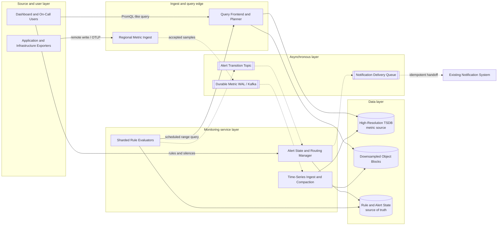

# Monitoring System

## 0. Interview classification

- **Primary challenge:** evaluate alerts over high-cardinality time-series data quickly enough to detect user-impacting failures without producing an unreliable flood of pages.
- **Secondary challenges:** metrics ingestion, time-series storage, query planning, rule scheduling, missing data, cardinality, notification dedupe, SLO burn rates, and regional failure.
- **Patterns exercised:** [[Queues Streams and Pub Sub]], [[Backpressure and Load Shedding]], [[Deduplication and Inbox Pattern]], [[Leader Election]], [[Caching Pattern]].
- **Expected interview level:** Senior Backend / Senior Golang; Staff signals come from narrowed guarantees and operational judgment.
- **Recommended prerequisites:** [[Observability and SLOs]], [[Partitioning and Sharding]], [[Replication]], [[Notification System]], [[Consistency Models]].
- **Candidate design disclaimer:** “An interview-oriented candidate design based on public information and distributed-systems principles, not a claim about the company’s exact internal implementation.”

## 1. How to approach this problem

- **First questions:** What does the system monitor? What ingest and series scale? How quickly must alerts fire? What retention and query horizon? What alert semantics?
- **Hidden complexity:** evaluate alerts over high-cardinality time-series data quickly enough to detect user-impacting failures without producing an unreliable flood of pages; make the invariant and failure boundary visible.
- **What not to over-design:** general log search, tracing backend, agent implementation for every platform, automated remediation, and a vendor-complete dashboard product
- **What the interviewer is testing:** bounded scope, ownership, complete flow, causal scaling, and explicit trade-offs.
- **Mental model:** derive authority and commit point first; add components only when a requirement or bottleneck forces them.
- **Expected deep-dive branches:** Rule evaluation and alert state; Time-series storage and query; SLO burn-rate alerting.

## 2. Interview timeline for this system

- **0–3:** restate ingest metrics, store/query time series, evaluate recording and alert rules, manage alert state, and route deduplicated notifications; park general log search, tracing backend, agent implementation for every platform, automated remediation, and a vendor-complete dashboard product
- **3–7:** clarify NFRs and calculate the dominant rate, data, and skew.
- **7–12:** state invariants, entities, APIs, keys, and source of truth.
- **12–22:** draw Version 1 and trace the critical flow.
- **22–32:** ask the interviewer to select Rule evaluation and alert state, Time-series storage and query, SLO burn-rate alerting.
- **32–39:** address Compute: expression evaluation and block merge; recording rules precompute reused expressions., Storage: high-resolution retention and index amplification; compact/downsample/archive., Network: remote-write ingest and query fan-out; batch/compress and prune shards. and failure controls.
- **39–43:** make decisions from the trade-off table; add region/security only where relevant.
- **43–45:** summarize guarantees, relaxed state, risks, and next validation.

## 3. Requirements clarification

| Candidate question | Possible interviewer answer |
| --- | --- |
| What does the system monitor? | Infrastructure and application numeric metrics plus SLO-derived alerts. |
| What ingest and series scale? | Ten million active series and two million samples/s peak. |
| How quickly must alerts fire? | Critical conditions detected and delivered within 60 seconds. |
| What retention and query horizon? | 15 days high resolution, 13 months downsampled. |
| What alert semantics? | At-least-once rule evaluation and notification handoff with dedupe; no claim of exactly-once paging. |

**Selected scope:** ingest metrics, store/query time series, evaluate recording and alert rules, manage alert state, and route deduplicated notifications

**Explicit non-goals:** general log search, tracing backend, agent implementation for every platform, automated remediation, and a vendor-complete dashboard product

## 4. Functional requirements

- Ingest timestamped metric samples with labels and tenant identity.
- Validate labels and control series cardinality.
- Store replicated high-resolution blocks and downsample older data.
- Run instant and range queries for dashboards.
- Schedule recording and alert rule evaluation.
- Track pending/firing/resolved alert state and silence/inhibit rules.
- Route grouped, deduplicated notifications to existing channels.

## 5. Non-functional requirements

- Interview assumption: 10M active series, 2M samples/s peak, 5× short bursts.
- 99.9% accepted-sample durability after durable handoff.
- Recent samples queryable within 30 seconds.
- Critical alert detect-to-notify p99 below 60 seconds.
- Monitoring remains useful during the failure it observes; regional and tenant bulkheads.
- Authenticated tenant isolation and controlled label/query cardinality.

## 6. Back-of-the-envelope estimation

> [!important] Interview assumptions
> These values size a candidate design. They are not company or production facts.

Two million samples/s at about 20 bytes compressed sample plus amortized label/index cost is at least 40 MB/s raw compressed sample data and 3.5 TB/day before replicas/index overhead. Ten million series scraped every 15 seconds produces about 667k samples/s average, leaving burst/headroom to 2M/s. Fifteen days at 3.5 TB/day is roughly 52 TB logical high-resolution data; RF2 and indexes increase physical need. If 100k rules evaluate every 30 seconds, average is 3,333 evaluations/s; shard by tenant/rule group and use jitter so minute boundaries do not synchronize. A 60-second alert SLO leaves budgets for ingest freshness, evaluation, and notification separately.

## 7. Core invariants

- An accepted sample is durably owned or explicitly rejected; silent acceptance followed by loss is forbidden.
- Series identity is metric name plus a normalized, authenticated-tenant label set.
- A tenant cannot create unbounded new series or query fan-out.
- For each rule group and scheduled timestamp, one logical evaluation result is committed idempotently even if workers retry.
- Alert state transitions use event time and configured for-duration; missing data has an explicit per-rule policy.
- A page event has a stable fingerprint so retries and replicas do not create uncontrolled duplicate incidents.
- Monitoring control and data planes avoid depending solely on the same failure domain they monitor.

## 8. Core entities

| Entity | Ownership and lifecycle |
| --- | --- |
| Series | Metrics service owns tenant, metric name, normalized labels, fingerprint, and active/last-seen lifecycle. |
| Sample | Ingest owns series fingerprint, event timestamp, value, receive time, and batch identity. |
| MetricBlock | Storage owns immutable tenant/time shard with index, checksum, resolution, and compaction state. |
| RuleGroup | Rule control plane owns expressions, interval, for-duration, labels, dependencies, and version. |
| AlertInstance | Rule engine owns fingerprint, state, active_since, last evaluation/value, annotations, and generation. |
| Silence/Inhibition | Alert manager owns matchers, time range, creator, audit, and suppression reason. |
| NotificationEvent | Alert manager owns receiver, group key, alert generation, dedupe key, attempt, and delivery state. |

## 9. API design

| Method | Path or RPC | Request | Response | Authentication | Idempotency | Pagination | Error behaviour |
| --- | --- | --- | --- | --- | --- | --- | --- |
| POST | /v1/metrics:write | remote-write/OTLP samples, batch_id | accepted/rejected counts | mTLS/workload identity | batch_id and point identity | N/A | 400 labels/time; 413; 429 cardinality; 503 |
| POST | /v1/query_range | expression, start, end, step | series matrix, warnings, partial | user/service tenant auth | N/A | Bounded result/continuation | 400/422; 429 cost; 206 partial |
| PUT | /v1/rule-groups/{id} | rules, interval, expected_version | version, validation | monitoring admin | request_id | N/A | 400 expression; 409 version |
| POST | /v1/silences | matchers, start, end, comment | silence_id | on-call/admin | request_id | N/A | 400 broad/long; 403 |
| GET | /v1/alerts | state, receiver, cursor | alerts, next_cursor | on-call/user role | N/A | Opaque keyset cursor | 403; 400 cursor |

## 10. Data model

| Table/store | Primary key | Partition key | Important indexes | Source of truth | Retention | Consistency | Access pattern |
| --- | --- | --- | --- | --- | --- | --- | --- |
| Ingest WAL/stream | tenant + shard + batch/offset | tenant hash + rotating shard | series fingerprint | Ingest service | 24–72 hour replay | per-partition ordered, at-least-once | durable handoff |
| Series catalog | tenant + fingerprint | tenant hash + fingerprint | metric/label inverted index | Metrics storage | Active plus tombstone policy | conditional create/cardinality budget | label matching and admission |
| High-resolution blocks | tenant + time block + shard | tenant/time/fingerprint range | min/max and label postings | Metrics storage | 15 days | immutable blocks, replicated | recent range queries |
| Downsampled archive | tenant + month + resolution | tenant/time | checksum/catalog | Metrics storage | 13 months | immutable object blocks | long-horizon trends |
| Rule config | tenant + rule_group_id | tenant | next evaluation/version | Rule control plane | Audit history | strong version update | rule scheduling |
| Alert state | tenant + alert fingerprint | tenant/fingerprint | state/receiver | Rule engine | Active plus history | conditional generation update | pending/firing/resolved |
| Notification log | dedupe key + generation | receiver shard | next attempt | Alert manager | Policy-defined | idempotent state machine | group/retry/audit |

## 11. First working design

### HLD: Monitoring System — candidate design



### ASCII fallback

```text
[Exporters] --remote write--> [Regional Ingest] --durable--> [Metric WAL/Stream] --> [TSDB blocks] --> [Object archive]
[Users/Dashboards] --query--> [Query Frontend/Planner] -------------------------------> stores
[Rule Scheduler/Evaluators] --scheduled query--> Query
          |--> [Rule + Alert State: source of truth] --alert event--> [Alert Manager]
                                                                    |--> [Silences/group/dedupe]
                                                                    +--async--> [Notification Queue] --> [[Notification System]]
```

**Legend:** solid arrow = synchronous request/response or direct state access; dashed arrow = asynchronous event/job. “Source of truth” owns authoritative state; “derived” can rebuild.

## 12. Complete critical flow

1. Exporter sends a compressed sample batch over authenticated remote write; Ingest derives tenant, validates timestamps/labels, applies cardinality budgets, and durably appends valid points.
2. Ingest acknowledges with partial rejection details; storage consumers decode, deduplicate point identities, update series catalog, and create replicated recent blocks.
3. At scheduled time 10:00:30, the owner of rule group checkout-slo evaluates against Query Frontend for a bounded window and carries group/version/evaluation timestamp.
4. Planner prunes tenant/time blocks, executes expression, and returns value plus freshness/partial metadata; evaluator never treats an undeclared partial result as healthy.
5. Evaluator conditionally advances AlertInstance: INACTIVE to PENDING or PENDING to FIRING after for-duration; it emits transition with stable fingerprint/generation.
6. Alert Manager applies silence/inhibition, groups related firing alerts, and enqueues a notification with dedupe key.
7. Existing Notification System delivers through email/pager/webhook at least once; Alert Manager records outcome and retries without creating a new incident generation.

## 13. Evolve the design under scale

### Version 1

One Prometheus-like server scrapes/writes metrics, stores local blocks, executes rules, and sends alerts; sufficient for one small environment.

### Version 2

Retention and HA require remote write, replicated ingest/storage, object blocks, query frontend, and two rule replicas with deterministic ownership/dedupe.

### Version 3

Partition by tenant/series/time, add cardinality and query budgets, sharded rule groups with leases, recording rules, multi-region ingest, independent alert managers, global view/federation, and SLO burn-rate policies. Keep alert path independent of dashboard availability where possible.

**Partition and routing:** Hash authenticated tenant plus series fingerprint across ingest/storage shards; time blocks bound scans. Rule groups are the scheduling/ordering unit and hash to evaluator owners with leases/fencing. Alert fingerprints hash across Alert Manager state shards; notification routing partitions by receiver/group.

## 14. Deep dive

### 1. Rule evaluation and alert state

**Problem and alternatives:** Duplicate evaluators or delayed samples can flap pages. Alternatives are one leader, active replicas with dedupe, or per-group leased ownership.

**Selected design and detailed flow:** Assign rule group to one current lease owner, evaluate at deterministic scheduled timestamps, write result keyed by group/version/timestamp, and conditionally update alert generation. A second replica may evaluate for HA but only one transition generation is accepted.

**Trade-offs and failure handling:** Leases add failover delay; duplicate evaluation is harmless through deterministic keys. Late/missing data follows rule policy and freshness threshold, never defaults silently to OK.

### 2. Time-series storage and query

**Problem and alternatives:** Billions of points need label filtering and time scans. Alternatives are general SQL, wide-column rows, or immutable compressed time blocks with postings indexes.

**Selected design and detailed flow:** Normalize series fingerprints, buffer/WAL recent samples, compact into immutable blocks by tenant/time/fingerprint, build label postings, and downsample older data. Planner fans out to matching blocks and merges by series/time.

**Trade-offs and failure handling:** Compaction is eventually visible and late data needs a bounded window. High-cardinality regex queries are costed/rejected; partial shards are explicitly reported.

### 3. SLO burn-rate alerting

**Problem and alternatives:** Static thresholds page on symptoms that may not threaten users. Alternatives are resource thresholds, anomaly detection, or error-budget burn alerts.

**Selected design and detailed flow:** Store SLI numerator/denominator recording rules; evaluate short and long windows together. Fast high burn pages, slower moderate burn tickets, and diagnostic resource metrics remain context.

**Trade-offs and failure handling:** Burn alerts require trustworthy SLI labels and traffic floors. Low-volume services need minimum-event logic; missing denominator is UNKNOWN, not healthy.

## 15. Detailed success flow

1. Checkout emits batch b-7 containing request/error counters at 10:00:15; Ingest accepts 99,900 points and rejects 100 forbidden user_id labels.
2. WAL durably owns b-7 before acknowledgement; storage makes the series queryable at 10:00:24.
3. At 10:00:30 rule owner e-12 evaluates a 5-minute and 1-hour checkout availability burn rule for timestamp 10:00:30.
4. Query returns complete/fresh values showing 18× short and 8× long error-budget burn; AlertInstance becomes FIRING generation 44.
5. Alert Manager finds no silence, groups by service/region, creates notify key checkout/ap-south-1/g44, and queues PagerDuty receiver.
6. Notification handoff succeeds at 10:00:38; p99 detect-to-notify is within 60 seconds and the dashboard links the exact rule query.

## 16. Detailed failure flows

### Failure 1 — Metrics arrive late or a shard is partial

- **Detection:** Query response carries freshness/partial markers and ingest lag rises.
- **Immediate behaviour:** Evaluator applies configured UNKNOWN behavior; it does not resolve a firing alert from incomplete data.
- **Retry policy:** Evaluation retries once within interval budget, then records UNKNOWN.
- **Idempotency/deduplication:** Group/version/timestamp key prevents retry creating a second transition.
- **Recovery:** When data catches up, next deterministic evaluation reconciles state; long gaps trigger monitoring-pipeline alert.
- **User-visible outcome:** On-call may see data-missing alert or retained firing state, not false green.
- **Observability:** data freshness, partial query rate, UNKNOWN duration, per-shard ingest lag.

### Failure 2 — Two evaluators own the same rule group briefly

- **Detection:** Lease generation differs and state CAS conflicts.
- **Immediate behaviour:** Only higher/current fencing token can commit AlertInstance generation; stale result is discarded.
- **Retry policy:** Loser refreshes ownership rather than rapidly retrying writes.
- **Idempotency/deduplication:** Evaluation key and alert generation dedupe duplicate calculations/events.
- **Recovery:** Lease converges to one owner; audit records overlap.
- **User-visible outcome:** At most one logical page generation.
- **Observability:** ownership churn, stale-token rejects, duplicate evaluation rate.

### Failure 3 — Notification destination times out

- **Detection:** Delivery worker observes deadline and receiver error while notification remains pending.
- **Immediate behaviour:** Keep alert FIRING; mark delivery attempt uncertain and do not invent resolution.
- **Retry policy:** Capped exponential backoff with jitter and receiver retry budget; alternate receiver per escalation policy.
- **Idempotency/deduplication:** Stable notification dedupe key lets destination or adapter return original outcome.
- **Recovery:** Reconcile provider receipt if possible; continue escalation and record terminal failure.
- **User-visible outcome:** On-call may receive delayed or duplicate-at-most-provider page; UI shows delivery state.
- **Observability:** delivery latency/success, uncertain outcomes, retry count, escalation activation.

### Failure 4 — Metric cardinality spike overloads a tenant

- **Detection:** New-series rate, catalog memory, and rejected label budget spike.
- **Immediate behaviour:** Reject new offending series and expensive queries for that tenant; preserve existing series and other tenants.
- **Retry policy:** Policy rejection is not retried blindly.
- **Idempotency/deduplication:** Series fingerprint ensures concurrent creates consume budget once.
- **Recovery:** Fix instrumentation/policy, expire excess series, and replay only if budget allows.
- **User-visible outcome:** Tenant loses disallowed dimensions and sees explicit rejection.
- **Observability:** new/active series by tenant/metric, rejected samples, query CPU, memory.

## 17. Bottlenecks and scalability

- Compute: expression evaluation and block merge; recording rules precompute reused expressions.
- Storage: high-resolution retention and index amplification; compact/downsample/archive.
- Network: remote-write ingest and query fan-out; batch/compress and prune shards.
- Hot keys: popular global dashboards/rules; cache immutable query fragments and precompute.
- Skew/cardinality: large tenants/label sets need dedicated shards and admission.
- Queue lag/freshness: WAL lag directly consumes alert-detection budget.
- Rule synchronization: jitter scheduled groups and shard by group, not each rule independently.
- Regional concentration: monitoring must retain an independent path or external sentinel for the monitored region.

**Partitioning unit and routing strategy:** Hash authenticated tenant plus series fingerprint across ingest/storage shards; time blocks bound scans. Rule groups are the scheduling/ordering unit and hash to evaluator owners with leases/fencing. Alert fingerprints hash across Alert Manager state shards; notification routing partitions by receiver/group.

## 18. Reliability and recovery

- Replicate ingest/WAL and recent blocks across zones; immutable archive enables rebuild.
- Use deterministic rule timestamps, leased ownership, fencing, and idempotent alert generations.
- Set bounded query/evaluation/notification deadlines and retry budgets.
- Bulkhead tenants, query classes, rule groups, and notification receivers.
- Gracefully degrade dashboards/long queries before alert ingestion/evaluation.
- Keep last-known-good rules and audit versioned changes; canary rule updates.
- Test region loss, object-block restore, alert-state recovery, and meta-monitoring from an independent failure domain.

## 19. Observability

- **Key metrics:** sample accept/reject, active/new series, WAL lag, query p99/partial, rule duration/missed evaluations, alert transitions, notification latency/success.
- **Logs:** rule/config change, evaluation result, freshness, alert generation, silence and delivery outcome with tenant/fingerprint.
- **Traces:** ingest batch, scheduled rule query, alert transition and async notification link.
- **SLI/SLO candidates:** 99.9% accepted samples durable; recent data within 30 seconds; critical detect-to-notify p99 under 60 seconds.
- **Dashboards:** ingest/storage/query health, cardinality, rule scheduler, alert/notification pipeline, SLO burn alerts.
- **Alerts:** meta-monitoring from independent path for ingest freshness, missed rules, alert delivery and storage quorum.
- **Business-level signals:** actionable incident detection, page precision/duplicates, mean detect time, error-budget protection.

## 20. Security and abuse

- Authenticate exporters and derive tenant from workload identity.
- Authorize queries, rule changes, silences, and receiver configuration by tenant/role; audit them.
- Encrypt transport/stores and protect notification secrets in a secret manager.
- Reject sensitive/high-cardinality labels such as user IDs; apply retention/deletion policy.
- Rate-limit ingest/query/rule changes and isolate tenants.
- Prevent alert-template injection and restrict outbound webhook destinations.

## 21. Explicit trade-off table

| Decision | Selected option | Alternative | Why selected | Cost or weakness | When alternative wins |
| --- | --- | --- | --- | --- | --- |
| Collection model | Remote write/push to regional ingest | Central scrape only | Scales across networks and decouples storage | Agents/ingest complexity | Small reachable fleet |
| Storage | Immutable TSDB blocks | General row store | Compression and time-range efficiency | Compaction/eventual visibility | Ad hoc relational queries dominate |
| Rule ownership | Leased group owner with fencing | Every replica sends | One logical state transition | Failover delay | Duplicate pages acceptable |
| Alert guarantee | At-least-once with dedupe | Exactly-once paging claim | Survives uncertain provider boundaries | Rare provider duplicate | Receiver shares transaction |
| Missing data | Explicit UNKNOWN policy | Treat as healthy | Avoids false recovery | Can retain noisy alert | Missing reliably means zero |
| Long retention | Downsampled object blocks | Full resolution forever | Controls cost | Loses fine detail | Forensic precision mandated |
| Query failure | Partial flagged | Silently omit shard | Honest availability | Callers handle warnings | Completeness-only API fails closed |
| Cardinality | Budget/reject new series | Accept all labels | Protects platform | Some diagnostics lost | Trusted bounded producers |
| Alerting | Multi-window SLO burn | Only CPU threshold | Tied to user impact | Needs good SLI design | No meaningful SLI yet |
| Regional design | Regional ingest plus independent meta-monitoring | One global stack | Small blast radius | Global federation complexity | Tiny single region |

## 22. Technology choices

| Technology | Role | Why it fits | Viable alternative | Operational cost | When choice changes |
| --- | --- | --- | --- | --- | --- |
| Prometheus | Metric model/query/rule reference | Mature PromQL and ecosystem | VictoriaMetrics | Single-node scaling/operations | Different scale/operational needs |
| Thanos/Mimir | Distributed metric storage/query options | Object blocks and horizontal components | Cortex/VictoriaMetrics | Many services and compaction | Managed vendor preferred |
| Kafka | Durable ingest handoff option | Replay and partitioned buffering | Native WAL/Kinesis | Broker operations | TSDB-native remote write durability suffices |
| S3 | Long-term immutable metric blocks | Durability and lifecycle | GCS | Compaction/catalog/egress | Cloud changes |
| Alertmanager | Grouping, inhibition, silence, routing | Established alert state semantics | Custom alert router | HA/dedupe operations | Highly custom incident workflow |
| OpenTelemetry | Metric ingestion/interoperability | Standard SDK/collector path | Prometheus exporters only | Semantic/version governance | Homogeneous Prometheus-only fleet |

## 23. Interviewer follow-up questions

| Likely follow-up | Concise strong answer | Diagram change | Trade-off |
| --- | --- | --- | --- |
| How do you avoid duplicate pages with two replicas? | Deterministic rule timestamp plus conditional alert generation and receiver dedupe key. | Add fencing/generation labels. | HA versus strict single evaluation. |
| What if metric data is missing? | Rule declares UNKNOWN behavior; partial/freshness is input, not interpreted as zero or healthy. | Add freshness marker to query. | Noise versus false green. |
| How do you support 13 months? | Compact immutable blocks and downsample older resolutions in object storage with catalog/query pruning. | Emphasize archive tier. | Precision versus cost. |
| How do you monitor the monitoring system? | Use independent regional/meta probes and a separate notification path for core freshness/evaluation signals. | Add external sentinel. | Cost versus common-mode failure. |

## 24. What a weak candidate does

- Draws Prometheus and Grafana but not ingest/storage/rule/alert ownership.
- Treats missing data as zero and resolves alerts during telemetry outage.
- Lets every evaluator replica page independently.
- Accepts arbitrary labels and expressions.
- Does not allocate the 60-second detection budget across stages.
- Confuses this alert-evaluation system with the full logging pipeline.

## 25. What a strong senior candidate demonstrates

- Defines series identity, cardinality budget, freshness, rule timestamp, and alert generation.
- Connects storage/query design to alert correctness rather than only dashboards.
- Explains duplicates, partial data, missing-data policy, and notification uncertainty.
- Uses SLO burn alerts and independent meta-monitoring.
- Quantifies samples, retention, rule evaluations, and hotspot/query fan-out.
- Adapts accuracy, cost, and region choices explicitly.

## 26. Five-minute revision

- **Requirements:** ingest/query metrics, evaluate rules, maintain alerts, route deduped notifications.
- **Critical invariant:** missing/partial is explicit; one logical alert generation per rule timestamp.
- **Core HLD:** regional ingest → WAL → TSDB/object; query feeds leased rule evaluators → alert manager → notification.
- **Most important data model:** series fingerprint/time block and AlertInstance fingerprint/generation.
- **Critical flow:** accept sample, store, scheduled query, conditional transition, deduped page.
- **Three bottlenecks:** cardinality, query/rule fan-out, ingest freshness.
- **Three trade-offs:** immutable blocks, leased evaluation, explicit UNKNOWN.
- **Three failures:** late data, dual evaluator, destination timeout.
- **Likely deep dive:** rule evaluation and alert state.

## 27. Blank-page practice prompt

Design a monitoring system for ten million active time series and two million samples per second. It must support dashboards, recording and alert rules, fifteen days of high-resolution data, thirteen months downsampled, and critical detect-to-notify latency below sixty seconds. Explain cardinality, missing data, duplicate evaluation, storage, and meta-monitoring.

## 28. Adversarial variations

- Sample rate and active series grow 100×.
- A tenant adds user_id as a metric label.
- One metric-storage shard is stale during a critical alert.
- The primary monitoring region fails during the incident it observes.
- Critical alert latency tightens to ten seconds.
- Storage cost must fall 60%.
- Notification provider is unreliable for an hour.

## 29. Practice and re-test history

- [ ] Untimed reconstruction — date/result:
- [ ] 45-minute mock — score/date:
- [ ] Follow-up round — variation/result:
- [ ] One-day review — date/result:
- [ ] Three-day review — date/result:
- [ ] Seven-day review — date/result:
- [ ] Fourteen-day review — date/result:

Personal readiness remains `not-started` until evidence is recorded in [[System Design Practice Tracker]].

## 30. Related internal notes and verified external references

**Internal:** [[Observability and SLOs]] · [[Queues Streams and Pub Sub]] · [[Leader Election]] · [[Deduplication and Inbox Pattern]] · [[Notification System]] · [[Logging and Metrics Pipeline]]

**Verified external references (checked 2026-07-17):**

- [Prometheus data model](https://prometheus.io/docs/concepts/data_model/) — time-series identity and labels.
- [Prometheus alerting rules](https://prometheus.io/docs/prometheus/latest/configuration/alerting_rules/) — pending/firing semantics and for-duration.
- [Prometheus Alertmanager](https://prometheus.io/docs/alerting/latest/alertmanager/) — grouping, inhibition, silences, and HA alert routing.
- [Google Cloud reliability guidance on SLOs](https://cloud.google.com/architecture/framework/reliability/slo-and-alerts) — SLO and alerting practice.
- [OpenTelemetry metrics](https://opentelemetry.io/docs/concepts/signals/metrics/) — interoperable metric signal concepts.

