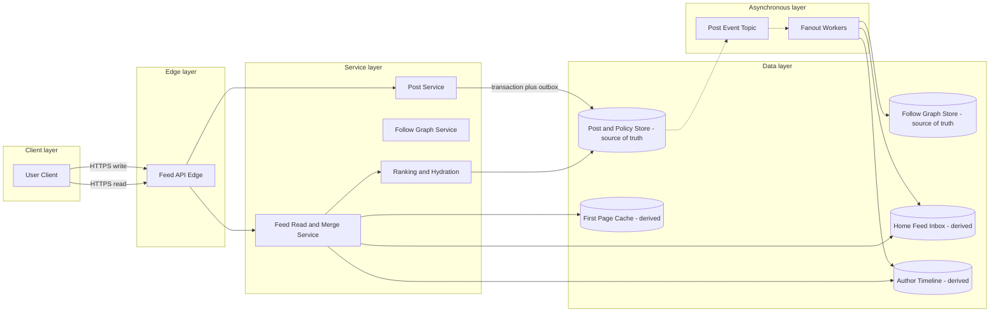

# News Feed System

## 0. Interview classification

- **Primary challenge:** high-read personalized fan-out with celebrity skew.
- **Secondary challenges:** ranking, cursor pagination, deletion/privacy propagation, cache freshness, and regional reads.
- **Patterns exercised:** [[Fan-out on Write vs Fan-out on Read]], [[Caching Pattern]], [[Transactional Outbox Pattern]], [[Backpressure and Load Shedding]].
- **Expected interview level:** Senior Backend / Senior Golang; Staff signals come from narrowed guarantees and operational judgment.
- **Recommended prerequisites:** [[Queues Streams and Pub Sub]], [[Partitioning and Sharding]], [[Consistency Models]].
- **Candidate design disclaimer:** “An interview-oriented candidate design based on public information and distributed-systems principles, not a claim about the company’s exact internal implementation.”

## 1. How to approach this problem

- **First questions:** Feed type? Ranking? Freshness? Scale?
- **Hidden complexity:** high-read personalized fan-out with celebrity skew; make the invariant and failure boundary visible.
- **What not to over-design:** full recommendation ML, ads auction, comments/likes internals, media upload, and exact company architecture.
- **What the interviewer is testing:** bounded scope, ownership, complete flow, causal scaling, and explicit trade-offs.
- **Mental model:** derive authority and commit point first; add components only when a requirement or bottleneck forces them.
- **Expected deep-dive branches:** Hybrid fan-out; Ranking and pagination; Deletion and privacy.

## 2. Interview timeline for this system

- **0–3:** restate Post creation, follow graph lookup, home-feed generation/read, cursor pagination, deletion/block filtering, and read-your-writes.; park full recommendation ML, ads auction, comments/likes internals, media upload, and exact company architecture.
- **3–7:** clarify NFRs and calculate the dominant rate, data, and skew.
- **7–12:** state invariants, entities, APIs, keys, and source of truth.
- **12–22:** draw Version 1 and trace the critical flow.
- **22–32:** ask the interviewer to select Hybrid fan-out, Ranking and pagination, Deletion and privacy.
- **32–39:** address celebrity fan-out and hot author timeline, per-user feed storage/write amplification, fan-out queue lag and failure controls.
- **39–43:** make decisions from the trade-off table; add region/security only where relevant.
- **43–45:** summarize guarantees, relaxed state, risks, and next validation.

## 3. Requirements clarification

| Candidate question | Possible interviewer answer |
| --- | --- |
| Feed type? | Home feed from followed accounts; create post, follow, read feed, delete/block. |
| Ranking? | Chronological baseline, then a pluggable rank score; recommendation is out of scope. |
| Freshness? | Seconds of lag acceptable; own post should be visible via read-your-writes merge. |
| Scale? | Assume 100M DAU, 500M feed reads/day, 20M posts/day, highly skewed follower counts. |

**Selected scope:** Post creation, follow graph lookup, home-feed generation/read, cursor pagination, deletion/block filtering, and read-your-writes.

**Explicit non-goals:** full recommendation ML, ads auction, comments/likes internals, media upload, and exact company architecture.

## 4. Functional requirements

- Create/delete a post and maintain author timeline.
- Follow/unfollow users and retrieve a personalized home feed.
- Generate ordinary-user feed entries asynchronously and merge celebrity posts on read.
- Provide stable cursor pagination, deduplication, and privacy/block filtering.

## 5. Non-functional requirements

- Interview assumptions: 100M DAU, 500M feed reads/day, 20M posts/day, 5× peak, 1 KB post metadata/reference.
- Feed p99 below 300 ms; post creation p99 below 500 ms after durable commit.
- Feed may lag seconds; post ownership/privacy/deletion is authoritative and rechecked.
- Availability and low read latency; hot celebrity/active-user skew is explicit.
- Authenticate writes, authorize visibility, minimize relationship exposure, and control spam/abuse.

## 6. Back-of-the-envelope estimation

> [!important] Interview assumptions
> These values size a candidate design. They are not company or production facts.

Average reads ≈5,800/s and 5× peak ≈29k/s; posts average ≈230/s and peak ≈1,200/s. Pure write fan-out with an average 500 followers creates about 10B inbox writes/day, and one 50M-follower author creates a catastrophic burst. Therefore use hybrid fan-out. Storing 500 feed references per active user at 32 B is about 1.6 KB? Actually 500×32 B = 16 KB/user, or 1.6 TB for 100M users before replication—manageable only with retention/active-user policy.

## 7. Core invariants

- A post has one authoritative author/visibility/version; inbox entries are derived references.
- Per-user home-feed cursor ordering is stable enough for pagination; global order is unnecessary.
- Delete, block, and privacy rules must prevent unauthorized delivery even if fan-out/cache lags.
- Fan-out duplication is harmless through unique user+post references and version filtering.

## 8. Core entities

| Entity | Ownership and lifecycle |
| --- | --- |
| Post | Author-owned content metadata, visibility, version, delete state. |
| FollowEdge | Follower→followee relationship and version. |
| AuthorTimeline | Ordered authoritative/derived references to an author’s posts. |
| HomeFeedInbox | Derived post references keyed by recipient and score/time. |
| FanoutTask | Post plus follower-range and idempotent task identity. |
| FeedCursor | Opaque stable boundary containing score/time/post ID and generation. |

## 9. API design

| Method | Path or RPC | Request | Response | Authentication | Idempotency | Pagination | Error behaviour |
| --- | --- | --- | --- | --- | --- | --- | --- |
| POST | /v1/posts | content/mediaRefs, visibility | 201 postId,version | user | Idempotency-Key | n/a | 400; 403; 409; 429 |
| DELETE | /v1/posts/{id} | expectedVersion | 202/204 | author/moderator | Idempotency-Key | n/a | 403; 404; 409 |
| PUT | /v1/users/{id}/follow | targetId | 204 | user | Idempotency-Key | n/a | 403; 409; 429 |
| GET | /v1/feed | limit,cursor | items,nextCursor,freshness | user | read-only | opaque cursor | 401; 429; partial/degraded |

## 10. Data model

| Table/store | Primary key | Partition key | Important indexes | Source of truth | Retention | Consistency | Access pattern |
| --- | --- | --- | --- | --- | --- | --- | --- |
| posts | post_id | author_id+post_id | author+created | authoritative | policy | strong owner update | hydrate/filter |
| follow_edges | follower+followee | follower_id | followee index | authoritative graph | active+audit | versioned | fan-out/list |
| author_timeline | author+time+post | author_id | time | derived from post truth | post retention | eventual | celebrity pull |
| home_feed | user+score+post | user_id | score/time cursor | derived | bounded window | eventual | feed page |
| fanout_tasks | task_id | post_id/range | status | workflow state | replay horizon | at-least-once | worker |
| deletion/block versions | subject+object | subject | updated_at | authoritative policy | policy | strong | read filter |

## 11. First working design

### HLD: News Feed System — candidate design



### ASCII fallback

```text
Create: Client --> Post Service --> Post Store [truth] --async event--> Fanout Workers
Fanout --> Follow Graph [truth] --> Home Feed Inbox [derived]
       --> Author Timeline [derived]
Read: Client --> Feed Service --> first-page cache/inbox + celebrity timelines
                          --> hydrate and policy-check Post Store [truth]
```

**Legend:** solid arrow = synchronous request/response or direct state access; dashed arrow = asynchronous event/job. “Source of truth” owns authoritative state; “derived” can rebuild.

## 12. Complete critical flow

1. Author creates post; Post Service authenticates, commits post+outbox, and returns post ID after durable acceptance.
2. Event creates author-timeline reference. Fan-out planner reads follower segments and classifies ordinary versus celebrity/high-fanout author.
3. Ordinary post fan-out workers append idempotent references to active follower inbox partitions; celebrity post is not expanded to every follower.
4. Feed read fetches inbox page, merges followed celebrity timelines and user’s recent own posts, deduplicates, ranks, and cursor-slices.
5. Hydration rechecks post visibility, deletion, follow/block policy, then returns items; caches store only safe user/version-specific results.

## 13. Evolve the design under scale

### Version 1

Compute feed on read by fetching followed author timelines; simple but tail grows with follow count.

### Version 2

Fan-out all posts on write into per-user inbox; fast reads but celebrity amplification and inactive-user waste.

### Version 3

Hybrid: push ordinary posts to active users, pull celebrity sources on read, cache first page, retain authoritative policy checks and lag fallback.

**Partition and routing:** Home feed partitions by recipient user ID; author timeline by author ID; follow graph supports follower-range scans. Celebrity pull turns one hot author into read hotspot handled by replicated cache/timeline. Cross-user global order is unnecessary.

## 14. Deep dive

### 1. Hybrid fan-out

**Problem and alternatives:** Options are push, pull, and threshold/activity-based hybrid.

**Selected design and detailed flow:** Select hybrid: push ordinary author posts to active follower inboxes; store all in author timeline; pull high-fanout sources at read. Fan-out tasks use follower ranges and unique user+post key.

**Trade-offs and failure handling:** Threshold adapts to follower count, activity, and backlog. Hybrid costs merge complexity but bounds both write and read amplification.

### 2. Ranking and pagination

**Problem and alternatives:** Options are chronological, precomputed score, request-time ranking.

**Selected design and detailed flow:** Use chronological baseline with score/time/post ID cursor; candidate merge is deterministic, then bounded ranking. Cursor encodes last boundary and feed generation/version.

**Trade-offs and failure handling:** Fresh ranking can move items between pages; cursor contract allows eventual changes but prevents unbounded duplicates via seen IDs/dedupe.

### 3. Deletion and privacy

**Problem and alternatives:** Options are delete every inbox synchronously, tombstone events, read-time policy filter.

**Selected design and detailed flow:** Commit authoritative delete/block, publish tombstone cleanup, invalidate caches, and always filter hydrated results against current policy for sensitive access.

**Trade-offs and failure handling:** Read check costs latency but closes lag window; async cleanup reclaims storage. Short caches and versioned policy bound stale content.

## 15. Detailed success flow

1. User a posts p-9 at 12:00; post/outbox commit and author timeline update.
2. a has 10k followers and is below threshold; workers fan out ranges, inserting unique references into active inboxes.
3. Follower u-7 requests feed; service merges inbox and celebrity timelines, filters policy, hydrates posts, returns cursor based on score/time/post ID.

## 16. Detailed failure flows

### Failure 1 — Fan-out backlog

- **Detection:** oldest task age and feed freshness.
- **Immediate behaviour:** Continue accepting posts while marking bounded stale; read may pull recent author timelines as fallback.
- **Retry policy:** Workers retry transient ranges with backoff.
- **Idempotency/deduplication:** Unique user+post inbox key and task range ID.
- **Recovery:** Scale/drain workers, isolate celebrity task, reconcile missing ranges.
- **User-visible outcome:** Feed may be delayed but not duplicate wildly.
- **Observability:** fan-out age, missing-reference sample, drain time.

### Failure 2 — Celebrity post spike

- **Detection:** task expansion estimate/hot partition.
- **Immediate behaviour:** Classify to pull path; do not enqueue millions of writes; replicate author timeline/cache.
- **Retry policy:** No mass retry.
- **Idempotency/deduplication:** Post identity and merge dedupe.
- **Recovery:** Adjust threshold and cache hot author.
- **User-visible outcome:** Reads may do extra merge work.
- **Observability:** author QPS, cache hit, merge latency.

### Failure 3 — Delete/block invalidation lost

- **Detection:** policy version and stale-content sampling.
- **Immediate behaviour:** Truth marks hidden; read-time filter suppresses; cache TTL/version bounds.
- **Retry policy:** Retry tombstone/invalidation idempotently.
- **Idempotency/deduplication:** post/policy version.
- **Recovery:** Cleanup scan removes derived references.
- **User-visible outcome:** Content disappears within sensitive read path immediately or bounded contract.
- **Observability:** delete-to-hide, stale hits, cleanup lag.

### Failure 4 — Feed cache outage

- **Detection:** cache errors/origin load.
- **Immediate behaviour:** Bypass with bounded inbox/merge queries; shed optional ranking/enrichment.
- **Retry policy:** One bounded read retry only.
- **Idempotency/deduplication:** Read-only; response dedupe.
- **Recovery:** Warm gradually and protect stores.
- **User-visible outcome:** Slower/degraded chronological feed or 503.
- **Observability:** cache hit, fallback QPS, merge/store saturation.

## 17. Bottlenecks and scalability

- celebrity fan-out and hot author timeline
- per-user feed storage/write amplification
- fan-out queue lag
- feed merge/ranking tail
- deletion/privacy propagation

**Partitioning unit and routing strategy:** Home feed partitions by recipient user ID; author timeline by author ID; follow graph supports follower-range scans. Celebrity pull turns one hot author into read hotspot handled by replicated cache/timeline. Cross-user global order is unnecessary.

## 18. Reliability and recovery

- Post truth and outbox atomic; inbox/timelines rebuildable from posts and graph.
- Bounded fan-out queues with priority for active users and backpressure.
- First-page cache is disposable; safe fallback is chronological merge.
- Multi-AZ stores and broker; backups for posts/graph; projections rebuild/reconcile.
- Regional reads use replicated post/graph policy and home write authority for post changes.

## 19. Observability

- **Key metrics:** post create, feed p50/p99, fan-out age/rate, inbox writes, celebrity pull, merge candidates, cache hit, policy-filtered items, delete lag.
- **Logs:** post/user hashed IDs, task range, cursor/generation, policy version; no content/PII by default.
- **Traces:** post commit→fan-out range and feed read→merge→hydrate/filter.
- **SLI/SLO candidates:** durable post create and feed page latency/freshness; unauthorized item rate zero.
- **Dashboards:** read SLO, fan-out, hot authors, storage, cache/merge, privacy/delete.
- **Alerts:** fan-out age, hot partition, feed burn, delete lag, policy filter anomaly.
- **Business-level signals:** posts created, active feeders, feed freshness, follows, hides/deletes, spam blocked.

## 20. Security and abuse

- Authenticate writes and authorize post/delete/follow resources.
- Visibility/block policy is authoritative and checked after derived candidate lookup.
- Rate-limit posting/follow scraping and detect spam/abuse; isolate tenants if applicable.
- Minimize exposure of social graph and PII in logs/events/cache keys.
- Audit moderator actions and propagate deletes/privacy to caches, search, inboxes, backups per policy.

## 21. Explicit trade-off table

| Decision | Selected option | Alternative | Why selected | Cost or weakness | When alternative wins |
| --- | --- | --- | --- | --- | --- |
| Fan-out | hybrid | all write or all read | bounds celebrity and read tail | merge complexity | bounded uniform follower counts |
| Ranking | bounded request-time on candidates | fully precompute | fresh flexible score | read CPU/latency | stable simple chronology |
| Inbox content | post references | full copies | lower storage/deletion cost | hydration reads | tiny immutable posts |
| Freshness | eventual seconds | sync fan-out | available fast writes | lag | small follower graph |
| Pagination | cursor | offset | stable scalable traversal | opaque cursor | static small list |
| Policy | read-time recheck+cleanup | cleanup only | closes privacy lag | extra read | public immutable content |
| Cache | user/version first page | global feed cache | low latency | high cardinality/invalidation | public nonpersonal feed |
| Region | home writes+regional reads | active-active post edits | simple ownership | write latency | conflict-free append-only model |
| Inactive users | skip/pull on return | fan-out all | saves writes/storage | cold-start merge | all users active |

## 22. Technology choices

| Technology | Role | Why it fits | Viable alternative | Operational cost | When choice changes |
| --- | --- | --- | --- | --- | --- |
| PostgreSQL/DynamoDB | post truth | conditional owner state | Cassandra | sharding/query limits | massive exact-key writes |
| Kafka | post/fan-out tasks | durable partitions/replay | SQS/Pub/Sub | lag/broker ops | simple queue |
| Cassandra/DynamoDB | home feed and author timeline | high key/range writes | PostgreSQL shards | denormalization | modest scale |
| Redis | first-page/hot-author cache | low latency/hot replication | Memcached | memory/eviction | cache optional |
| Ranking service | candidate score/merge | isolates evolution | chronological in feed | model/ops | simple chronology |

## 23. Interviewer follow-up questions

| Likely follow-up | Concise strong answer | Diagram change | Trade-off |
| --- | --- | --- | --- |
| Celebrity posts? | Do not write fan-out; pull from replicated author timeline and merge at read. | Add celebrity branch. | write vs read amplification |
| Delete/block? | Truth+tombstone+cache invalidation plus read-time policy check. | Add policy filter. | latency vs privacy |
| Read-your-writes? | Merge user’s recent author timeline into own feed until fan-out catches up. | Add local merge. | complexity vs UX |
| Global ranking? | Generate candidates by social graph/recency, then bounded rank; no global sort. | Annotate rank stage. | quality vs latency |

## 24. What a weak candidate does

- Chooses fan-out-on-write for every account and ignores celebrity.
- Copies full post into every inbox.
- Uses offset pagination and no stable order.
- Deletes only from source while serving stale cache/inbox.
- Calls feed cache authoritative.

## 25. What a strong senior candidate demonstrates

- Quantifies amplification and chooses a hybrid threshold.
- Separates post/policy truth from derived inbox and cache.
- Explains cursor, dedupe, read-your-writes, and privacy filter.
- Handles hot authors independently from ordinary sharding.
- Measures feed freshness and unauthorized-content correctness.

## 26. Five-minute revision

- **Requirements:** create/delete post, follow, read personalized feed, cursor.
- **Critical invariant:** post/policy truth; inbox derived; unauthorized item never served.
- **Core HLD:** Post DB/outbox→fan-out→user inbox; celebrity timeline merged at read.
- **Most important data model:** posts, follow edges, author timeline, home inbox(user+score+post).
- **Critical flow:** commit→classify fan-out→inbox/pull→merge→policy hydrate.
- **Three bottlenecks:** celebrity; write amplification; merge/lag.
- **Three trade-offs:** push/pull; refs/copies; rank/precompute.
- **Three failures:** fan-out lag; celebrity spike; delete invalidation.
- **Likely deep dive:** hybrid fan-out.

## 27. Blank-page practice prompt

Design a personalized home news feed for users who follow accounts. Include post creation, feed reads, celebrity accounts, deletion/privacy, and stable pagination.

## 28. Adversarial variations

- One author has 100M followers.
- Traffic grows 100×.
- Block/delete must take effect immediately.
- Ranking changes from chronological to ML.
- Cost must fall by skipping inactive users.
- One region fails while fan-out is backlogged.

## 29. Practice and re-test history

- [ ] Untimed reconstruction — date/result:
- [ ] 45-minute mock — score/date:
- [ ] Follow-up round — variation/result:
- [ ] One-day review — date/result:
- [ ] Three-day review — date/result:
- [ ] Seven-day review — date/result:
- [ ] Fourteen-day review — date/result:

Personal readiness remains `not-started` until evidence is recorded in [[System Design Practice Tracker]].

## 30. Related internal notes and verified external references

**Internal:** [[Fan-out on Write vs Fan-out on Read]] · [[Caching Pattern]] · [[Transactional Outbox Pattern]] · [[Backpressure and Load Shedding]] · [[CQRS]]

**Verified external references (checked 2026-07-17):**

- [Apache Kafka documentation](https://kafka.apache.org/documentation/) — partitioned fan-out transport.
- [Redis client-side caching](https://redis.io/docs/latest/develop/reference/client-side-caching/) — hot cache and invalidation considerations.

