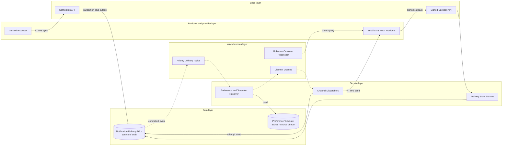

# Notification System

## 0. Interview classification

- **Primary challenge:** durable multi-channel delivery under provider uncertainty.
- **Secondary challenges:** priority isolation, preferences, templates, deduplication, provider quotas, and callbacks.
- **Patterns exercised:** [[Transactional Outbox Pattern]], [[Idempotency Pattern]], [[Deduplication and Inbox Pattern]], [[Rate Limiting Pattern]], [[Circuit Breaker Pattern]].
- **Expected interview level:** Senior Backend / Senior Golang; Staff signals come from narrowed guarantees and operational judgment.
- **Recommended prerequisites:** [[Queues Streams and Pub Sub]], [[Backpressure and Load Shedding]], [[Security Abuse and Privacy]].
- **Candidate design disclaimer:** “An interview-oriented candidate design based on public information and distributed-systems principles, not a claim about the company’s exact internal implementation.”

## 1. How to approach this problem

- **First questions:** Which channels and traffic? What does delivery mean? How current must preferences be? Priority and scale?
- **Hidden complexity:** durable multi-channel delivery under provider uncertainty; make the invariant and failure boundary visible.
- **What not to over-design:** campaign authoring, audience segmentation, or exact carrier/device delivery proof.
- **What the interviewer is testing:** bounded scope, ownership, complete flow, causal scaling, and explicit trade-offs.
- **Mental model:** derive authority and commit point first; add components only when a requirement or bottleneck forces them.
- **Expected deep-dive branches:** Unknown provider outcome; Priority and quota isolation; Preferences and templates.

## 2. Interview timeline for this system

- **0–3:** restate Accept one-recipient notifications, resolve preferences, render a versioned template, schedule/dispatch, process callbacks, and expose status.; park campaign authoring, audience segmentation, or exact carrier/device delivery proof.
- **3–7:** clarify NFRs and calculate the dominant rate, data, and skew.
- **7–12:** state invariants, entities, APIs, keys, and source of truth.
- **12–22:** draw Version 1 and trace the critical flow.
- **22–32:** ask the interviewer to select Unknown provider outcome, Priority and quota isolation, Preferences and templates.
- **32–39:** address provider quotas and tail latency, priority backlog and fan-out, preference/template hot reads and failure controls.
- **39–43:** make decisions from the trade-off table; add region/security only where relevant.
- **43–45:** summarize guarantees, relaxed state, risks, and next validation.

## 3. Requirements clarification

| Candidate question | Possible interviewer answer |
| --- | --- |
| Which channels and traffic? | Transactional email, SMS, push, and in-app first; campaigns are out of scope. |
| What does delivery mean? | Durable platform acceptance and auditable attempts; no exact-once claim across external providers. |
| How current must preferences be? | Resolve current consent/suppression at dispatch and record the policy version. |
| Priority and scale? | Assume 100M requests/day, 5× peak, average 1.5 deliveries, and provider quotas. |

**Selected scope:** Accept one-recipient notifications, resolve preferences, render a versioned template, schedule/dispatch, process callbacks, and expose status.

**Explicit non-goals:** campaign authoring, audience segmentation, or exact carrier/device delivery proof.

## 4. Functional requirements

- Accept an idempotent notification request/event and expose status.
- Resolve channels, consent/suppression, and immutable template version.
- Schedule and dispatch by channel/priority under provider and tenant quotas.
- Persist every attempt and process signed callbacks and reconciliation.

## 5. Non-functional requirements

- Interview assumptions: 100M requests/day, 5× peak, 1 KB request, 1.5 deliveries/request, 30-day hot audit.
- Durable acceptance p99 below 300 ms; urgent provider-accept p99 below five seconds while providers are healthy.
- At-least-once internal work with application deduplication; external visible exact-once is not promised.
- Provider, channel, tenant, and priority isolation with bounded queues.
- PII minimization, current consent policy, signed callbacks, and auditable operator actions.

## 6. Back-of-the-envelope estimation

> [!important] Interview assumptions
> These values size a candidate design. They are not company or production facts.

Average intake is about 1,160/s; 5× peak is about 5,800/s. Peak delivery jobs are about 8,700/s before retries. Request data alone is about 100 GB/day, while attempts may be several times larger, so tier audit history. A one-hour provider outage at 4k jobs/s accumulates 14.4M jobs; retention and drain capacity must handle this without violating provider quotas.

## 7. Core invariants

- One logical request and recipient/channel maps to one Delivery identity.
- Platform retries do not create a second provider send where idempotency or reconciliation can prevent it; unknown outcome remains explicit.
- A delivery records an immutable template version and the preference/suppression decision used.
- ACCEPTED, QUEUED, SENT, UNKNOWN, DELIVERED, FAILED, and SUPPRESSED have distinct meanings.

## 8. Core entities

| Entity | Ownership and lifecycle |
| --- | --- |
| NotificationRequest | Producer intent, idempotency, recipient reference, type, and priority. |
| Delivery | Unique recipient and channel unit with authoritative lifecycle. |
| TemplateVersion | Immutable rendered contract by locale and channel. |
| Preference/Suppression | Authoritative consent and policy with version/audit. |
| Attempt | Provider call/reference, status, error class, and timestamp. |
| ProviderCallback | Signed input deduped by provider event/reference. |

## 9. API design

| Method | Path or RPC | Request | Response | Authentication | Idempotency | Pagination | Error behaviour |
| --- | --- | --- | --- | --- | --- | --- | --- |
| POST | /v1/notifications | type, recipientId, variables, channels, priority, scheduleAt | 202 notificationId and status | producer workload | Idempotency-Key+hash | n/a | 400; 403; 409; 429; 503 |
| GET | /v1/notifications/{id} | id | request/delivery states and freshness | producer/owner | read-only | delivery cursor if needed | 403; 404 |
| POST | /v1/providers/{provider}/callbacks | provider body/signature | 204 | verified provider | providerEventId | n/a | 400; 401; 409; 429 |
| PUT | /v1/templates/{id}/versions/{v} | immutable content/schema | 201 version | template admin | operation key | n/a | 400; 403; 409 |

## 10. Data model

| Table/store | Primary key | Partition key | Important indexes | Source of truth | Retention | Consistency | Access pattern |
| --- | --- | --- | --- | --- | --- | --- | --- |
| notification_requests | notification_id | hash(notification_id) | producer+dedupe | authoritative | audit policy | strong create | status |
| deliveries | delivery_id | hash(recipient/delivery) | notification+recipient+state | authoritative | audit policy | versioned transition | dispatch/status |
| attempts | attempt_id | delivery_id | provider_ref+time | authoritative audit | policy | append/strong transition | reconcile |
| preferences | recipient_id | recipient_id | channel+type | authoritative | active+audit | strong update | policy read |
| templates | template_id+version | template_id | locale+channel | authoritative immutable | long | strong publish | render |
| delivery_events | event_id | delivery_id | state+time | event stream | replay window | at-least-once | workers/analytics |

## 11. First working design

### HLD: Notification System — candidate design



### ASCII fallback

```text
Producer --HTTPS--> Notification API --> Delivery DB [truth] --async--> Priority Topic
Priority --> Preference/Template Resolver --> Channel Queue --> Dispatcher --HTTPS--> Provider
Preference/Template Store [truth] --------^       Dispatcher --> Attempt State [truth]
Provider --signed callback--> Callback API --> Delivery State
Unknown Reconciler ------------------------------> Provider
```

**Legend:** solid arrow = synchronous request/response or direct state access; dashed arrow = asynchronous event/job. “Source of truth” owns authoritative state; “derived” can rebuild.

## 12. Complete critical flow

1. Producer authenticates and submits a stable key; API validates and commits request, delivery identities, and outbox before returning 202.
2. Priority consumer loads current preference/suppression and immutable template version, records the decision, and emits one channel job.
3. Dispatcher acquires provider/tenant quota, creates an Attempt with stable provider reference, sends HTTPS, and classifies accepted, rejected, or unknown.
4. Provider response/callback advances only a valid delivery version; signed callbacks dedupe by provider event ID.
5. UNKNOWN attempts enter reconciliation; producer status is updated asynchronously and never confuses acceptance with delivery.

## 13. Evolve the design under scale

### Version 1

Persist a request then call one provider synchronously; workable at low volume but provider latency couples dispatch.

### Version 2

Add outbox, priority/channel queues, independent dispatchers, rate limits, attempts/callbacks, and preference/template owners.

### Version 3

Add regional intake, recipient/tenant partitioning, urgent reserved capacity, multiple providers, and explicit home-region delivery authority.

**Partition and routing:** Partition delivery topics/state by recipient or delivery ID to preserve needed order; a fairness layer prevents a hot tenant from monopolizing consumers. Provider quota is a separate hierarchical resource.

## 14. Deep dive

### 1. Unknown provider outcome

**Problem and alternatives:** Alternatives are blind retry, provider idempotency/reference query, and manual no-retry.

**Selected design and detailed flow:** Use stable delivery/attempt reference, provider idempotency where supported, and query/reconciliation. Keep UNKNOWN until evidence; fail over only under an explicit duplicate policy.

**Trade-offs and failure handling:** This trades immediate delivery for duplicate safety. Low-impact push may tolerate a controlled duplicate; payment OTP may not.

### 2. Priority and quota isolation

**Problem and alternatives:** Alternatives are one queue, channel queues, and channel+priority fair queues.

**Selected design and detailed flow:** Use channel/priority topics with reserved urgent workers/provider tokens and fair tenant scheduling. Pause bulk when urgent SLO or quota is threatened.

**Trade-offs and failure handling:** Isolation fragments capacity; controlled borrowing recovers utilization. Oldest age and starvation are the control signals.

### 3. Preferences and templates

**Problem and alternatives:** Alternatives are resolve at intake, resolve at dispatch, or immutable snapshot.

**Selected design and detailed flow:** Read current policy at dispatch for consent-sensitive classes and record its version; select an immutable template version before rendering.

**Trade-offs and failure handling:** Extra reads/cache complexity buy auditable freshness. Product policy defines races with already queued urgent messages.

## 15. Detailed success flow

1. Order event e-77 maps idempotency key order-confirmed:o-42 to notification n-9 and delivery d-email-9.
2. Resolver sees email allowed at preference v12, renders template order-confirmed:v3, records both, and enqueues urgent email.
3. Dispatcher reserves quota, records attempt a-1 with providerRef d-email-9, provider accepts, and callback cb-8 marks DELIVERED; duplicate e-77 returns n-9.

## 16. Detailed failure flows

### Failure 1 — Provider timeout after possible acceptance

- **Detection:** Attempt timeout and no response.
- **Immediate behaviour:** Mark UNKNOWN; do not claim failed or successful.
- **Retry policy:** Query or retry with the same provider reference within a deadline; never blindly use another provider.
- **Idempotency/deduplication:** Delivery/attempt identity and provider callback ID.
- **Recovery:** Reconciler queries provider or awaits callback, then applies manual terminal policy.
- **User-visible outcome:** Status remains pending/unknown and message may be delayed.
- **Observability:** unknown age/count, reconciliation success, duplicate reports.

### Failure 2 — Provider rate limit or outage

- **Detection:** 429/error burn and circuit state.
- **Immediate behaviour:** Pause channel consumption, reserve urgent quota, delay/expire bulk, and use only safe fallback.
- **Retry policy:** Bounded backoff+jitter respecting Retry-After.
- **Idempotency/deduplication:** Delivery ID protects platform retries; failover duplicate risk is explicit.
- **Recovery:** Drain under quota; reconcile attempts before failover.
- **User-visible outcome:** Urgent may use fallback; bulk reports delayed/expired.
- **Observability:** oldest age, quota use, circuit, failover rate.

### Failure 3 — Poison template or payload

- **Detection:** Deterministic render/validation failure.
- **Immediate behaviour:** Quarantine that delivery without blocking the partition and mark FAILED_TEMPLATE.
- **Retry policy:** Do not retry until content/data is corrected.
- **Idempotency/deduplication:** Delivery version prevents repeated finalization.
- **Recovery:** Operator publishes fixed version and explicitly re-drives linked delivery.
- **User-visible outcome:** Producer sees a precise failed reason; others continue.
- **Observability:** errors by template version and quarantine age.

### Failure 4 — Callback replay or forgery

- **Detection:** Signature/timestamp/event-id validation.
- **Immediate behaviour:** Reject unauthenticated/replayed callback and rate-limit endpoint.
- **Retry policy:** Invalid callbacks are not retried by us.
- **Idempotency/deduplication:** Unique provider event ID and valid state transition.
- **Recovery:** Audit and query provider if status is important.
- **User-visible outcome:** No false delivery transition.
- **Observability:** invalid signature, replay, and transition conflict.

## 17. Bottlenecks and scalability

- provider quotas and tail latency
- priority backlog and fan-out
- preference/template hot reads
- callback bursts
- hot tenant and retry storms
- attempt/audit growth

**Partitioning unit and routing strategy:** Partition delivery topics/state by recipient or delivery ID to preserve needed order; a fairness layer prevents a hot tenant from monopolizing consumers. Provider quota is a separate hierarchical resource.

## 18. Reliability and recovery

- Durable request+outbox, at-least-once queues, and consumer inbox/dedup.
- Timeout, bounded retry, circuit, and bulkhead per provider; explicit unknown reconciliation.
- Multi-AZ DB/broker, backup/restore, replayable events, and provider-outage drills.
- Bounded queues with expiry and priority; urgent reserved capacity.
- Preference/template cache fails safely; broad messages carry recipient references rather than contact PII.

## 19. Observability

- **Key metrics:** accept/dispatch/deliver latency, oldest age by priority/channel, provider errors/429/circuit, attempts/unknown/reconcile, suppression/render, callback lag.
- **Logs:** request, delivery, attempt, provider refs, and policy/template versions; redact body/contact/token.
- **Traces:** intake→outbox→resolver→dispatcher→callback linked by IDs.
- **SLI/SLO candidates:** durable acceptance and urgent time-to-provider-accept; delivery proof separately.
- **Dashboards:** priority backlog, providers, unknown outcomes, template/preference failures, tenant fairness.
- **Alerts:** urgent burn, oldest age, unknown age, provider quota/circuit, poison spike.
- **Business-level signals:** accepted, suppressed, delivered, and failed by type/consent policy.

## 20. Security and abuse

- Authenticate and authorize producers and tenant scope; validate schema and template variables.
- Minimize/encrypt contact data; queues use recipient references where possible.
- Use immutable sanitized templates; prevent header/content injection and unsafe links.
- Verify callback signatures, timestamps, and IDs; restrict outbound adapters.
- Audit consent/unsubscribe/suppression and operator actions; isolate tenants.

## 21. Explicit trade-off table

| Decision | Selected option | Alternative | Why selected | Cost or weakness | When alternative wins |
| --- | --- | --- | --- | --- | --- |
| Semantics | at-least-once+reconcile | exact-once claim | honest provider boundary | delay/rare duplicate | provider transactional idempotency |
| Flow | asynchronous | sync provider call | buffers burst/outage | lag/backlog | tiny internal workload |
| Priority | reserved queues | single FIFO | protects urgent | fragmented capacity | uniform SLO |
| Preference timing | dispatch-time snapshot | intake-time | current consent | extra read/cache | immutable policy |
| Templates | immutable versions | mutable ID | audit/rollback | version storage | non-audited low risk |
| Provider failover | reconcile then policy | immediate alternate | reduces duplicates | slower recovery | duplicate-tolerant push |
| Partition | recipient/delivery | provider only | ordering/dedupe locality | quota coordination | independent provider bulk |
| Audit | hot relational+tiered | all hot | cost control | archive delay | short retention |
| Fan-out | delivery per recipient/channel | giant request | isolated retry/state | write amplification | provider batch with compatible semantics |

## 22. Technology choices

| Technology | Role | Why it fits | Viable alternative | Operational cost | When choice changes |
| --- | --- | --- | --- | --- | --- |
| PostgreSQL | request/delivery/attempt/template audit | constraints and state transitions | DynamoDB/Cassandra | write/storage ops | extreme key scale |
| Kafka/SQS | priority/channel buffering | durable at-least-once and isolation | RabbitMQ/Pub/Sub | lag/duplicates | simple managed queue |
| Redis | quota and immutable cache | low-latency counters/TTL | local cache/DB | eviction/cluster | modest load |
| Provider adapters | normalize vendors | isolate contracts | embedded client | maintenance | one provider/simple scope |
| Object/warehouse | archive and aggregates | cheap retention | hot DB | retrieval delay | short audit |

## 23. Interviewer follow-up questions

| Likely follow-up | Concise strong answer | Diagram change | Trade-off |
| --- | --- | --- | --- |
| Exactly once? | Not across provider/device; use identity, dedupe, provider idempotency, reconciliation, and auditable state. | Highlight UNKNOWN/callback path. | safety vs immediacy |
| Preferences change after queue? | Record policy version and re-evaluate at dispatch where current consent is required. | Add dispatch-time policy read. | freshness vs latency |
| Provider outage? | Circuit, pause/backpressure, priority reserve, safe failover after unknown reconciliation. | Annotate channel isolation. | availability vs duplicates |
| Large campaign? | Segment into delivery IDs, fair tenant queues, quotas; never put audience in one message. | Add fan-out stage. | throughput vs write amplification |

## 24. What a weak candidate does

- Promises exact-once delivery.
- Uses one unbounded queue and no priority/provider quotas.
- Does not distinguish SENT, DELIVERED, and UNKNOWN.
- Copies PII/body into queues and logs.
- Retries a timed-out send through another provider immediately.

## 25. What a strong senior candidate demonstrates

- Defines durable acceptance, delivery identity, attempt state, and unknown outcome.
- Protects urgent traffic with isolation/backpressure and provider-aware quota.
- Versions preferences/templates for audit.
- Explains external duplicate boundary honestly.
- Uses business delivery metrics rather than broker success.

## 26. Five-minute revision

- **Requirements:** accept, preferences/templates, schedule/channel dispatch, callbacks/status.
- **Critical invariant:** one delivery identity; UNKNOWN explicit; acceptance is not delivery.
- **Core HLD:** API→DB/outbox→priority→resolver→channel→adapter/provider→callback.
- **Most important data model:** request, delivery, attempt, template version, preference decision.
- **Critical flow:** commit→resolve→quota→attempt→provider→callback/reconcile.
- **Three bottlenecks:** provider quota; backlog; hot tenant.
- **Three trade-offs:** async vs sync; failover vs duplicate; preference timing.
- **Three failures:** provider timeout; outage/rate limit; poison template.
- **Likely deep dive:** unknown provider outcome.

## 27. Blank-page practice prompt

Design a multi-channel transactional notification service for email, SMS, push, and in-app messages, including preferences, templates, provider failures, and status.

## 28. Adversarial variations

- A provider is unavailable for two hours.
- A tenant launches a 50M-recipient campaign.
- Consent changes must take effect within five seconds.
- Duplicate SMS has severe user/cost impact.
- Audit cost must fall through tiering.
- The primary region fails while urgent work is queued.

## 29. Practice and re-test history

- [ ] Untimed reconstruction — date/result:
- [ ] 45-minute mock — score/date:
- [ ] Follow-up round — variation/result:
- [ ] One-day review — date/result:
- [ ] Three-day review — date/result:
- [ ] Seven-day review — date/result:
- [ ] Fourteen-day review — date/result:

Personal readiness remains `not-started` until evidence is recorded in [[System Design Practice Tracker]].

## 30. Related internal notes and verified external references

**Internal:** [[Transactional Outbox Pattern]] · [[Idempotency Pattern]] · [[Deduplication and Inbox Pattern]] · [[Backpressure and Load Shedding]] · [[Rate Limiting Pattern]]

**Verified external references (checked 2026-07-17):**

- [AWS Builders’ Library: idempotent APIs](https://aws.amazon.com/builders-library/making-retries-safe-with-idempotent-APIs/) — retry-safe mutations.
- [Debezium Outbox Event Router](https://debezium.io/documentation/reference/stable/transformations/outbox-event-router.html) — durable event handoff.

