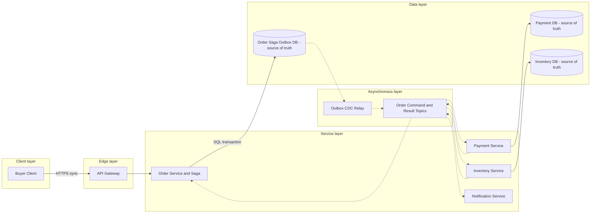

# Order Processing System

## 0. Interview classification

- **Primary challenge:** cross-service transaction with auditable compensation.
- **Secondary challenges:** idempotent creation, payment and inventory coordination, cancellation races, and repair.
- **Patterns exercised:** [[Saga Pattern]], [[Transactional Outbox Pattern]], [[Change Data Capture]], [[Idempotency Pattern]], [[Deduplication and Inbox Pattern]].
- **Expected interview level:** Senior Backend / Senior Golang; Staff signals come from narrowed guarantees and operational judgment.
- **Recommended prerequisites:** [[Consistency Models]], [[Queues Streams and Pub Sub]], [[Reliability and Failure Analysis]].
- **Candidate design disclaimer:** “An interview-oriented candidate design based on public information and distributed-systems principles, not a claim about the company’s exact internal implementation.”

## 1. How to approach this problem

- **First questions:** Core workflow? Step order? Consistency? Scale?
- **Hidden complexity:** cross-service transaction with auditable compensation; make the invariant and failure boundary visible.
- **What not to over-design:** catalogue search, fulfillment routing, returns, accounting settlement, and recommendations.
- **What the interviewer is testing:** bounded scope, ownership, complete flow, causal scaling, and explicit trade-offs.
- **Mental model:** derive authority and commit point first; add components only when a requirement or bottleneck forces them.
- **Expected deep-dive branches:** Payment versus inventory ordering; Outbox and consumer atomicity; Cancellation race.

## 2. Interview timeline for this system

- **0–3:** restate Order acceptance, payment authorization, inventory reservation, confirmation/cancellation, status, and reconciliation.; park catalogue search, fulfillment routing, returns, accounting settlement, and recommendations.
- **3–7:** clarify NFRs and calculate the dominant rate, data, and skew.
- **7–12:** state invariants, entities, APIs, keys, and source of truth.
- **12–22:** draw Version 1 and trace the critical flow.
- **22–32:** ask the interviewer to select Payment versus inventory ordering, Outbox and consumer atomicity, Cancellation race.
- **32–39:** address hot SKU reservation contention, payment provider latency and unknown outcomes, skewed event partitions and failure controls.
- **39–43:** make decisions from the trade-off table; add region/security only where relevant.
- **43–45:** summarize guarantees, relaxed state, risks, and next validation.

## 3. Requirements clarification

| Candidate question | Possible interviewer answer |
| --- | --- |
| Core workflow? | Create order, authorize payment, reserve inventory, confirm or cancel, and expose status. |
| Step order? | Use payment authorization then inventory for this interview; explain when reservation-first wins. |
| Consistency? | Per-service ACID and eventual cross-service saga; no lost accepted order or duplicate business effect. |
| Scale? | Assume 10M orders/day, 10× peak, five events/order, and five items/order. |

**Selected scope:** Order acceptance, payment authorization, inventory reservation, confirmation/cancellation, status, and reconciliation.

**Explicit non-goals:** catalogue search, fulfillment routing, returns, accounting settlement, and recommendations.

## 4. Functional requirements

- Create an order idempotently from validated items and a price snapshot.
- Coordinate payment authorization and inventory reservation through a persisted saga.
- Expose order and step status and allow cancellation in valid states.
- Compensate partial completion and support operator repair and safe replay.

## 5. Non-functional requirements

- Interview assumptions: 10M orders/day, 10× peak, five events/order, five items/order, and long financial-reference retention.
- Durable acceptance p99 below 500 ms; workflow completion is asynchronous and observable.
- No duplicate charge or reservation from platform retries; preserve per-order transition order.
- Status is highly available; writes prefer correctness when invariant authority is unavailable.
- Minimize PII/payment tokens, authorize ownership, and audit repair operations.

## 6. Back-of-the-envelope estimation

> [!important] Interview assumptions
> These values size a candidate design. They are not company or production facts.

Average orders are about 116/s; 10× peak about 1,160/s. Five events/order yields roughly 5,800 events/s before retries. At 2 KB order/items and 1 KB/event, new raw state is tens of GB/day before indexes and replicas. A 30-minute payment outage at peak creates about 2.1M pending orders, so admission, retention, and drain capacity matter.

## 7. Core invariants

- One scoped idempotency key and payload creates one logical order.
- Order, saga transition, idempotency result, and local outbox commit atomically.
- Each participant owns its database and applies a command once locally through inbox/idempotency.
- CONFIRMED requires required payment and inventory results; failed compensation remains visible.

## 8. Core entities

| Entity | Ownership and lifecycle |
| --- | --- |
| Order | Customer purchase aggregate, price snapshot, status/version; Order Service owns. |
| OrderItem | SKU, quantity, immutable unit price and currency. |
| SagaInstance | Step, deadline, command IDs, compensation and manual-repair state. |
| PaymentAuthorization | Payment-owned side effect and provider reference. |
| InventoryReservation | Inventory-owned SKU allocation and expiry. |
| Outbox and Inbox | Local event intent and consumer receipt ledger. |

## 9. API design

| Method | Path or RPC | Request | Response | Authentication | Idempotency | Pagination | Error behaviour |
| --- | --- | --- | --- | --- | --- | --- | --- |
| POST | /v1/orders | customerId, items, paymentMethodToken | 202 orderId,status | customer | Idempotency-Key+hash | n/a | 400; 409; 429; 503 |
| GET | /v1/orders/{id} | id | order and step state/version | owner/support | read-only | item cursor if large | 403; 404; 503 |
| POST | /v1/orders/{id}/cancel | expectedVersion, reason | 202 status | owner/support | Idempotency-Key | n/a | 403; 404; 409 |
| RPC | Payment.Authorize / Inventory.Reserve | stable command and order refs | result event | service identity | commandId | n/a | retryable, unavailable, or permanent rejection |

## 10. Data model

| Table/store | Primary key | Partition key | Important indexes | Source of truth | Retention | Consistency | Access pattern |
| --- | --- | --- | --- | --- | --- | --- | --- |
| orders | order_id | hash(order_id) | customer_id+created_at, status | authoritative | business/audit | strong local | create/status |
| order_items | order_id+line | order_id | sku | authoritative | with order | strong local | workflow/audit |
| sagas | saga_id | order_id | status+deadline | authoritative workflow | terminal+audit | optimistic version | advance/repair |
| outbox | event_id | aggregate_id | created_at | authoritative event intent | replay horizon | same transaction | CDC |
| consumer_inbox | consumer+event_id | business key | created_at | authoritative dedupe | replay horizon | same transaction | consume once |

## 11. First working design

### HLD: Order Processing System — candidate design



### ASCII fallback

```text
Buyer --> Gateway --> Order Service/Saga --> Order+Saga+Outbox DB [truth]
Order DB --async CDC--> Command and Result Topics
Topics --> Payment Service --> Payment DB [truth] --> result
Topics --> Inventory Service --> Inventory DB [truth] --> result
Results --> Saga transition --> notification event
```

**Legend:** solid arrow = synchronous request/response or direct state access; dashed arrow = asynchronous event/job. “Source of truth” owns authoritative state; “derived” can rebuild.

## 12. Complete critical flow

1. Buyer posts a stable key; Order Service validates server-side prices and atomically commits PENDING order, saga, key result, and outbox before 202.
2. CDC publishes OrderCreated keyed by order ID; saga emits AuthorizePayment with stable command ID.
3. Payment commits inbox, authorization, and outbox locally; result advances only expected saga version and emits ReserveInventory.
4. Inventory conditionally reserves required SKUs and emits reserved or rejected; success makes order CONFIRMED with outbox.
5. Rejection triggers void/refund. Success makes CANCELLED; failed compensation stays COMPENSATION_PENDING. Notification is asynchronous.

## 13. Evolve the design under scale

### Version 1

Keep order, inventory, and payment placeholder in one relational transaction when one owner and small scale allow it.

### Version 2

Split service-owned databases and add persisted saga, outbox/CDC, inbox dedupe, and explicit pending states.

### Version 3

Shard orders by order ID and inventory by SKU/warehouse, tier audit, add regional reads and fenced write homes.

**Partition and routing:** Partition order state/events by order_id for ordering. Customer listing uses a secondary index. Inventory partitions by SKU/warehouse and may hotspot; serialize or bucket scarce SKU ownership rather than scatter one invariant.

## 14. Deep dive

### 1. Payment versus inventory ordering

**Problem and alternatives:** Options are reserve-first, authorize-first, and parallel.

**Selected design and detailed flow:** Choose authorize then reserve when authorization is reversible and stock holds should be short. Commands and results are versioned.

**Trade-offs and failure handling:** Reservation-first wins for extremely scarce stock; parallel lowers latency but increases compensation.

### 2. Outbox and consumer atomicity

**Problem and alternatives:** Options are unsafe dual write, poller/CDC outbox, and broker transaction.

**Selected design and detailed flow:** Commit state+saga+outbox locally; CDC publishes at least once. Participant inbox+business state+outbox commit locally, and acknowledgement follows commit.

**Trade-offs and failure handling:** Duplicates remain harmless. CDC adds connector/WAL operations; polling may win at small scale.

### 3. Cancellation race

**Problem and alternatives:** Options are last-write-wins, versioned saga transition, and participant-owned cancellation.

**Selected design and detailed flow:** Use expected saga version and allowed transitions. Cancellation before irreversible completion moves to CANCELLING; a completion that won first returns current state/conflict.

**Trade-offs and failure handling:** User may see pending during compensation. No service edits another owner’s table.

## 15. Detailed success flow

1. checkout-abc creates order o-42, saga s-42, and outbox e-1 in one commit; API returns PENDING.
2. Payment command c-pay-42 creates authorization p-9 once; inventory command c-inv-42 reserves five items once.
3. Saga advances to CONFIRMED and emits notification; duplicate events hit inbox and return stored result.

## 16. Detailed failure flows

### Failure 1 — Inventory rejects after payment

- **Detection:** InventoryRejected event.
- **Immediate behaviour:** Move saga to COMPENSATING_PAYMENT and issue stable void/refund.
- **Retry policy:** Retry transient failures with deadline; permanent rejection does not retry.
- **Idempotency/deduplication:** Command IDs, participant inbox, and provider idempotency.
- **Recovery:** On success mark CANCELLED; failure remains COMPENSATION_PENDING for repair.
- **User-visible outcome:** Pending then cancelled; never false confirmed.
- **Observability:** compensation age/rate, stuck saga, provider unknown.

### Failure 2 — Consumer crashes after commit

- **Detection:** Broker redelivery and lag.
- **Immediate behaviour:** Redeliver normally.
- **Retry policy:** At-least-once retry.
- **Idempotency/deduplication:** Inbox and effect share transaction.
- **Recovery:** Return stored result and advance offset.
- **User-visible outcome:** No duplicate charge or reservation.
- **Observability:** duplicate/redelivery/inbox conflicts.

### Failure 3 — CDC relay stalls

- **Detection:** Oldest unpublished outbox age and WAL retention.
- **Immediate behaviour:** Order stays durable but workflow pauses; throttle before retention risk.
- **Retry policy:** Connector backoff and restart.
- **Idempotency/deduplication:** Event IDs/versions absorb replay.
- **Recovery:** Restore checkpoint, replay, reconcile non-terminal sagas.
- **User-visible outcome:** Order remains PENDING/delayed.
- **Observability:** outbox age, WAL remaining, saga duration.

### Failure 4 — Cancel races confirmation

- **Detection:** Optimistic transition conflict.
- **Immediate behaviour:** Only one allowed version commits; loser reloads.
- **Retry policy:** No blind retry across changed state.
- **Idempotency/deduplication:** Idempotency key and expected version.
- **Recovery:** If confirmation won, apply post-confirm cancellation policy; otherwise compensate.
- **User-visible outcome:** Precise current state or conflict.
- **Observability:** transition conflicts and cancellation duration.

## 17. Bottlenecks and scalability

- hot SKU reservation contention
- payment provider latency and unknown outcomes
- skewed event partitions
- Order DB write/index growth
- CDC lag and compensation storms

**Partitioning unit and routing strategy:** Partition order state/events by order_id for ordering. Customer listing uses a secondary index. Inventory partitions by SKU/warehouse and may hotspot; serialize or bucket scarce SKU ownership rather than scatter one invariant.

## 18. Reliability and recovery

- End-to-end deadlines and classified retries; provider mutations use identity and reconciliation.
- Multi-AZ databases/broker, backups and restore, replayable outbox, poison quarantine.
- Admission and backpressure during payment outage or compensation storm; status remains readable.
- Reconciliation compares non-terminal saga with participant/provider truth.
- Region failover uses order-home epoch so two saga writers cannot run.

## 19. Observability

- **Key metrics:** acceptance, saga duration by step, outbox age, lag, duplicate/inbox, payment unknown, reservation rejection, compensation pending.
- **Logs:** order/saga/event/command/provider references and versions; no tokens/PII.
- **Traces:** API commit through CDC, participants, and compensation.
- **SLI/SLO candidates:** durable order acceptance and terminal completion time by outcome.
- **Dashboards:** acceptance, workflow funnel, lag, payment/inventory, compensation.
- **Alerts:** acceptance burn, WAL risk, stuck saga, compensation age, hot SKU.
- **Business-level signals:** confirmed/cancelled/pending, authorized amount, reserved stock, customer delay.

## 20. Security and abuse

- Authenticate buyer and authorize order reads/cancellation.
- Tokenize payment method and exclude raw credentials from events/logs.
- Validate price and currency server-side using integer minor units.
- Restrict topic/database ownership and audit operator repair.
- Minimize customer data and apply retention to projections.

## 21. Explicit trade-off table

| Decision | Selected option | Alternative | Why selected | Cost or weakness | When alternative wins |
| --- | --- | --- | --- | --- | --- |
| Coordination | orchestrated saga | choreography | visible state/repair | coordinator complexity | few simple reactions |
| Step order | payment then inventory | inventory then payment | shorter stock holds | void/refund risk | extremely scarce inventory |
| Events | outbox+CDC | dual write | atomic intent | connector operations | single DB/no event |
| Delivery | at-least-once+inbox | exact-once claim | replay safety | extra writes | broker-only derived output |
| Store | PostgreSQL | KV | transactions/queries | future sharding | massive exact-key scale |
| API | 202 pending | wait synchronously | bounded resilient latency | eventual UX | fast same-DB flow |
| Partition | order ID | customer ID | per-order order | secondary listing | customer-serial workflow |
| Cancellation | versioned state machine | last-write-wins | race safety | conflict/pending | never for financial state |
| Region | single home | active-active | simple invariant | failover pause | proven disjoint ownership |

## 22. Technology choices

| Technology | Role | Why it fits | Viable alternative | Operational cost | When choice changes |
| --- | --- | --- | --- | --- | --- |
| PostgreSQL | order/saga/outbox | ACID constraints | distributed SQL/KV | sharding/connections | global/exact-key need |
| Debezium | outbox relay | committed CDC | poller | connector/WAL ops | small scale |
| Kafka | keyed commands/results | replay/per-order order | SQS/Pub/Sub | broker ops | simple queues |
| Temporal | optional workflow engine | durable timers | custom saga | platform ops | few workflows |
| OpenTelemetry | cross-step telemetry | semantic correlation | vendor agent | cardinality/privacy | retain semantics |

## 23. Interviewer follow-up questions

| Likely follow-up | Concise strong answer | Diagram change | Trade-off |
| --- | --- | --- | --- |
| Reserve or pay first? | Tie choice to scarcity, reversibility, and business cost; show compensation. | Swap first commands. | stock hold vs refund |
| Exactly once? | No end-to-end claim; outbox/inbox/provider identity make duplicates harmless. | Highlight inbox/outbox. | storage vs safety |
| Region fails? | Promote fenced home, reconcile participant state, then resume pending workflows. | Add epoch. | RTO vs correctness |
| Hot SKU? | One authoritative SKU owner/conditional bucket; queue/admit rather than oversell. | Split inventory shard. | availability vs correctness |

## 24. What a weak candidate does

- Draws Kafka but no saga state, command identity, or compensation.
- Shares writable participant databases.
- Retries payment blindly or claims exactly once.
- Marks cancelled while refund is unresolved.
- Cannot say what 202 guarantees.

## 25. What a strong senior candidate demonstrates

- Uses one ACID boundary per owner and explicit cross-service state.
- Treats timeouts as unknown and compensation as business action.
- Explains step ordering and cancellation race.
- Measures stuck and compensation state, not only broker lag.
- Can simplify to one transaction when ownership allows.

## 26. Five-minute revision

- **Requirements:** create, authorize, reserve, confirm/cancel, status/repair.
- **Critical invariant:** order+saga+outbox atomic; no duplicate effect; terminal state truthful.
- **Core HLD:** Order DB/outbox→CDC/topics→Payment/Inventory inbox+outbox→Saga.
- **Most important data model:** orders, saga version/step, outbox, consumer inbox.
- **Critical flow:** accept→payment→inventory→confirm or compensate.
- **Three bottlenecks:** hot SKU; provider unknown; CDC lag.
- **Three trade-offs:** orchestration/choreography; step order; async/sync.
- **Three failures:** inventory reject; crash after commit; cancellation race.
- **Likely deep dive:** saga and outbox/inbox.

## 27. Blank-page practice prompt

Design an order-processing workflow coordinating payment, inventory, status, notification, cancellation, and partial-failure recovery.

## 28. Adversarial variations

- Payment provider is unavailable for 30 minutes.
- One SKU becomes a global hotspot.
- Cancellation arrives while inventory result is in flight.
- Orders must accept writes in two regions.
- The broker replays a week of events.
- Audit retention increases to seven years.

## 29. Practice and re-test history

- [ ] Untimed reconstruction — date/result:
- [ ] 45-minute mock — score/date:
- [ ] Follow-up round — variation/result:
- [ ] One-day review — date/result:
- [ ] Three-day review — date/result:
- [ ] Seven-day review — date/result:
- [ ] Fourteen-day review — date/result:

Personal readiness remains `not-started` until evidence is recorded in [[System Design Practice Tracker]].

## 30. Related internal notes and verified external references

**Internal:** [[Saga Pattern]] · [[Transactional Outbox Pattern]] · [[Deduplication and Inbox Pattern]] · [[Retry Timeout and Deadline Pattern]] · [[Change Data Capture]]

**Verified external references (checked 2026-07-17):**

- [Debezium Outbox Event Router](https://debezium.io/documentation/reference/stable/transformations/outbox-event-router.html) — outbox relay.
- [PostgreSQL transaction isolation](https://www.postgresql.org/docs/current/transaction-iso.html) — local transaction semantics.

