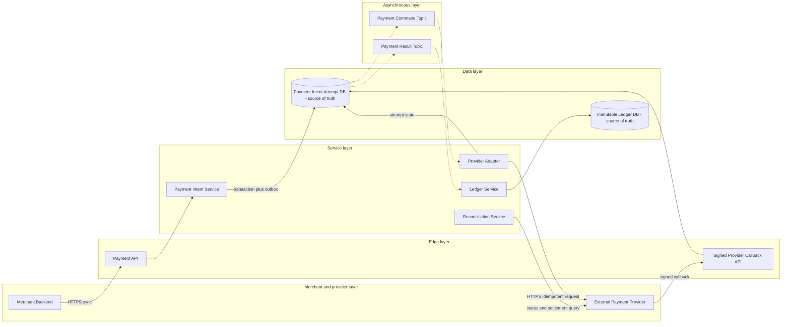

# Payment System

## 0. Interview classification

- **Primary challenge:** financial correctness across retries and external-provider uncertainty.
- **Secondary challenges:** ledger integrity, idempotent API, reconciliation, refunds, and multi-region authority.
- **Patterns exercised:** [[Idempotency Pattern]], [[Transactional Outbox Pattern]], [[Saga Pattern]], [[Deduplication and Inbox Pattern]], [[Retry Timeout and Deadline Pattern]].
- **Expected interview level:** Senior Backend / Senior Golang; Staff signals come from narrowed guarantees and operational judgment.
- **Recommended prerequisites:** [[Consistency Models]], [[API and Data Model Design]], [[Security Abuse and Privacy]].
- **Candidate design disclaimer:** “An interview-oriented candidate design based on public information and distributed-systems principles, not a claim about the company’s exact internal implementation.”

## 1. How to approach this problem

- **First questions:** Scope? Money representation? Guarantees? Scale?
- **Hidden complexity:** financial correctness across retries and external-provider uncertainty; make the invariant and failure boundary visible.
- **What not to over-design:** building a card network, merchant settlement engine, FX pricing, full fraud ML, or claiming compliance certification.
- **What the interviewer is testing:** bounded scope, ownership, complete flow, causal scaling, and explicit trade-offs.
- **Mental model:** derive authority and commit point first; add components only when a requirement or bottleneck forces them.
- **Expected deep-dive branches:** Idempotency and unknown outcome; Ledger design; Multi-region authority.

## 2. Interview timeline for this system

- **0–3:** restate Payment intent lifecycle, PSP adapter, idempotency, ledger, callbacks, reconciliation, refunds, and status.; park building a card network, merchant settlement engine, FX pricing, full fraud ML, or claiming compliance certification.
- **3–7:** clarify NFRs and calculate the dominant rate, data, and skew.
- **7–12:** state invariants, entities, APIs, keys, and source of truth.
- **12–22:** draw Version 1 and trace the critical flow.
- **22–32:** ask the interviewer to select Idempotency and unknown outcome, Ledger design, Multi-region authority.
- **32–39:** address provider latency, quota, and unknown outcomes, ledger write/index/retention growth, hot merchant and failure controls.
- **39–43:** make decisions from the trade-off table; add region/security only where relevant.
- **43–45:** summarize guarantees, relaxed state, risks, and next validation.

## 3. Requirements clarification

| Candidate question | Possible interviewer answer |
| --- | --- |
| Scope? | Create intent, authorize/capture, refund, status, provider callbacks, and reconciliation; not card-network internals. |
| Money representation? | Integer minor units and currency; an immutable double-entry ledger represents our accounting state. |
| Guarantees? | One logical charge/refund, balanced ledger, and truthful UNKNOWN/PENDING. |
| Scale? | Assume 20M intents/day, 10× peak, two attempts/intent, and long ledger retention. |

**Selected scope:** Payment intent lifecycle, PSP adapter, idempotency, ledger, callbacks, reconciliation, refunds, and status.

**Explicit non-goals:** building a card network, merchant settlement engine, FX pricing, full fraud ML, or claiming compliance certification.

## 4. Functional requirements

- Create an idempotent payment intent with amount, currency, merchant, and order.
- Authorize/capture through a provider, process callbacks, and expose precise state.
- Create idempotent partial/full refunds linked to the capture.
- Record balanced immutable ledger entries and reconcile provider evidence to local state.

## 5. Non-functional requirements

- Interview assumptions: 20M intents/day, 10× peak, two attempts/intent, and long financial/audit retention.
- Durable creation p99 below 500 ms; provider completion may be asynchronous.
- At most one provider side effect per logical capture/refund and no unbalanced ledger transaction.
- Correctness over write availability when authority is uncertain; status reads stay highly available.
- Tokenized payment method, encryption, least privilege, signed callbacks, and requirements-led compliance controls.

## 6. Back-of-the-envelope estimation

> [!important] Interview assumptions
> These values size a candidate design. They are not company or production facts.

Average intent rate is about 231/s; 10× peak is about 2,310/s. Attempts, callbacks, ledger commands, and retries can create 5–10k events/s. At a few KB per intent/attempt/ledger record, tens of GB/day accumulate; long retention needs partitioning and tiering. A 15-minute provider outage at peak creates roughly 2.1M pending attempts, so admission and reconciliation capacity are first-class.

## 7. Core invariants

- Same merchant, idempotency key, and payload creates one PaymentIntent; changed payload conflicts.
- A logical capture or refund uses one stable provider reference and creates at most one provider effect.
- Each ledger transaction is immutable and balanced: total debits equal total credits.
- A timeout creates UNKNOWN/PENDING, never an assumed failure or a blind second charge.
- Only allowed versioned transitions commit and one home authority writes an intent at a time.

## 8. Core entities

| Entity | Ownership and lifecycle |
| --- | --- |
| PaymentIntent | Merchant/order amount, currency, state/version, and idempotency identity. |
| PaymentAttempt | Provider operation/reference, request hash, result/error/unknown. |
| LedgerTransaction and Entry | Immutable balanced accounting representation. |
| Refund | Independent idempotent lifecycle linked to capture. |
| ProviderCallback | Signed, deduplicated external evidence. |
| ReconciliationCase | Mismatch evidence, owner, resolution, and audit. |

## 9. API design

| Method | Path or RPC | Request | Response | Authentication | Idempotency | Pagination | Error behaviour |
| --- | --- | --- | --- | --- | --- | --- | --- |
| POST | /v1/payment-intents | merchant, order, amountMinor, currency, methodToken, captureMode | 201/202 paymentId,state | merchant workload | Idempotency-Key+hash | n/a | 400; 409; 422; 429; 503 |
| POST | /v1/payment-intents/{id}/capture | amount, expectedVersion | 202 state | merchant | Idempotency-Key | n/a | 404; 409; 422; 503 |
| POST | /v1/payments/{id}/refunds | amountMinor, reason | 202 refundId,state | merchant/support | Idempotency-Key | GET list cursor | 404; 409; 422 |
| GET | /v1/payments/{id} | id | state, attempt summary, version | merchant/owner | read-only | attempt cursor | 403; 404; freshness |
| POST | /v1/providers/{p}/callbacks | signed event | 204 | provider verification | provider event ID | n/a | 400; 401; 409 |

## 10. Data model

| Table/store | Primary key | Partition key | Important indexes | Source of truth | Retention | Consistency | Access pattern |
| --- | --- | --- | --- | --- | --- | --- | --- |
| payment_intents | payment_id | merchant_id+payment_id | merchant+idempotency; order | authoritative | financial policy | strong/versioned | create/status |
| payment_attempts | attempt_id | payment_id | provider_ref+time | authoritative audit | financial policy | append/transition | reconcile |
| ledger_transactions | ledger_tx_id | merchant+period | payment/refund ref | authoritative ledger | financial policy | immutable balanced | audit |
| ledger_entries | ledger_tx_id+line | merchant+period | account+time | authoritative ledger | financial policy | same transaction | balance/report |
| refunds | refund_id | payment_id | merchant+idempotency | authoritative | policy | strong/versioned | refund |
| provider_events | provider+event_id | provider_ref | received_at | authoritative receipt | replay horizon | dedupe | callback |

## 11. First working design

### HLD: Payment System — candidate design



### ASCII fallback

```text
Merchant --> Payment API --> Intent/Attempt DB [truth] --async--> PSP Adapter --HTTPS--> PSP
PSP --signed callback--> Callback --> Payment DB
Payment result --async--> Ledger Service --> Immutable Balanced Ledger [truth]
Reconciliation Service <--> PSP reports and local payment/ledger state
```

**Legend:** solid arrow = synchronous request/response or direct state access; dashed arrow = asynchronous event/job. “Source of truth” owns authoritative state; “derived” can rebuild.

## 12. Complete critical flow

1. Merchant creates an intent with stable key; API validates integer amount, currency, and token reference, then commits intent, key result, and outbox.
2. Worker creates one attempt with stable provider reference and calls PSP using provider idempotency; caller may already see PROCESSING.
3. Synchronous result or signed callback advances a valid state; timeout stores UNKNOWN and schedules provider query, not a new charge.
4. Successful capture emits ledger command; Ledger Service writes balanced entries with unique business reference.
5. Refund repeats identity/state pattern; reconciliation compares provider reports, attempts, and ledger and opens auditable cases.

## 13. Evolve the design under scale

### Version 1

One service/database and one PSP with synchronous call; still require idempotency and balanced ledger transaction.

### Version 2

Add async commands, provider adapter, callbacks, UNKNOWN reconciliation, immutable ledger, and outbox/inbox.

### Version 3

Add payment home-region epochs, merchant/period partitions, multiple PSP routing before attempt, and independent reconciliation plane.

**Partition and routing:** Partition intents/attempts by merchant and payment ID. Partition ledger by merchant/accounting period while keeping every balanced transaction on one shard. A hot merchant may require account-owner subshards; do not split one transaction.

## 14. Deep dive

### 1. Idempotency and unknown outcome

**Problem and alternatives:** Options are retrying a new request, stable provider key, and query/reconciliation.

**Selected design and detailed flow:** Use merchant key for intent and stable attempt reference for PSP. Timeout sets UNKNOWN; query/callback resolves before alternate-provider attempt.

**Trade-offs and failure handling:** This delays UX but prevents duplicate money movement. Same key with different amount conflicts; retain keys for the retry horizon.

### 2. Ledger design

**Problem and alternatives:** Options are mutable balance, append-only single entries, and double-entry ledger.

**Selected design and detailed flow:** Use immutable ledger transaction with debit/credit entries and unique business reference; balances are projections. Refund/reversal adds new entries.

**Trade-offs and failure handling:** Extra storage and query work buy audit/invariant. Local ledger is not external settlement proof; reconciliation bridges them.

### 3. Multi-region authority

**Problem and alternatives:** Options are active-active last-write-wins, single home, and global-consensus database.

**Selected design and detailed flow:** Use per-intent or merchant home with epoch/fencing and replicated reads. Promote from known state and reconcile unknown attempts before resume.

**Trade-offs and failure handling:** Write locality suffers; global consensus wins only when its latency, cost, and operational maturity are acceptable.

## 15. Detailed success flow

1. Merchant m-7 sends checkout-42 for INR 100000 and gets payment p-9 PROCESSING; duplicate returns p-9.
2. Attempt a-1 uses provider reference p-9:authorize:1; PSP accepts and callback ev-8 confirms capture.
3. Ledger transaction l-4 debits PSP receivable and credits merchant payable atomically; state becomes SUCCEEDED with references.

## 16. Detailed failure flows

### Failure 1 — Provider timeout after charge

- **Detection:** Attempt timeout and UNKNOWN age.
- **Immediate behaviour:** Persist UNKNOWN and stop blind retry/failover.
- **Retry policy:** Query by stable reference with bounded backoff; same provider key only.
- **Idempotency/deduplication:** Intent, attempt, provider reference, callback ID.
- **Recovery:** Reconcile to success/failure; manual case after horizon.
- **User-visible outcome:** PROCESSING/UNKNOWN, never false failure.
- **Observability:** unknown age, query outcome, duplicate reports.

### Failure 2 — Duplicate API or callback

- **Detection:** Unique key/event conflict.
- **Immediate behaviour:** Return original result or ignore stored callback.
- **Retry policy:** No new effect.
- **Idempotency/deduplication:** Merchant key+payload hash and provider event ID.
- **Recovery:** Investigate conflicting payload only.
- **User-visible outcome:** Original result or 409.
- **Observability:** dedupe and payload conflict.

### Failure 3 — Ledger write fails after capture

- **Detection:** Unposted capture metric/event retry.
- **Immediate behaviour:** Captured payment stays true; accounting posting is pending.
- **Retry policy:** Retry by unique ledger business reference.
- **Idempotency/deduplication:** Unique ledger transaction prevents duplicate entries.
- **Recovery:** Replay/reconcile until balanced; page overdue.
- **User-visible outcome:** Payment can succeed while accounting is operator-pending.
- **Observability:** unposted captured payments and balance invariant.

### Failure 4 — Region fails in-flight

- **Detection:** Health, epoch, and replication position.
- **Immediate behaviour:** Fence old region and pause new attempts until authority is known.
- **Retry policy:** Do not replay until provider unknowns are reconciled.
- **Idempotency/deduplication:** Home epoch and stable provider references.
- **Recovery:** Promote, query PSP, resume, and fail back deliberately.
- **User-visible outcome:** Temporary unavailable/pending, not double charge.
- **Observability:** failover RTO and unknown backlog.

## 17. Bottlenecks and scalability

- provider latency, quota, and unknown outcomes
- ledger write/index/retention growth
- hot merchant
- callback and reconciliation bursts
- cross-region authority

**Partitioning unit and routing strategy:** Partition intents/attempts by merchant and payment ID. Partition ledger by merchant/accounting period while keeping every balanced transaction on one shard. A hot merchant may require account-owner subshards; do not split one transaction.

## 18. Reliability and recovery

- Timeouts, bounded retries, provider idempotency, callback dedupe, and reconciliation.
- Multi-AZ payment and ledger stores, PITR, immutable backups, restore and balance verification.
- Circuit and bulkhead by provider/merchant; admission and pending state during outage.
- Outbox/inbox for internal effects; poison events quarantine with repair.
- Fenced home-region failover and post-recovery provider/ledger reconciliation.

## 19. Observability

- **Key metrics:** create/capture/refund latency, PSP errors/429, UNKNOWN age, callback lag, duplicate conflicts, unposted ledger, reconciliation backlog.
- **Logs:** merchant/payment/attempt/provider/ledger refs and versions; never payment credentials.
- **Traces:** intent commit→adapter→callback/query→ledger.
- **SLI/SLO candidates:** durable intent creation, terminal resolution time, zero duplicate logical charges, zero unbalanced ledger commits.
- **Dashboards:** payment funnel, providers, unknowns, ledger, refunds, reconciliation, region.
- **Alerts:** unknown age, duplicate-charge evidence, unposted capture, ledger invariant, provider burn.
- **Business-level signals:** authorized/captured/refunded amount by currency, success/decline, unresolved amount, reconciliation difference.

## 20. Security and abuse

- Tokenize payment methods and never store raw card credentials; ask rather than invent regulatory scope.
- Authenticate merchant/workload and authorize every merchant/payment resource.
- Encrypt data, isolate provider secrets, verify signed callbacks, and prevent replay.
- Use integer minor units plus currency and server-side amount/order validation.
- Use immutable operator audit and dual control for manual financial adjustment.

## 21. Explicit trade-off table

| Decision | Selected option | Alternative | Why selected | Cost or weakness | When alternative wins |
| --- | --- | --- | --- | --- | --- |
| Completion | async PROCESSING | block on provider | bounded latency/recovery | eventual UX | fast reliable provider |
| Idempotency | durable merchant key | best effort | prevents duplicate intent | retention storage | never for money |
| Unknown | reconcile before retry | immediate retry/failover | duplicate safety | delay | duplicate-tolerant side effect |
| Ledger | double-entry immutable | mutable balance | audit/invariant | complexity | nonfinancial counter |
| Provider | adapter | embedded client | isolation/routing | maintenance | one stable PSP |
| Region | single home+epoch | active-active LWW | safe authority | latency/pause | disjoint conflict-free ownership |
| Database | relational | KV | transactions/ledger | future sharding | exact-key scale with separate ledger |
| Capture | authorize then capture | immediate capture | business control | more states | simple immediate sale |
| Reconciliation | independent plane | trust callbacks | finds silent mismatch | cost/delay | never omit for external money |

## 22. Technology choices

| Technology | Role | Why it fits | Viable alternative | Operational cost | When choice changes |
| --- | --- | --- | --- | --- | --- |
| PostgreSQL | intent/attempt/idempotency | ACID transitions | DynamoDB/distributed SQL | sharding/connections | global exact-key scale |
| Separate PostgreSQL ledger | balanced entries | transaction constraints | specialized ledger DB | operations | very high regulated needs |
| Kafka/SQS | commands/results | durable replay | workflow engine/direct | lag/duplicates | low-volume sync |
| Provider adapter | calls/status | stable identity mapping | direct SDK | maintenance | one provider |
| OpenTelemetry | cross-step signals | safe correlation | vendor agent | cardinality/privacy | semantic needs remain |

## 23. Interviewer follow-up questions

| Likely follow-up | Concise strong answer | Diagram change | Trade-off |
| --- | --- | --- | --- |
| Exactly-once charge? | Promise one logical effect through identities, provider key, state machine, and reconcile; not network exactly-once. | Highlight UNKNOWN path. | latency vs safety |
| Ledger and provider differ? | Open reconciliation case; preserve history and post correcting entry after evidence/approval. | Add reconcile arrow. | availability vs closure |
| Multiple providers? | Route before an attempt; after UNKNOWN reconcile before failover unless duplicate policy permits. | Add provider router. | resilience vs duplicates |
| Active-active? | Use home authority or global consensus; LWW cannot protect money. | Add epoch. | locality vs correctness |

## 24. What a weak candidate does

- Treats timeout as failure and retries a new charge.
- Stores floating money or raw credentials.
- Uses mutable balance without ledger entries.
- Trusts callback without reconciliation.
- Uses active-active last-writer-wins.

## 25. What a strong senior candidate demonstrates

- States financial invariant and completion semantics.
- Uses layered idempotency and truthful UNKNOWN.
- Separates intent, provider attempt, and balanced ledger.
- Explains reconciliation and operator repair.
- Sacrifices availability under ambiguous authority rather than duplicate money.

## 26. Five-minute revision

- **Requirements:** intent, authorize/capture, refund, status, callback/reconcile.
- **Critical invariant:** one logical charge/refund; balanced ledger; UNKNOWN truthful.
- **Core HLD:** API→Payment DB/outbox→adapter/provider→callback/query→ledger.
- **Most important data model:** intent version/key, attempt providerRef, ledger tx/entries.
- **Critical flow:** commit→stable provider attempt→resolve→balanced posting.
- **Three bottlenecks:** provider; unknown backlog; ledger growth.
- **Three trade-offs:** async/sync; home/active-active; safety/failover speed.
- **Three failures:** provider timeout; ledger failure; region loss.
- **Likely deep dive:** idempotency and reconciliation.

## 27. Blank-page practice prompt

Design a payment service that creates intents, authorizes or captures through an external provider, refunds, records a ledger, and survives retries and timeouts.

## 28. Adversarial variations

- The provider gives no response after a charge.
- Two providers must support failover.
- Payments must accept writes in two regions.
- Ledger closes while callbacks are delayed.
- Refund races with capture or chargeback.
- One merchant becomes 30% of traffic.

## 29. Practice and re-test history

- [ ] Untimed reconstruction — date/result:
- [ ] 45-minute mock — score/date:
- [ ] Follow-up round — variation/result:
- [ ] One-day review — date/result:
- [ ] Three-day review — date/result:
- [ ] Seven-day review — date/result:
- [ ] Fourteen-day review — date/result:

Personal readiness remains `not-started` until evidence is recorded in [[System Design Practice Tracker]].

## 30. Related internal notes and verified external references

**Internal:** [[Idempotency Pattern]] · [[Retry Timeout and Deadline Pattern]] · [[Transactional Outbox Pattern]] · [[Saga Pattern]] · [[Consistency Models]]

**Verified external references (checked 2026-07-17):**

- [AWS Builders’ Library: idempotent APIs](https://aws.amazon.com/builders-library/making-retries-safe-with-idempotent-APIs/) — mutation identity.
- [PostgreSQL concurrency control](https://www.postgresql.org/docs/current/mvcc.html) — ledger transaction primitives.

