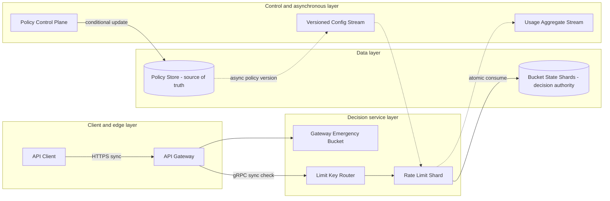

# Rate Limiter System

## 0. Interview classification

- **Primary challenge:** distributed admission control with bounded overshoot.
- **Secondary challenges:** fairness, low latency, multi-region state, and dynamic configuration.
- **Patterns exercised:** [[Rate Limiting Pattern]], [[Backpressure and Load Shedding]], [[Consistent Hashing Pattern]], [[Bulkhead Pattern]].
- **Expected interview level:** Senior Backend / Senior Golang; Staff signals come from narrowed guarantees and operational judgment.
- **Recommended prerequisites:** [[Latency Throughput and Capacity]], [[Consistency Models]], [[Security Abuse and Privacy]].
- **Candidate design disclaimer:** “An interview-oriented candidate design based on public information and distributed-systems principles, not a claim about the company’s exact internal implementation.”

## 1. How to approach this problem

- **First questions:** What resource is protected? Required accuracy? Burst behaviour? Deployment?
- **Hidden complexity:** distributed admission control with bounded overshoot; make the invariant and failure boundary visible.
- **What not to over-design:** a complete WAF/fraud system, billing ledger, or application authentication.
- **What the interviewer is testing:** bounded scope, ownership, complete flow, causal scaling, and explicit trade-offs.
- **Mental model:** derive authority and commit point first; add components only when a requirement or bottleneck forces them.
- **Expected deep-dive branches:** Token-bucket state; Distributed accuracy; Failure policy.

## 2. Interview timeline for this system

- **0–3:** restate Check/consume quota, publish policies, enforce hierarchical tenant/user/route/global limits, and report decisions.; park a complete WAF/fraud system, billing ledger, or application authentication.
- **3–7:** clarify NFRs and calculate the dominant rate, data, and skew.
- **7–12:** state invariants, entities, APIs, keys, and source of truth.
- **12–22:** draw Version 1 and trace the critical flow.
- **22–32:** ask the interviewer to select Token-bucket state, Distributed accuracy, Failure policy.
- **32–39:** address hot tenant/global key, bucket-store atomic latency, policy fan-out and version skew and failure controls.
- **39–43:** make decisions from the trade-off table; add region/security only where relevant.
- **43–45:** summarize guarantees, relaxed state, risks, and next validation.

## 3. Requirements clarification

| Candidate question | Possible interviewer answer |
| --- | --- |
| What resource is protected? | API requests and expensive operations; per-tenant/route plus global backend limits. |
| Required accuracy? | Small bounded overshoot is acceptable for ordinary quotas; billing/security limits need stronger authority. |
| Burst behaviour? | Token bucket with configurable burst; reject with 429 and Retry-After. |
| Deployment? | Multi-region enforcement with centrally versioned policy and region token budgets. |

**Selected scope:** Check/consume quota, publish policies, enforce hierarchical tenant/user/route/global limits, and report decisions.

**Explicit non-goals:** a complete WAF/fraud system, billing ledger, or application authentication.

## 4. Functional requirements

- Evaluate a request before expensive work against hierarchical limits.
- Support token-bucket rate and burst by tenant, user, IP, route, and resource cost.
- Distribute versioned configuration safely with shadow evaluation and rollback.
- Return allow, remaining budget, retry guidance, reason, and policy version.

## 5. Non-functional requirements

- Interview assumptions: one million decisions/s globally across five regions; p99 added latency below 5 ms in-region.
- Decision availability target 99.99%; limiter must not become a more fragile dependency than the protected service.
- At most 2% ordinary quota overshoot during partitions; strict security/billing quotas use a stronger mode.
- Configuration converges within ten seconds and retains last-known-good; decisions are auditable without PII explosion.
- Failure policy is explicit per route: fail-open, conservative local, or fail-closed.

## 6. Back-of-the-envelope estimation

> [!important] Interview assumptions
> These values size a candidate design. They are not company or production facts.

At 1M decisions/s and 100-byte telemetry per decision, raw logging would be 100 MB/s, so aggregate or sample ordinary decisions. If one shard safely serves 50k decisions/s under measured headroom, baseline is 20 shards; deploy more logical shards/replicas for skew and failure. A one-second regional lease for a global 100k/s quota bounds overshoot to outstanding leased tokens rather than an unbounded partition.

## 7. Core invariants

- A decision consumes at most one token for its request identity where retries can duplicate checks.
- Ordinary distributed limits overshoot only within a declared bound; strict limits never silently fail open.
- Policy version used for a decision is observable and monotonic per limit key.
- Enforcement happens before the protected expensive resource.

## 8. Core entities

| Entity | Ownership and lifecycle |
| --- | --- |
| LimitPolicy | Scope/key dimensions, algorithm, rate, burst, fail mode, and version. |
| BucketState | Tokens and last refill logical time; owned by a shard. |
| TokenLease | Bounded region/shard allocation from a strict global quota with expiry and epoch. |
| Decision | Allowed, reason, remaining, retryAfter, and policy version. |
| UsageAggregate | Privacy-safe derived counters for tuning and audit. |

## 9. API design

| Method | Path or RPC | Request | Response | Authentication | Idempotency | Pagination | Error behaviour |
| --- | --- | --- | --- | --- | --- | --- | --- |
| POST | /v1/check | subject, route, cost, requestId | allow, remaining, retryAfter, reason | trusted gateway workload | requestId where needed | n/a | 429 decision; 503 unavailable |
| PUT | /v1/policies/{id} | policy, expectedVersion | new version | admin/control plane | operation key | n/a | 400; 403; 409; 503 |
| GET | /v1/policies/{id} | id | policy/version | admin/service | read-only | n/a | 404 |
| GET | /v1/usage | scope and time | aggregates | tenant/admin | read-only | cursor/time window | 429; partial/freshness |

## 10. Data model

| Table/store | Primary key | Partition key | Important indexes | Source of truth | Retention | Consistency | Access pattern |
| --- | --- | --- | --- | --- | --- | --- | --- |
| limit_policies | policy_id | policy_id | scope+route | authoritative control plane | audit policy | strong/versioned | config update |
| bucket_state | limit_key | hash(limit_key) | expiry | decision authority per owner | TTL after idle | atomic per key | consume/refill |
| token_leases | global_key+region+epoch | global_key | expiry | strict allocation authority | short | strong allocation | regional quota |
| usage_aggregates | key+time bucket | tenant+time | time | derived | policy | eventual | dashboards |

## 11. First working design

### HLD: Rate Limiter System — candidate design



### ASCII fallback

```text
Client --> API Gateway --gRPC check--> Key Router --> Limit Shard --> Bucket State [authority]
                     +--degraded policy--> Emergency Local Bucket
Policy Control Plane --> Policy Store [truth] --async version--> Limit Shards
Limit Shards --async aggregates--> Usage Stream
```

**Legend:** solid arrow = synchronous request/response or direct state access; dashed arrow = asynchronous event/job. “Source of truth” owns authoritative state; “derived” can rebuild.

## 12. Complete critical flow

1. Gateway authenticates and builds canonical keys such as tenant:t7:route:search plus request cost.
2. Router hashes the key to an owner shard; shard loads versioned policy and atomically refills/consumes token-bucket state.
3. Decision returns allow, remaining, Retry-After, and policy version within deadline; gateway enforces before forwarding.
4. Strict global quotas lease bounded token batches to regions under an epoch; a partition cannot exceed outstanding lease.
5. Usage aggregates emit asynchronously; policy updates move through validate, shadow, canary, enforce, and rollback.

## 13. Evolve the design under scale

### Version 1

Use an in-process token bucket per gateway; simple but replica count multiplies the effective quota.

### Version 2

Introduce a sharded regional limiter with atomic per-key owners, hierarchy, and emergency local mode.

### Version 3

Add regional token leases for selected global quotas and a strict allocator for zero/low-overshoot policies.

**Partition and routing:** Partition by canonical limit key. Hierarchical checks avoid a distributed transaction by allocating child budgets from parent quotas. Consistent hashing moves ordinary keys; hot tenants can receive dedicated ownership.

## 14. Deep dive

### 1. Token-bucket state

**Problem and alternatives:** Alternatives are fixed/sliding windows, leaky bucket, and token bucket.

**Selected design and detailed flow:** Select token bucket for average rate plus bounded burst. Atomic owner stores tokens and last-refill logical time; expensive routes consume multiple units.

**Trade-offs and failure handling:** Clock skew and concurrent updates are avoided by one owner/atomic script; stale owner epoch is rejected. Fixed window wins for cheap coarse limits.

### 2. Distributed accuracy

**Problem and alternatives:** Alternatives are a central call per request, independent regional limits, and leased regional budgets.

**Selected design and detailed flow:** Select token leases: a global owner grants bounded batches with expiry/epoch, and regions serve locally. Overshoot is bounded by outstanding leases.

**Trade-offs and failure handling:** Larger leases improve availability/latency but increase overshoot. During allocator failure regions exhaust leases then follow policy.

### 3. Failure policy

**Problem and alternatives:** Alternatives are fail-open, fail-closed, and conservative local buckets.

**Selected design and detailed flow:** Select per-policy behaviour: login/payment abuse fails closed/conservative; low-risk reads may fail open behind a global admission cap.

**Trade-offs and failure handling:** Universal behaviour is unsafe. Emergency policies are versioned, short-lived, visible, and intentionally less accurate.

## 15. Detailed success flow

1. Tenant t7 search request cost 1 reaches the gateway; key routes to shard 12 and policy v8 refills then consumes one token.
2. Decision allow=true, remaining=19 returns in 2 ms and the gateway forwards. Aggregate records an allowed decision without raw user PII.
3. At exhaustion the next request receives 429 and Retry-After derived from refill; it never consumes a backend connection.

## 16. Detailed failure flows

### Failure 1 — Limiter shard timeout

- **Detection:** Decision deadline and shard error rate.
- **Immediate behaviour:** Use route-specific emergency policy: conservative local, fail-open, or fail-closed; do not wait indefinitely.
- **Retry policy:** One retry only when deadline and request identity preserve consume semantics.
- **Idempotency/deduplication:** Request identity and bounded local budget constrain double consumption.
- **Recovery:** Fail over shard ownership with a new epoch; bucket state recovers from replica.
- **User-visible outcome:** Explicit 429/503 or allowed-degraded.
- **Observability:** timeouts, emergency decisions, and overshoot estimate.

### Failure 2 — Hot tenant or key

- **Detection:** Per-key QPS and shard skew.
- **Immediate behaviour:** Use dedicated shard or child budgets while preserving the tenant parent cap.
- **Retry policy:** No retry storm; reject with 429.
- **Idempotency/deduplication:** Owner/lease bounds tokens.
- **Recovery:** Rebalance weight and review abusive client.
- **User-visible outcome:** Only that tenant throttles; others remain healthy.
- **Observability:** top-key QPS, shard saturation, fairness.

### Failure 3 — Bad policy rollout

- **Detection:** Shadow mismatch or rejection spike.
- **Immediate behaviour:** Freeze and revert; shards keep last-known-good.
- **Retry policy:** Config delivery retries idempotently by version.
- **Idempotency/deduplication:** Monotonic versions reject older updates.
- **Recovery:** Audit, canary comparison, and replay corrected policy.
- **User-visible outcome:** Prior limits remain or conservative mode applies.
- **Observability:** version skew, shadow delta, rejection spike.

### Failure 4 — Global allocator partition

- **Detection:** Lease renewal failure.
- **Immediate behaviour:** Consume existing lease; strict quotas fail closed/conservative on expiry, ordinary limits use regional cap.
- **Retry policy:** Bounded renewal retries with jitter.
- **Idempotency/deduplication:** Epoch and lease ID prevent reuse.
- **Recovery:** Allocator quorum promotes a new epoch; regions discard old leases.
- **User-visible outcome:** Possible throttling, never unbounded strict overshoot.
- **Observability:** lease remaining, renewal failures, regional rejects.

## 17. Bottlenecks and scalability

- hot tenant/global key
- bucket-store atomic latency
- policy fan-out and version skew
- global lease allocator
- telemetry cardinality

**Partitioning unit and routing strategy:** Partition by canonical limit key. Hierarchical checks avoid a distributed transaction by allocating child budgets from parent quotas. Consistent hashing moves ordinary keys; hot tenants can receive dedicated ownership.

## 18. Reliability and recovery

- Very short decision deadline and no deep synchronous dependencies.
- Replicated shard owners with epochs and locally cached last-known-good policy.
- Per-policy failure mode and emergency capacity; bulkhead by tenant/route.
- Control plane is isolated from data plane; config stream is replayable and canaried.
- Policy is backed up/audited; strict lease state persists, ordinary idle buckets may expire.

## 19. Observability

- **Key metrics:** decision p50/p99 and availability, allow/reject reason, policy skew, shard/key skew, emergency mode, lease remaining and overshoot estimate.
- **Logs:** policy changes and sampled decisions with hashed subject; no raw credentials/PII.
- **Traces:** gateway check through shard for slow/error samples.
- **SLI/SLO candidates:** correct low-latency enforcement by policy class and protected-backend saturation.
- **Dashboards:** regional SLO, shard load, top keys, rollout, lease health.
- **Alerts:** burn rate, emergency duration, version skew, allocator failure, tenant starvation.
- **Business-level signals:** backend overload avoided, quota disputes, abuse blocked, false-positive rate.

## 20. Security and abuse

- Only trusted gateways call check; authenticate workloads and authorize policy scope.
- Control plane uses least privilege, approval, conditional versions, audit, and rollback.
- Hash sensitive subject identifiers in telemetry; keys include tenant/resource.
- Do not let callers choose a cheaper cost or weaker scope.
- Strict policies fail safely; configuration is signed or integrity-protected.

## 21. Explicit trade-off table

| Decision | Selected option | Alternative | Why selected | Cost or weakness | When alternative wins |
| --- | --- | --- | --- | --- | --- |
| Algorithm | token bucket | fixed/sliding window | burst plus average control | state complexity | coarse cheap quota |
| State | regional sharded owner | per-instance | accuracy independent of replica count | network dependency | small non-strict service |
| Global quota | regional leases | central call each request | low latency with bounded overshoot | lease complexity | low-QPS strict billing |
| Failure mode | per-policy | universal fail-open | matches risk | config complexity | only low-risk availability |
| Routing | consistent hash | random | state locality | rebalance metadata | directory for dedicated tenants |
| Config | push plus last-good | DB read each request | stable fast data plane | eventual rollout | tiny config volume |
| Telemetry | aggregate/sample | every decision | cost/privacy control | less forensic detail | strict audited subset |
| Strictness | bounded ordinary | linearizable all | availability/latency | not exact | security/billing |
| Hierarchy | leased child budgets | multi-key transaction | scalable local checks | allocation inefficiency | very low rate |

## 22. Technology choices

| Technology | Role | Why it fits | Viable alternative | Operational cost | When choice changes |
| --- | --- | --- | --- | --- | --- |
| Go/Java service | decision and routing | predictable low latency | Envoy local limiter | custom operations | simple node-local policies |
| Redis Cluster | regional atomic bucket state | fast TTL and atomic script | DynamoDB/FoundationDB | memory/cluster ops | durable stricter state |
| etcd/PostgreSQL | policy source/version | strong control plane | Git/config service | control-plane ops | slow declarative policy |
| Kafka/Pub/Sub | config and aggregates | replayable async | watch API/SQS | broker overhead | small config set |
| Envoy/API Gateway | enforcement point | rejects before backend | app middleware | fleet rollout | single service |

## 23. Interviewer follow-up questions

| Likely follow-up | Concise strong answer | Diagram change | Trade-off |
| --- | --- | --- | --- |
| How exact globally? | State bounded overshoot; use leases or central linearizable owner for strict policies. | Add global allocator/leases. | accuracy vs latency |
| Limiter is down? | Per-policy open/closed/conservative local with global admission and visible degraded state. | Add emergency bucket. | security vs availability |
| One hot tenant? | Dedicated capacity and child budgets while parent cap remains authoritative. | Split tenant path. | fairness vs complexity |
| Clock skew? | Owner uses server logical/monotonic time, clamps refill delta, and fences ownership. | Annotate owner time. | simplicity vs distributed time |

## 24. What a weak candidate does

- Names token bucket without defining key, state, refill, or atomicity.
- Uses per-instance counters and ignores replica multiplication.
- Chooses fail-open universally.
- Promises perfectly exact global limits at one million checks/s for free.
- Enforces after the protected database call.

## 25. What a strong senior candidate demonstrates

- Separates policy/control plane from decision data plane.
- Quantifies acceptable overshoot and chooses leases deliberately.
- Defines hierarchical keys, cost units, failure modes, and hot-key handling.
- Links decisions to protected-backend SLO.
- Uses shadow rollout and false-positive observability.

## 26. Five-minute revision

- **Requirements:** hierarchical check, token bucket, policy update, 429.
- **Critical invariant:** bounded overshoot; strict policy never silently fail-open.
- **Core HLD:** gateway→router→shard→bucket authority; policy async; emergency local.
- **Most important data model:** policy version, bucket tokens/time, regional lease epoch.
- **Critical flow:** canonical key→atomic consume→decision before backend.
- **Three bottlenecks:** hot key; bucket latency; allocator.
- **Three trade-offs:** accuracy vs latency; open vs closed; lease size vs overshoot.
- **Three failures:** shard timeout; config bug; allocator partition.
- **Likely deep dive:** distributed accuracy with leased budgets.

## 27. Blank-page practice prompt

Design a distributed rate-limiting service used by API gateways across multiple regions. Support tenant/route policies, bursts, fairness, and explicit failure behaviour.

## 28. Adversarial variations

- Traffic grows to ten million decisions/s.
- A security limit must have zero overshoot.
- The policy store and config stream are unavailable.
- One tenant produces 40% of traffic.
- Regions become disconnected for ten minutes.
- False positives must fall without exposing backend capacity.

## 29. Practice and re-test history

- [ ] Untimed reconstruction — date/result:
- [ ] 45-minute mock — score/date:
- [ ] Follow-up round — variation/result:
- [ ] One-day review — date/result:
- [ ] Three-day review — date/result:
- [ ] Seven-day review — date/result:
- [ ] Fourteen-day review — date/result:

Personal readiness remains `not-started` until evidence is recorded in [[System Design Practice Tracker]].

## 30. Related internal notes and verified external references

**Internal:** [[Rate Limiting Pattern]] · [[Backpressure and Load Shedding]] · [[Consistent Hashing Pattern]] · [[API Gateway System]] · [[Security Abuse and Privacy]]

**Verified external references (checked 2026-07-17):**

- [RFC 6585](https://www.rfc-editor.org/rfc/rfc6585) — 429 semantics.
- [Redis use cases](https://redis.io/docs/latest/develop/use-cases/) — official rate-limiting examples.

