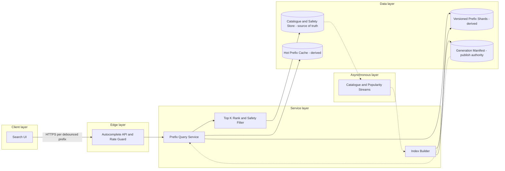

# Search Autocomplete System

## 0. Interview classification

- **Primary challenge:** low-latency prefix retrieval and ranking under skew.
- **Secondary challenges:** index building, freshness, typo/language handling, privacy, hot prefixes, and safe fallback.
- **Patterns exercised:** [[Caching Pattern]], [[Change Data Capture]], [[Backpressure and Load Shedding]], [[Consistent Hashing Pattern]].
- **Expected interview level:** Senior Backend / Senior Golang; Staff signals come from narrowed guarantees and operational judgment.
- **Recommended prerequisites:** [[Search and Geospatial Indexes]], [[Latency Throughput and Capacity]], [[Caching and CDN Fundamentals]].
- **Candidate design disclaimer:** “An interview-oriented candidate design based on public information and distributed-systems principles, not a claim about the company’s exact internal implementation.”

## 1. How to approach this problem

- **First questions:** Corpus? Freshness? Ranking? Scale?
- **Hidden complexity:** low-latency prefix retrieval and ranking under skew; make the invariant and failure boundary visible.
- **What not to over-design:** full document search, semantic/vector search, complete spell-correction ML, or proprietary ranking.
- **What the interviewer is testing:** bounded scope, ownership, complete flow, causal scaling, and explicit trade-offs.
- **Mental model:** derive authority and commit point first; add components only when a requirement or bottleneck forces them.
- **Expected deep-dive branches:** Index representation; Ranking and freshness; Hot prefixes.

## 2. Interview timeline for this system

- **0–3:** restate Prefix API, normalization, ranked top-k suggestions, offline/stream index build, cache, deletion/safety, and versioned rollout.; park full document search, semantic/vector search, complete spell-correction ML, or proprietary ranking.
- **3–7:** clarify NFRs and calculate the dominant rate, data, and skew.
- **7–12:** state invariants, entities, APIs, keys, and source of truth.
- **12–22:** draw Version 1 and trace the critical flow.
- **22–32:** ask the interviewer to select Index representation, Ranking and freshness, Hot prefixes.
- **32–39:** address hot short prefixes, prefix-index memory/build amplification, regional cache miss storms and failure controls.
- **39–43:** make decisions from the trade-off table; add region/security only where relevant.
- **43–45:** summarize guarantees, relaxed state, risks, and next validation.

## 3. Requirements clarification

| Candidate question | Possible interviewer answer |
| --- | --- |
| Corpus? | Product/query suggestions for a bounded catalogue and trending queries; prefix autocomplete, not full search. |
| Freshness? | Minutes for catalogue, seconds for trending; deleted/unsafe suggestions must disappear faster. |
| Ranking? | Popularity, recency, locale, optional personalization; start nonpersonal. |
| Scale? | Assume 1B autocomplete requests/day, 10× peak, 100M candidate phrases, top 10 results. |

**Selected scope:** Prefix API, normalization, ranked top-k suggestions, offline/stream index build, cache, deletion/safety, and versioned rollout.

**Explicit non-goals:** full document search, semantic/vector search, complete spell-correction ML, or proprietary ranking.

## 4. Functional requirements

- Return up to ten normalized prefix suggestions with stable scores and freshness.
- Ingest catalogue/query popularity changes and build versioned prefix index.
- Support locale and optional safe filters; remove deleted/unsafe terms.
- Roll out/rebuild index without downtime and degrade safely.

## 5. Non-functional requirements

- Interview assumptions: 1B requests/day, 10× peak, 100M phrases, top ten, up to 20-character prefix.
- Regional p99 below 50 ms; high availability; response can be minutes stale except removals.
- Index is derived and rebuildable; authoritative catalogue/safety state is separate.
- Hot one/two-character prefixes, cache stampede, and high-cardinality language/tenant dimensions are explicit.
- Minimize query logging/PII, rate-limit scraping, and filter unsafe suggestions.

## 6. Back-of-the-envelope estimation

> [!important] Interview assumptions
> These values size a candidate design. They are not company or production facts.

Average QPS ≈11,600; 10× peak ≈116k/s. Each keystroke may generate a request, multiplying sessions by query length. Caching top prefixes can absorb most traffic. A naïve prefix expansion of 100M phrases×20 creates up to 2B prefix associations; store only top-k per node/prefix, compress with trie/FST, or shard. Response payload around 1 KB makes network manageable; memory/index size and hot prefix dominate.

## 7. Core invariants

- Autocomplete index is derived; catalogue/safety source remains authoritative.
- Within one index generation a prefix returns a deterministic top-k order and cursor is unnecessary for the small result.
- Deleted/blocked terms are suppressed by versioned safety filter even if popularity index lags.
- Index generation switches atomically; readers never combine incompatible partial shards.

## 8. Core entities

| Entity | Ownership and lifecycle |
| --- | --- |
| Suggestion | Normalized text, display text, locale, type, source ID, safety/version. |
| PrefixEntry | Prefix→top candidate IDs/scores for one generation. |
| PopularitySignal | Aggregated count/recency with privacy threshold. |
| IndexGeneration | Build snapshot/change position, shard manifests, state. |
| SafetyTombstone | Authoritative blocked/deleted source/version. |
| QueryContext | Prefix, locale, tenant/category, optional user-safe features. |

## 9. API design

| Method | Path or RPC | Request | Response | Authentication | Idempotency | Pagination | Error behaviour |
| --- | --- | --- | --- | --- | --- | --- | --- |
| GET | /v1/autocomplete | q,locale,limit,category | suggestions,generation,freshness | public/user optional | read-only | n/a top-k | 400; 429; partial/empty |
| POST | /v1/catalogue-events | source/version/change | 202 | trusted producer | event ID | n/a | 400; 409 |
| POST | /v1/index-generations | snapshot/position/config | 202 generation state | admin/build service | operation key | n/a | 403; 409 |
| PUT | /v1/safety/{sourceId} | blocked,version | 204 | moderator/safety | Idempotency-Key | n/a | 403; 409 |

## 10. Data model

| Table/store | Primary key | Partition key | Important indexes | Source of truth | Retention | Consistency | Access pattern |
| --- | --- | --- | --- | --- | --- | --- | --- |
| catalogue | source_id | source domain | normalized text/locale | authoritative | business | strong owner | build/filter |
| popularity_events | event_id | term/locale | time | signal stream | short aggregate | at-least-once | ranking |
| prefix_shards | generation+prefix | prefix hash/range | locale/category | derived | generation | immutable | top-k lookup |
| generation_manifest | generation | generation | status/position | build authority | audit | strong publish | route |
| safety_tombstones | source_id | source hash | version | authoritative safety | policy | strong/versioned | read filter |
| prefix_cache | locale+category+prefix+generation | hash prefix | TTL | derived | short | eventual | hot lookup |

## 11. First working design

### HLD: Search Autocomplete System — candidate design



### ASCII fallback

```text
Search UI --debounced HTTPS--> Autocomplete API --> Hot Prefix Cache [derived]
                                              \--> Versioned Prefix Shard [derived]
                                                   --> safety filter [truth]
Catalogue/Safety [truth] + Popularity Stream --> Index Builder --> new immutable generation
Generation Manifest atomically switches readers
```

**Legend:** solid arrow = synchronous request/response or direct state access; dashed arrow = asynchronous event/job. “Source of truth” owns authoritative state; “derived” can rebuild.

## 12. Complete critical flow

1. Client debounces and sends normalized prefix, locale, category, and top-k limit; edge rate-limits scraping and rejects oversized input.
2. Query uses current generation and checks cache key including locale/category/generation. Miss routes prefix to shard.
3. Shard returns bounded candidates; rank applies score/tie-break and safety/deletion filter from fast versioned state.
4. Response returns top ten, generation, and freshness; cache stores short-lived result.
5. Builder consumes catalogue snapshot plus popularity/change stream, creates immutable shards, validates coverage/quality/safety, then atomically publishes manifest.

## 13. Evolve the design under scale

### Version 1

SQL prefix query with index and popularity order for small catalogue.

### Version 2

Precomputed prefix→top-k store plus hot-prefix cache and async change updates.

### Version 3

Compressed/sharded trie or FST generations, regional replicas, streaming trend overlay, atomic blue/green rollout, and safety filter independent from index lag.

**Partition and routing:** Shard prefix entries by normalized prefix hash or leading range while replicating hot short prefixes. Locale/category are key dimensions. Index generations are immutable; manifest maps generation/shard owners. Hot keys need replication, not ordinary reshards.

## 14. Deep dive

### 1. Index representation

**Problem and alternatives:** Options are SQL LIKE/range, trie, FST, prefix hash table, search engine completion suggester.

**Selected design and detailed flow:** Use versioned prefix shards storing only top-k candidate IDs/scores for frequent prefixes; compress strings with trie/FST for memory. SQL wins for small corpus.

**Trade-offs and failure handling:** Precomputation multiplies entries; top-k pruning reduces memory but limits ad-hoc ranking. Generation build validates before publish.

### 2. Ranking and freshness

**Problem and alternatives:** Options are batch popularity only, streaming counters, request-time model.

**Selected design and detailed flow:** Use batch base score plus bounded streaming trend overlay by locale; deterministic tie-break. Personalization is optional rerank of small candidates.

**Trade-offs and failure handling:** Streaming improves freshness but invites spam and counter skew. Privacy thresholds and abuse filtering apply before promotion.

### 3. Hot prefixes

**Problem and alternatives:** Options are shard uniformly, edge cache, precompute first characters, client debounce.

**Selected design and detailed flow:** Combine debounce, cache/replicate one- and two-character results, request coalescing, and rate limits. Empty/one-character may return curated trends rather than huge candidate work.

**Trade-offs and failure handling:** A hot key is not fixed by more hash shards; it needs replicas/cache or product restriction.

## 15. Detailed success flow

1. User types ca in en-IN; client waits debounce, sends request, cache generation g42 misses.
2. Shard returns 30 candidates; rank filters a deleted source at safety v9 and returns top ten with deterministic scores.
3. Result caches by en-IN:category:ca:g42. Builder later publishes g43 atomically after replaying changes through position p-8.

## 16. Detailed failure flows

### Failure 1 — Index shard unavailable

- **Detection:** timeout/error rate.
- **Immediate behaviour:** Serve cached/stale safe result or empty response; do not hit catalogue with unbounded scan.
- **Retry policy:** One bounded replica retry.
- **Idempotency/deduplication:** Read-only generation key.
- **Recovery:** Fail over shard/replica; rebuild from generation artifact.
- **User-visible outcome:** Autocomplete degrades while full search still works.
- **Observability:** shard errors, stale serves, empty rate.

### Failure 2 — Bad generation

- **Detection:** canary relevance/coverage/safety metrics.
- **Immediate behaviour:** Stop rollout and keep prior manifest.
- **Retry policy:** Build/publish operation is idempotent by generation.
- **Idempotency/deduplication:** Immutable generation and conditional manifest.
- **Recovery:** Rollback pointer; inspect/rebuild.
- **User-visible outcome:** Users remain on known-good suggestions.
- **Observability:** generation skew, quality delta, rollback.

### Failure 3 — Hot prefix stampede

- **Detection:** per-key QPS/cache miss/origin load.
- **Immediate behaviour:** Replicate cache, coalesce loader, soft TTL+jitter, restrict very short prefixes.
- **Retry policy:** No synchronized client retry.
- **Idempotency/deduplication:** Read-only; generation key.
- **Recovery:** Warm regional caches and capacity.
- **User-visible outcome:** Possibly curated/empty short-prefix response.
- **Observability:** hot key QPS, coalescing, shard load.

### Failure 4 — Unsafe term removal lag

- **Detection:** safety version mismatch/report.
- **Immediate behaviour:** Independent safety tombstone suppresses at read and purges cache.
- **Retry policy:** Retry tombstone/invalidation idempotently.
- **Idempotency/deduplication:** Source ID and version.
- **Recovery:** Reconcile index/cache, rebuild generation.
- **User-visible outcome:** Term removed within safety SLO.
- **Observability:** remove-to-hide latency and stale-hit audit.

## 17. Bottlenecks and scalability

- hot short prefixes
- prefix-index memory/build amplification
- regional cache miss storms
- ranking trend updates and abuse
- index generation build/rollout

**Partitioning unit and routing strategy:** Shard prefix entries by normalized prefix hash or leading range while replicating hot short prefixes. Locale/category are key dimensions. Index generations are immutable; manifest maps generation/shard owners. Hot keys need replication, not ordinary reshards.

## 18. Reliability and recovery

- Multiple immutable shard replicas and last-known-good generation pointer.
- Cache stale serve only after independent safety filter; full search remains separate.
- Builder snapshot+change position, validation, canary, atomic publish, rollback.
- Bound query deadline/input and shed personalized/trend enrichment before base suggestions.
- Regional read replicas; authoritative catalogue/safety home and versioned change stream.

## 19. Observability

- **Key metrics:** QPS/p50/p99, prefix length, cache hit, shard fan-out, candidate/rank latency, index freshness/build, generation skew, unsafe suppression.
- **Logs:** normalized prefix only under privacy policy and sampling; no user identifiers/credentials.
- **Traces:** sample edge→cache/shard→rank/filter and generation build.
- **SLI/SLO candidates:** safe top-k response latency/availability and removal enforcement time.
- **Dashboards:** query SLO, hot prefixes, cache/shards, build/generation, safety, ranking quality.
- **Alerts:** query burn, hot-key miss, generation skew, safety lag, bad canary.
- **Business-level signals:** click-through, zero-result, suggestion acceptance, unsafe reports, catalogue coverage.

## 20. Security and abuse

- Rate-limit scraping by layered identity and bound prefix length/characters.
- Minimize query logs, aggregate with privacy thresholds, and separate personalization data.
- Authoritative safety/deletion filter and auditable moderator updates.
- Tenant/locale dimensions in keys prevent cross-tenant suggestion leakage.
- Validate output rendering to prevent injection; do not expose hidden catalogue terms.

## 21. Explicit trade-off table

| Decision | Selected option | Alternative | Why selected | Cost or weakness | When alternative wins |
| --- | --- | --- | --- | --- | --- |
| Index | precomputed top-k | SQL query each time | low latency | build/write amplification | small corpus |
| Representation | compressed trie/FST | hash every prefix | memory sharing | implementation/build complexity | simple distributed KV |
| Freshness | batch base+stream overlay | fully request-time | fast and fresh trends | two paths/abuse | stable catalogue |
| Cache | replicate short prefixes | ordinary shard only | handles hot keys | staleness/memory | uniform long prefixes |
| Safety | read filter+async cleanup | index cleanup only | fast removal | extra lookup | public non-sensitive corpus |
| Generation | immutable blue/green | in-place shard writes | atomic rollback | double storage during build | tiny index |
| Personalization | rerank small set | personal index | bounded cost/privacy | limited recall | strong personalized product |
| Very short prefix | curated/cached | full lookup | capacity and quality | less exhaustive | small corpus |
| Region | regional replicas | central query | low latency/availability | freshness lag | strict immediate updates |

## 22. Technology choices

| Technology | Role | Why it fits | Viable alternative | Operational cost | When choice changes |
| --- | --- | --- | --- | --- | --- |
| OpenSearch completion | prefix candidates | built-in index/suggester | custom FST | cluster/merge ops | custom memory/latency control |
| Custom FST/trie | compressed top-k | fast memory reads | Redis sorted sets | build complexity | smaller dynamic corpus |
| Redis/CDN | hot prefix cache | replication and TTL | in-process cache | invalidation/memory | one-node scale |
| Kafka/Kinesis | catalogue/popularity stream | replay and partition | DB polling | broker ops | low update rate |
| Object storage | generation artifacts | immutable cheap rollout | local disks | download/startup | small index |

## 23. Interviewer follow-up questions

| Likely follow-up | Concise strong answer | Diagram change | Trade-off |
| --- | --- | --- | --- |
| Typo tolerance? | Generate bounded normalized/edit candidates then query/rank; cap work and avoid expanding every request. | Add candidate generator. | quality vs latency |
| Trending suddenly? | Overlay streaming counters on batch base with abuse/privacy thresholds. | Add trend store. | freshness vs manipulation |
| One-letter prefix? | Debounce, curated/replicated result, stricter rate limit; never scan entire corpus. | Add hot cache. | coverage vs capacity |
| Delete immediately? | Independent safety tombstone at read plus purge and rebuild. | Add filter. | latency vs safety |

## 24. What a weak candidate does

- Runs database LIKE query at 100k/s without index/estimate.
- Builds every prefix association without memory analysis.
- Uses ordinary sharding to solve a one-letter hot key.
- Logs all raw queries/user IDs.
- Cannot explain generation rollout or deletion.

## 25. What a strong senior candidate demonstrates

- Separates authoritative catalogue/safety from derived prefix index.
- Quantifies keystroke amplification and hot-prefix skew.
- Uses immutable generations and atomic rollout.
- Balances batch base, trend overlay, and safety filter.
- Defines graceful empty/stale-safe fallback.

## 26. Five-minute revision

- **Requirements:** prefix top-k, locale/rank, updates, safe removal, rollout.
- **Critical invariant:** index derived; safety truth suppresses; generation atomic.
- **Core HLD:** edge→cache→prefix shard→rank/safety; builder→immutable generation→manifest.
- **Most important data model:** prefix top-k by generation, catalogue, popularity, safety tombstone.
- **Critical flow:** debounce→lookup→filter/rank→cache; snapshot+stream build→publish.
- **Three bottlenecks:** hot short prefix; index memory; build.
- **Three trade-offs:** SQL/precompute; trie/hash; batch/stream.
- **Three failures:** shard loss; bad generation; unsafe removal lag.
- **Likely deep dive:** index representation and hot prefixes.

## 27. Blank-page practice prompt

Design a search autocomplete service returning ranked prefix suggestions at high QPS, including index construction, trending updates, hot prefixes, and safe removals.

## 28. Adversarial variations

- Traffic grows 100×.
- One-character prefixes are 70% of requests.
- Suggestions must reflect trends within one second.
- Unsafe terms must disappear in two seconds.
- Twenty languages and tenant-specific catalogues are added.
- Memory cost must fall by half.

## 29. Practice and re-test history

- [ ] Untimed reconstruction — date/result:
- [ ] 45-minute mock — score/date:
- [ ] Follow-up round — variation/result:
- [ ] One-day review — date/result:
- [ ] Three-day review — date/result:
- [ ] Seven-day review — date/result:
- [ ] Fourteen-day review — date/result:

Personal readiness remains `not-started` until evidence is recorded in [[System Design Practice Tracker]].

## 30. Related internal notes and verified external references

**Internal:** [[Search and Geospatial Indexes]] · [[Caching Pattern]] · [[Change Data Capture]] · [[Backpressure and Load Shedding]] · [[Consistent Hashing Pattern]]

**Verified external references (checked 2026-07-17):**

- [OpenSearch documentation](https://docs.opensearch.org/latest/) — search and indexing concepts.
- [PostgreSQL text search](https://www.postgresql.org/docs/current/textsearch.html) — smaller-scale alternative.

