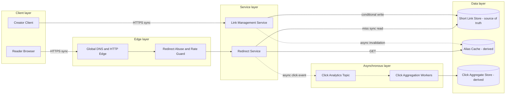

# URL Shortener

## 0. Interview classification

- **Primary challenge:** read-heavy key lookup with global uniqueness and abuse control.
- **Secondary challenges:** hot-key caching, low-latency redirects, asynchronous analytics, disable propagation.
- **Patterns exercised:** [[Caching Pattern]], [[Cache Invalidation and Stampede]], [[Rate Limiting Pattern]], [[Consistent Hashing Pattern]].
- **Expected interview level:** Senior Backend / Senior Golang; Staff signals come from narrowed guarantees and operational judgment.
- **Recommended prerequisites:** [[Caching and CDN Fundamentals]], [[Partitioning and Sharding]], [[Security Abuse and Privacy]].
- **Candidate design disclaimer:** “An interview-oriented candidate design based on public information and distributed-systems principles, not a claim about the company’s exact internal implementation.”

## 1. How to approach this problem

- **First questions:** Are custom aliases required? Redirect semantics? Geography? Scale?
- **Hidden complexity:** read-heavy key lookup with global uniqueness and abuse control; make the invariant and failure boundary visible.
- **What not to over-design:** preview pages, ads, recommendations, and a full malware-scanning implementation.
- **What the interviewer is testing:** bounded scope, ownership, complete flow, causal scaling, and explicit trade-offs.
- **Mental model:** derive authority and commit point first; add components only when a requirement or bottleneck forces them.
- **Expected deep-dive branches:** Alias generation; Cache correctness and a viral key; Global custom-alias uniqueness.

## 2. Interview timeline for this system

- **0–3:** restate Create, redirect, disable/expire, owner status, and duplicate-tolerant click analytics.; park preview pages, ads, recommendations, and a full malware-scanning implementation.
- **3–7:** clarify NFRs and calculate the dominant rate, data, and skew.
- **7–12:** state invariants, entities, APIs, keys, and source of truth.
- **12–22:** draw Version 1 and trace the critical flow.
- **22–32:** ask the interviewer to select Alias generation, Cache correctness and a viral key, Global custom-alias uniqueness.
- **32–39:** address viral alias and synchronized expiry, store fallback during cache failure, global uniqueness writer during failover and failure controls.
- **39–43:** make decisions from the trade-off table; add region/security only where relevant.
- **43–45:** summarize guarantees, relaxed state, risks, and next validation.

## 3. Requirements clarification

| Candidate question | Possible interviewer answer |
| --- | --- |
| Are custom aliases required? | Yes; generated and custom aliases, expiry, and owner disable. |
| Redirect semantics? | Use 302/307 initially for operational control; analytics is off the redirect critical path. |
| Geography? | Global reads, single-home writes initially; malicious links must be disabled quickly. |
| Scale? | Assume 100M redirects/day, 1M creates/day, and 10× read peak; these are interview assumptions. |

**Selected scope:** Create, redirect, disable/expire, owner status, and duplicate-tolerant click analytics.

**Explicit non-goals:** preview pages, ads, recommendations, and a full malware-scanning implementation.

## 4. Functional requirements

- Create a generated or custom alias with idempotent request semantics.
- Redirect an active alias and distinguish missing, expired, disabled, and backend failure.
- Disable or expire an owner link and propagate invalidation.
- Collect privacy-minimized click events asynchronously and expose aggregate stats.

## 5. Non-functional requirements

- Interview assumptions: 100M redirects/day, 1M creates/day, 10× peak, 500-byte mapping, five-year retention.
- Redirect p99 target 100 ms in-region; create p99 500 ms excluding optional scanning.
- Alias uniqueness and accepted mapping durability are strict; analytics is eventual and may be sampled.
- Global read availability; one authoritative write region initially; abuse disable converges within a bounded interval.
- Authenticate creators, authorize owner/admin actions, minimize click PII, and protect against malicious destinations.

## 6. Back-of-the-envelope estimation

> [!important] Interview assumptions
> These values size a candidate design. They are not company or production facts.

Average redirects are about 100,000,000 ÷ 86,400 ≈ 1,160/s; 10× peak is about 12k/s. Creates average about 12/s and peak about 120/s. Five years of 1M mappings/day × 500 B is about 0.9 TB raw before indexes and replicas. If 20% of aliases produce 95% of reads, cache sizing follows the hot working set, not total mappings. Hot-key and origin protection dominate bandwidth.

## 7. Core invariants

- An alias identifies at most one authoritative mapping at a time.
- A successful create is durable before response; the same idempotency key and payload returns the same alias.
- Disabled or expired state is authoritative even if cache invalidation lags; policy defines the bounded stale-redirect risk.
- Click analytics never blocks or changes redirect correctness.

## 8. Core entities

| Entity | Ownership and lifecycle |
| --- | --- |
| ShortLink | Alias identity, target, owner, status/version, expiry; Link Service owns lifecycle. |
| AliasReservation | Arbitrates custom/generated uniqueness and creation idempotency. |
| RedirectCacheEntry | Derived alias→target/status/version with TTL; disposable. |
| ClickEvent | Privacy-minimized immutable analytics input; duplicate-tolerant. |
| AbuseDecision | Versioned allow/block decision with reason and audit. |

## 9. API design

| Method | Path or RPC | Request | Response | Authentication | Idempotency | Pagination | Error behaviour |
| --- | --- | --- | --- | --- | --- | --- | --- |
| POST | /v1/links | targetUrl, customAlias?, expiresAt? | 201 alias, shortUrl, version | creator token | Idempotency-Key and payload hash | n/a | 400 invalid; 409 conflict; 429; 503 |
| GET | /{alias} | alias | 302/307 Location or typed error | public plus risk controls | read-only | n/a | 404 missing; 410 expired/disabled; 503 |
| DELETE | /v1/links/{alias} | expectedVersion | 202/204 status | owner/admin | Idempotency-Key | n/a | 403; 404; 409 |
| GET | /v1/links/{alias}/stats | time range | aggregates and freshness | owner | read-only | cursor by bucket | 404; 429; partial |

## 10. Data model

| Table/store | Primary key | Partition key | Important indexes | Source of truth | Retention | Consistency | Access pattern |
| --- | --- | --- | --- | --- | --- | --- | --- |
| short_links | alias | hash(alias) | owner_id; owner_id+created_at | authoritative | five years/policy | strong create/disable | redirect by alias; owner list |
| idempotency_keys | owner_id+key | owner_id | expiry | authoritative | retry/audit horizon | strong | dedupe create |
| click_events | event_id | hash(alias) | alias+time bucket | event stream | short raw | at-least-once | analytics |
| link_stats | alias+time bucket | hash(alias) | time range | derived | policy | eventual | owner dashboard |

## 11. First working design

### HLD: URL Shortener — candidate design



### ASCII fallback

```text
Creator --HTTPS--> Link Management --conditional write--> Short Link Store [truth]
Reader --HTTPS--> Global Edge --> Redirect Service --> Alias Cache [derived]
                                               +--miss--> Short Link Store
Redirect Service --async--> Click Analytics Topic --> Aggregator --> Stats [derived]
```

**Legend:** solid arrow = synchronous request/response or direct state access; dashed arrow = asynchronous event/job. “Source of truth” owns authoritative state; “derived” can rebuild.

## 12. Complete critical flow

1. Creator calls Link Management; it authenticates, validates scheme and length, and rate-limits before costly checks.
2. Service reserves a custom alias or allocates a random/base62 alias with conditional insert; idempotency row and mapping commit together.
3. Reader reaches Redirect Service. A cache hit returns active target; a miss reads Short Link Store and populates a versioned TTL entry.
4. Redirect returns 302/307, then emits event ID, alias, coarse region/time, and approved referrer fields asynchronously.
5. Aggregator deduplicates and writes stats. Disable commits source version, then invalidates cache asynchronously.

## 13. Evolve the design under scale

### Version 1

One Link/Redirect service and PostgreSQL uniqueness, without cache; this proves create, redirect, and disable.

### Version 2

Add redirect cache, miss coalescing, async click topic, and abuse guard after read QPS/hot aliases become the first bottleneck.

### Version 3

Hash-partition mappings, add regional caches/edge and replicated reads, but retain home-region alias writes and fenced failover for uniqueness.

**Partition and routing:** Hash alias for mappings and cache routing. This distributes ordinary aliases but a viral alias needs replicated caching and request coalescing. Analytics partitions by alias/time; owner lists use an owner+created-at index.

## 14. Deep dive

### 1. Alias generation

**Problem and alternatives:** Alternatives are auto-increment+base62, random high-entropy ID with collision retry, and custom alias.

**Selected design and detailed flow:** Select a sufficiently long random ID plus conditional insert to decentralize allocation; custom aliases use the same unique key. Generate, conditionally insert, and retry a rare collision.

**Trade-offs and failure handling:** Random aliases are longer and require collision monitoring. Sequential ranges win when compact aliases matter and enumeration risk is controlled.

### 2. Cache correctness and a viral key

**Problem and alternatives:** Alternatives are cache-aside, edge KV, and direct database replicas.

**Selected design and detailed flow:** Select regional cache-aside with version, TTL+jitter, request coalescing, hot-key replication, and bounded source fallback. Disable writes truth before invalidating.

**Trade-offs and failure handling:** Long TTL helps hit rate but delays disable. Cache outage uses admission-controlled fallback; analytics sheds before redirects.

### 3. Global custom-alias uniqueness

**Problem and alternatives:** Alternatives are active-active last-writer-wins, home-region conditional write, and disjoint namespaces.

**Selected design and detailed flow:** Select one write authority initially. Global readers use caches/replicas. Failover needs a fenced epoch and known replication point.

**Trade-offs and failure handling:** Cross-region create latency is acceptable at low write rate. During uncertain partition, creation pauses while safe redirects continue.

## 15. Detailed success flow

1. Owner c-7 sends idempotency key create-91 for target https://example.test/a. Conditional insert wins alias k9Qa2 and returns version 1.
2. First redirect misses regional cache, reads active version 1, fills with jittered TTL, returns 302, and emits click e-44 after response.
3. Later reads hit cache. Aggregator folds e-44 once. Disable at expected version 1 commits DISABLED version 2 and invalidates version 1.

## 16. Detailed failure flows

### Failure 1 — Cache outage

- **Detection:** Cache latency/error and fallback concurrency.
- **Immediate behaviour:** Use a short cache timeout, bounded replica fallback, and shed click/stat work first.
- **Retry policy:** One safe read retry only within deadline.
- **Idempotency/deduplication:** Cache is derived; click event IDs tolerate duplicate.
- **Recovery:** Warm gradually with coalescing/admission.
- **User-visible outcome:** Redirects slow or receive 503 rather than collapse truth.
- **Observability:** cache errors, fallback QPS, store saturation, p99.

### Failure 2 — Alias race

- **Detection:** Unique constraint conflict.
- **Immediate behaviour:** Winner commits; loser gets original idempotent result or 409.
- **Retry policy:** Same idempotency key/payload only; generated collision chooses another ID.
- **Idempotency/deduplication:** Unique alias and idempotency constraints.
- **Recovery:** No repair for legitimate conflict; audit suspicious reuse.
- **User-visible outcome:** Deterministic 409 or original result.
- **Observability:** conflict, collision, idempotency reuse.

### Failure 3 — Lost disable invalidation

- **Detection:** Version/stale-age sampling or disabled-link access.
- **Immediate behaviour:** Truth remains disabled; TTL/version bounds exposure; urgent policy may recheck truth.
- **Retry policy:** Retry invalidation with backoff; event keyed by alias+version.
- **Idempotency/deduplication:** Cache applies only newer versions.
- **Recovery:** Reconcile recent status changes against cache generation.
- **User-visible outcome:** Possible stale redirect only within declared bound.
- **Observability:** disable-to-enforcement latency and invalidation lag.

### Failure 4 — Viral hot alias

- **Detection:** Per-key QPS and cache-node saturation.
- **Immediate behaviour:** Replicate at edge/local cache, coalesce misses, protect origin, sample analytics.
- **Retry policy:** No blind retry.
- **Idempotency/deduplication:** Reads are side-effect free; event IDs dedupe sampled analytics.
- **Recovery:** Rebalance/replicate hot key and drain analytics.
- **User-visible outcome:** Redirect preserved; detailed analytics may lag.
- **Observability:** hot-key QPS, node skew, origin miss.

## 17. Bottlenecks and scalability

- viral alias and synchronized expiry
- store fallback during cache failure
- global uniqueness writer during failover
- abusive creation/scanner cost
- click analytics cardinality

**Partitioning unit and routing strategy:** Hash alias for mappings and cache routing. This distributes ordinary aliases but a viral alias needs replicated caching and request coalescing. Analytics partitions by alias/time; owner lists use an owner+created-at index.

## 18. Reliability and recovery

- End-to-end redirect deadline with shorter cache/store budgets; no unsafe mutation retry.
- Multi-AZ truth, read replicas, point-in-time backup, restore test, and fenced home-region failover.
- Cache is disposable; stale serve only for active non-security-critical links within policy.
- Click queue is bounded and analytics degrades before redirect.
- Reconciliation checks disable propagation and analytics gaps; failback is deliberate.

## 19. Observability

- **Key metrics:** redirect QPS and p50/p99, typed outcomes, create conflict/collision, cache hit/load, hot-key skew, invalidation latency, click lag.
- **Logs:** structured alias hash, safe owner ID, version, decision, and error class; never log sensitive target tokens.
- **Traces:** create and cache-miss/store paths; sampled hot-hit paths.
- **SLI/SLO candidates:** correct redirect latency for active aliases, durable create success, disable enforcement latency.
- **Dashboards:** redirect SLO, cache/origin, hot aliases, create/abuse, analytics freshness.
- **Alerts:** burn-rate redirect failures, fallback saturation, disable lag, single-key overload.
- **Business-level signals:** active links, disables, malicious blocks, redirects by typed outcome.

## 20. Security and abuse

- Authenticate creators and authorize alias ownership/admin disable.
- Permit safe URL schemes; scanner egress blocks private/link-local networks to prevent SSRF.
- Rate-limit creation and scraping; provide reporting/reputation controls.
- Minimize click IP/referrer, encrypt data, audit operator access, and define retention.
- Cache keys isolate tenant/private variants; never log signed/private destination data.

## 21. Explicit trade-off table

| Decision | Selected option | Alternative | Why selected | Cost or weakness | When alternative wins |
| --- | --- | --- | --- | --- | --- |
| Redirect status | 302/307 | 301 | operational control | less browser caching | immutable permanent links |
| Alias ID | random high-entropy | sequential base62 | decentralized and less enumerable | longer/collision handling | compact controlled namespace |
| Write topology | single-home | active-active | simple strict uniqueness | cross-region create latency | disjoint namespaces/conflict-safe design |
| Read path | cache-aside | DB replicas only | hot read latency | staleness/invalidation | small scale |
| TTL | short+jitter | long | bounds disable staleness | more misses | immutable versioned links |
| Analytics | async at-least-once | sync counter | redirect unaffected | lag/duplicates | count correctness blocks response |
| Store | PostgreSQL then shard | KV store | constraints/owner queries | future sharding | huge exact-key volume |
| Disable | truth then invalidation | cache mutation | one authority/audit | bounded propagation | cache-only never for truth |
| Global read | regional cache/replica | leader read | latency/availability | may be stale | immediate disable guarantee |

## 22. Technology choices

| Technology | Role | Why it fits | Viable alternative | Operational cost | When choice changes |
| --- | --- | --- | --- | --- | --- |
| PostgreSQL | mappings, uniqueness, idempotency | strong constraints and owner queries | DynamoDB/Cassandra | connections/sharding | exact-key global scale |
| Redis | regional alias cache | low latency TTL/hot-key tools | Memcached/edge KV | memory/eviction/cluster | globally replicated immutable data |
| Kafka/Kinesis | click/invalidation stream | durable partitioned async | SQS/Pub/Sub | broker lag/ops | simple work queue |
| OpenSearch | optional abuse/admin search | derived flexible queries | PostgreSQL indexes | index operations | modest query scope |
| CDN/edge | TLS, proximity, safe caching | latency/origin protection | regional load balancers | purge/routing cost | limited geography |

## 23. Interviewer follow-up questions

| Likely follow-up | Concise strong answer | Diagram change | Trade-off |
| --- | --- | --- | --- |
| How many characters? | Choose entropy from lifetime creates and collision probability; conditional insert is final arbiter. | Annotate allocator. | compactness vs collision/enumeration |
| What if viral? | Replicate/cache/coalesce that key; ordinary resharding does not split one key. | Add hot edge cache. | freshness vs capacity |
| Disable malicious link fast? | Commit block, versioned invalidation/purge, short TTL, optionally truth-check risky hits. | Add abuse/purge arrow. | hit ratio vs safety |
| Multi-region create? | Home authority or disjoint namespace; never last-writer-wins same alias. | Add home epoch. | availability vs uniqueness |

## 24. What a weak candidate does

- Draws Redis and database but cannot name source of truth, cache key, or disable flow.
- Uses IDs without collision/enumeration discussion.
- Places analytics synchronously on redirect.
- Says consistent hashing fixes a viral alias.
- Ignores malicious destinations and typed errors.

## 25. What a strong senior candidate demonstrates

- Narrows scope to create, redirect, and disable; keeps analytics derived.
- Makes uniqueness and disable authority explicit.
- Evolves from database-only to cache after quantified pressure.
- Handles one hot key separately from fleet balance.
- Protects redirect availability and abuse enforcement.

## 26. Five-minute revision

- **Requirements:** create/custom alias, redirect, disable/expiry, async stats.
- **Critical invariant:** one alias maps to one authoritative target; analytics never blocks redirect.
- **Core HLD:** edge→Redirect→versioned cache→Link Store; create uses conditional write; clicks async.
- **Most important data model:** short_links(alias PK,status,version,target,owner,expiry).
- **Critical flow:** cache/miss truth→typed redirect→async click.
- **Three bottlenecks:** viral key; cache outage fallback; global uniqueness.
- **Three trade-offs:** 302 vs 301; random vs sequential; home writes vs active-active.
- **Three failures:** cache outage; alias race; lost invalidation.
- **Likely deep dive:** cache correctness and alias allocation.

## 27. Blank-page practice prompt

Design a globally accessible URL-shortening service supporting generated/custom aliases, redirects, expiry/disable, and basic click statistics. Derive it from requirements.

## 28. Adversarial variations

- Redirect traffic grows 100× and one alias has 30% of reads.
- The authoritative region fails during custom-alias creation.
- Security requires malicious-link disable within five seconds.
- Analytics cost must fall 70% without harming redirects.
- Links may be private with expiring access.
- Custom aliases must be globally case-insensitive.

## 29. Practice and re-test history

- [ ] Untimed reconstruction — date/result:
- [ ] 45-minute mock — score/date:
- [ ] Follow-up round — variation/result:
- [ ] One-day review — date/result:
- [ ] Three-day review — date/result:
- [ ] Seven-day review — date/result:
- [ ] Fourteen-day review — date/result:

Personal readiness remains `not-started` until evidence is recorded in [[System Design Practice Tracker]].

## 30. Related internal notes and verified external references

**Internal:** [[Caching Pattern]] · [[Cache Invalidation and Stampede]] · [[Partitioning and Sharding]] · [[Rate Limiting Pattern]] · [[Security Abuse and Privacy]]

**Verified external references (checked 2026-07-17):**

- [RFC 9110 HTTP semantics](https://www.rfc-editor.org/rfc/rfc9110) — redirect and status semantics.
- [Redis client-side caching](https://redis.io/docs/latest/develop/reference/client-side-caching/) — cache invalidation and failure guidance.

