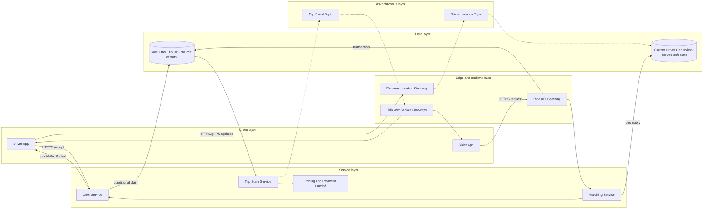

# Uber System Design

## 0. Interview classification

- **Primary challenge:** low-latency geospatial candidate search with one atomic driver assignment.
- **Secondary challenges:** high-write location ingest, offer fan-out, realtime trip state, payment handoff, and regional isolation.
- **Patterns exercised:** [[Search and Geospatial Indexes]], [[Idempotency Pattern]], [[Rate Limiting Pattern]], [[Backpressure and Load Shedding]], [[Consistent Hashing Pattern]].
- **Expected interview level:** Senior Backend / Senior Golang; Staff signals come from narrowed guarantees and operational judgment.
- **Recommended prerequisites:** [[Invariants and Critical Paths]], [[Partitioning and Sharding]], [[WebSocket Chat or Realtime System]].
- **Candidate design disclaimer:** “An interview-oriented candidate design based on public information and distributed-systems principles, not a claim about the company’s exact internal implementation.”

## 1. How to approach this problem

- **First questions:** Primary journey? Location freshness? Geography? Scale?
- **Hidden complexity:** low-latency geospatial candidate search with one atomic driver assignment; make the invariant and failure boundary visible.
- **What not to over-design:** maps rendering/route algorithms, pooled/scheduled rides, driver onboarding, fraud/ML, and a claim about Uber’s private architecture.
- **What the interviewer is testing:** bounded scope, ownership, complete flow, causal scaling, and explicit trade-offs.
- **Mental model:** derive authority and commit point first; add components only when a requirement or bottleneck forces them.
- **Expected deep-dive branches:** Nearby-driver search; Double acceptance; Stadium hotspot.

## 2. Interview timeline for this system

- **0–3:** restate Driver availability/location, estimate/request, nearby matching, offers, atomic acceptance, trip lifecycle, realtime updates, and payment handoff.; park maps rendering/route algorithms, pooled/scheduled rides, driver onboarding, fraud/ML, and a claim about Uber’s private architecture.
- **3–7:** clarify NFRs and calculate the dominant rate, data, and skew.
- **7–12:** state invariants, entities, APIs, keys, and source of truth.
- **12–22:** draw Version 1 and trace the critical flow.
- **22–32:** ask the interviewer to select Nearby-driver search, Double acceptance, Stadium hotspot.
- **32–39:** address 1.25M/s location ingest and coalescing, stadium/airport hot geo cells, candidate query and ETA dependency and failure controls.
- **39–43:** make decisions from the trade-off table; add region/security only where relevant.
- **43–45:** summarize guarantees, relaxed state, risks, and next validation.

## 3. Requirements clarification

| Candidate question | Possible interviewer answer |
| --- | --- |
| Primary journey? | A rider requests nearby eligible driver, one accepts, both track trip, then pricing/payment starts. |
| Location freshness? | Updates every few seconds; stale drivers expire. Search can be eventual, final assignment cannot. |
| Geography? | Regional/city ownership; start single region per city and discuss failover. |
| Scale? | Assume 5M active drivers updating every 4 seconds and 100k ride requests/s peak globally. |

**Selected scope:** Driver availability/location, estimate/request, nearby matching, offers, atomic acceptance, trip lifecycle, realtime updates, and payment handoff.

**Explicit non-goals:** maps rendering/route algorithms, pooled/scheduled rides, driver onboarding, fraud/ML, and a claim about Uber’s private architecture.

## 4. Functional requirements

- Ingest sequenced driver location and availability.
- Create idempotent ride request and find/rank nearby fresh eligible drivers.
- Send time-bounded offers and atomically commit one driver to one ride.
- Maintain trip state/realtime updates and trigger pricing/payment after completion.

## 5. Non-functional requirements

- Interview assumptions: 5M active drivers, 4-second updates, 100k ride requests/s peak, regional traffic skew.
- Location ingest available with bounded drop/coalescing; match p99 target below a few seconds.
- One active trip per driver and at most one accepted driver per request are strict.
- Location/ETA is eventual/soft; trip/payment state is durable and versioned.
- Regional fault isolation, location privacy/retention, abuse controls, and operator audit.

## 6. Back-of-the-envelope estimation

> [!important] Interview assumptions
> These values size a candidate design. They are not company or production facts.

Location updates average 5M/4 ≈1.25M/s before peak and protocol overhead. At 100 bytes/update, raw ingress is about 125 MB/s; retain only policy-required history and coalesce latest state. Ride requests at 100k/s may inspect 20–100 candidates, so candidate reads can reach millions/s. One stadium cell creates severe skew; average cell load is misleading.

## 7. Core invariants

- A driver has at most one active accepted trip and a ride request has at most one winning driver.
- Location sequence is monotonic per driver session; older samples do not overwrite newer current state.
- Only fresh AVAILABLE drivers are candidates; candidate search may be stale but final conditional claim rechecks authority.
- Trip state follows allowed versioned transitions; payment command is idempotent.

## 8. Core entities

| Entity | Ownership and lifecycle |
| --- | --- |
| DriverSession and Availability | Driver identity, vehicle, region, state/version, active trip. |
| LocationUpdate | Driver/session sequence, coordinates, accuracy, recorded time. |
| RideRequest | Rider, pickup/destination, product, state/version, expiry. |
| MatchAttempt and Offer | Candidate set/rank, time-bounded offer, response. |
| Trip | Winning rider/driver and authoritative state machine. |
| Fare/PaymentReference | Versioned pricing facts and payment command/result. |

## 9. API design

| Method | Path or RPC | Request | Response | Authentication | Idempotency | Pagination | Error behaviour |
| --- | --- | --- | --- | --- | --- | --- | --- |
| PUT | /v1/drivers/me/location | lat,lon,accuracy,recordedAt,sequence | 202 lastAcceptedSequence | driver device | session+sequence | n/a | 400; 409 stale; 429 |
| POST | /v1/ride-requests | pickup,destination,product | 202 requestId,estimate,state | rider | Idempotency-Key | n/a | 400; 409; 429; 503 |
| POST | /v1/offers/{id}/accept | driverSession,expectedVersion | 200 tripId or conflict | driver | Idempotency-Key | n/a | 404; 409 expired/lost |
| GET | /v1/trips/{id} | id | trip snapshot/version | rider/driver | read-only | event cursor optional | 403; 404 |
| WS | trip updates | tripId,lastVersion | state/location events | trip member | event ID/version | version cursor | 401; 409 gap→snapshot |

## 10. Data model

| Table/store | Primary key | Partition key | Important indexes | Source of truth | Retention | Consistency | Access pattern |
| --- | --- | --- | --- | --- | --- | --- | --- |
| driver_availability | driver_id | region+geo shard | state+vehicle | authoritative assignment state | active+audit | conditional/versioned | claim/filter |
| current_location | driver_id | region+cell | cell+freshness | soft current view | minutes/TTL | eventual/sequence | nearby search |
| ride_requests | request_id | region+request | rider+created,state | authoritative | policy | strong/versioned | match/status |
| offers | offer_id | request_id | driver+expiry,state | authoritative attempt | short+audit | versioned | accept |
| trips | trip_id | region+trip | driver active, rider | authoritative | policy | strong/versioned | lifecycle |
| location_stream | driver session | region+cell | sequence/time | event stream | short/policy | ordered per driver key | current/history |

## 11. First working design

### HLD: Uber System Design — candidate design



### ASCII fallback

```text
Driver updates --> Regional Location Gateway --async--> Location Topic --> Current Geo Index [soft]
Rider --> Ride API --> Ride/Offer/Trip DB [truth] --> Matching --> Geo candidates
Matching --> Offer Service --push--> Drivers --accept--> conditional driver+request claim [truth]
Trip Service --async events--> WebSocket Gateways --> Rider/Driver
Trip completion --async--> Pricing and Payment
```

**Legend:** solid arrow = synchronous request/response or direct state access; dashed arrow = asynchronous event/job. “Source of truth” owns authoritative state; “derived” can rebuild.

## 12. Complete critical flow

1. Driver sends sequenced update; gateway validates session/range/accuracy, coalesces if overloaded, publishes by driver/region, and current geo view rejects older sequence.
2. Rider creates request with stable key; Ride DB commits SEARCHING before matching begins.
3. Matching maps pickup to a spatial cell, expands neighboring cells, filters stale/busy/incompatible drivers, and ranks by ETA/policy.
4. Offer Service sends a bounded batch with expiry. Acceptance transaction conditionally claims both driver AVAILABLE and request SEARCHING; winner creates Trip.
5. Trip transitions ASSIGNED→ARRIVING→IN_PROGRESS→COMPLETED, emits realtime versions, then sends stable pricing/payment command.

## 13. Evolve the design under scale

### Version 1

One city, relational trip/request state, in-memory geohash map, sequential offers; proves invariant.

### Version 2

Partition location stream/current geo by city+cell, independent match workers, batched offers, WebSocket trip delivery, conditional database claim.

### Version 3

Regional cell shards with hot-cell subshards, regional home authority for active trip, replicated durable state, coalesced location ingest, and controlled regional failover.

**Partition and routing:** Partition durable request/trip by region+request/trip ID and current locations by region+spatial cell. Use driver ID for per-driver sequence stream. Hot cells gain subshards; matching queries bounded subshards/rings. One active trip remains under a regional owner/epoch.

## 14. Deep dive

### 1. Nearby-driver search

**Problem and alternatives:** Options are SQL geo index, Redis GEO, geohash/S2/H3-like cell map, or spatial tree.

**Selected design and detailed flow:** Use hierarchical cells in regional current-location store. Query pickup cell and expanding neighbor rings, remove stale/busy drivers, then exact distance/ETA rank. Final assignment rechecks truth.

**Trade-offs and failure handling:** Fine cells reduce candidates but increase boundary/churn; coarse cells increase filtering. Explain geohash/cell simply and link [[Search and Geospatial Indexes]].

### 2. Double acceptance

**Problem and alternatives:** Options are distributed lock, optimistic conditional transaction, single request owner.

**Selected design and detailed flow:** Use one authoritative conditional transaction/owner: request must be SEARCHING and driver AVAILABLE; winning update sets both and creates Trip. Losing accept sees OFFER_EXPIRED.

**Trade-offs and failure handling:** Candidate and offer states may be stale; only claim is strict. Database constraint/partition owner is simpler than a free-floating lock.

### 3. Stadium hotspot

**Problem and alternatives:** Options are add ordinary shards, sub-shard hot cell, regional event partition, admission/coalescing.

**Selected design and detailed flow:** Split hot cell into random/secondary shards while querying all subshards, cap candidate/offer fan-out, coalesce redundant location updates, and reserve match capacity by city.

**Trade-offs and failure handling:** Sub-sharding adds query merge and movement; a single celebrity-like cell needs special handling beyond consistent hashing.

## 15. Detailed success flow

1. Driver d-7 sequence 501 enters cell c-18 with 10-second TTL and AVAILABLE v12.
2. Rider r-2 creates request q-9; matching expands one ring, ranks d-7, sends offer o-3.
3. d-7 accepts; transaction changes q-9 SEARCHING→MATCHED and d-7 AVAILABLE→ON_TRIP, creates trip t-4. Later accepts lose. Trip events reach both clients and completion triggers payment key t-4:fare:v1.

## 16. Detailed failure flows

### Failure 1 — Accept response lost

- **Detection:** Driver retries offer acceptance.
- **Immediate behaviour:** Return stored winning trip if same offer/request; never create another.
- **Retry policy:** Same idempotency key within deadline.
- **Idempotency/deduplication:** Offer/request/driver conditional state and command ID.
- **Recovery:** Client fetches trip snapshot by offer/request.
- **User-visible outcome:** Driver sees assigned trip or precise lost/expired status.
- **Observability:** duplicate accepts, transition conflicts, unknown accepts.

### Failure 2 — Stale location

- **Detection:** TTL/recordedAt/sequence and stale-candidate ratio.
- **Immediate behaviour:** Exclude stale driver, expand search, or report no cars rather than unsafe assignment.
- **Retry policy:** Location updates are latest-state coalesced; no retry old sample.
- **Idempotency/deduplication:** Sequence rejects old update.
- **Recovery:** Fresh updates rebuild soft state; no durable repair.
- **User-visible outcome:** Longer search/no-driver, not misleading assignment.
- **Observability:** ingest lag, stale ratio, rings expanded.

### Failure 3 — Hot cell overload

- **Detection:** cell shard QPS/lag and match timeout.
- **Immediate behaviour:** Sub-shard cell, cap candidates/offers, coalesce updates, admit by city.
- **Retry policy:** Retry only within request deadline; avoid offer storm.
- **Idempotency/deduplication:** Match attempt/offer IDs.
- **Recovery:** Add dedicated capacity and drain location lag; current view refreshes.
- **User-visible outcome:** Longer match or graceful no-driver.
- **Observability:** cell skew, candidate count, offer fan-out, p99.

### Failure 4 — Region failure during active trips

- **Detection:** regional health/epoch and socket loss.
- **Immediate behaviour:** Clients reconnect to allowed standby/read snapshot; new matching may pause until authority fenced.
- **Retry policy:** No cross-region duplicate matching; idempotent trip/payment commands.
- **Idempotency/deduplication:** Trip home epoch and state version.
- **Recovery:** Promote known durable state, reconcile active trips/driver availability, fail back deliberately.
- **User-visible outcome:** Existing trips recover snapshots; new requests may temporarily fail.
- **Observability:** failover RTO, active-trip reconciliation, duplicate-claim audit.

## 17. Bottlenecks and scalability

- 1.25M/s location ingest and coalescing
- stadium/airport hot geo cells
- candidate query and ETA dependency
- offer fan-out/double-accept contention
- WebSocket connections and regional provider latency

**Partitioning unit and routing strategy:** Partition durable request/trip by region+request/trip ID and current locations by region+spatial cell. Use driver ID for per-driver sequence stream. Hot cells gain subshards; matching queries bounded subshards/rings. One active trip remains under a regional owner/epoch.

## 18. Reliability and recovery

- Location is soft and rebuilt; trip/payment state is durable, replicated, and backed up.
- Bound/coalesce location updates and candidate/offer fan-out; shed display updates before trip transitions.
- Timeout/circuit/bulkhead maps, push, and payment dependencies; expose pending state.
- WebSocket reconnect uses versioned trip snapshot plus later events.
- Regional isolation/home epochs prevent cross-region double matching; restore/failback includes active-driver reconciliation.

## 19. Observability

- **Key metrics:** location ingest/drop/lag, stale ratio, geo query/rings/candidates, match latency/success, offer accepts/conflicts, trip transitions, sockets/reconnect, payment unknown.
- **Logs:** driver/rider request/offer/trip/session IDs, cell, sequence, version; protect coordinates/PII.
- **Traces:** ride request→geo query→offers→claim and completion→payment.
- **SLI/SLO candidates:** match completion latency/success, trip transition availability, zero double assignment.
- **Dashboards:** location, matching by city/cell, offers, trips, realtime, dependencies, region.
- **Alerts:** stale ratio, hot cell, match burn, invariant conflict anomaly, active-trip failover.
- **Business-level signals:** requests, matches, no-driver, cancellations, ETA error, completed trips, payment pending.

## 20. Security and abuse

- Authenticate driver/rider devices and authorize trip resources.
- Encrypt location, minimize precision/retention, restrict support access, and prevent scraping.
- Validate impossible/out-of-order location samples and rate-limit updates/requests.
- Do not expose exact driver location before product policy permits; audit operator trip changes.
- Tokenize payment; risk/fraud controls are interfaces, not invented ML architecture.

## 21. Explicit trade-off table

| Decision | Selected option | Alternative | Why selected | Cost or weakness | When alternative wins |
| --- | --- | --- | --- | --- | --- |
| Geo index | hierarchical cell map | SQL geo only | predictable regional in-memory query | boundary/churn complexity | modest city scale |
| Location consistency | eventual soft | strong every update | ingest availability/latency | stale candidates | safety-critical exact tracking |
| Assignment | conditional transaction | distributed lock | clear invariant/fencing | DB/owner contention | single partition service |
| Offer policy | small parallel batch | sequential/all-at-once | lower rider latency bounded spam | losing offers | driver-efficiency priority |
| Cell size | adaptive/fine | fixed coarse | candidate control | more movement/neighbors | uniform sparse areas |
| Durability | trip durable/location TTL | persist every current update | cost and recovery fit | limited history | audit/analytics requirement |
| Region | city home | active-active same city | simple authority | failover pause | disjoint city ownership |
| Realtime | WebSocket+snapshot | polling | low-latency updates | connection ops | low update frequency |
| ETA | map/route enrichment after geo filter | distance only | better ranking | dependency latency/cost | coarse MVP |

## 22. Technology choices

| Technology | Role | Why it fits | Viable alternative | Operational cost | When choice changes |
| --- | --- | --- | --- | --- | --- |
| Kafka/Pulsar | location/trip streams | partitioned high throughput | Kinesis/Pub/Sub | broker ops | managed preference |
| H3/S2/geohash-like cells | candidate indexing | hierarchical neighbor search | PostGIS/Redis GEO | boundary/tuning | smaller scale |
| Redis/Aerospike/custom memory | current location view | TTL and low latency | Cassandra/PostGIS | memory/cluster | durable/complex query need |
| PostgreSQL/distributed SQL | request/offer/trip invariant | conditional transactions | KV with transactions | contention/sharding | global high scale |
| WebSocket gateways | active trip events | bidirectional realtime | managed gateway/polling | connection ops | simple low-frequency |

## 23. Interviewer follow-up questions

| Likely follow-up | Concise strong answer | Diagram change | Trade-off |
| --- | --- | --- | --- |
| How prevent two drivers? | Final conditional claim of request and driver under one owner; candidate search may be stale. | Highlight RideDB claim. | latency vs correctness |
| Stadium hotspot? | Sub-shard cell, coalesce locations, cap candidate/offer fan-out, reserve city capacity. | Split cell. | query fan-out vs capacity |
| Cross-region? | City/trip home epoch and fenced failover; do not active-active same driver without ownership. | Add regional epoch. | availability vs split brain |
| ETA versus distance? | Geo index finds candidates; bounded maps/traffic enrichment ranks ETA with circuit/fallback. | Add ETA branch. | quality vs latency/cost |

## 24. What a weak candidate does

- Claims to describe Uber’s real private architecture.
- Uses a database geo query but no location freshness or ingest sizing.
- Applies strong consistency to every location update yet not final assignment.
- Uses a distributed lock without showing driver/request state.
- Ignores hot city/cell and reconnect/recovery.

## 25. What a strong senior candidate demonstrates

- Separates soft candidate location from strict final claim.
- Quantifies location write rate and hotspot skew.
- Derives cell expansion and ETA ranking in stages.
- Defines one regional owner/epoch for active trips.
- Connects failures to user-visible match/trip/payment states.

## 26. Five-minute revision

- **Requirements:** location, request, nearby match, offer/accept, trip, payment handoff.
- **Critical invariant:** one driver and one request; monotonic location sequence; valid trip transitions.
- **Core HLD:** Location Gateway→topic→geo view; Ride DB→Match→Offer→conditional claim→Trip/WebSocket.
- **Most important data model:** driver availability, current cell/sequence, request/offer, trip version.
- **Critical flow:** ingest→query cells→rank→offer→atomic claim→trip→payment.
- **Three bottlenecks:** location ingest; hot cell; offer/realtime.
- **Three trade-offs:** eventual location/strict claim; cell size; batch offers.
- **Three failures:** lost accept response; stale location; region loss.
- **Likely deep dive:** nearby search and double acceptance.

## 27. Blank-page practice prompt

Design a ride-hailing system for driver locations, nearby matching, offers, one-driver acceptance, realtime trip lifecycle, and payment handoff.

## 28. Adversarial variations

- Location traffic grows 100×.
- A stadium creates extreme geographic skew.
- One city region fails during active trips.
- Drivers update only every 30 seconds.
- Matching must consider vehicle and accessibility constraints.
- Mapping/ETA provider becomes unreliable.

## 29. Practice and re-test history

- [ ] Untimed reconstruction — date/result:
- [ ] 45-minute mock — score/date:
- [ ] Follow-up round — variation/result:
- [ ] One-day review — date/result:
- [ ] Three-day review — date/result:
- [ ] Seven-day review — date/result:
- [ ] Fourteen-day review — date/result:

Personal readiness remains `not-started` until evidence is recorded in [[System Design Practice Tracker]].

## 30. Related internal notes and verified external references

**Internal:** [[Search and Geospatial Indexes]] · [[Partitioning and Sharding]] · [[WebSocket Chat or Realtime System]] · [[Idempotency Pattern]] · [[Multi-Region Design]]

**Verified external references (checked 2026-07-17):**

- [PostGIS manual](https://postgis.net/docs/) — official spatial-database alternative.
- [RFC 6455](https://www.rfc-editor.org/rfc/rfc6455) — realtime WebSocket transport.

