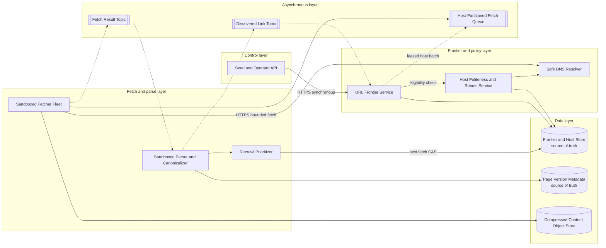

# Web Crawler System

## 0. Interview classification

- **Primary challenge:** crawl a large, changing web corpus efficiently while enforcing politeness, deduplicating work, and preventing untrusted content from harming the platform.
- **Secondary challenges:** URL canonicalization, frontier scheduling, DNS/robots handling, content deduplication, change detection, priority, and recrawl policy.
- **Patterns exercised:** [[Queues Streams and Pub Sub]], [[Rate Limiting Pattern]], [[Deduplication and Inbox Pattern]], [[Backpressure and Load Shedding]], [[Consistent Hashing Pattern]].
- **Expected interview level:** Senior Backend / Senior Golang; Staff signals come from narrowed guarantees and operational judgment.
- **Recommended prerequisites:** [[Partitioning and Sharding]], [[Blob Object and File Storage]], [[Search and Geospatial Indexes]], [[Security Abuse and Privacy]], [[Observability and SLOs]].
- **Candidate design disclaimer:** “An interview-oriented candidate design based on public information and distributed-systems principles, not a claim about the company’s exact internal implementation.”

## 1. How to approach this problem

- **First questions:** What corpus and scale? What is the output? How fresh must pages be? Must robots.txt and host politeness be honored? Do we render JavaScript?
- **Hidden complexity:** crawl a large, changing web corpus efficiently while enforcing politeness, deduplicating work, and preventing untrusted content from harming the platform; make the invariant and failure boundary visible.
- **What not to over-design:** a search ranking algorithm, full browser rendering for every page, bypassing access controls, private-site crawling, and a complete internet-scale company architecture
- **What the interviewer is testing:** bounded scope, ownership, complete flow, causal scaling, and explicit trade-offs.
- **Mental model:** derive authority and commit point first; add components only when a requirement or bottleneck forces them.
- **Expected deep-dive branches:** Polite frontier scheduling; URL and content deduplication; Safe fetching of hostile content.

## 2. Interview timeline for this system

- **0–3:** restate discover, prioritize, fetch, validate, store, parse, deduplicate, and reschedule public web pages politely; park a search ranking algorithm, full browser rendering for every page, bypassing access controls, private-site crawling, and a complete internet-scale company architecture
- **3–7:** clarify NFRs and calculate the dominant rate, data, and skew.
- **7–12:** state invariants, entities, APIs, keys, and source of truth.
- **12–22:** draw Version 1 and trace the critical flow.
- **22–32:** ask the interviewer to select Polite frontier scheduling, URL and content deduplication, Safe fetching of hostile content.
- **32–39:** address Compute: HTML parsing and optional rendering; isolate renderer and prioritize by value., Storage: raw content dominates; compress, content-address, lifecycle, and bound retention., Network: egress bandwidth and slow connections; streaming limits and regional egress pools. and failure controls.
- **39–43:** make decisions from the trade-off table; add region/security only where relevant.
- **43–45:** summarize guarantees, relaxed state, risks, and next validation.

## 3. Requirements clarification

| Candidate question | Possible interviewer answer |
| --- | --- |
| What corpus and scale? | Public HTTP(S) pages; one billion fetches/day at steady state. |
| What is the output? | Durable raw responses plus normalized metadata and discovered links for downstream indexing. |
| How fresh must pages be? | Priority-dependent: minutes for selected sources, days or weeks for stable pages. |
| Must robots.txt and host politeness be honored? | Yes; robots rules and per-host rate/concurrency are hard constraints. |
| Do we render JavaScript? | Not initially; rendering is an optional expensive tier. |

**Selected scope:** discover, prioritize, fetch, validate, store, parse, deduplicate, and reschedule public web pages politely

**Explicit non-goals:** a search ranking algorithm, full browser rendering for every page, bypassing access controls, private-site crawling, and a complete internet-scale company architecture

## 4. Functional requirements

- Accept seed URLs and discovered links.
- Canonicalize and deduplicate URL scheduling.
- Fetch and cache robots.txt; enforce host rules and crawl delay.
- Rate-limit and schedule requests per host.
- Store raw content and fetch metadata durably.
- Extract normalized links and content fingerprints.
- Choose recrawl time from priority, change history, and response hints.

## 5. Non-functional requirements

- Interview assumption: 1B fetch attempts/day and 4× peak.
- No host exceeds configured concurrency or request rate.
- Raw successful responses are durable; frontier work is recoverable.
- At-least-once scheduling with idempotent URL/version processing.
- Strict egress, parser sandbox, size, and scheme controls.
- Multi-zone regional execution; optional regional egress pools, not active-active frontier ownership initially.

## 6. Back-of-the-envelope estimation

> [!important] Interview assumptions
> These values size a candidate design. They are not company or production facts.

1B fetches/day is about 11,600/s average and 46,300/s peak. At a 200 KB average successful response and 70% success, raw ingress is about 140 TB/day before compression; 30-day raw retention is roughly 4.2 PB, so compression, content-addressing, and lifecycle tiers are mandatory. At 500 ms mean fetch latency, peak requires about 23k in-flight connections; provision 50k for tail latency. A 300-byte frontier record for 5B known URLs is 1.5 TB before indexes. Partition at least thousands of host buckets because host politeness, not global throughput, is the scheduling unit.

## 7. Core invariants

- Robots policy and host-level rate/concurrency are checked before every network fetch.
- A URL has one canonical identity under a versioned normalization policy; original URL remains auditable.
- At-least-once frontier delivery may refetch, but the same fetch result/event does not create duplicate stored versions.
- Untrusted response bytes never execute in privileged crawler or parser context.
- A response larger than the configured limit is stopped and recorded.
- Raw content is addressed by checksum so identical bytes need not be stored repeatedly.
- Recrawl priority cannot starve mandatory robots refresh or retry-delay rules.

## 8. Core entities

| Entity | Ownership and lifecycle |
| --- | --- |
| CanonicalURL | Frontier owns normalized URL ID, original forms, host key, priority, next-fetch time, and crawl state. |
| HostPolicy | Politeness service owns robots rules, expiry, rate, concurrency, DNS/IP risk, and last request. |
| FetchAttempt | Fetcher owns attempt ID, timing, status, redirects, content metadata, and bounded error. |
| ContentBlob | Object store owns immutable compressed bytes by checksum and retention class. |
| PageVersion | Metadata service owns URL-to-content checksum, headers, fetch time, fingerprint, and change features. |
| DiscoveredLink | Parser emits source URL, normalized target, relation, and discovery time. |

## 9. API design

| Method | Path or RPC | Request | Response | Authentication | Idempotency | Pagination | Error behaviour |
| --- | --- | --- | --- | --- | --- | --- | --- |
| POST | /v1/seeds | URLs, priority, scope, request_id | accepted/rejected counts | operator/service token | request_id required | N/A | 400 schemes; 413 batch; 429 quota |
| GET | /v1/urls/{url_id} | url_id | crawl state, last fetch, next fetch, latest version | operator role | N/A | N/A | 404 unknown |
| POST | Frontier.ClaimHostBatch | worker_region, capacity | host token, URLs, lease | mTLS worker | claim_id | N/A | empty if no eligible host; 503 |
| POST | Fetch.Result | attempt, host token, metadata, blob checksum | accepted, next action | mTLS worker | attempt_id | N/A | 409 stale lease; 422 policy violation |
| GET | /v1/hosts | filter, cursor | host policy summaries, next_cursor | operator role | N/A | Opaque keyset cursor | 403; 400 cursor |

## 10. Data model

| Table/store | Primary key | Partition key | Important indexes | Source of truth | Retention | Consistency | Access pattern |
| --- | --- | --- | --- | --- | --- | --- | --- |
| URL frontier store | url_id | hash(host_key) | next_fetch_time + priority within host shard | Frontier | Known-corpus lifetime | conditional schedule version | eligible URL selection |
| Host policy store | host_key | hash(host_key) | next_allowed_at; robots_expiry | Politeness service | Host lifetime | strong per-host lease/rate update | admission before fetch |
| Fetch attempt log | attempt_id | hash(url_id) | url_id + fetched_at; status | Fetcher metadata service | 90 days hot; archive longer | append-only idempotent | debug and recrawl features |
| Page version store | url_id + fetched_at | hash(url_id) | checksum; latest pointer | Metadata service | Policy-defined | per-URL ordered latest update | change history and downstream index |
| Content object store | sha256 checksum | checksum prefix | MIME/size metadata | Content storage | 30 days hot then lifecycle/archive | immutable read-after-write | raw response retrieval |
| Discovered-link topic | source_url_id + parse_version | hash(target host) | event ID | Parser pipeline | 7-day replay | at-least-once, deduped at frontier | URL discovery |

## 11. First working design

### HLD: Web Crawler System — candidate design



### ASCII fallback

```text
[Seeds] --HTTPS--> [Frontier] --> [Frontier/Host Store: source of truth]
                         <--> [Robots + Politeness] <--> [Safe DNS]
                                |
                                +--async host batch--> [Fetch Queue] --> [Sandboxed Fetchers] --HTTP(S)--> Web
                                                                              |--> [Content Object Store]
                                                                              +--async--> [Fetch Results]
                                                                                           |
                                                                                     [Parser] --> [Page Metadata]
                                                                                           +--links--> [Frontier]
                                                                                           +--change--> [Recrawl]
```

**Legend:** solid arrow = synchronous request/response or direct state access; dashed arrow = asynchronous event/job. “Source of truth” owns authoritative state; “derived” can rebuild.

## 12. Complete critical flow

1. A seed URL enters over HTTPS; Frontier canonicalizes scheme/host/path under policy version, rejects unsafe schemes, hashes canonical URL, and upserts one record.
2. Frontier groups eligible URLs by host; Politeness Service reads cached robots policy, resolves DNS safely, and atomically reserves host concurrency plus next-allowed time.
3. A fetcher claims a host batch with a lease and receives an allowed URL, byte/time limit, redirect limit, and policy token.
4. Fetcher performs bounded HTTP(S), revalidates every redirect target against DNS/egress policy, streams bytes through checksum/compression to object storage, and never executes page code.
5. Fetcher emits result metadata asynchronously; Parser validates MIME, extracts text/links in a sandbox, canonicalizes targets, and writes an idempotent PageVersion.
6. Discovered-link events are partitioned by target host; Frontier deduplicates/upserts them and assigns initial priority.
7. Recrawl Prioritizer compares checksum/change history, cache headers, errors, and importance, then conditionally sets next_fetch_time.

## 13. Evolve the design under scale

### Version 1

One database frontier, FIFO queue, fetch workers, object storage, and parser workers handle a bounded site set; a per-host last-fetch timestamp enforces politeness.

### Version 2

Global FIFO lets large hosts dominate and database next-time scans contend. Partition by host, keep a durable host-ready heap/index, batch URLs per host, and separate fetch from parse via streams.

### Version 3

Use thousands of logical host shards, zone-separated frontier replicas, content-addressed blobs, priority classes, change-aware recrawl, isolated renderer tier, regional egress pools, and feedback admission based on parser/storage lag.

**Partition and routing:** Hash normalized host key to logical frontier shards because politeness and scheduling serialize at host scope. Within each host, order URLs by priority and due time. Page metadata may hash by URL ID; discovered links route by target host so their upsert reaches the owning frontier shard.

## 14. Deep dive

### 1. Polite frontier scheduling

**Problem and alternatives:** Naive global FIFO can hammer one host or let it occupy all workers. Alternatives include per-URL queue, per-host queues, or a two-level ready-host scheduler.

**Selected design and detailed flow:** Maintain a durable host record with next_allowed_at, in_flight, and policy. A shard scheduler selects an eligible host, leases a bounded URL batch, advances its token bucket, then requeues the host at its next eligible time.

**Trade-offs and failure handling:** Two-level scheduling costs state and fairness logic. A worker crash releases capacity on lease expiry; fencing prevents a stale batch from decrementing or advancing current host state.

### 2. URL and content deduplication

**Problem and alternatives:** Equivalent URLs and mirrored content waste crawl/storage. Alternatives include exact canonical hashes, Bloom filters, and similarity fingerprints.

**Selected design and detailed flow:** Apply versioned canonicalization before frontier upsert; exact URL ID gives authoritative dedupe. Hash response bytes for content-addressing and store a SimHash-like fingerprint only as a near-duplicate hint for downstream indexing.

**Trade-offs and failure handling:** Canonicalization can merge distinct resources, so preserve original URL and policy version. Bloom filters are only a prefilter; false positives must not permanently suppress authoritative upsert.

### 3. Safe fetching of hostile content

**Problem and alternatives:** Crawler follows attacker-controlled redirects, DNS, content lengths, and parsers. Alternatives are trusting network libraries or strict sandbox and egress mediation.

**Selected design and detailed flow:** Resolve through a controlled resolver, block private/link-local ranges, pin validation for each redirect, cap redirects/time/bytes/decompression ratio, isolate fetcher/parser identities, and store bytes without execution.

**Trade-offs and failure handling:** Controls add latency and false rejects. DNS rebinding is addressed by validating the connected IP; parser crashes quarantine only that object and do not block a partition.

## 15. Detailed success flow

1. At 09:00, seed https://example.org/a canonicalizes to URL u-9 and host h-3; Frontier stores it due now.
2. Host policy cache has unexpired robots rule allowing /a and a 1 request/second policy; scheduler leases u-9 as attempt f-88 with host token 501.
3. Fetcher resolves a public IP, connects over HTTPS, receives 200 and 120 KB, computes checksum c-77, and stores compressed blob c-77.
4. Fetch result f-88 reaches Parser; it writes PageVersion u-9/09:00 pointing to c-77 and extracts 42 links.
5. Frontier upserts 37 unique allowed canonical targets; duplicates only update discovery metadata.
6. Recrawl sees the page changed since last checksum and schedules it for six hours rather than the stable-page default of seven days.

## 16. Detailed failure flows

### Failure 1 — Host times out repeatedly

- **Detection:** Connect/read timeout rate and host failure score increase.
- **Immediate behaviour:** Release worker, decrement host in-flight with current token, and delay only that host.
- **Retry policy:** Capped exponential backoff with jitter and a host-level retry budget; honor Retry-After.
- **Idempotency/deduplication:** Attempt ID prevents duplicate result processing.
- **Recovery:** After threshold, circuit-break host for a cooling interval; later probe one URL.
- **User-visible outcome:** Page freshness degrades and status records timeout; other hosts continue.
- **Observability:** timeout by host/ASN, breaker state, retry budget, freshness lag.

### Failure 2 — Duplicate frontier/event delivery

- **Detection:** Conditional upsert sees existing URL/version or attempt ID.
- **Immediate behaviour:** Treat duplicate as success without scheduling a second concurrent fetch.
- **Retry policy:** Transport may redeliver; processing retry is bounded.
- **Idempotency/deduplication:** Canonical URL ID and attempt inbox make operations idempotent.
- **Recovery:** Existing schedule remains; discovery metadata may merge monotonically.
- **User-visible outcome:** No duplicate visible page version.
- **Observability:** dedupe hits, canonical collisions, inbox size, duplicate fetch sampled rate.

### Failure 3 — Parser hits a decompression bomb or crash

- **Detection:** Byte/decompression limits or sandbox termination fires.
- **Immediate behaviour:** Stop parsing, quarantine content metadata, and acknowledge event after durable failure record.
- **Retry policy:** Retry only known transient parser failure and cap attempts.
- **Idempotency/deduplication:** Parse key checksum plus parser_version prevents duplicate outputs.
- **Recovery:** Update parser/signature, then replay quarantined checksum if safe.
- **User-visible outcome:** Page is fetched but not indexed; crawl continues.
- **Observability:** quarantine count, parser crash rate, expansion-ratio rejects, event lag.

### Failure 4 — Frontier shard falls behind

- **Detection:** Eligible-host age and queue lag rise only for a shard.
- **Immediate behaviour:** Stop adding low-priority discoveries to that shard and prioritize overdue/high-value hosts.
- **Retry policy:** No immediate retry storm; rebalance shard lease after health threshold.
- **Idempotency/deduplication:** URL upsert remains idempotent across new owner.
- **Recovery:** Split hot host shard or add owner capacity; replay link topic.
- **User-visible outcome:** Affected pages become stale, not lost.
- **Observability:** per-shard due age, discovery admission drops, owner churn, host skew.

## 17. Bottlenecks and scalability

- Compute: HTML parsing and optional rendering; isolate renderer and prioritize by value.
- Storage: raw content dominates; compress, content-address, lifecycle, and bound retention.
- Network: egress bandwidth and slow connections; streaming limits and regional egress pools.
- Hot partitions: huge hosts and link farms; host-specific caps and subqueues preserve global fairness while not violating host policy.
- Skew: popular domains have many URLs but cannot consume unlimited concurrency.
- Queue lag: separate fetch and parse queues; feedback admission when downstream falls behind.
- Large objects: stop at declared limits and defend decompression ratios.
- DNS/connection concentration: cache safely but respect TTL and revalidate security policy.

**Partitioning unit and routing strategy:** Hash normalized host key to logical frontier shards because politeness and scheduling serialize at host scope. Within each host, order URLs by priority and due time. Page metadata may hash by URL ID; discovered links route by target host so their upsert reaches the owning frontier shard.

## 18. Reliability and recovery

- Durably record frontier eligibility before dispatch and make queue rebuildable.
- Use bounded fetch deadlines, redirect count, bytes, and retry budgets.
- Lease host work with fencing so stale workers cannot corrupt concurrency state.
- Replicate frontier metadata across zones; object storage provides durable blobs.
- Bulkhead hosts, priority tiers, parser types, and renderer pools.
- Gracefully stop low-priority discovery/recrawl when storage or parsing is degraded.
- After recovery, reconcile expired host leases and replay result/link streams.

## 19. Observability

- **Key metrics:** fetch rate/status, bytes, p50/p99 latency, frontier eligible age, host concurrency, robots denies, parser lag, dedupe, freshness by class.
- **Logs:** URL ID, sanitized host, attempt, redirect chain hashes, policy decision, sizes, error reason; avoid sensitive query values.
- **Traces:** frontier claim through DNS, fetch, object write, parse, link upsert, recrawl decision.
- **SLI/SLO candidates:** no host exceeds policy; 99% priority pages fetched within freshness target; accepted results durably recorded.
- **Dashboards:** corpus/freshness, per-shard lag, host error map, egress/storage, parser quarantine.
- **Alerts:** politeness violation immediate page; burn-rate freshness alerts; object-store or frontier authority page.
- **Business-level signals:** useful changed pages per byte/fetch, corpus coverage, duplicate bandwidth avoided.

## 20. Security and abuse

- Allow only public HTTP(S); block private, link-local, metadata, file, and unsupported schemes.
- Revalidate DNS and connected IP on every redirect to prevent server-side request forgery and rebinding.
- Sandbox fetchers/parsers; separate network and storage identities with least privilege.
- Cap response bytes, header size, redirects, time, decompression ratio, and parser resources.
- Honor robots.txt and policy; identify crawler where required.
- Treat URL/query/content as untrusted and potentially sensitive; minimize logs and retention.

## 21. Explicit trade-off table

| Decision | Selected option | Alternative | Why selected | Cost or weakness | When alternative wins |
| --- | --- | --- | --- | --- | --- |
| Frontier key | Canonical URL hash | Raw URL | Reduces duplicate work | Canonicalization mistakes can merge resources | Every raw form must be preserved distinctly |
| Scheduling unit | Host | URL | Natural politeness/fairness boundary | Large-host internal queue complexity | Small trusted corpus |
| Delivery | At-least-once | Exactly-once fetch | Recoverable and practical | Occasional duplicate network fetch | Single transactional fetch target |
| Raw storage | Content-addressed object store | Inline database blobs | Cheap durable large-object storage and dedupe | Metadata/object two-step lifecycle | Tiny short-lived responses |
| Queueing | Two-level host scheduler | Global FIFO | Enforces per-host limits | More state | One host or homogeneous workload |
| Recrawl | Change-aware priority | Fixed interval | Spends bandwidth on changing pages | Model/tuning complexity | Uniform freshness requirement |
| JavaScript | Separate selective renderer tier | Render every page | Controls cost and attack surface | Misses JS-only pages initially | Small high-value corpus |
| Robots cache | TTL with forced refresh rules | Fetch every request | Reduces load and latency | Temporarily stale policy | Policy changes must apply immediately |
| Regional model | Regional workers, one frontier owner | Active-active URL writes | Simpler dedupe and ordering | Cross-region dispatch latency | Regional autonomy is mandatory |
| Near-duplicate | Fingerprint as hint | Treat fingerprint as authority | Avoids false-positive suppression | Downstream still handles duplicates | Lossy corpus reduction is acceptable |

## 22. Technology choices

| Technology | Role | Why it fits | Viable alternative | Operational cost | When choice changes |
| --- | --- | --- | --- | --- | --- |
| PostgreSQL/Cassandra | Frontier and metadata options | Ordered due index or large partitioned writes | DynamoDB | Schema/partition operations | Access pattern and managed-service preference change |
| Kafka | Fetch results and discovered links | Partitioning and replay | SQS/Kinesis | Cluster operations | Managed queue semantics suffice |
| S3 | Compressed content blobs | Durability, lifecycle, checksum | GCS | Storage/egress governance | Cloud changes |
| Kubernetes | Isolated fetcher/parser pools | Scheduling and identities | VM pools | Cluster operations | Hard isolation uses dedicated VMs |
| OpenTelemetry | Cross-stage telemetry | Async span links and standard signals | Vendor SDK | Cardinality and instrumentation | Single vendor |
| Safe DNS proxy | Controlled resolution and egress | Central security enforcement | Library-only validation | Critical service dependency | Trusted closed corpus |

## 23. Interviewer follow-up questions

| Likely follow-up | Concise strong answer | Diagram change | Trade-off |
| --- | --- | --- | --- |
| How do you avoid crawling one host too fast? | Host is scheduling key; atomically lease concurrency and next-allowed time before dispatch. | Highlight Host Policy store. | Throughput versus politeness. |
| How do you deduplicate URLs? | Versioned canonical URL hash is authority; Bloom filter only avoids unnecessary lookups. | Add canonicalizer/Bloom prefilter if useful. | CPU/lookup cost versus false positives. |
| What if a page changes every minute? | Priority and change history may shorten recrawl, bounded by host budget and global value. | Adjust recrawl arrow. | Freshness versus bandwidth/fairness. |
| How do you handle region failure? | Promote a replicated frontier owner after fencing, expire leases, and route fetchers; blobs already replicate by policy. | Add DR control plane. | RTO versus split-brain. |

## 24. What a weak candidate does

- Uses a global FIFO queue and says workers will rate-limit themselves.
- Ignores robots.txt, SSRF, redirects, response limits, and hostile parsers.
- Treats a Bloom filter as authoritative and permanently loses false positives.
- Stores all page bodies in a relational row.
- Cannot explain recrawl selection or content duplicates.
- Claims the design is an exact search-engine architecture.

## 25. What a strong senior candidate demonstrates

- Makes host politeness an invariant and partitioning unit.
- Separates frontier authority, fetch I/O, parsing, blob storage, and downstream indexing.
- Quantifies bandwidth/storage and evolves only when those bottleneck.
- Explains exact URL dedupe, content fingerprints, leases, and overload.
- Treats hostile inputs and egress as core design, not an appendix.
- Adapts freshness and rendering cost to business value.

## 26. Five-minute revision

- **Requirements:** polite discovery, fetch, durable content, parse, dedupe, recrawl.
- **Critical invariant:** never violate robots/host budget; untrusted bytes stay sandboxed.
- **Core HLD:** host-partitioned frontier → fetch queue → sandbox fetch → blob/result → parser → links/recrawl.
- **Most important data model:** host policy + canonical URL due state; immutable content checksum.
- **Critical flow:** upsert URL, lease host, bounded fetch, store, parse, reschedule.
- **Three bottlenecks:** egress/storage, host skew, parser/render lag.
- **Three trade-offs:** host scheduler, content addressing, selective render.
- **Three failures:** host timeout, duplicate delivery, malicious content.
- **Likely deep dive:** polite frontier scheduling.

## 27. Blank-page practice prompt

Design a web crawler that attempts one billion public page fetches per day, honors robots.txt and per-host limits, stores raw content, extracts links, deduplicates work, and recrawls changing pages. Explain frontier partitioning, hostile input handling, failure recovery, and freshness.

## 28. Adversarial variations

- Fetch volume grows 100×.
- One domain contains 30% of known URLs but permits two requests/second.
- All pages require JavaScript rendering.
- Raw storage cost must be cut by 70%.
- A region loses its frontier owner and in-flight workers.
- Robots rules change while millions of URLs are queued.
- A malicious site returns endless redirects and compressed bombs.

## 29. Practice and re-test history

- [ ] Untimed reconstruction — date/result:
- [ ] 45-minute mock — score/date:
- [ ] Follow-up round — variation/result:
- [ ] One-day review — date/result:
- [ ] Three-day review — date/result:
- [ ] Seven-day review — date/result:
- [ ] Fourteen-day review — date/result:

Personal readiness remains `not-started` until evidence is recorded in [[System Design Practice Tracker]].

## 30. Related internal notes and verified external references

**Internal:** [[Queues Streams and Pub Sub]] · [[Rate Limiting Pattern]] · [[Deduplication and Inbox Pattern]] · [[Blob Object and File Storage]] · [[Partitioning and Sharding]] · [[Security Abuse and Privacy]]

**Verified external references (checked 2026-07-17):**

- [RFC 9309: Robots Exclusion Protocol](https://www.rfc-editor.org/rfc/rfc9309) — standardized robots.txt interpretation.
- [RFC 3986: URI generic syntax](https://www.rfc-editor.org/rfc/rfc3986) — URL/URI normalization foundation.
- [AWS S3 object integrity](https://docs.aws.amazon.com/AmazonS3/latest/userguide/checking-object-integrity-upload.html) — checksum verification for stored content.
- [OWASP SSRF Prevention Cheat Sheet](https://cheatsheetseries.owasp.org/cheatsheets/Server_Side_Request_Forgery_Prevention_Cheat_Sheet.html) — controlled outbound request defenses.
- [Apache Kafka documentation](https://kafka.apache.org/documentation/) — partitioned replayable event transport.
