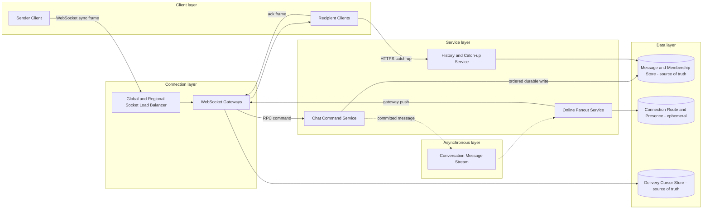

# WebSocket Chat or Realtime System

## 0. Interview classification

- **Primary challenge:** durable per-conversation messaging over ephemeral long-lived connections.
- **Secondary challenges:** connection routing, per-conversation ordering, offline catch-up, giant groups, presence, and backpressure.
- **Patterns exercised:** [[Idempotency Pattern]], [[Deduplication and Inbox Pattern]], [[Backpressure and Load Shedding]], [[Fan-out on Write vs Fan-out on Read]].
- **Expected interview level:** Senior Backend / Senior Golang; Staff signals come from narrowed guarantees and operational judgment.
- **Recommended prerequisites:** [[Queues Streams and Pub Sub]], [[Stateless and Stateful Services]], [[Consistency Models]].
- **Candidate design disclaimer:** “An interview-oriented candidate design based on public information and distributed-systems principles, not a claim about the company’s exact internal implementation.”

## 1. How to approach this problem

- **First questions:** Conversation type? Guarantees? Offline? Scale?
- **Hidden complexity:** durable per-conversation messaging over ephemeral long-lived connections; make the invariant and failure boundary visible.
- **What not to over-design:** end-to-end encryption protocol design, media upload internals, recommendation, moderation ML, or global total order.
- **What the interviewer is testing:** bounded scope, ownership, complete flow, causal scaling, and explicit trade-offs.
- **Mental model:** derive authority and commit point first; add components only when a requirement or bottleneck forces them.
- **Expected deep-dive branches:** Per-conversation ordering; Reconnect and gap recovery; Large-group fan-out.

## 2. Interview timeline for this system

- **0–3:** restate Connect/authenticate, send/accept message, deliver online, persist history, acknowledge/read cursor, reconnect/catch up, and presence.; park end-to-end encryption protocol design, media upload internals, recommendation, moderation ML, or global total order.
- **3–7:** clarify NFRs and calculate the dominant rate, data, and skew.
- **7–12:** state invariants, entities, APIs, keys, and source of truth.
- **12–22:** draw Version 1 and trace the critical flow.
- **22–32:** ask the interviewer to select Per-conversation ordering, Reconnect and gap recovery, Large-group fan-out.
- **32–39:** address gateway sockets, memory, and reconnect storms, hot conversation sequencer/partition, large-group fan-out and failure controls.
- **39–43:** make decisions from the trade-off table; add region/security only where relevant.
- **43–45:** summarize guarantees, relaxed state, risks, and next validation.

## 3. Requirements clarification

| Candidate question | Possible interviewer answer |
| --- | --- |
| Conversation type? | One-to-one and bounded groups; giant broadcast groups are a deep dive. |
| Guarantees? | Durable accepted messages, per-conversation order, at-least-once delivery with client/server dedupe. |
| Offline? | History and cursor catch-up after reconnect; presence/typing are best-effort. |
| Scale? | Assume 20M concurrent sockets, 2M messages/s peak, 1 KB messages, 30-day hot history. |

**Selected scope:** Connect/authenticate, send/accept message, deliver online, persist history, acknowledge/read cursor, reconnect/catch up, and presence.

**Explicit non-goals:** end-to-end encryption protocol design, media upload internals, recommendation, moderation ML, or global total order.

## 4. Functional requirements

- Establish authenticated long-lived connections and register routing with leases.
- Accept idempotent messages, authorize membership, persist and sequence per conversation.
- Fan out to online members and store history for offline catch-up.
- Track delivery/read cursors and best-effort presence/typing.

## 5. Non-functional requirements

- Interview assumptions: 20M concurrent sockets, 2M messages/s peak, 1 KB average message, 30-day hot history.
- Online accept-to-deliver p99 below 500 ms under healthy path; accepted messages are durable.
- Ordering is per conversation, not global; duplicate delivery is tolerated and deduped.
- Gateways bound memory/connection buffers and recover from reconnect storms.
- Message privacy, membership authorization, abuse/rate controls, and minimized presence/location metadata.

## 6. Back-of-the-envelope estimation

> [!important] Interview assumptions
> These values size a candidate design. They are not company or production facts.

At 20M sockets and 50k sockets per gateway under tested headroom, baseline is about 400 gateways plus deploy/failure reserve. At 2M messages/s ×1 KB, broker/store ingress is about 2 GB/s before replication and fan-out. One message to a 100-member group creates 100 deliveries; group-size distribution therefore matters more than mean. Thirty days of raw 2M/s peak is not a sensible average assumption, so separately ask average message rate before storage sizing.

## 7. Core invariants

- An accepted message is durably stored before sender acknowledgement.
- Message identity is unique by sender/device clientMessageId; retries return the same server message.
- Sequence order is monotonic per conversation; global order is not promised.
- Socket/presence state is ephemeral; message history and membership are authoritative.
- A slow client cannot create an unbounded gateway buffer.

## 8. Core entities

| Entity | Ownership and lifecycle |
| --- | --- |
| Conversation and Membership | Authoritative participants, roles, membership version. |
| Message | Conversation, sequence, sender, client ID, content reference, timestamp. |
| ConversationSequence | Single owner/version for next sequence or ordered log partition. |
| ConnectionRoute | User/device→gateway/session lease; reconstructible. |
| DeliveryCursor | Highest contiguous delivered/read sequence per user/device policy. |
| PresenceLease | Best-effort online/last-seen state with TTL. |

## 9. API design

| Method | Path or RPC | Request | Response | Authentication | Idempotency | Pagination | Error behaviour |
| --- | --- | --- | --- | --- | --- | --- | --- |
| GET Upgrade | /v1/realtime | auth, deviceId, last cursors | WebSocket accepted | user/device | session key | n/a | 401; 429; 503 |
| WS send | message | conversationId, clientMessageId, body | accepted messageId,sequence | socket identity+membership | clientMessageId | n/a | 403; 409; 413; 429 |
| WS ack | ack | conversationId,sequence,type | acknowledged cursor | member/device | monotonic cursor | n/a | 409 gap ignored/handled |
| GET | /v1/conversations/{id}/messages | afterSequence,limit | messages,next cursor | member | read-only | sequence cursor | 403; 404; partial |
| POST | /v1/conversations | member IDs | conversationId | user | Idempotency-Key | member cursor | 403; 409 |

## 10. Data model

| Table/store | Primary key | Partition key | Important indexes | Source of truth | Retention | Consistency | Access pattern |
| --- | --- | --- | --- | --- | --- | --- | --- |
| conversations | conversation_id | hash(conversation_id) | updated_at | authoritative | policy | strong membership/version | authorize |
| memberships | conversation+user | conversation_id | user index | authoritative | active+audit | strong/versioned | send/read |
| messages | conversation+sequence | conversation_id | message_id/client ID | authoritative history | hot+cold policy | per-conversation ordered | history/catch-up |
| client_message_ids | sender+device+client ID | sender/device | message_id | authoritative dedupe | retry horizon | strong | send retry |
| delivery_cursors | user+conversation+device | user_id | updated_at | authoritative cursor | active | monotonic | catch-up |
| connection_routes | user+device+session | gateway shard | lease expiry | ephemeral | short TTL | eventual | online routing |

## 11. First working design

### HLD: WebSocket Chat or Realtime System — candidate design



### ASCII fallback

```text
Clients --WebSocket--> Load Balancer --> Gateways --> Chat Command
Chat --> Message/Membership Store [truth] --async keyed stream--> Fanout
Fanout --> Connection Route [ephemeral] --> Gateways --> online clients
Clients --ack--> Cursor Store [truth]
Reconnect --HTTPS--> History Service --> Message Store
```

**Legend:** solid arrow = synchronous request/response or direct state access; dashed arrow = asynchronous event/job. “Source of truth” owns authoritative state; “derived” can rebuild.

## 12. Complete critical flow

1. Client authenticates socket; gateway creates session lease/route and receives last cursors. Presence remains soft.
2. Sender frame carries conversation and stable clientMessageId. Gateway applies size/rate limits and forwards to Chat Command.
3. Chat verifies membership, dedupes client ID, assigns next per-conversation sequence, persists message/outbox, then acknowledges sender.
4. Committed event keyed by conversation reaches fan-out; it resolves active routes and pushes to bounded gateway buffers.
5. Recipients ack contiguous sequences to cursor store. Reconnect fetches after cursor, merges gap, then resumes live stream without relying on presence.

## 13. Evolve the design under scale

### Version 1

One gateway and relational message table with polling; proves durability and history.

### Version 2

Many gateways with external route leases, keyed message stream, fan-out workers, cursor catch-up, and per-conversation sequencing.

### Version 3

Partition by conversation/home region, tier history, isolate giant groups, regional gateways and replicated catch-up; retain one ordered owner per conversation epoch.

**Partition and routing:** Messages and stream partition by conversation ID to preserve order. Connections route by user/device to gateway leases. A hot conversation cannot be solved by ordinary hashing; dedicate its order owner and split only delivery fan-out.

## 14. Deep dive

### 1. Per-conversation ordering

**Problem and alternatives:** Options are database sequence row, broker partition order, client timestamp, and dedicated sequencer.

**Selected design and detailed flow:** Choose one conversation owner/partition with monotonic sequence. Message transaction assigns sequence and persists; stream key preserves order. Failover uses epoch and rejects stale owner.

**Trade-offs and failure handling:** One hot conversation caps one partition; giant groups may split delivery fan-out but not message order. Client timestamps never arbitrate authoritative order.

### 2. Reconnect and gap recovery

**Problem and alternatives:** Options are replay socket buffers, fetch by sequence cursor, or full snapshot.

**Selected design and detailed flow:** Persist history and monotonic cursor. Reconnect authenticates, fetches after last contiguous sequence, then subscribes/live-merges with sequence dedupe. Gateway buffer is never durability.

**Trade-offs and failure handling:** Catch-up may be large, so paginate/tier and cap. Route lease expiry and jittered reconnect avoid storms.

### 3. Large-group fan-out

**Problem and alternatives:** Options are push every member, pull history, hybrid online push plus offline pull.

**Selected design and detailed flow:** Push to online bounded routes; offline users catch up. For huge groups, partition membership ranges and do not maintain per-message per-offline delivery rows.

**Trade-offs and failure handling:** Read receipts/presence may be disabled or aggregated for giant groups; product semantics trade detail for scale.

## 15. Detailed success flow

1. Device d-1 sends client ID c-77 to conversation conv-9. Membership v4 allows it; transaction stores message m-10 at sequence 842.
2. Sender receives accepted m-10/842 after durable commit. Stream fan-out routes to recipient gateway g-3 and pushes frame.
3. Recipient acks contiguous 842; cursor advances. After disconnect at 845, reconnect fetches 843–845 then resumes live at 846.

## 16. Detailed failure flows

### Failure 1 — Gateway crashes

- **Detection:** Lease expiry, socket close, reconnect spike.
- **Immediate behaviour:** Clients reconnect with jitter to other gateways; old route expires.
- **Retry policy:** Connection establishment retries with backoff; message send keeps same client ID.
- **Idempotency/deduplication:** Client message ID and sequence/cursor dedupe.
- **Recovery:** Catch up from durable history; no gateway buffer replay required.
- **User-visible outcome:** Short disconnect, then recovered messages.
- **Observability:** connections, reconnect rate, lease expiry, catch-up duration.

### Failure 2 — Crash after message commit before ack

- **Detection:** Sender retry with same client ID.
- **Immediate behaviour:** Return stored message/sequence.
- **Retry policy:** Safe same-key retry.
- **Idempotency/deduplication:** Unique sender/device/client ID.
- **Recovery:** No data repair; outbox replay fan-outs if needed.
- **User-visible outcome:** One visible message.
- **Observability:** dedupe hit and outbox age.

### Failure 3 — Slow recipient

- **Detection:** gateway send-buffer high-water mark.
- **Immediate behaviour:** Drop typing/presence first; close socket if durable messages cannot drain.
- **Retry policy:** Do not retry endlessly in memory.
- **Idempotency/deduplication:** Recipient dedupes sequence; cursor records progress.
- **Recovery:** Client reconnects and catches up.
- **User-visible outcome:** Temporary disconnect, durable history preserved.
- **Observability:** buffer depth, slow-client closes, gap size.

### Failure 4 — Hot conversation or group

- **Detection:** partition lag and fan-out saturation.
- **Immediate behaviour:** Keep order owner, split membership-range fan-out, degrade receipts/presence, use offline pull.
- **Retry policy:** Bounded worker retries; no global reorder.
- **Idempotency/deduplication:** message ID/sequence and fan-out task IDs.
- **Recovery:** Add dedicated capacity and drain ranges; history remains truth.
- **User-visible outcome:** Delivery may lag; send acceptance can remain.
- **Observability:** per-conversation lag, group fan-out time, route lookup load.

## 17. Bottlenecks and scalability

- gateway sockets, memory, and reconnect storms
- hot conversation sequencer/partition
- large-group fan-out
- presence write amplification
- history storage and catch-up scans

**Partitioning unit and routing strategy:** Messages and stream partition by conversation ID to preserve order. Connections route by user/device to gateway leases. A hot conversation cannot be solved by ordinary hashing; dedicate its order owner and split only delivery fan-out.

## 18. Reliability and recovery

- Gateways are replaceable connection state; message/history and cursors are durable.
- Bound per-socket and per-gateway buffers, apply backpressure, and jitter reconnect.
- Multi-AZ message store/stream, replayable outbox, backup and tiered history.
- Presence may drop; send/history/catch-up degrade independently.
- Conversation has home region/epoch for ordering; failover fences stale owner and reconciles sequence.

## 19. Observability

- **Key metrics:** active sockets, connect/auth failures, reconnects, send accept/deliver latency, stream lag, sequence gaps, buffers, slow closes, catch-up.
- **Logs:** conversation/message/session/gateway IDs and sequence; never log message body/token.
- **Traces:** sample send commit→stream→fan-out and reconnect catch-up.
- **SLI/SLO candidates:** durable message acceptance and online delivery latency; catch-up completion; zero unauthorized delivery.
- **Dashboards:** connections, message pipeline, hot conversations, slow clients, history, region.
- **Alerts:** acceptance/delivery burn, reconnect storm, partition lag, buffer saturation, sequence anomaly.
- **Business-level signals:** messages accepted/delivered/read, active conversations, offline catch-up, abuse blocks.

## 20. Security and abuse

- Authenticate device/session and authorize membership on every send/history access.
- Encrypt transport and storage; minimize message/body telemetry; rotate sessions.
- Rate-limit connects/sends and frame size; spam/report/moderation hooks without claiming ML internals.
- Protect route/presence data and limit presence precision/retention.
- For E2EE follow-up, servers store ciphertext but metadata, membership, key distribution, and abuse trade-offs remain.

## 21. Explicit trade-off table

| Decision | Selected option | Alternative | Why selected | Cost or weakness | When alternative wins |
| --- | --- | --- | --- | --- | --- |
| Transport | WebSocket | polling/SSE | bidirectional low latency | stateful operations | one-way updates/simple clients |
| Order | per conversation | global | sufficient semantics/scale | hot conversation | global audit niche |
| Ack | after durable store | after gateway receive | no lost accepted message | higher latency | ephemeral notification |
| Delivery | online push+offline pull | push all rows | bounded fan-out | catch-up work | small bounded groups |
| Presence | TTL soft state | durable exact | cheap/recoverable | stale | compliance-critical status |
| Gateway state | external route+history | sticky gateway durability | failover/catch-up | extra stores | very small deployment |
| History | partitioned conversation log | user inbox copies | ordering/locality | multi-conversation list work | per-user mailbox product |
| Region | conversation home | active-active ordering | clear sequence | cross-region latency | CRDT/unordered collaboration |
| Receipts | contiguous cursor | row per message/user | compact catch-up | less granular | small groups needing exact receipt |

## 22. Technology choices

| Technology | Role | Why it fits | Viable alternative | Operational cost | When choice changes |
| --- | --- | --- | --- | --- | --- |
| Go/Netty gateways | long-lived sockets | efficient concurrency | managed WebSocket service | connection ops | managed scale |
| Kafka/Pulsar | keyed message stream | per-key order/replay | SQS | partition ops | no order/replay need |
| PostgreSQL/Cassandra/DynamoDB | message/membership truth | key-range history | specialized message store | partition/retention ops | choice follows scale/query |
| Redis/etcd | route/presence leases | TTL low latency | custom registry | ephemeral cluster ops | service mesh/discovery alternative |
| Object storage | cold history/media | cheap immutable retention | hot DB | retrieval latency | short retention |

## 23. Interviewer follow-up questions

| Likely follow-up | Concise strong answer | Diagram change | Trade-off |
| --- | --- | --- | --- |
| Exactly once delivery? | At-least-once frames with message identity and sequence dedupe; durable acceptance exactly one logical message. | Highlight client ID/cursor. | storage vs semantics |
| Cross-region order? | Assign conversation home/epoch or accept conflict semantics; do not claim global free order. | Add regional owner. | latency vs ordering |
| Huge groups? | Split online fan-out ranges, offline pull, and reduce receipt/presence detail. | Add membership partitions. | feature fidelity vs scale |
| Gateway loss? | Reconnect+jitter, route lease expiry, history cursor catch-up; gateway is not truth. | Highlight history. | reconnect load vs recovery time |

## 24. What a weak candidate does

- Treats WebSocket gateway as durable message store.
- Promises global exactly-once and total order.
- Uses unbounded per-client buffers.
- Has presence but no history cursor/reconnect path.
- Copies one delivery row for every member of a huge group without analysis.

## 25. What a strong senior candidate demonstrates

- Separates ephemeral connections from durable history.
- Defines client idempotency, per-conversation order, and cursor catch-up.
- Handles hot conversation separately from ordinary partitioning.
- Uses backpressure and degrades ephemeral features first.
- Explains regional ordering authority and security metadata.

## 26. Five-minute revision

- **Requirements:** connect, send, durable history, online delivery, ack/catch-up, presence.
- **Critical invariant:** accepted message durable; unique client ID; per-conversation sequence.
- **Core HLD:** socket gateway→Chat→Message DB/outbox→keyed stream→fan-out→gateway; cursor/history.
- **Most important data model:** message(conversation,sequence), membership, client ID, cursor, route lease.
- **Critical flow:** send→auth/dedupe/sequence/commit→ack→fan-out→cursor.
- **Three bottlenecks:** sockets/reconnect; hot conversation; group fan-out.
- **Three trade-offs:** per-conversation/global; push/pull; presence durability.
- **Three failures:** gateway crash; commit-before-ack; slow client.
- **Likely deep dive:** ordering and reconnect.

## 27. Blank-page practice prompt

Design a one-to-one and group chat system with WebSockets, durable messages, per-conversation ordering, offline catch-up, presence, and large groups.

## 28. Adversarial variations

- Concurrent sockets grow 100×.
- One conversation has five million members.
- A region fails while messages are in flight.
- End-to-end encryption is required.
- Message retention drops from 30 days to forever.
- Presence must cost 80% less.

## 29. Practice and re-test history

- [ ] Untimed reconstruction — date/result:
- [ ] 45-minute mock — score/date:
- [ ] Follow-up round — variation/result:
- [ ] One-day review — date/result:
- [ ] Three-day review — date/result:
- [ ] Seven-day review — date/result:
- [ ] Fourteen-day review — date/result:

Personal readiness remains `not-started` until evidence is recorded in [[System Design Practice Tracker]].

## 30. Related internal notes and verified external references

**Internal:** [[Queues Streams and Pub Sub]] · [[Idempotency Pattern]] · [[Backpressure and Load Shedding]] · [[Stateless and Stateful Services]] · [[Multi-Region Design]]

**Verified external references (checked 2026-07-17):**

- [RFC 6455 WebSocket Protocol](https://www.rfc-editor.org/rfc/rfc6455) — protocol semantics.
- [Apache Kafka documentation](https://kafka.apache.org/documentation/) — keyed partitions and replay.

