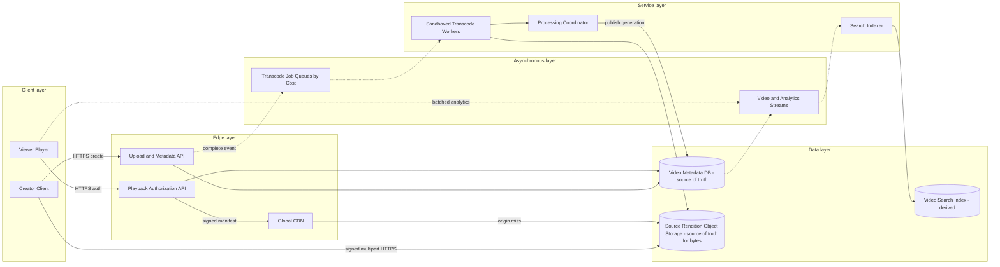

# YouTube System Design

## 0. Interview classification

- **Primary challenge:** durable resumable upload and asynchronous media processing with global playback.
- **Secondary challenges:** transcoding scheduling, immutable renditions, CDN/origin protection, metadata/search consistency, and analytics.
- **Patterns exercised:** [[Transactional Outbox Pattern]], [[Backpressure and Load Shedding]], [[Caching Pattern]], [[Idempotency Pattern]].
- **Expected interview level:** Senior Backend / Senior Golang; Staff signals come from narrowed guarantees and operational judgment.
- **Recommended prerequisites:** [[Blob Object and File Storage]], [[Caching and CDN Fundamentals]], [[Queues Streams and Pub Sub]].
- **Candidate design disclaimer:** “An interview-oriented candidate design based on public information and distributed-systems principles, not a claim about the company’s exact internal implementation.”

## 1. How to approach this problem

- **First questions:** Core journey? Scope? Availability/consistency? Scale?
- **Hidden complexity:** durable resumable upload and asynchronous media processing with global playback; make the invariant and failure boundary visible.
- **What not to over-design:** recommendations, comments, live streaming, ads, copyright matching, and a claim about YouTube’s private implementation.
- **What the interviewer is testing:** bounded scope, ownership, complete flow, causal scaling, and explicit trade-offs.
- **Mental model:** derive authority and commit point first; add components only when a requirement or bottleneck forces them.
- **Expected deep-dive branches:** Resumable upload and publish; Transcode scheduling; Playback and CDN.

## 2. Interview timeline for this system

- **0–3:** restate Resumable upload, metadata/visibility, processing state, multi-rendition transcode, manifest publish, playback through CDN, search index, and analytics.; park recommendations, comments, live streaming, ads, copyright matching, and a claim about YouTube’s private implementation.
- **3–7:** clarify NFRs and calculate the dominant rate, data, and skew.
- **7–12:** state invariants, entities, APIs, keys, and source of truth.
- **12–22:** draw Version 1 and trace the critical flow.
- **22–32:** ask the interviewer to select Resumable upload and publish, Transcode scheduling, Playback and CDN.
- **32–39:** address petabyte-scale object ingress/storage, transcode CPU/GPU and long-job skew, CDN origin egress on misses and failure controls.
- **39–43:** make decisions from the trade-off table; add region/security only where relevant.
- **43–45:** summarize guarantees, relaxed state, risks, and next validation.

## 3. Requirements clarification

| Candidate question | Possible interviewer answer |
| --- | --- |
| Core journey? | Creator uploads/resumes and viewer plays after processing. |
| Scope? | Metadata, multipart upload, transcode/package, playback/CDN, search indexing, quality analytics. |
| Availability/consistency? | Upload durability and visibility strict; playback highly available; search/analytics eventual. |
| Scale? | Assume 5M uploads/day averaging 200 MB and 100M concurrent peak viewers as interview inputs. |

**Selected scope:** Resumable upload, metadata/visibility, processing state, multi-rendition transcode, manifest publish, playback through CDN, search index, and analytics.

**Explicit non-goals:** recommendations, comments, live streaming, ads, copyright matching, and a claim about YouTube’s private implementation.

## 4. Functional requirements

- Create an upload session and upload/resume verified parts directly to object storage.
- Finalize source and asynchronously produce thumbnails, renditions, segments, and manifests.
- Authorize playback and distribute immutable media globally through CDN.
- Expose processing state, index metadata, and ingest duplicate-tolerant quality/view analytics.

## 5. Non-functional requirements

- Interview assumptions: 5M uploads/day ×200 MB average, three encoded bytes per source byte, 100M peak viewers, 5 Mbps average playback.
- Accepted source upload is durable; processing can take minutes and is observable.
- Playback startup p99 target below two seconds where CDN coverage exists; high availability and graceful rendition degradation.
- Metadata/visibility is authoritative; search/analytics eventual; cached private content revocation is bounded.
- Sandbox untrusted media, signed URLs, private origins, PII-minimized analytics, and abuse/moderation interfaces.

## 6. Back-of-the-envelope estimation

> [!important] Interview assumptions
> These values size a candidate design. They are not company or production facts.

Source ingress is about 1 PB/day (5M×200 MB). If renditions total 3× source, new object bytes are roughly 4 PB/day before replication/lifecycle—an intentionally extreme assumption that forces object storage and tiering. At 100M concurrent viewers×5 Mbps, aggregate edge egress is about 500 Tbps, so CDN hit ratio and geography dominate. Upload QPS is modest relative to bytes; transcode compute and playback egress are first limits.

## 7. Core invariants

- A completed upload session references one verified immutable source generation; acknowledged bytes are not lost.
- A Video is playable only when its active manifest generation and required renditions are verified and authorized.
- Processing jobs are idempotent by video, generation, and rendition; retries never overwrite the active generation partially.
- Visibility/ownership is authoritative; search, counts, and quality analytics may lag.
- Queue messages carry object references, never media bytes.

## 8. Core entities

| Entity | Ownership and lifecycle |
| --- | --- |
| Video | Owner, metadata, visibility, processing state/version, active manifest generation. |
| UploadSession/Part | Part numbers, checksums, object key, expiry, completion state. |
| SourceObject | Immutable verified original in object storage. |
| ProcessingGeneration/Job | Required outputs, state, attempt, cost class. |
| Rendition/Manifest | Immutable segments/codecs/resolutions and published pointer. |
| PlaybackSession/AnalyticsEvent | Authorization/token and sequenced client quality events. |

## 9. API design

| Method | Path or RPC | Request | Response | Authentication | Idempotency | Pagination | Error behaviour |
| --- | --- | --- | --- | --- | --- | --- | --- |
| POST | /v1/videos/uploads | metadata,size,type | uploadId,videoId,signed part instructions | creator | Idempotency-Key | n/a | 400; 403; 413; 429 |
| PUT | signed object URL | part bytes+checksum | part ETag/checksum | scoped signature | uploadId+part | n/a | 403; 409; checksum failure |
| POST | /v1/videos/{id}/uploads/{u}:complete | parts/checksums | 202 processing state | owner | Idempotency-Key | n/a | 409 incomplete/conflict; 422 corrupt |
| GET | /v1/videos/{id}/playback | device capabilities | manifest URL/token | authorized viewer | read-only/session | n/a | 403; 404; 409 not ready |
| POST | /v1/analytics/events | session,sequence,batch | 202 | viewer session | event/session sequence | n/a | 400; 413; 429 |

## 10. Data model

| Table/store | Primary key | Partition key | Important indexes | Source of truth | Retention | Consistency | Access pattern |
| --- | --- | --- | --- | --- | --- | --- | --- |
| videos | video_id | owner+video | owner+created,state | authoritative metadata | policy | strong/versioned | status/playback auth |
| upload_sessions | upload_id | video_id | expiry/state | authoritative workflow | short+audit | strong | resume/complete |
| media_objects | object key | video+generation | type/rendition | object store truth for bytes | lifecycle | immutable | upload/playback |
| processing_jobs | video+generation+rendition | cost class | state+lease | workflow authority | audit | idempotent/versioned | workers |
| search_index | video doc | query shard | terms/owner/time | derived | rebuildable | eventual | discovery |
| analytics_events | session+sequence | video/time | time | event stream | tiered | at-least-once | quality/aggregate |

## 11. First working design

### HLD: YouTube System Design — candidate design



### ASCII fallback

```text
Creator --> Upload API --> Metadata DB [truth]
Creator --signed multipart/checksum--> Object Storage [source bytes]
Complete --async--> Cost-class Job Queues --> Sandboxed Transcoders --> Renditions/Manifests [bytes truth]
Coordinator --> atomically publish active generation in Metadata DB
Viewer --> Playback Auth --> signed manifest --> CDN --miss--> Object Storage
Viewer --async quality events--> Analytics Stream; metadata events --> Search Index [derived]
```

**Legend:** solid arrow = synchronous request/response or direct state access; dashed arrow = asynchronous event/job. “Source of truth” owns authoritative state; “derived” can rebuild.

## 12. Complete critical flow

1. Creator creates Video and upload session; API authenticates, stores metadata/state, and returns scoped signed multipart instructions.
2. Client uploads parts directly with checksums and resumes only missing parts. Complete validates object/part manifest and commits UPLOADED plus processing outbox.
3. Coordinator creates idempotent generation/rendition jobs by cost class. Sandboxed workers read source and write temporary then immutable verified outputs.
4. When required outputs verify, one metadata transaction switches activeManifestGeneration and state to READY; optional outputs can continue by policy.
5. Playback API authorizes visibility and issues short-lived signed manifest. CDN serves immutable segments; player sends sequenced analytics asynchronously.

## 13. Evolve the design under scale

### Version 1

Upload through one API and run one transcode worker; correct but bandwidth/compute coupled.

### Version 2

Direct signed multipart to object storage, durable metadata/outbox, job queues, idempotent workers, immutable generation publish, and CDN.

### Version 3

Regional upload endpoints, cost-aware schedulers/pools, origin shields/multi-CDN, replicated ready media, home-region metadata writes, tiered analytics/search.

**Partition and routing:** Metadata/jobs partition by video ID; scheduling also classifies by estimated cost/priority. Object keys include video/generation/rendition. Playback hot keys replicate in cache/CDN; ordinary hashing alone does not solve viral content.

## 14. Deep dive

### 1. Resumable upload and publish

**Problem and alternatives:** Options are proxy upload, direct multipart, streaming chunk service.

**Selected design and detailed flow:** Use direct multipart with upload session, per-part checksum, scoped URLs, and explicit complete. Bytes remain unpublished until metadata points to verified source generation.

**Trade-offs and failure handling:** Orphan parts/objects require expiry/reconciliation. Direct upload reduces API bandwidth but complicates authorization and completion.

### 2. Transcode scheduling

**Problem and alternatives:** Options are FIFO, one queue per rendition, cost-class scheduling, workflow DAG.

**Selected design and detailed flow:** Estimate job cost from duration/codec/resolution; put short/priority and long jobs in isolated queues, lease workers, and publish output only after verification. Generation+rendition is idempotency key.

**Trade-offs and failure handling:** Fairness avoids long-video head-of-line blocking; estimation errors and GPU/CPU pools add operations. Queue age, not only depth, drives autoscale.

### 3. Playback and CDN

**Problem and alternatives:** Options are origin direct, one CDN, multi-CDN/origin shield.

**Selected design and detailed flow:** Use immutable segments and manifests through CDN with origin shielding. Playback API authorizes and returns short token; visibility changes invalidate pointer/token and purge when required.

**Trade-offs and failure handling:** Long immutable TTL maximizes hit rate; private/revoked content needs short auth lifetime and bounded purge. Multi-CDN wins at required resilience/scale but costs routing/operations.

## 15. Detailed success flow

1. Creator c-7 uploads video v-9 in 13 verified parts; complete commits source generation g1 and processing event.
2. Workers produce 360p/720p/1080p segments and thumbnails under generation g1; coordinator verifies required outputs and atomically sets READY/manifest g1.
3. Viewer receives signed manifest, first segment misses to origin then CDN caches it; adaptive player switches bitrate and sends sequenced quality events.

## 16. Detailed failure flows

### Failure 1 — Worker crash or corrupt source

- **Detection:** job lease timeout/checksum/probe error.
- **Immediate behaviour:** Transient crash returns job; deterministic corrupt source marks processing failed/quarantine.
- **Retry policy:** Bounded retry by video+generation+rendition; deterministic errors do not retry.
- **Idempotency/deduplication:** Output uses immutable key and completion marker.
- **Recovery:** Clean temp objects; requeue or expose creator failure; optional rendition policy explicit.
- **User-visible outcome:** PROCESSING longer or FAILED with reason.
- **Observability:** job age, retries, deterministic failures, temp bytes.

### Failure 2 — CDN miss storm on viral video

- **Detection:** origin request/egress and cache-miss coalescing.
- **Immediate behaviour:** Origin shield, request collapse, edge cache, source admission; analytics shed first.
- **Retry policy:** CDN/origin safe GET retry within deadline.
- **Idempotency/deduplication:** Immutable segment key.
- **Recovery:** Warm shields/alternate CDN and recover cache progressively.
- **User-visible outcome:** Possible startup delay, playback continues where cached.
- **Observability:** hit ratio, origin egress, startup/rebuffer.

### Failure 3 — Visibility revoked while cached

- **Detection:** metadata version and access reports.
- **Immediate behaviour:** Playback API stops issuing tokens; short token expiry and purge/private-origin policy bound exposure.
- **Retry policy:** Versioned purge retries idempotently.
- **Idempotency/deduplication:** Manifest generation/visibility version.
- **Recovery:** Audit purge completion and reconcile edge state.
- **User-visible outcome:** Existing token may work only within declared bound.
- **Observability:** revoke-to-deny and purge lag.

### Failure 4 — Processing queue backlog

- **Detection:** oldest age by cost class and time-to-ready.
- **Immediate behaviour:** Reserve priority, autoscale within quota, shed optional renditions, admit uploads if durable capacity exists.
- **Retry policy:** Bounded worker retry; no retry storm.
- **Idempotency/deduplication:** Job identity and completion checks.
- **Recovery:** Drain with fair scheduling and communicate state.
- **User-visible outcome:** Uploads accepted but READY delayed.
- **Observability:** queue age, capacity, ready time, optional skips.

## 17. Bottlenecks and scalability

- petabyte-scale object ingress/storage
- transcode CPU/GPU and long-job skew
- CDN origin egress on misses
- viral metadata/manifest hot keys
- analytics volume/cardinality and search lag

**Partitioning unit and routing strategy:** Metadata/jobs partition by video ID; scheduling also classifies by estimated cost/priority. Object keys include video/generation/rendition. Playback hot keys replicate in cache/CDN; ordinary hashing alone does not solve viral content.

## 18. Reliability and recovery

- Object checksums, immutable generations, versioning/lifecycle, and metadata backups/restore.
- At-least-once jobs with idempotent workers, leases, quarantine, and temp cleanup.
- CDN/origin shield and graceful optional-rendition degradation; playback isolated from analytics.
- Cross-region ready-media replication and home metadata authority with explicit RPO/RTO.
- Reconciliation verifies READY manifests/objects and repairs stuck jobs/indexes.

## 19. Observability

- **Key metrics:** upload success/resume/checksum, bytes, job age/duration/retry, time-to-ready, rendition completeness, CDN hit/origin, startup/rebuffer, analytics/search lag.
- **Logs:** video/upload/job/generation/object refs; no signed URLs/tokens/content PII.
- **Traces:** upload complete→jobs→publish and playback auth→CDN origin sampled.
- **SLI/SLO candidates:** durable upload completion, time-to-ready, playback startup and rebuffer ratio.
- **Dashboards:** uploads, processing pools, storage, CDN/origin, playback quality, index/analytics.
- **Alerts:** checksum/corrupt spike, job age, missing rendition, origin storm, playback burn, revoke lag.
- **Business-level signals:** videos uploaded/ready/failed, views, watch success, creator processing delay, storage/egress cost.

## 20. Security and abuse

- Short-lived scoped signed upload/playback URLs and private object origins.
- Authorize ownership/visibility; minimize signed URL lifetime and logs.
- Sandbox untrusted media workers with least privilege, resource limits, and malware/media validation.
- Rate/size/format limits and abuse/moderation interfaces without claiming proprietary systems.
- Encrypt data, minimize analytics identifiers, and audit privileged visibility actions.

## 21. Explicit trade-off table

| Decision | Selected option | Alternative | Why selected | Cost or weakness | When alternative wins |
| --- | --- | --- | --- | --- | --- |
| Upload | direct multipart | proxy through API | bandwidth/resume scale | completion complexity | small files/simple system |
| Objects | immutable generation | overwrite keys | safe publish/cache/recovery | storage cleanup | tiny mutable content |
| Processing | async | sync upload | durable/burst tolerant | time-to-ready | very small instant transform |
| Scheduling | cost-class fair queues | FIFO | avoids long-job blocking | estimation/pool complexity | uniform jobs |
| CDN | long immutable TTL | short mutable URLs | hit/egress efficiency | revocation via pointer/token | frequently mutable content |
| Publish | required rendition gate | publish each immediately | coherent playback baseline | slower ready | progressive playback product |
| Metadata store | relational/strong | document/KV | ownership/state transitions | future sharding | exact-key massive scale |
| Region | home writes+replicated ready bytes | active-active metadata | simple visibility/version | write latency/failover | conflict-free ownership |
| Analytics | async sampled/batched | sync exact | playback isolation/cost | lag/approximation | billing-critical event subset |

## 22. Technology choices

| Technology | Role | Why it fits | Viable alternative | Operational cost | When choice changes |
| --- | --- | --- | --- | --- | --- |
| S3/GCS object store | sources/renditions/manifests | multipart, durability, lifecycle | distributed file store | egress/request cost | random-write POSIX need |
| PostgreSQL/distributed SQL | metadata/workflow | versioned transactions | DynamoDB | sharding/connections | global exact-key scale |
| Kafka/SQS/Pub/Sub | processing/analytics events | durable buffering | workflow engine | lag/duplicates | simple low volume |
| FFmpeg sandbox workers | transcode/package | mature codecs | managed transcoder | security/capacity ops | managed economics |
| CDN | global playback | edge caching/origin shield | regional cache | purge/routing cost | regional small audience |
| OpenSearch | metadata discovery | text/filter | SQL search | derived ops | small catalogue |

## 23. Interviewer follow-up questions

| Likely follow-up | Concise strong answer | Diagram change | Trade-off |
| --- | --- | --- | --- |
| Two-hour video vs short clip? | Estimate cost, use fair cost queues and chunk/stage DAG; avoid FIFO head-of-line. | Split job classes. | fairness vs utilization |
| Private video cached? | Private origin, playback auth, short signed token, immutable bytes, purge/version on revoke. | Add auth pointer/purge. | hit rate vs revocation |
| Live streaming? | Replace completed source with ingest segments, rolling manifests, low-latency replication, and no whole-file transcode gate. | Add live ingest path. | latency vs recoverability |
| Region loss? | Serve replicated ready renditions; pause/home-route metadata/upload according to RPO, then reconcile objects/jobs. | Add replicated objects/home epoch. | availability vs write complexity |

## 24. What a weak candidate does

- Claims exact YouTube internals or uses invented company scale as fact.
- Proxies petabyte uploads through app servers.
- Puts video bytes in Kafka or relational rows.
- Publishes a manifest before outputs verify.
- Adds CDN without keys, authorization, revocation, or origin protection.

## 25. What a strong senior candidate demonstrates

- Separates bytes, metadata, processing workflow, and derived indexes.
- Uses immutable generations and an atomic publish pointer.
- Quantifies egress/compute and schedules by job cost.
- Explains cache revocation and viral origin protection.
- Treats playback as independent from analytics and optional processing.

## 26. Five-minute revision

- **Requirements:** resume upload, process renditions, publish, playback/CDN, search/analytics.
- **Critical invariant:** verified source durable; READY points to complete generation; idempotent jobs.
- **Core HLD:** direct object upload→metadata/outbox→job queues→workers→immutable outputs→publish→CDN.
- **Most important data model:** video state/generation, upload parts/checksums, job rendition.
- **Critical flow:** multipart→complete→transcode→verify/publish→signed CDN playback.
- **Three bottlenecks:** object bytes; transcode; origin egress.
- **Three trade-offs:** direct/proxy; async/sync; immutable/revocation.
- **Three failures:** worker/corrupt; miss storm; visibility revoke.
- **Likely deep dive:** transcode scheduling and publish.

## 27. Blank-page practice prompt

Design a video platform with resumable upload, asynchronous transcoding, multiple renditions, global playback, search metadata, and quality analytics.

## 28. Adversarial variations

- Uploads and viewing grow 100×.
- One video becomes globally viral.
- Private content must revoke in seconds.
- Live streaming is added.
- Transcode cost must drop 50%.
- One region and one CDN fail together.

## 29. Practice and re-test history

- [ ] Untimed reconstruction — date/result:
- [ ] 45-minute mock — score/date:
- [ ] Follow-up round — variation/result:
- [ ] One-day review — date/result:
- [ ] Three-day review — date/result:
- [ ] Seven-day review — date/result:
- [ ] Fourteen-day review — date/result:

Personal readiness remains `not-started` until evidence is recorded in [[System Design Practice Tracker]].

## 30. Related internal notes and verified external references

**Internal:** [[Blob Object and File Storage]] · [[Caching and CDN Fundamentals]] · [[Backpressure and Load Shedding]] · [[Transactional Outbox Pattern]] · [[Multi-Region Design]]

**Verified external references (checked 2026-07-17):**

- [Amazon S3 multipart upload](https://docs.aws.amazon.com/AmazonS3/latest/userguide/mpuoverview.html) — resumable multipart mechanics.
- [Amazon S3 object integrity](https://docs.aws.amazon.com/AmazonS3/latest/userguide/checking-object-integrity-upload.html) — checksums.
- [Amazon CloudFront expiration](https://docs.aws.amazon.com/AmazonCloudFront/latest/DeveloperGuide/Expiration.html) — CDN TTL behaviour.

