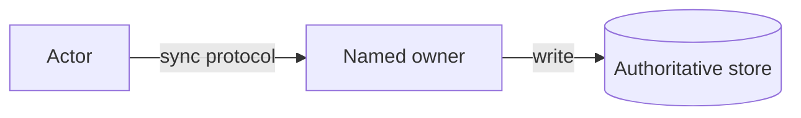

# {{System}} — Raw Attempt {{date}}

> Preserve this attempt before comparison. Assumptions are interview assumptions, not company facts.

## Scope

Actors:  
Critical journey:  
In scope:  
Non-goals:

## NFRs and estimates

Latency/availability/durability/consistency/geography/security:  
Peak calculation and first likely constraint:

## Invariants and ownership

Strict invariant:  
State owner/source of truth:  
Derived/eventual state:  
Completion semantics:

## APIs and data

Commands/queries/events:  
PK/partition/index/version/idempotency:

## Incremental HLD

Legend and numbered critical flow:

## Deep dive

Problem:  
Alternatives:  
Selected design and cost:

## Failure and scale

First bottleneck/fix:  
Failure detection → immediate behavior → retry/dedup → recovery → user outcome → signal:

## Summary

Guarantees:  
Deliberate trade-off:  
Remaining risks:

## Post-attempt evidence

Time:  
Hints:  
Rubric score:  
Exact correction:  
Next review:

