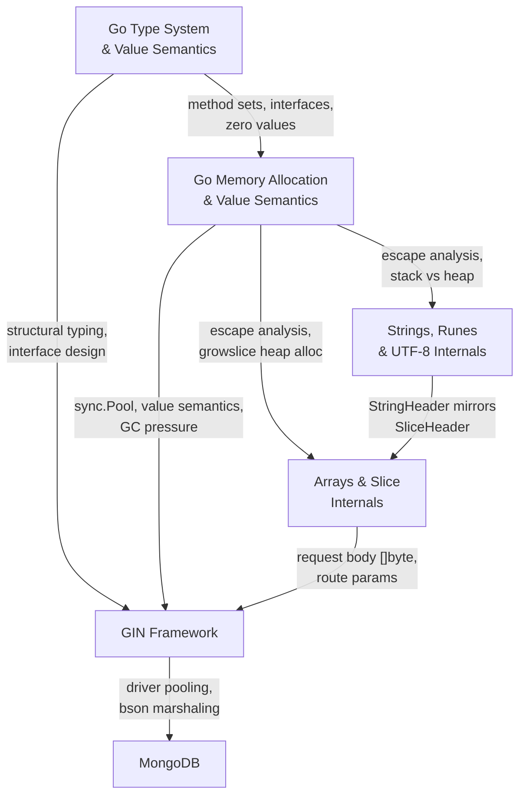

# Topic Connections Map

> How completed topics feed into each other and into future topics.
> Use this to answer "how does X relate to Y" interview questions.

---

## Dependency Graph

---

## Cross-Topic Connections (completed topics)

### Memory Allocation → Arrays & Slices
- Slice backing arrays escape to heap when returned or shared across goroutines
- `growslice()` triggers heap allocation -- every reallocation is GC work
- Pre-allocating with `make([]T, 0, n)` reduces heap churn
- `[]Struct` (contiguous, stack-friendly) vs `[]*Struct` (pointers, heap scatter) is a value semantics decision

### Strings → Arrays & Slices
- StringHeader (ptr + len, 16B) is a subset of SliceHeader (ptr + len + cap, 24B)
- `[]byte(s)` and `string(b)` share the same backing array concerns
- `strings.Builder` internally wraps a `[]byte` -- same growth mechanics as slices
- Sub-string memory leak mirrors sub-slice memory leak (shared backing)

### Arrays & Slices → GIN
- Request body parsing reads into `[]byte` then unmarshals
- Gin's middleware chain is `[]HandlerFunc` -- a slice of function values
- Route parameters extracted from radix tree into slices

### Type System → Memory Allocation
- Value vs pointer semantics determine stack vs heap placement
- Method set rules (T vs *T) affect whether values escape to heap through interfaces
- Interface boxing can trigger heap allocation (value > pointer-size gets copied to heap)

### Type System → GIN Framework
- Gin's `HandlerFunc` is a function type; middleware chains rely on Go's type system
- `gin.Context` methods use interface patterns (ShouldBind accepts interface-based validators)
- Route handlers accept/return concrete types following "accept interfaces, return structs"

### Memory Allocation → Strings
- String immutability means every "modification" is a new heap allocation
- `strings.Builder` reduces GC pressure (single buffer vs O(n) string copies)
- Substring slicing is a retention leak -- small string keeps large backing array on heap
- `[]byte` ↔ `string` conversions trigger allocations (except compiler-optimized map key lookups)

### Memory Allocation → GIN
- `gin.Context` allocated from `sync.Pool` to reduce GC pressure
- Goroutine-per-request model means each request's stack is ~2-8KB
- Value semantics for small middleware config structs keeps them on stack

### Strings → GIN
- Request body parsing involves `[]byte` → struct unmarshaling
- Path parameters are strings extracted from radix tree nodes
- Response writing involves string/[]byte handling

### GIN → MongoDB
- `mongo.Client` connection pool mirrors `sync.Pool` concepts
- BSON marshaling uses struct tags (same reflection + type system concepts)
- Context propagation from Gin to MongoDB driver for timeout/cancellation

---

## Connections to Future Topics

### Completed → Phase 1 (remaining)
- **Type System** → [[Pointers & Pointer Semantics]] (pointer receivers, nil behavior)
- **Arrays & Slices** → [[Map Internals]] (hmap uses bucket arrays, similar growth/GC concerns)
- **Strings** → [[Struct Layout & Memory Alignment]] (StringHeader is a struct with specific alignment)
- **Arrays & Slices** → [[Struct Layout & Memory Alignment]] ([]Struct contiguous layout, cache line awareness)

### Completed → Phase 4 (Concurrency)
- **Memory Allocation** → [[Goroutine Internals]] (2-8KB stack, stack growth)
- **Memory Allocation** → [[GMP Scheduler]] (per-P allocation caches)
- **Type System** → [[Channel Internals]] (chan is a reference type, hchan struct)
- **GIN** → [[Goroutine Internals]] (goroutine-per-request model)

### Completed → Phase 5 (GC)
- **Memory Allocation** → [[Garbage Collector Deep Dive]] (mark-sweep, write barrier, mark assist)
- **Memory Allocation** → [[GC Tuning (GOGC & GOMEMLIMIT)]] (production tuning)
- **Memory Allocation** → [[sync.Pool Internals]] (per-P pool, GC eviction)

---

> Update this file as new topics are completed.
