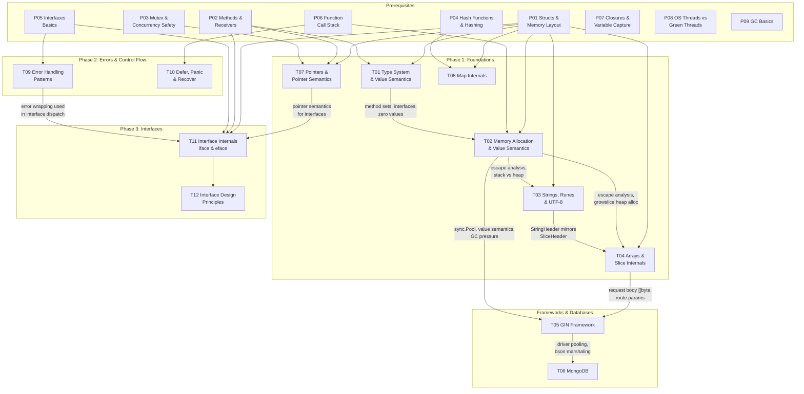

# Topic Connections Map

> How completed topics feed into each other and into future topics.
> Use this to answer "how does X relate to Y" interview questions.

---

## Dependency Graph

---

## Cross-Topic Connections (completed topics)

### P-notes → T-notes (prerequisite foundations)

- **P01 (Structs)** underpins T01, T02, T03, T04, T07, T08, T11 — struct layout, padding, zero values, and memory alignment are referenced everywhere
- **P02 (Methods)** underpins T01, T07, T11 — value vs pointer receivers, method sets, and the T/*T asymmetry
- **P03 (Mutex)** underpins T07 — never copy a mutex-containing struct, pointer receivers for stateful types
- **P04 (Hashing)** underpins T08 — hash functions, collisions, bucket concept, load factor
- **P05 (Interfaces)** underpins T09, T11 — interface contracts, typed nil trap, error as interface
- **P06 (Call Stack)** underpins T02, T10 — stack frames, defer, named returns, goroutine stacks

### Memory Allocation → Arrays & Slices
- Slice backing arrays escape to heap when returned or shared across goroutines
- `growslice()` triggers heap allocation -- every reallocation is GC work
- Pre-allocating with `make([]T, 0, n)` reduces heap churn
- `[]Struct` (contiguous, stack-friendly) vs `[]*Struct` (pointers, heap scatter) is a value semantics decision

### Strings → Arrays & Slices
- StringHeader (ptr + len, 16B) is a subset of SliceHeader (ptr + len + cap, 24B)
- `[]byte(s)` and `string(b)` share the same backing array concerns
- `strings.Builder` internally wraps a `[]byte` -- same growth mechanics as slices
- Sub-string memory leak mirrors sub-slice memory leak (shared backing)

### Pointers → Interfaces
- T07 pointer receiver rules directly feed into T11 interface satisfaction (method set asymmetry)
- Typed nil interface trap originates in P05, deepened in T07 (nil pointer dereference), formalized in T11 (iface two-word structure)
- Understanding pointer semantics is required for interface boxing behavior

### Error Handling → Interface Internals
- `error` is an interface; T09 patterns (sentinels, custom types, wrapping) build on P05 foundations
- Type assertions and type switches from T09 are explained at runtime level in T11 (itab lookup)
- The typed nil trap appears in P05, T07, T09, and T11 — same concept at increasing depth

### Interface Internals → Interface Design
- T11 (iface/eface internals) explains WHY the design principles in T12 work
- "Accept interfaces, return structs" (T12) makes sense once you understand boxing cost (T11)
- Small interfaces (T12) reduce itab cache pressure and simplify dispatch (T11)

### Defer/Panic → Error Handling
- T10 defer patterns (named return + defer error wrapping) are the backbone of T09 error handling in practice
- `recover()` in T10 catches panics; T09 shows when to panic vs return errors

### Type System → Memory Allocation
- Value vs pointer semantics determine stack vs heap placement
- Method set rules (T vs *T) affect whether values escape to heap through interfaces
- Interface boxing can trigger heap allocation (value > pointer-size gets copied to heap)

### Arrays & Slices → GIN
- Request body parsing reads into `[]byte` then unmarshals
- Gin's middleware chain is `[]HandlerFunc` -- a slice of function values
- Route parameters extracted from radix tree into slices

### GIN → MongoDB
- `mongo.Client` connection pool mirrors `sync.Pool` concepts
- BSON marshaling uses struct tags (same reflection + type system concepts)
- Context propagation from Gin to MongoDB driver for timeout/cancellation

---

## Connections to Future Topics

### Completed → Phase 4 (Concurrency)
- **P07 (Closures)** → [[T13 Goroutine Internals]] (goroutine closures capture variables)
- **P08 (OS Threads)** → [[T14 GMP Scheduler]] (M:N model, GOMAXPROCS)
- **P03 (Mutex)** → [[T18 Mutex & RWMutex Internals]] (deep dive on lock state machine)
- **P05 (Interfaces)** → [[T19 Context Package Internals]] (context.Context is an interface)
- **T02 (Memory)** → [[T13 Goroutine Internals]] (2-8KB stack, stack growth)
- **T04 (Slices)** → [[T15 Channel Internals]] (hchan circular buffer is a slice-like structure)
- **T05 (GIN)** → [[T13 Goroutine Internals]] (goroutine-per-request model)

### Completed → Phase 5 (GC)
- **P09 (GC Basics)** → [[T24 Garbage Collector Deep Dive]] (tri-color, write barrier, mark assist)
- **P09 (GC Basics)** → [[T25 GC Tuning (GOGC & GOMEMLIMIT)]] (production tuning)
- **T02 (Memory)** → [[T24 Garbage Collector Deep Dive]] (escape analysis feeds GC workload)

### Completed → Phase 7-8 (Patterns & Production)
- **T09 (Errors)** → [[T22 Graceful Shutdown]] (error handling during drain)
- **T10 (Defer)** → [[T22 Graceful Shutdown]] (defer for cleanup during shutdown)
- **T12 (Interface Design)** → [[T26 net/http Internals]] (Handler interface, middleware pattern)
- **T05 (GIN)** → [[T26 net/http Internals]] (Gin wraps net/http)

---

> Update this file as new topics are completed.
