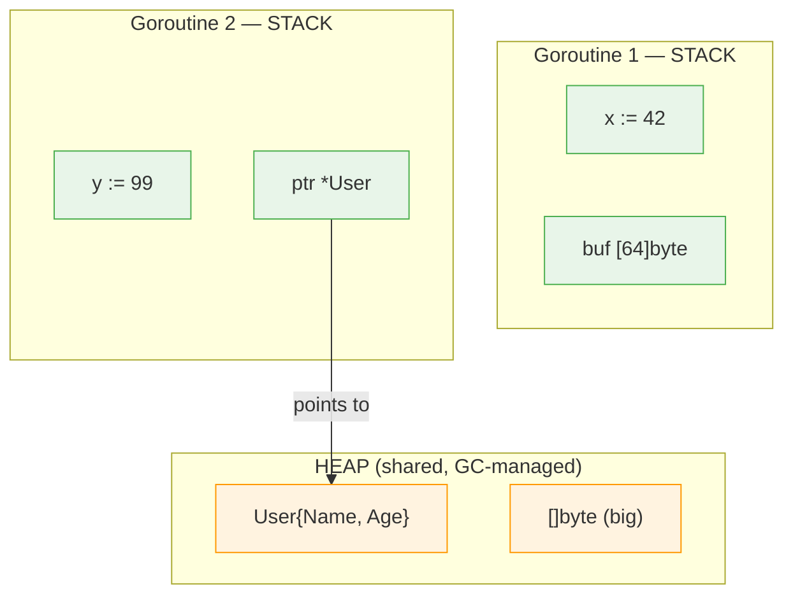
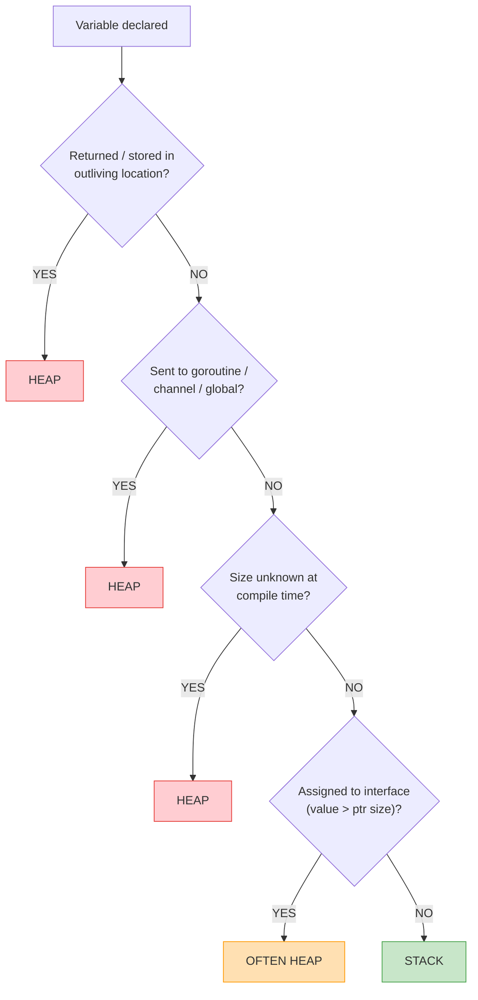
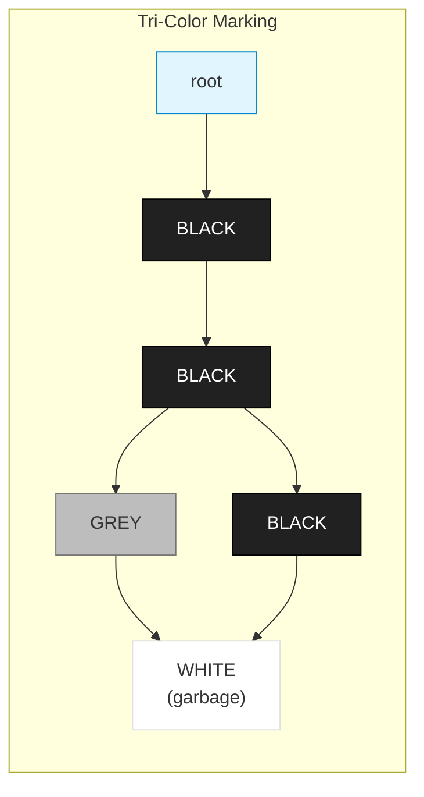
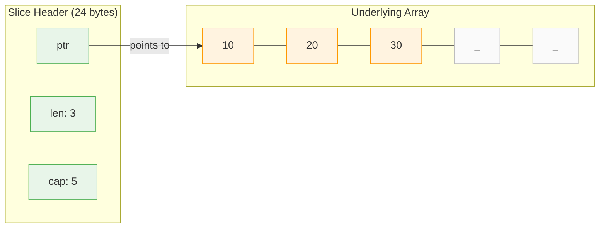

## 1. Concept

Go Memory Allocation & Value Semantics — how data is stored on stack vs heap, passed between functions, and shared across goroutines.

> **Naming trap**: The official "Go Memory Model" (go.dev/ref/mem) is about **happens-before ordering** across goroutines, not stack/heap allocation. If an interviewer hears "Go Memory Model," they'll expect you to talk about visibility guarantees. Use "memory allocation" or "value semantics" when discussing this topic. See [[Go Memory Model (Happens-Before)]] for that topic.

---

## 2. Core Insight (TL;DR)

Go is **strictly pass-by-value**, and the **compiler (via escape analysis)** decides whether data lives on the **stack (~1-2ns, free)** or **heap (~25-50ns + GC cost)**. The programmer never explicitly chooses — `new()` and `&T{}` do NOT guarantee heap allocation.

---

## 3. Mental Model (Lock this in)

### Stack → "Your Desk"

- Private, fast, auto-cleaned on function return
- Each goroutine has its own stack (~2-8 KB initial)

### Heap → "Shared Storage"

- Used when data outlives function or can't stay on stack
- Managed by GC — every heap allocation creates future GC work
- ~12-25x slower than stack allocation

### Pass-by-value → "Everything is a photocopy"

- Even pointers are copied (the address itself, not the data)
- Sharing happens only through internal pointers within copied values



> Stack: ~1-2ns alloc, auto-freed on return. Heap: ~25-50ns alloc + GC scan cost.

---

## 4. How It Actually Works (Internals)

### Escape Analysis: The Compiler's Decision Engine

Escape analysis uses **static data-flow analysis** on the AST. The compiler builds a **directed weighted graph**:

- **Vertices** = variables (allocation sites)
- **Edges** = assignments between variables
- **Edge weights** encode pointer operations:

| Operation | Weight | Meaning |
|---|---|---|
| `p = &q` | -1 | Taking address (increases indirection) |
| `p = q` | 0 | Direct assignment |
| `p = *q` | +1 | Dereference (decreases indirection) |

The compiler walks this graph looking for paths that violate two invariants:
1. Pointers to stack objects **cannot** be stored on the heap
2. Pointers to a stack object **cannot** outlive that object

If either is violated → variable escapes to heap.



### Stack Internals

- Starts small (~2-8 KB per goroutine)
- **Contiguous stack model** (since Go 1.4)
- Growth = allocate **new larger stack** + **copy old data** + **adjust all pointers**

```
BEFORE (~2 KB)              AFTER (~4 KB)
  frame: C()                  frame: C()
  frame: B()   ── copy ──▶    frame: B()
  frame: A()                  frame: A()
                              (room to grow)

ALL pointers into old stack are REWRITTEN.
This is why Go bans pointer arithmetic.
```

### Heap + GC

- **Tri-color concurrent mark-and-sweep** GC (since Go 1.5)
- STW phases: typically **sub-millisecond** (< 100μs)
- Real latency killer: **mark assist** — goroutines allocating during GC are forced to help mark before their allocation proceeds



> WHITE = unvisited (sweep candidate). GREY = visited, children unscanned. BLACK = fully scanned. After marking, remaining WHITE objects are garbage → freed.

### Write Barrier

During a GC cycle, every **pointer write to the heap** goes through a write barrier — a hidden runtime check preserving the tri-color invariant.

> Pointer writes are more expensive than value writes during GC.

---

## 5. Key Rules & Behaviors

1. **Everything is pass-by-value** — no exceptions. Even pointers, slices, maps, and interfaces are copied.
2. **`new()` and `&T{}` do NOT guarantee heap** — escape analysis decides.
3. **Returned pointer → heap**. If a function returns `&x`, `x` escapes.
4. **Shared via goroutine/channel/global → heap**.
5. **Unknown size at compile time → heap** (e.g., `make([]byte, n)` where `n` is a variable).
6. **Constant-sized small slices can be stack-allocated** — the compiler optimizes `make([]T, constant)`.
7. **Slice passed by value**: modifying elements is visible, but `append` may not be (new backing array).
8. **Map is already a pointer** — no need for `*map`. Passing a map shares the data.
9. **Interface boxing**: assigning a value > pointer-size to an interface usually heap-allocates.
10. **More pointers = more GC work** — each pointer is an edge the GC must traverse.

---

## 6. Code Examples (Show, Don't Tell)

### Escape vs no escape

```go
// ESCAPES — returned pointer outlives function
func foo() *int {
    x := 10
    return &x
}

// STAYS ON STACK — pointer used only within scope
func bar() int {
    x := 10
    p := &x
    return *p
}
```

### Pass-by-value with pointer

```go
func update(x *int) {
    *x = 20 // modifies original via dereference
}
```

```
caller: p ──┐      callee: x ──┐
             ▼                   ▼
           [ 42 ]  ◄── both point here (pointer copied, data shared)
```

### Slice header copy

```go
func modify(s []int) {
    s[0] = 100 // ✅ visible — same backing array
}

func grow(s []int) {
    s = append(s, 4) // ❌ may NOT be visible
}
```



> Passing slice = copying the 24-byte header. Both copies see the same array.

### Map is a pointer

```go
m := make(map[string]int)
// m is *runtime.hmap under the hood
// Passing m shares the hash table — no *map needed
```

### Interface internals

```go
type iface struct {     // interface with methods
    tab  *itab          // type + method table
    data unsafe.Pointer // pointer to concrete value
}

type eface struct {     // empty interface (any)
    _type *_type
    data  unsafe.Pointer
}
```

---

## 7. Edge Cases & Gotchas

### The append trap

```go
func grow(s []int) {
    s = append(s, 4) // cap exceeded → new array
}                     // caller's slice unchanged!
```

**Why**: `append` may allocate a new backing array. The local `s` header updates, but the caller's copy still points to the old array.

**Fix**: return the new slice or pass `*[]int`.

```
BEFORE: caller.s ──▶ [10, 20, 30]       (cap=3, full)
INSIDE: local s  ──▶ [10, 20, 30, 4]    (new array!)
AFTER:  caller.s ──▶ [10, 20, 30]       ← unchanged, stale
```

### Slice memory leak from sub-slicing

```go
func getFirstThree(data []byte) []byte {
    return data[:3] // LEAK: holds ref to entire backing array
}
```

**Fix**: copy the subset.

```go
func getFirstThree(data []byte) []byte {
    result := make([]byte, 3)
    copy(result, data[:3])
    return result
}
```

### Interface nil trap

```go
var p *MyStruct = nil
var i interface{} = p
fmt.Println(i == nil) // false!
```

**Why**: An interface is nil only when **both** `tab/type` AND `data` are nil. Wrapping a typed nil gives a non-nil interface.

```go
// BAD — returns non-nil interface wrapping a nil pointer
func getUser() error {
    var err *MyError = nil
    return err
}

// GOOD — returns actual nil interface
func getUser() error {
    return nil
}
```

### Mutex copy via value receiver

```go
type Cache struct {
    mu   sync.Mutex
    data map[string]string
}

// BUG: value receiver copies the mutex!
func (c Cache) Get(key string) string {
    c.mu.Lock() // locking a COPY — no protection
    defer c.mu.Unlock()
    return c.data[key]
}
```

**Fix**: always use pointer receiver with embedded mutexes.

### Loop variable trap

```go
for _, v := range arr {
    go func() {
        fmt.Println(v) // Pre-1.22: all see final value
    }()
}
```

**Go 1.22+**: Fixed at compiler level — loop variable is now per-iteration.

### Closure escape

```go
func makeAdder(n int) func(int) int {
    return func(x int) int {
        return x + n // n escapes to heap
    }
}
```

The closure outlives `makeAdder`, so captured `n` must survive → heap-allocated.

```
closure { code: func(x), env ──▶ [n=5] }  ← env is on the heap
```

---

## 8. Performance & Tradeoffs

### Value vs Pointer Semantics

| Factor | Value | Pointer |
|---|---|---|
| Allocation | ✅ Stack-friendly | ❌ Can trigger escape |
| Cache locality | ✅ Contiguous, cache-friendly | ❌ Pointer chasing, cache misses |
| GC pressure | ✅ No pointers to scan | ❌ Every pointer = GC edge |
| Copy cost | ❌ Expensive if struct > ~128B | ✅ 8 bytes always |
| Mutation sharing | ❌ Requires copy-out/copy-back | ✅ Direct mutation |
| Predictability | ✅ Deterministic | ❌ GC pauses under load |

> For structs ≤ ~128 bytes with read-heavy access: prefer values. For large structs or write-heavy shared state: consider pointers — but always benchmark.

### `map[string]User` vs `map[string]*User` (10M entries)

| Factor | `map[string]User` | `map[string]*User` |
|---|---|---|
| GC pressure | ✅ Low (no extra pointers) | ❌ 10M pointer edges |
| Rehash cost | ❌ Copies all values | ✅ Copies pointers only |
| Mutation | ❌ Copy-out, modify, copy-back | ✅ Direct via pointer |
| `&m["key"]` | ❌ Illegal | ✅ Already a pointer |
| Cache locality | ✅ Contiguous in buckets | ❌ Pointer chasing |

> **Advanced**: `map[string]int32` as index into `[]User` slice — dense values + cheap map ops.

### Zero-Allocation Patterns for Hot Paths

| Technique | Impact | When to Use |
|---|---|---|
| `sync.Pool` for buffers | Eliminates repeated alloc | HTTP handlers, serialization |
| `make([]T, 0, knownCap)` | Prevents append realloc | Known-size batch processing |
| `[]byte` instead of `string` in hot paths | Avoids copy on conversion | Log processing, parsing |
| Byte-level pre-filters | Skip expensive ops early | Regex/PII scanning (~80% skip) |
| Struct-of-arrays over array-of-structs | Better cache utilization | Columnar data access |
| Constant-sized local slices | Stack-allocated by compiler | Fixed-size temp buffers |

---

## 9. Common Misconceptions

| Misconception | Reality |
|---|---|
| Go is pass-by-reference | **WRONG** — strictly pass-by-value, always |
| Pointer = always faster | **WRONG** — adds GC pressure, hurts cache locality |
| Slice is a reference type | **HALF TRUE** — header is a value containing a pointer |
| `new()` always allocates on heap | **WRONG** — escape analysis decides |
| Map values are addressable | **WRONG** — `&m["key"]` is illegal |
| STW pauses are the GC bottleneck | **OUTDATED** — mark assist is the real latency killer |
| Large struct → always use pointer | **WRONG** — measure first; ~128B is roughly the crossover |
| `make([]byte, 1024)` always heap-allocates | **WRONG** — constant size can be stack-allocated |

> Everything is pass-by-value. Some values contain internal pointers that enable shared access.

---

## 10. Related Tooling & Debugging

### Escape analysis inspection

```bash
go build -gcflags="-m"       # basic: what escapes
go build -gcflags="-m -m"    # verbose: WHY it escapes
go build -gcflags="-m -l"    # disable inlining (clearer output)
```

### Allocation profiling

```bash
go test -bench=. -benchmem           # allocs/op in benchmarks
go test -memprofile mem.prof         # heap profile
go tool pprof -alloc_space mem.prof  # total bytes allocated
go tool pprof -inuse_space mem.prof  # currently live bytes
```

### Runtime flags

```bash
GODEBUG=gctrace=1 ./myserver        # GC cycle logging
GOGC=100                             # GC trigger ratio (default)
GOMEMLIMIT=512MiB ./myserver         # soft memory cap (Go 1.19+)
```

### GC tuning

```
GOGC=100 (default): GC at 200MB when live=100MB  → less CPU, more RAM
GOGC=50:            GC at 150MB when live=100MB  → more CPU, less RAM
GOMEMLIMIT=512MiB:  runtime adjusts GC pacing to stay under 512MB
```

> "GOGC trades throughput for memory. GOMEMLIMIT (Go 1.19+) is the modern approach — set a memory budget and the runtime adjusts GC pacing. In production, set GOMEMLIMIT and use high GOGC (or off) to let the limit drive GC."

### Go pointer types (full taxonomy)

| Type | Package | Since | Use Case |
|---|---|---|---|
| `*T` | builtin | 1.0 | Standard pointer |
| `unsafe.Pointer` | unsafe | 1.0 | Type-erased pointer, low-level memory |
| `uintptr` | builtin | 1.0 | Integer holding an address, not traced by GC |
| `atomic.Pointer[T]` | sync/atomic | 1.19 | Lock-free concurrent pointer access |
| `weak.Pointer[T]` | weak | 1.24 | Does not prevent GC collection |

---

## 11. Interview Gold Questions

### Q1: `map[string]User` vs `map[string]*User` for 10M users?

**Answer**: For small structs (< ~128 bytes) with read-heavy access, `map[string]User` — value storage eliminates 10M pointer edges the GC must trace, dramatically reducing mark phase duration and p99 latency. Tradeoff: map rehash is more expensive (copies all values) and mutation requires copy-out/modify/copy-back. For large structs or write-heavy workloads, `map[string]*User` wins on rehash cost. Advanced: use `map[string]int32` indexing into `[]User` slice for best of both.

### Q2: How would you reduce GC pressure in a high-throughput service?

**Answer**: First, profile — `GODEBUG=gctrace=1` and `go tool pprof -alloc_space` to find allocation hotspots. Then: (1) `sync.Pool` for hot-path buffers, (2) value semantics for small structs, (3) pre-allocate slices with known capacity, (4) avoid interface boxing in tight loops, (5) use `[]byte` instead of `string` in parsing paths to avoid copy, (6) tune `GOMEMLIMIT` for a memory budget rather than relying solely on GOGC. The chain: fewer heap allocs → fewer live objects → shorter mark phase → less mark assist → better p99.

### Q3: Explain why `new()` doesn't always mean heap allocation.

**Answer**: `new(T)` allocates memory for type `T` and returns a pointer, but escape analysis decides where. If the pointer never escapes the function (not returned, not sent to a goroutine, not stored in a long-lived location), the compiler allocates on the stack. Similarly `&T{}`. You can verify with `go build -gcflags="-m"`. This is why Go doesn't need malloc/free — the compiler optimizes placement automatically.

---

## 12. Final Verbal Answer

> "Go is strictly pass-by-value. The compiler uses escape analysis — a static data-flow analysis that builds a directed graph of assignments — to decide whether variables live on the stack or heap. Stack allocation is near-free at 1-2 nanoseconds, while heap allocation costs 25-50 nanoseconds plus future garbage collection work. The GC is a concurrent tri-color mark-and-sweep collector where STW pauses are sub-millisecond, but the real production cost is mark assist — goroutines forced to help with GC marking during allocation, causing tail latency spikes. Types like slices, maps, and interfaces appear reference-like because they contain internal pointers, but the headers themselves are always copied by value. In high-performance systems, minimizing heap allocations is critical — using value semantics for small structs, sync.Pool for buffer reuse, pre-allocated slices, and GOMEMLIMIT tuning to keep GC pressure under control."

---
