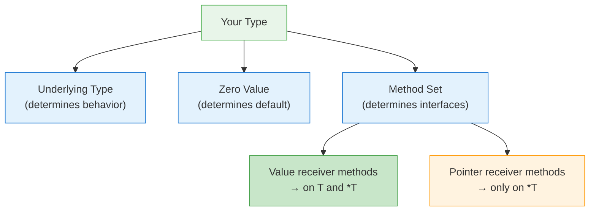
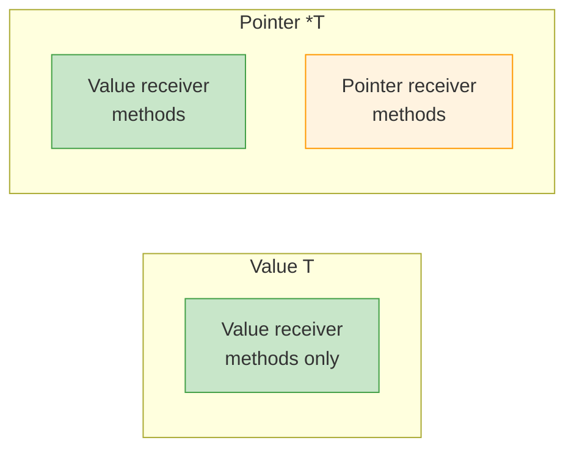
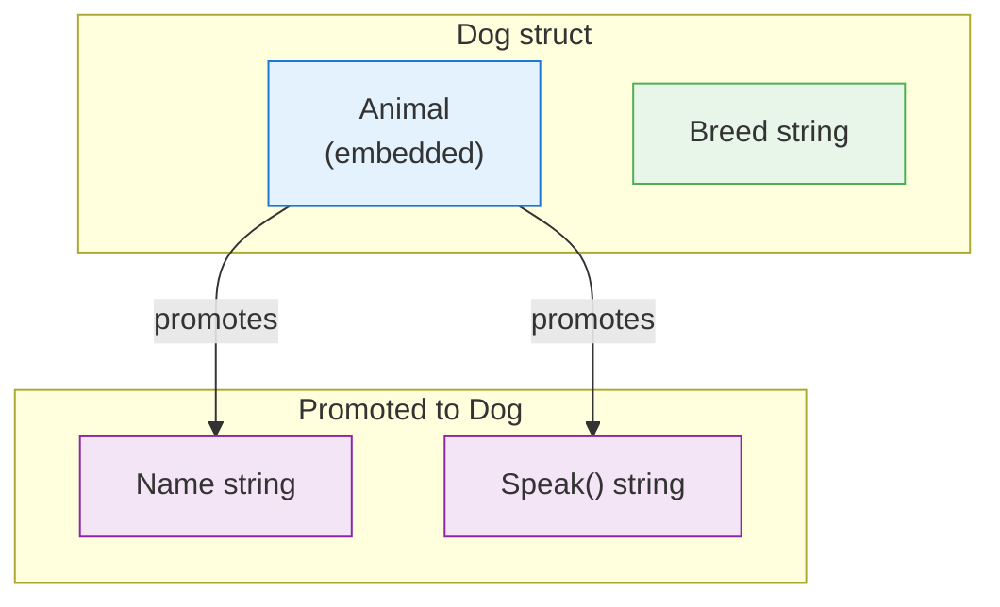

## 1. Concept

Go's type system — how types are defined, how they relate to each other, and the rules governing identity, assignability, method sets, and composition. The foundation every other Go concept builds on.

> **Scope note**: This covers the type system itself (defined types, aliases, underlying types, zero values, method sets, embedding). For stack/heap allocation and pass-by-value mechanics, see [[Go Memory Allocation & Value Semantics]].

---

## 2. Core Insight (TL;DR)

Go is **statically typed** with **structural typing for interfaces** (satisfied implicitly, not declared). Every type has an **underlying type**, a **zero value**, and a **method set** that determines what interfaces it satisfies. Understanding the rules of **type identity vs assignability** and **value vs pointer receiver method sets** is what separates senior Go engineers from mid-level ones.

---

## 3. Mental Model (Lock this in)

### Types are blueprints, values are the thing built from them

- Every variable has a type, known at compile time
- Every type has a **zero value** — Go never has uninitialized memory
- Types don't inherit; they **compose** via embedding

### The Three Questions for Any Type

1. **What is its underlying type?** (determines behavior)
2. **What is its zero value?** (determines safety)
3. **What is its method set?** (determines interface satisfaction)



---

## 4. How It Actually Works (Internals)

### Defined Types vs Type Aliases

```go
type Celsius float64    // DEFINED TYPE — new type, own method set
type Temperature = float64  // TYPE ALIAS — same type, no own methods
```

| Feature | Defined Type (`type X T`) | Type Alias (`type X = T`) |
|---|---|---|
| New type? | ✅ Yes, distinct from T | ❌ No, identical to T |
| Own methods? | ✅ Can attach methods | ❌ Cannot add methods |
| Assignable to T? | ❌ Requires explicit conversion | ✅ Directly assignable |
| Underlying type | T | T |
| Use case | Domain modeling, type safety | Gradual refactoring, cross-package access |

### Underlying Types

Every type has an underlying type. For predeclared types (int, string, bool), the underlying type is itself. For defined types, it's the type in the definition:

```go
type Celsius float64     // underlying: float64
type Point struct{X, Y int}  // underlying: struct{X, Y int}
type Weights []float64   // underlying: []float64
```

> Two types are **identical** only if they have the same name in the same package, or if they're both unnamed with identical structure.

### Type Identity vs Assignability

```go
type MyInt int
var a int = 42
var b MyInt = a    // COMPILE ERROR: different types
var c MyInt = MyInt(a)  // OK: explicit conversion

var s []int
var t []int
s = t  // OK: same unnamed type
```

**Assignability rules** (when `x` can be assigned to type `T`):
1. `x`'s type is identical to `T`
2. `x`'s type and `T` have identical underlying types, and at least one is unnamed
3. `T` is an interface and `x` implements `T`
4. `x` is the untyped nil and `T` is a pointer, function, slice, map, channel, or interface
5. `x` is an untyped constant representable by type `T`

### Zero Values

Go guarantees every variable is initialized to its **zero value** — there is no uninitialized memory:

| Type Category | Zero Value |
|---|---|
| `bool` | `false` |
| Numeric (`int`, `float64`, etc.) | `0` |
| `string` | `""` (empty string) |
| Pointer, function, slice, map, channel, interface | `nil` |
| Array | All elements zeroed |
| Struct | All fields zeroed |

> Design types so their zero value is **useful**. `sync.Mutex{}` is ready to use. `bytes.Buffer{}` is an empty buffer. This is idiomatic Go.

### Method Sets: The Interface Gateway

The method set determines which interfaces a type satisfies:

| Receiver | Methods available on `T` | Methods available on `*T` |
|---|---|---|
| `func (t T) M()` | ✅ Yes | ✅ Yes |
| `func (t *T) M()` | ❌ No | ✅ Yes |

> **`*T` gets everything. `T` only gets value receiver methods.**

This is the most tested type system rule in Go interviews.



### Struct Embedding (Composition, NOT Inheritance)

```go
type Animal struct {
    Name string
}
func (a Animal) Speak() string { return a.Name + " speaks" }

type Dog struct {
    Animal       // embedded — promotes fields + methods
    Breed string
}

d := Dog{Animal{"Rex"}, "Labrador"}
d.Name      // promoted from Animal
d.Speak()   // promoted from Animal
```

Under the hood: the compiler rewrites `d.Speak()` as `d.Animal.Speak()`. The receiver is **always the embedded type**, not the outer type.



---

## 5. Key Rules & Behaviors

1. **Defined types create new types** — `type X int` makes `X` and `int` distinct; explicit conversion required.
2. **Type aliases are the same type** — `type X = int` is just another name for `int`.
3. **Underlying type determines convertibility** — types with the same underlying type can be explicitly converted.
4. **Zero values are guaranteed** — every variable is initialized; no garbage memory.
5. **Design for useful zero values** — `sync.Mutex{}`, `bytes.Buffer{}`, `http.Client{}` all work at zero.
6. **Method sets are asymmetric** — `*T` has all methods; `T` only has value receiver methods.
7. **Interface satisfaction is implicit** — no `implements` keyword; just match the method set.
8. **Embedding promotes, doesn't inherit** — the embedded type is the receiver, not the outer type.
9. **Embedding multiple types** that share a method name → ambiguity compile error (must disambiguate).
10. **Untyped constants** are assignable to any compatible type without explicit conversion.

---

## 6. Code Examples (Show, Don't Tell)

### Defined type vs underlying type

```go
type UserID int64
type OrderID int64

var uid UserID = 42
var oid OrderID = uid // COMPILE ERROR: different types!
var oid OrderID = OrderID(uid) // OK: same underlying type
```

### Zero value usefulness

```go
var mu sync.Mutex   // ready to use, no initialization needed
mu.Lock()
defer mu.Unlock()

var buf bytes.Buffer // empty buffer, ready to write
buf.WriteString("hello")
```

### Method set and interface satisfaction

```go
type Sizer interface {
    Size() int
}

type File struct{ name string }

func (f *File) Size() int { return len(f.name) }

var s Sizer
s = &File{"test.go"} // ✅ *File has Size()
s = File{"test.go"}  // ❌ COMPILE ERROR: File (value) lacks Size()
```

### Embedding and method promotion

```go
type Logger struct{}
func (l Logger) Log(msg string) { fmt.Println(msg) }

type Server struct {
    Logger  // embedding
    Addr string
}

s := Server{Addr: ":8080"}
s.Log("started") // promoted from Logger
```

### The embedding "inheritance" trap

```go
type Base struct{}
func (b Base) Name() string { return "Base" }
func (b Base) Greet() string { return "Hello, " + b.Name() }

type Derived struct{ Base }
func (d Derived) Name() string { return "Derived" }

d := Derived{}
fmt.Println(d.Greet()) // "Hello, Base" — NOT "Hello, Derived"!
```

> `Greet()` calls `b.Name()` where `b` is `Base`, not `Derived`. Embedding is delegation, not polymorphism.

---

## 7. Edge Cases & Gotchas

### Value can't satisfy pointer-receiver interface

```go
type Writer interface { Write([]byte) }
type MyWriter struct{}
func (w *MyWriter) Write(b []byte) {}

var w Writer = MyWriter{} // ❌ COMPILE ERROR
var w Writer = &MyWriter{} // ✅ OK
```

**Why**: Go won't silently take the address of a value stored in an interface, because the interface holds a copy — mutations via pointer receiver would be lost.

### Method calling flexibility is syntactic sugar ONLY

```go
v := MyWriter{}
v.Write(data) // ✅ works: compiler rewrites to (&v).Write(data)

// BUT for interfaces, this sugar does NOT apply:
var w Writer = v // ❌ still fails
```

> Direct method calls get automatic `&v` insertion. Interface assignment does not.

### Ambiguous embedding

```go
type A struct{}
func (A) Foo() {}

type B struct{}
func (B) Foo() {}

type C struct{ A; B }

c := C{}
c.Foo() // ❌ COMPILE ERROR: ambiguous selector
c.A.Foo() // ✅ disambiguate explicitly
```

### Map values are not addressable

```go
type User struct{ Name string }
m := map[string]User{"alice": {"Alice"}}
m["alice"].Name = "Bob" // ❌ COMPILE ERROR: cannot assign to map value
```

**Fix**: copy out, modify, assign back:

```go
u := m["alice"]
u.Name = "Bob"
m["alice"] = u
```

Or use `map[string]*User` for direct mutation.

### Nil interface vs typed nil (from [[Go Memory Allocation & Value Semantics]])

```go
var p *MyStruct = nil
var i interface{} = p
i == nil // false — type info is non-nil
```

### Comparable types and map keys

Not all types can be map keys or compared with `==`:

| Comparable? | Types |
|---|---|
| ✅ Yes | bool, numeric, string, pointer, channel, interface, array (if element type is comparable), struct (if all fields comparable) |
| ❌ No | slice, map, function |

```go
m := map[[]int]string{} // ❌ COMPILE ERROR: slice not comparable
```

---

## 8. Performance & Tradeoffs

### Value Receiver vs Pointer Receiver

| Factor | Value Receiver | Pointer Receiver |
|---|---|---|
| Copies data? | ✅ Yes (safe, no side effects) | ❌ No (shared, can mutate) |
| Interface satisfaction | Only value-receiver interfaces | All interfaces |
| Stack-friendly? | ✅ Stays on stack easily | ❌ May cause escape |
| Large structs? | ❌ Expensive copy | ✅ 8-byte pointer |
| Consistency rule | Use for small immutable types | Use if ANY method mutates |

> **Bill Kennedy's rule**: If any method on a type uses a pointer receiver, ALL methods should use pointer receiver for consistency. Mixing confuses the reader about mutation intent.

### Defined Type vs Type Alias

| Use Case | Defined Type | Type Alias |
|---|---|---|
| Domain modeling (`UserID`, `Currency`) | ✅ Prefer — type safety | ❌ No safety |
| Gradual refactoring | ❌ Breaks callers | ✅ Non-breaking |
| Adding methods to external type | ✅ Required | ❌ Can't add methods |
| Cross-package type migration | ❌ New type | ✅ Same type |

### Embedding vs Field

| Factor | Embedding | Named Field |
|---|---|---|
| Promotes methods | ✅ Yes | ❌ No |
| Interface satisfaction via promoted methods | ✅ Yes | ❌ No |
| Name collision risk | ❌ Ambiguity errors | ✅ Explicit access |
| Clarity of intent | ❌ Can mislead (looks like inheritance) | ✅ Explicit composition |

---

## 9. Common Misconceptions

| Misconception | Reality |
|---|---|
| Embedding is inheritance | **WRONG** — it's delegation/composition; receiver is always the embedded type |
| Value `T` has all methods of `*T` | **WRONG** — `T` only has value receiver methods; `*T` has both |
| `type X int` and `int` are the same | **WRONG** — they're distinct types; explicit conversion required |
| `type X = int` creates a new type | **WRONG** — it's an alias; `X` IS `int` |
| Zero value means uninitialized | **WRONG** — zero value is a deliberate, defined, safe state |
| You need constructors in Go | **WRONG** — design for useful zero values instead; use `NewX()` only when needed |
| Struct embedding means the outer type IS-A inner type | **WRONG** — outer type HAS-A inner type with promoted access |

---

## 10. Related Tooling & Debugging

### Type inspection

```bash
go vet ./...                    # catches interface satisfaction issues
go build -gcflags="-m"          # shows escape analysis (type-related escapes)
```

### Compile-time interface checks

```go
// Force compile error if *Server doesn't implement Handler
var _ Handler = (*Server)(nil)
```

This is a zero-cost compile-time assertion pattern. Use it to catch interface satisfaction bugs early.

### Struct size and alignment

```bash
go tool objdump -s "main.MyStruct" ./binary  # check layout
```

```go
import "unsafe"
fmt.Println(unsafe.Sizeof(MyStruct{}))   // total size
fmt.Println(unsafe.Alignof(MyStruct{}))  // alignment requirement
```

---

## 11. Interview Gold Questions

### Q1: Why can't a value type satisfy an interface with pointer receiver methods?

**Answer**: When you assign a value to an interface, the interface stores a **copy** of that value. If Go allowed pointer-receiver methods on that copy, any mutations would happen to the interface's internal copy, not the original — silently losing writes. Go prevents this at compile time. The fix: assign a pointer to the interface (`&val`), or switch to value receivers if mutation isn't needed.

### Q2: What's the difference between `type X int` and `type X = int`?

**Answer**: `type X int` creates a **new defined type** with `int` as its underlying type. `X` and `int` are distinct — you can't assign between them without explicit conversion, and you can attach methods to `X`. `type X = int` creates a **type alias** — `X` IS `int`, no conversion needed, but you can't add methods to `X`. Use defined types for domain modeling and type safety (`UserID`, `Currency`). Use aliases for gradual refactoring and cross-package migration.

### Q3: How does struct embedding differ from inheritance in OOP languages?

**Answer**: Embedding promotes the embedded type's fields and methods to the outer type for convenience, but it's composition, not inheritance. The critical difference: when a promoted method runs, its receiver is always the **embedded type**, not the outer type. So if `Base.Greet()` calls `b.Name()`, it calls `Base.Name()` even if the outer `Derived` type overrides `Name()`. There's no virtual dispatch. This means embedding can't be used for the Template Method pattern or polymorphism — it's pure delegation.

---

## 12. Final Verbal Answer

> "Go has a statically typed system with structural interface satisfaction — types implement interfaces implicitly by having the right method set, no `implements` keyword needed. Every type has an underlying type, a guaranteed zero value, and a method set. The critical rule: a value of type `T` only has value-receiver methods in its method set, while `*T` has both value and pointer receiver methods. This matters for interface satisfaction — a value can't satisfy an interface requiring pointer-receiver methods, because the interface stores a copy and mutations would be lost. Go uses composition over inheritance through struct embedding, which promotes fields and methods but is delegation, not polymorphism — the embedded type is always the receiver. Defined types create new distinct types for type safety, while type aliases are just alternate names. Designing for useful zero values is idiomatic — `sync.Mutex{}`, `bytes.Buffer{}`, and `http.Client{}` all work without initialization."

---
