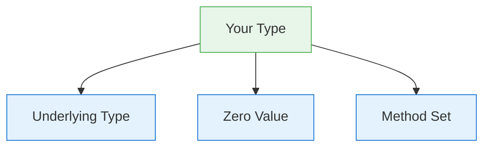

> **Reading Guide**: Sections 1-3 and 6 are essential first read (20 min).
> Sections 4-5 deepen understanding (15 min).
> Sections 7-12 are interview-specific — read closer to interview day.
> Section 13 is your comprehensive interview Q&A bank → [[questions/T01 Go Type System - Interview Questions]]
> Something not clicking? → [[simplified/T01 Go Type System & Value Semantics - Simplified]]

---

## 1. Concept

Go's type system — how types are defined, how they relate to each other, and the rules governing identity, assignability, method sets, and composition. The foundation every other Go concept builds on.

> **Scope note**: This covers the type system itself (defined types, aliases, underlying types, zero values, method sets, embedding). For stack/heap allocation and pass-by-value mechanics, see [[T02 Go Memory Allocation & Value Semantics]].

---

## 2. Core Insight (TL;DR)

Go is **statically typed** with **structural typing for interfaces** (satisfied implicitly, not declared). Every type has an **underlying type**, a **zero value**, and a **method set** that determines what interfaces it satisfies. Understanding the rules of **type identity vs assignability** and **value vs pointer receiver method sets** is what separates senior Go engineers from mid-level ones.

---

## 3. Mental Model (Lock this in)

### Types are blueprints, values are the thing built from them

- Every variable has a type, known at compile time
- Every type has a **zero value** — Go never has uninitialized memory
- Types don't inherit; they **compose** via embedding

### The Three Questions for Any Type

1. **What is its underlying type?** (determines behavior)
2. **What is its zero value?** (determines safety)
3. **What is its method set?** (determines interface satisfaction)

> **In plain English:** Go doesn't care what you call your type — it only cares what methods it has. If it walks like a duck and quacks like a duck, it satisfies the "Duck" interface. No signup form needed.



```
Method set rules:
  Value T    → only value receiver methods
  Pointer *T → value receiver methods + pointer receiver methods

  *T gets everything. T only gets value receiver methods.
```

---

## 4. How It Actually Works (Internals) [INTERMEDIATE → ADVANCED]

### Defined Types vs Type Aliases

```go
type Celsius float64       // DEFINED TYPE — new type, own method set
type Temperature = float64 // TYPE ALIAS — same type, no own methods
```

```
Defined type:  type Celsius float64
  Creates a BRAND NEW type called Celsius
  Celsius and float64 are DIFFERENT types — can't assign between them
  BUT you can convert: Celsius(3.14) or float64(c)
  You CAN attach methods to Celsius

Type alias:  type Temperature = float64
  Temperature IS float64 — just another name
  No conversion needed: var t Temperature = 3.14
  You CANNOT attach methods to Temperature
```

> **In plain English:** A defined type is like creating a new brand of coffee — it's still coffee inside, but you can't accidentally mix it with tea. A type alias is just a nickname — same coffee, different label.

| Feature | Defined Type (`type X T`) | Type Alias (`type X = T`) |
|---|---|---|
| New type? | ✅ Yes, distinct from T | ❌ No, identical to T |
| Own methods? | ✅ Can attach methods | ❌ Cannot add methods |
| Assignable to T? | ❌ Requires explicit conversion | ✅ Directly assignable |
| Underlying type | T | T |
| Use case | Domain modeling, type safety | Gradual refactoring, cross-package access |

### Underlying Types

Every type has an underlying type. For predeclared types (int, string, bool), the underlying type is itself. For defined types, it's the type in the definition:

```go
type Celsius float64         // underlying: float64
type Point struct{X, Y int}  // underlying: struct{X, Y int}
type Weights []float64       // underlying: []float64
```

> Two types are **identical** only if they have the same name in the same package, or if they're both unnamed with identical structure.

### Type Identity vs Assignability

```go
type MyInt int
var a int = 42
var b MyInt = a        // COMPILE ERROR: different types
var c MyInt = MyInt(a) // OK: explicit conversion
```

```
Step 1: a is type int, value 42
Step 2: b is type MyInt — even though MyInt's underlying type is int,
        MyInt and int are DIFFERENT types.
        You can't assign int to MyInt directly.
Step 3: MyInt(a) — explicit conversion works because they share
        the same underlying type (int).
```

**Assignability rules** (when `x` can be assigned to type `T`):
1. `x`'s type is identical to `T`
2. `x`'s type and `T` have identical underlying types, and at least one is unnamed
3. `T` is an interface and `x` implements `T`
4. `x` is the untyped nil and `T` is a pointer, function, slice, map, channel, or interface
5. `x` is an untyped constant representable by type `T`

### Zero Values

Go guarantees every variable is initialized to its **zero value** — there is no uninitialized memory:

| Type Category | Zero Value |
|---|---|
| `bool` | `false` |
| Numeric (`int`, `float64`, etc.) | `0` |
| `string` | `""` (empty string) |
| Pointer, function, slice, map, channel, interface | `nil` |
| Array | All elements zeroed |
| Struct | All fields zeroed |

> Design types so their zero value is **useful**. `sync.Mutex{}` is ready to use. `bytes.Buffer{}` is an empty buffer. This is idiomatic Go.

> **In plain English:** In Go, there's no such thing as "uninitialized." Every variable starts with a sensible default — numbers start at 0, strings start empty, booleans start false. It's like every seat in a theater having a default "empty" card on it before anyone sits down.

### Method Sets: The Interface Gateway

The method set determines which interfaces a type satisfies:

| Receiver | Methods available on `T` | Methods available on `*T` |
|---|---|---|
| `func (t T) M()` | ✅ Yes | ✅ Yes |
| `func (t *T) M()` | ❌ No | ✅ Yes |

> **`*T` gets everything. `T` only gets value receiver methods.**

This is the most tested type system rule in Go interviews.

```
Why this asymmetry?

Value receiver: func (t T) M()
  Works on T:  Go copies the value → safe, no side effects
  Works on *T: Go auto-dereferences → (*p).M() copies the pointed-to value

Pointer receiver: func (t *T) M()
  Works on *T: pointer is passed → can modify original
  FAILS on T stored in interface: interface holds a COPY of T
    If Go auto-took &copy, mutations would hit the copy, not the original
    → silently wrong behavior → Go prevents this at compile time
```

### Struct Embedding (Composition, NOT Inheritance)

```go
type Animal struct {
    Name string
}
func (a Animal) Speak() string { return a.Name + " speaks" }

type Dog struct {
    Animal       // embedded — promotes fields + methods
    Breed string
}

d := Dog{Animal{"Rex"}, "Labrador"}
d.Name      // promoted from Animal
d.Speak()   // promoted from Animal
```

```
What embedding looks like in memory:

Dog struct in memory:
  [ Animal { Name: "Rex" } | Breed: "Labrador" ]
    ↑ embedded, not a pointer

d.Speak() is syntactic sugar for d.Animal.Speak()
The receiver of Speak() is ALWAYS Animal, not Dog.
```

> **In plain English:** Embedding is like hiring a specialist. A Hospital doesn't become a Doctor — it has a Doctor on staff. When someone asks the Hospital to diagnose, the Doctor does the work. The Hospital gets credit for having the capability, but the Doctor is always the one doing it.

---

## 5. Key Rules & Behaviors

1. **Defined types create new types** — `type X int` makes `X` and `int` distinct; explicit conversion required.
2. **Type aliases are the same type** — `type X = int` is just another name for `int`.
3. **Underlying type determines convertibility** — types with the same underlying type can be explicitly converted.
4. **Zero values are guaranteed** — every variable is initialized; no garbage memory.
5. **Design for useful zero values** — `sync.Mutex{}`, `bytes.Buffer{}`, `http.Client{}` all work at zero.
6. **Method sets are asymmetric** — `*T` has all methods; `T` only has value receiver methods.
7. **Interface satisfaction is implicit** — no `implements` keyword; just match the method set.
8. **Embedding promotes, doesn't inherit** — the embedded type is the receiver, not the outer type.
9. **Embedding multiple types** that share a method name → ambiguity compile error (must disambiguate).
10. **Untyped constants** are assignable to any compatible type without explicit conversion.

---

## 6. Code Examples (Show, Don't Tell)

### Defined type vs underlying type

```go
type UserID int64
type OrderID int64

var uid UserID = 42
var oid OrderID = uid          // COMPILE ERROR: different types!
var oid2 OrderID = OrderID(uid) // OK: same underlying type
```

```
Step 1: uid is type UserID, value 42
Step 2: oid = uid → FAILS because UserID and OrderID are different types
        Even though both have underlying type int64!
        This is the POINT of defined types — type safety.
Step 3: OrderID(uid) → explicit conversion works
        Compiler knows both underlying types are int64 → safe to convert
```

### Zero value usefulness

```go
var mu sync.Mutex   // ready to use, no initialization needed
mu.Lock()
defer mu.Unlock()

var buf bytes.Buffer // empty buffer, ready to write
buf.WriteString("hello")
```

```
In many languages, you'd need:
  mu = new Mutex()
  buf = new Buffer()

In Go, the zero value IS the initialized state:
  sync.Mutex{}  → locked: false, ready to Lock()
  bytes.Buffer{} → empty buffer, ready to Write()
  
This is a design principle, not an accident.
```

### Method set and interface satisfaction

```go
type Sizer interface {
    Size() int
}

type File struct{ name string }

func (f *File) Size() int { return len(f.name) }

var s Sizer
s = &File{"test.go"} // ✅ *File has Size()
s = File{"test.go"}  // ❌ COMPILE ERROR: File (value) lacks Size()
```

```
Step 1: Sizer interface requires: Size() int

Step 2: Size() is defined on *File (pointer receiver)
  *File method set: { Size() }   ← has it
  File method set:  { }          ← empty! No value receiver methods.

Step 3: s = &File{...}  → *File satisfies Sizer → ✅
Step 4: s = File{...}   → File does NOT satisfy Sizer → ❌
                          <-- this is the #1 type system interview question

Why? If Go stored a copy of File in the interface and allowed
pointer-receiver methods, mutations would hit the copy, not your original.
Go prevents this silent bug at compile time.
```

### Embedding and method promotion

```go
type Logger struct{}
func (l Logger) Log(msg string) { fmt.Println(msg) }

type Server struct {
    Logger  // embedding
    Addr string
}

s := Server{Addr: ":8080"}
s.Log("started") // promoted from Logger
```

```
Step 1: Server embeds Logger (not a field name, just the type)
Step 2: Logger has method Log()
Step 3: Go promotes Log() to Server — s.Log() works
Step 4: Under the hood: s.Log("started") → s.Logger.Log("started")
        The receiver is Logger, NOT Server
```

### The embedding "inheritance" trap

```go
type Base struct{}
func (b Base) Name() string { return "Base" }
func (b Base) Greet() string { return "Hello, " + b.Name() }

type Derived struct{ Base }
func (d Derived) Name() string { return "Derived" }

d := Derived{}
fmt.Println(d.Greet()) // "Hello, Base" — NOT "Hello, Derived"!
```

```
Step 1: d.Greet() → Go looks for Greet() on Derived
        Derived doesn't have Greet() directly
        But embedded Base does → promoted → calls Base.Greet()

Step 2: Inside Base.Greet(): "Hello, " + b.Name()
        b is type Base (the receiver is ALWAYS the embedded type)
        b.Name() calls Base.Name() → "Base"

Step 3: Result: "Hello, Base"
                 <-- NOT "Hello, Derived"!

In most OOP languages, this would call Derived's Name(). Not in Go.
In Go: b.Name() calls Base.Name() because b IS Base. No virtual dispatch.
This is delegation, not polymorphism.
```

---

## 6.5. Practice Checkpoint

### Tier 1: Predict the Output (2 min)

Paste into [Go Playground](https://go.dev/play/) and predict output BEFORE running:

```go
package main

import "fmt"

type Animal struct{ Sound string }
func (a Animal) Speak() string { return a.Sound }

type Dog struct {
    Animal
    Sound string
}

func main() {
    d := Dog{Animal{"woof"}, "bark"}
    fmt.Println(d.Sound)
    fmt.Println(d.Speak())
}
```

<details>
<summary>Answer</summary>

`bark` then `woof`. `d.Sound` accesses Dog's own `Sound` field (shadows Animal's). But `d.Speak()` calls `Animal.Speak()` which uses `a.Sound` — Animal's Sound, which is "woof".

</details>

### Tier 2: Fix the Bug (5 min)

This code should implement the `Stringer` interface but doesn't compile:

```go
type User struct {
    Name string
    Age  int
}

func (u *User) String() string {
    return fmt.Sprintf("%s (age %d)", u.Name, u.Age)
}

func printUser(s fmt.Stringer) {
    fmt.Println(s.String())
}

func main() {
    u := User{"Alice", 30}
    printUser(u) // doesn't compile!
}
```

<details>
<summary>Hint</summary>

`String()` is defined on `*User` (pointer receiver), but `u` is a value. Value types don't have pointer-receiver methods in their method set.

</details>

<details>
<summary>Fix</summary>

Either change to value receiver: `func (u User) String()` or pass a pointer: `printUser(&u)`.

</details>

### Tier 3: Build It (15 min)

1. Create a `Shape` interface with `Area() float64`
2. Implement it for `Circle` (value receiver) and `Rectangle` (pointer receiver)
3. Write a function `printArea(s Shape)` and call it with both types
4. Observe which requires `&` and which doesn't. Then verify with `var _ Shape = Circle{}` and `var _ Shape = (*Rectangle)(nil)` compile-time checks.

> Full solutions with explanations → [[exercises/T01 Go Type System - Exercises]]

---

## 7. Edge Cases & Gotchas

### Value can't satisfy pointer-receiver interface

```go
type Writer interface { Write([]byte) }
type MyWriter struct{}
func (w *MyWriter) Write(b []byte) {}

var w Writer = MyWriter{}  // ❌ COMPILE ERROR
var w Writer = &MyWriter{} // ✅ OK
```

```
MyWriter method set:  { }           ← no methods (Write is on *MyWriter)
*MyWriter method set: { Write() }   ← has it

Interface stores a COPY of the value.
If Go allowed pointer-receiver methods on a copy:
  mutations would hit the copy, not your original → silent data loss
Go prevents this at compile time.
```

**Why**: Go won't silently take the address of a value stored in an interface, because the interface holds a copy — mutations via pointer receiver would be lost.

> **In plain English:** When you put a value into an interface box, Go makes a photocopy. If the method needs to modify the original, a photocopy won't do — so Go blocks it at compile time rather than letting you silently modify a copy.

### Method calling flexibility is syntactic sugar ONLY

```go
v := MyWriter{}
v.Write(data) // ✅ works: compiler rewrites to (&v).Write(data)

// BUT for interfaces, this sugar does NOT apply:
var w Writer = v // ❌ still fails
```

```
Direct method call:
  v.Write(data) → compiler sees v is addressable → rewrites to (&v).Write(data)
  This is syntactic sugar — a convenience the compiler provides.

Interface assignment:
  var w Writer = v → compiler checks method set of MyWriter (not *MyWriter)
  MyWriter has no Write() → COMPILE ERROR
  
  The sugar does NOT apply here because the interface would store a COPY,
  and taking &copy would be meaningless (not your original v).
```

> Direct method calls get automatic `&v` insertion. Interface assignment does not.

### Ambiguous embedding

```go
type A struct{}
func (A) Foo() {}

type B struct{}
func (B) Foo() {}

type C struct{ A; B }

c := C{}
c.Foo()   // ❌ COMPILE ERROR: ambiguous selector
c.A.Foo() // ✅ disambiguate explicitly
```

```
C embeds both A and B.
Both A and B have Foo().
Go promotes BOTH → conflict at the same depth level.
c.Foo() is ambiguous — which Foo()?
Fix: call explicitly via c.A.Foo() or c.B.Foo()
```

### Map values are not addressable

```go
type User struct{ Name string }
m := map[string]User{"alice": {"Alice"}}
m["alice"].Name = "Bob" // ❌ COMPILE ERROR: cannot assign to map value
```

```
Why? Map entries can MOVE in memory (rehashing, growing).
If Go gave you a pointer to an entry, it could become invalid after rehash.
So Go makes map values non-addressable — you can't modify them in place.
```

**Fix**: copy out, modify, assign back:

```go
u := m["alice"]
u.Name = "Bob"
m["alice"] = u
```

Or use `map[string]*User` for direct mutation.

### Nil interface vs typed nil (from [[T02 Go Memory Allocation & Value Semantics]])

```go
var p *MyStruct = nil
var i interface{} = p
i == nil // false — type info is non-nil
```

```
i = [ type: *MyStruct | data: nil ]
     type is NOT nil → interface is NOT nil

For true nil: var i interface{} = nil
i = [ type: nil | data: nil ] → i == nil is true
```

### Comparable types and map keys

Not all types can be map keys or compared with `==`:

| Comparable? | Types |
|---|---|
| ✅ Yes | bool, numeric, string, pointer, channel, interface, array (if element type is comparable), struct (if all fields comparable) |
| ❌ No | slice, map, function |

```go
m := map[[]int]string{} // ❌ COMPILE ERROR: slice not comparable
```

> **In plain English:** Some types in Go are too complex to compare with `==` — slices, maps, and functions. It's like asking "are these two recipes the same?" — there's no simple yes/no answer, so Go refuses to guess.

---

## 8. Performance & Tradeoffs

### Value Receiver vs Pointer Receiver

| Factor | Value Receiver | Pointer Receiver |
|---|---|---|
| Copies data? | ✅ Yes (safe, no side effects) | ❌ No (shared, can mutate) |
| Interface satisfaction | Only value-receiver interfaces | All interfaces |
| Stack-friendly? | ✅ Stays on stack easily | ❌ May cause escape |
| Large structs? | ❌ Expensive copy | ✅ 8-byte pointer |
| Consistency rule | Use for small immutable types | Use if ANY method mutates |

> **Bill Kennedy's rule**: If any method on a type uses a pointer receiver, ALL methods should use pointer receiver for consistency. Mixing confuses the reader about mutation intent.

### Defined Type vs Type Alias

| Use Case | Defined Type | Type Alias |
|---|---|---|
| Domain modeling (`UserID`, `Currency`) | ✅ Prefer — type safety | ❌ No safety |
| Gradual refactoring | ❌ Breaks callers | ✅ Non-breaking |
| Adding methods to external type | ✅ Required | ❌ Can't add methods |
| Cross-package type migration | ❌ New type | ✅ Same type |

### Embedding vs Field

| Factor | Embedding | Named Field |
|---|---|---|
| Promotes methods | ✅ Yes | ❌ No |
| Interface satisfaction via promoted methods | ✅ Yes | ❌ No |
| Name collision risk | ❌ Ambiguity errors | ✅ Explicit access |
| Clarity of intent | ❌ Can mislead (looks like inheritance) | ✅ Explicit composition |

---

## 9. Common Misconceptions

| Misconception | Reality |
|---|---|
| Embedding is inheritance | **WRONG** — it's delegation/composition; receiver is always the embedded type |
| Value `T` has all methods of `*T` | **WRONG** — `T` only has value receiver methods; `*T` has both |
| `type X int` and `int` are the same | **WRONG** — they're distinct types; explicit conversion required |
| `type X = int` creates a new type | **WRONG** — it's an alias; `X` IS `int` |
| Zero value means uninitialized | **WRONG** — zero value is a deliberate, defined, safe state |
| You need constructors in Go | **WRONG** — design for useful zero values instead; use `NewX()` only when needed |
| Struct embedding means the outer type IS-A inner type | **WRONG** — outer type HAS-A inner type with promoted access |

---

## 10. Related Tooling & Debugging

### Type inspection

```bash
go vet ./...                    # catches interface satisfaction issues
go build -gcflags="-m"          # shows escape analysis (type-related escapes)
```

### Compile-time interface checks

```go
var _ Handler = (*Server)(nil)
```

This is a zero-cost compile-time assertion pattern. Use it to catch interface satisfaction bugs early. If `*Server` doesn't implement `Handler`, this line fails at compile time.

### Struct size and alignment

```bash
go tool objdump -s "main.MyStruct" ./binary  # check layout
```

```go
import "unsafe"
fmt.Println(unsafe.Sizeof(MyStruct{}))   // total size in bytes
fmt.Println(unsafe.Alignof(MyStruct{}))  // alignment requirement
```

---

## 11. Interview Gold Questions

### Q1: Why can't a value type satisfy an interface with pointer receiver methods?

**Answer**: When you assign a value to an interface, the interface stores a **copy** of that value. If Go allowed pointer-receiver methods on that copy, any mutations would happen to the interface's internal copy, not the original — silently losing writes. Go prevents this at compile time. The fix: assign a pointer to the interface (`&val`), or switch to value receivers if mutation isn't needed.

### Q2: What's the difference between `type X int` and `type X = int`?

**Answer**: `type X int` creates a **new defined type** with `int` as its underlying type. `X` and `int` are distinct — you can't assign between them without explicit conversion, and you can attach methods to `X`. `type X = int` creates a **type alias** — `X` IS `int`, no conversion needed, but you can't add methods to `X`. Use defined types for domain modeling and type safety (`UserID`, `Currency`). Use aliases for gradual refactoring and cross-package migration.

### Q3: How does struct embedding differ from inheritance in OOP languages?

**Answer**: Embedding promotes the embedded type's fields and methods to the outer type for convenience, but it's composition, not inheritance. The critical difference: when a promoted method runs, its receiver is always the **embedded type**, not the outer type. So if `Base.Greet()` calls `b.Name()`, it calls `Base.Name()` even if the outer `Derived` type overrides `Name()`. There's no virtual dispatch. This means embedding can't be used for the Template Method pattern or polymorphism — it's pure delegation.

---

## 12. Final Verbal Answer

> "Go has a statically typed system with structural interface satisfaction — types implement interfaces implicitly by having the right method set, no `implements` keyword needed. Every type has an underlying type, a guaranteed zero value, and a method set. The critical rule: a value of type `T` only has value-receiver methods in its method set, while `*T` has both value and pointer receiver methods. This matters for interface satisfaction — a value can't satisfy an interface requiring pointer-receiver methods, because the interface stores a copy and mutations would be lost. Go uses composition over inheritance through struct embedding, which promotes fields and methods but is delegation, not polymorphism — the embedded type is always the receiver. Defined types create new distinct types for type safety, while type aliases are just alternate names. Designing for useful zero values is idiomatic — `sync.Mutex{}`, `bytes.Buffer{}`, and `http.Client{}` all work without initialization."

---

## 13. Comprehensive Interview Questions

> Full interview question bank (15 questions) → [[questions/T01 Go Type System - Interview Questions]]

Preview of most frequently asked:

1. **Why can't a value type satisfy an interface with pointer receiver methods?** `[COMMON]`
2. **How does struct embedding differ from inheritance? Show a case where it surprises you.** `[COMMON]`
3. **What's the nil interface trap and how do you avoid it in production?** `[TRICKY]`

---

> See [[Glossary]] for term definitions.
