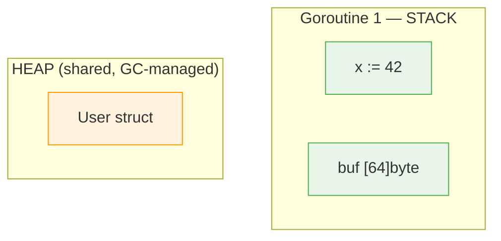

> **Reading Guide**: Sections 1-3 and 6 are essential first read (20 min).
> Sections 4-5 deepen understanding (15 min).
> Sections 7-12 are interview-specific — read closer to interview day.
> Section 13 is your comprehensive interview Q&A bank → [[questions/T02 Go Memory Allocation - Interview Questions]]
> Something not clicking? → [[simplified/T02 Go Memory Allocation & Value Semantics - Simplified]]

---

## 0. Prerequisites

Complete these before starting this topic:

- [[prerequisites/P01 Structs & Struct Memory Layout]]
- [[prerequisites/P06 Function Call Stack]]

---

## 1. Concept

Go Memory Allocation & Value Semantics — how data is stored on stack vs heap, passed between functions, and shared across goroutines.

> **Naming trap**: The official "Go Memory Model" (go.dev/ref/mem) is about **happens-before ordering** across goroutines, not stack/heap allocation. If an interviewer hears "Go Memory Model," they'll expect you to talk about visibility guarantees. Use "memory allocation" or "value semantics" when discussing this topic. See [[Go Memory Model (Happens-Before)]] for that topic.

---

## 2. Core Insight (TL;DR)

Go is **strictly pass-by-value**, and the **compiler (via escape analysis)** decides whether data lives on the **stack (~1-2ns, free)** or **heap (~25-50ns + GC cost)**. The programmer never explicitly chooses — `new()` and `&T{}` do NOT guarantee heap allocation.

---

## 3. Mental Model (Lock this in)

### Stack → "Your Desk"

- Private, fast, auto-cleaned on function return
- Each goroutine has its own stack (~2-8 KB initial)

### Heap → "Shared Storage"

- Used when data outlives function or can't stay on stack
- Managed by GC (Garbage Collector) — every heap allocation creates future GC work
- ~12-25x slower than stack allocation

### Pass-by-value → "Everything is a photocopy"

- Even pointers are copied (the address itself, not the data)
- Sharing happens only through internal pointers within copied values

> **In plain English:** Stack is your personal desk — fast, private, cleaned up when you leave. Heap is the shared office storage — anyone can access it, but someone (the garbage collector) has to clean it up periodically, which slows things down.



> Stack: ~1-2ns alloc, auto-freed on return. Heap: ~25-50ns alloc + GC scan cost.

### The mistake that teaches you

```go
func NewUser(name string) *User {
    u := User{Name: name}
    return &u // returning a pointer to a local variable
}
```

**What you'd expect:** "I'm returning a pointer to a stack variable — won't that be a dangling pointer, like in C?"

**What actually happens:** It works perfectly. Go's escape analysis detects that `u` outlives the function (because you return `&u`) and moves it to the heap automatically. No dangling pointer, no crash.

**Why this matters:** In Go, the compiler decides stack vs heap — not you. You never need to think "should I `malloc` this?" But every time the compiler escapes a variable to the heap, it adds GC work. Run `go build -gcflags="-m"` to see: `moved to heap: u`. That's the trade-off: safety is automatic, but the cost shows up in tail latency under load.

---

## 4. How It Actually Works (Internals) [INTERMEDIATE → ADVANCED]

### Escape Analysis: The Compiler's Decision Engine

Escape analysis uses **static data-flow analysis** on the AST (Abstract Syntax Tree). The compiler examines your code BEFORE it runs and decides: can this variable safely live on the stack, or must it go to the heap?

> **In plain English:** The Go compiler is like a smart warehouse manager who decides: "Will this box be needed after this function returns? If yes, put it in long-term storage (heap). If no, keep it on the quick shelf (stack) and toss it when we're done."

**Does it escape? Walk this checklist:**

1. Returned as pointer from function? → **HEAP** (outlives the function)
2. Sent to another goroutine / channel / stored in global? → **HEAP** (shared across scopes)
3. Size unknown at compile time? → **HEAP** (e.g., `make([]byte, n)` where `n` is a variable)
4. Assigned to an interface and value is larger than a pointer? → **USUALLY HEAP** (boxing)
5. None of the above? → **STACK**

You can see the compiler's decisions with:

```bash
go build -gcflags="-m"       # basic: what escapes
go build -gcflags="-m -m"    # verbose: WHY it escapes
```

### Stack Internals

- Starts small (~2-8 KB per goroutine)
- **Contiguous stack model** (since Go 1.4)
- Growth = allocate **new larger stack** + **copy old data** + **adjust all pointers**

```
BEFORE (~2 KB)              AFTER (~4 KB)
  frame: C()                  frame: C()
  frame: B()   ── copy ──▶    frame: B()
  frame: A()                  frame: A()
                              (room to grow)

ALL pointers into old stack are REWRITTEN.
This is why Go bans pointer arithmetic.
```

### Heap + GC (Garbage Collector)

- **Tri-color concurrent mark-and-sweep** GC (since Go 1.5)
- STW (Stop-The-World) phases: typically **sub-millisecond** (< 100 microseconds)
- Real latency killer: **mark assist** — goroutines allocating during GC are forced to help mark before their allocation proceeds

**How tri-color marking works:**

```
1. Start: all objects are WHITE (unvisited)
2. Mark roots (globals, stack variables) as GREY
3. Pick a GREY object → scan its pointers → mark children GREY → mark it BLACK
4. Repeat step 3 until no GREY objects remain
5. Remaining WHITE objects = garbage → freed

BLACK = fully scanned (safe)
GREY  = visited, children still being scanned
WHITE = not reached yet (will be freed if still white at end)
```

### Write Barrier

During a GC cycle, every **pointer write to the heap** goes through a write barrier — a hidden runtime check preserving the tri-color invariant.

> Pointer writes are more expensive than value writes during GC.

---

## 5. Key Rules & Behaviors

1. **Everything is pass-by-value** — no exceptions. Even pointers, slices, maps, and interfaces are copied.
2. **`new()` and `&T{}` do NOT guarantee heap** — escape analysis decides.
3. **Returned pointer → heap**. If a function returns `&x`, `x` escapes.
4. **Shared via goroutine/channel/global → heap**.
5. **Unknown size at compile time → heap** (e.g., `make([]byte, n)` where `n` is a variable).
6. **Constant-sized small slices can be stack-allocated** — the compiler optimizes `make([]T, constant)`.
7. **Slice passed by value**: modifying elements is visible, but `append` may not be (new backing array).
8. **Map is already a pointer** — no need for `*map`. Passing a map shares the data.
9. **Interface boxing**: assigning a value larger than pointer-size to an interface usually heap-allocates.
10. **More pointers = more GC work** — each pointer is an edge the GC must traverse.

---

## 6. Code Examples (Show, Don't Tell)

### Escape vs no escape

```go
func foo() *int {
    x := 10
    return &x
}

func bar() int {
    x := 10
    p := &x
    return *p
}
```

```
foo() — ESCAPES to heap:
  Step 1: x := 10          stack: [ x = 10 ]
  Step 2: return &x         caller gets a pointer to x
          BUT foo() is about to return — its stack frame will be destroyed!
          So x MUST move to the heap to survive.
          heap: [ x = 10 ] ◄── returned pointer points here

bar() — STAYS on stack:
  Step 1: x := 10          stack: [ x = 10 ]
  Step 2: p := &x          stack: [ x = 10, p ──▶ x ]
  Step 3: return *p         returns the VALUE 10, not the pointer
          p and x are never needed after bar() returns → stack is fine
```

### Pass-by-value with pointer

```go
func update(x *int) {
    *x = 20
}

func main() {
    val := 42
    update(&val)
    fmt.Println(val) // 20
}
```

```
Step 1: main — val := 42
  main stack: [ val = 42 ]

Step 2: update(&val) — Go copies the ADDRESS (not the data)
  main stack:   [ val = 42 ] ◄──┐
  update stack: [ x = 0xABC ] ──┘  x is a COPY of the pointer
                                    both point to the same val

Step 3: *x = 20 — dereference and write
  main stack:   [ val = 20 ] ◄──┐  val is modified!
  update stack: [ x = 0xABC ] ──┘

Step 4: update returns — its stack frame is destroyed
  main stack: [ val = 20 ]   the change persists
```

> **In plain English:** In Go, nothing is shared unless you explicitly hand over the address. Passing a value is like giving someone a photocopy. Passing a pointer is like giving someone your home address — they can come in and move things around.

### Slice header copy

```go
func modify(s []int) {
    s[0] = 100
}

func grow(s []int) {
    s = append(s, 4)
}

func main() {
    data := []int{10, 20, 30}
    modify(data)
    fmt.Println(data[0]) // 100 — change visible!

    grow(data)
    fmt.Println(len(data)) // 3 — append NOT visible!
}
```

```
What IS a slice? A 24-byte header (ptr + len + cap) on the stack:

  stack 0xC000060000: data = [ ptr=0xC000080000 | len=3 | cap=3 ]
  heap  0xC000080000: [10, 20, 30]

Step 1: modify(data) — header is COPIED (24 bytes), but ptr still points to same array
  main stack   0xC000060000: [ ptr=0xC000080000 | len=3 | cap=3 ]
  modify stack 0xC000070000: [ ptr=0xC000080000 | len=3 | cap=3 ]  ← copy of header
                                      ↑ SAME heap address!
  modify does s[0] = 100:
    s.ptr + 0*8 = 0xC000080000 → write 100
  main reads data[0]: data.ptr + 0*8 = 0xC000080000 → reads 100 ← visible!

Step 2: grow(data) — header is COPIED again
  main stack 0xC000060000: [ ptr=0xC000080000 | len=3 | cap=3 ]
  grow stack 0xC000070000: [ ptr=0xC000080000 | len=3 | cap=3 ]  ← copy
  
  append needs cap=4 but cap=3 → allocates NEW array at 0xC000090000:
  grow stack 0xC000070000: [ ptr=0xC000090000 | len=4 | cap=6 ] ← NEW array!
  main stack 0xC000060000: [ ptr=0xC000080000 | len=3 | cap=3 ] ← still old array!
                                                                  <-- THIS is why append isn't visible
  heap 0xC000080000: [100, 20, 30]       ← main still reads here
  heap 0xC000090000: [100, 20, 30, 4, _, _] ← grow's new array (only grow knows)
```

> **In plain English:** When a slice runs out of room and `append` builds a bigger one, it's like moving to a bigger apartment. The function that did the moving knows the new address, but anyone who had your old address still shows up at the old place. That's why you must return and reassign the new slice.

### Map is a pointer

```go
m := make(map[string]int)
```

```
Under the hood, m is a pointer to a runtime.hmap struct:

  stack 0xC000060000: m = [ ptr=0xC000010000 ]  ← 8-byte pointer on the stack
                                  │
                                  ▼
  heap 0xC000010000: hmap{ count:0, B:0, hash0:0x7A3F, buckets → 0xC000020000 }
                                                                      │
                                                                      ▼
  heap 0xC000020000: [bucket0 — 8 empty slots]

  When you insert m["key"] = val:
    hash("key", hash0) → bucket = hash & (2^B - 1) → find slot → store key+val

Passing m to a function copies the 8-byte pointer, NOT the hmap.
  caller:  m = 0xC000010000
  callee:  m = 0xC000010000  ← same address, same hash table
No need for *map — it's already a pointer.
```

### Interface internals

```go
type iface struct {
    tab  *itab
    data unsafe.Pointer
}

type eface struct {
    _type *_type
    data  unsafe.Pointer
}
```

```
iface (interface with methods, e.g., io.Reader):
  [ tab ──▶ itab{type info + method addresses} | data ──▶ actual value ]

eface (empty interface / any):
  [ _type ──▶ type descriptor | data ──▶ actual value ]

Key insight: an interface is a TWO-FIELD struct, not just a pointer.
This is why a "nil pointer inside an interface" is NOT a nil interface.
```

- **iface** = interface with methods — runtime struct holding {pointer to method table (itab), pointer to actual data}
- **eface** = empty interface (`any` / `interface{}`) — runtime struct holding {pointer to type info, pointer to data}
- **itab** = Interface Table — cached mapping of concrete type to interface method addresses

---

## 6.5. Practice Checkpoint

### Tier 1: Predict the Output (2 min)

Paste into [Go Playground](https://go.dev/play/) and predict output BEFORE running:

```go
package main

import "fmt"

func change(s []int) {
    s[0] = 999
    s = append(s, 4, 5, 6)
    s[0] = 111
}

func main() {
    data := make([]int, 3, 3)
    data[0] = 1
    data[1] = 2
    data[2] = 3
    change(data)
    fmt.Println(data)
}
```

<details>
<summary>Answer</summary>

`[999 2 3]` — The `s[0] = 999` is visible (same backing array). But `append` triggers a new array (cap was full), so `s[0] = 111` writes to the NEW array. Main's `data` still points to the old array where `[0]` is `999`.

</details>

### Tier 2: Fix the Bug (5 min)

This HTTP handler has a memory leak. Find and fix it:

```go
func handler(w http.ResponseWriter, r *http.Request) {
    body, _ := io.ReadAll(r.Body) // could be 10MB
    prefix := body[:128]          // just need first 128 bytes
    log.Println(string(prefix))
    // ... rest of handler uses prefix but not body
}
```

<details>
<summary>Hint</summary>

`prefix` is a sub-slice of `body` — it holds a reference to the entire 10MB backing array even though you only need 128 bytes.

</details>

<details>
<summary>Fix</summary>

```go
prefix := make([]byte, 128)
copy(prefix, body[:128])
```

Now `prefix` has its own 128-byte backing array, and the 10MB `body` array can be garbage collected.

</details>

### Tier 3: Build It (15 min)

Write a Go program that:
1. Creates a function returning a pointer to a local variable
2. Creates a function returning a value (no pointer)
3. Run `go build -gcflags="-m"` and verify which escapes and which doesn't
4. Bonus: create a struct larger than 128 bytes and benchmark value receiver vs pointer receiver using `testing.B`

> Full solutions with explanations → [[exercises/T02 Go Memory Allocation - Exercises]]

---

## 7. Edge Cases & Gotchas

### The append trap

```go
func grow(s []int) {
    s = append(s, 4) // cap exceeded → new array
}                     // caller's slice unchanged!
```

**Why**: `append` may allocate a new backing array. The local `s` header updates, but the caller's copy still points to the old array.

**Fix**: return the new slice or pass `*[]int`.

```
BEFORE grow(s):
  caller stack 0xC000060000: s = [ ptr=0xC000080000 | len=3 | cap=3 ]
  heap 0xC000080000: [10, 20, 30]  ← full (len == cap)

INSIDE grow(s):
  grow stack 0xC000070000: s = [ ptr=0xC000080000 | len=3 | cap=3 ]  ← copy
  append: cap exceeded → new array at 0xC000090000
  grow stack 0xC000070000: s = [ ptr=0xC000090000 | len=4 | cap=6 ]  ← updated locally
  heap 0xC000090000: [10, 20, 30, 4, _, _]

AFTER grow returns:
  caller stack 0xC000060000: s = [ ptr=0xC000080000 | len=3 | cap=3 ]  ← UNCHANGED
  heap 0xC000080000: [10, 20, 30]    ← caller still reads here
  heap 0xC000090000: [10, 20, 30, 4] ← orphaned, no one points here → GC

Fix: return the new slice
  func grow(s []int) []int {
      return append(s, 4)
  }
  data = grow(data)  ← now caller has the updated header
```

> **In plain English:** `append` is like asking the post office to add a room to your house. If there's space, they extend it in place. If not, they build a whole new house and move everything — but they only tell YOU the new address. Anyone who had your old address is now going to an empty lot.

### Slice memory leak from sub-slicing

```go
func getFirstThree(data []byte) []byte {
    return data[:3] // LEAK: holds ref to entire backing array
}
```

**Fix**: copy the subset.

```go
func getFirstThree(data []byte) []byte {
    result := make([]byte, 3)
    copy(result, data[:3])
    return result
}
```

```
WITHOUT fix (memory leak):
  stack: data   = [ ptr=0xC000100000 | len=1048576 | cap=1048576 ]
  stack: result = [ ptr=0xC000100000 | len=3       | cap=1048576 ]
                         ↑ SAME address — result still holds entire 1MB alive!
  heap 0xC000100000: [A][B][C][D][E]...[1MB data]
  GC checks: anything still pointing at 0xC000100000? → YES (result) → can't free

WITH fix (independent copy):
  stack: result = [ ptr=0xC000200000 | len=3 | cap=3 ]  ← own tiny array
  heap 0xC000200000: [A][B][C]          ← 3 bytes only
  heap 0xC000100000: 1MB → no references remain → GC eligible
```

### Interface nil trap

```go
var p *MyStruct = nil
var i interface{} = p
fmt.Println(i == nil) // false!
```

```
Step 1: var p *MyStruct = nil
  p = nil  (a nil pointer of type *MyStruct)

Step 2: var i interface{} = p
  An interface is TWO fields: [ type | data ]
  i = [ type: *MyStruct | data: nil ]
       ^^^^^^^^^^^^^^^^
       type is NOT nil! It knows it's holding a *MyStruct.

Step 3: i == nil?
  Go checks: is type == nil AND data == nil?
  type = *MyStruct → NOT nil!
  Result: false
                    <-- THIS is the trap

A truly nil interface has BOTH fields nil:
  var i interface{} = nil
  i = [ type: nil | data: nil ]  → i == nil is true
```

> **In plain English:** A nil interface is an empty shelf. A non-nil interface holding a nil pointer is a shelf with an empty labeled box on it. The shelf isn't empty — it has a box (even though the box is empty). Go checks if the shelf is empty, not if the box is empty.

```go
// BAD — returns non-nil interface wrapping a nil pointer
func getUser() error {
    var err *MyError = nil
    return err       // interface{type: *MyError, data: nil} ≠ nil
}

// GOOD — returns actual nil interface
func getUser() error {
    return nil       // interface{type: nil, data: nil} == nil
}
```

### Mutex copy via value receiver

```go
type Cache struct {
    mu   sync.Mutex
    data map[string]string
}

// BUG: value receiver copies the mutex!
func (c Cache) Get(key string) string {
    c.mu.Lock()        // locking a COPY — no protection
    defer c.mu.Unlock()
    return c.data[key]
}
```

```
Step 1: c.Get("foo") is called
  Go COPIES the entire Cache struct (because value receiver)
  original: [ mu = {locked: false} | data ──▶ map ]
  copy:     [ mu = {locked: false} | data ──▶ map ]  ← INDEPENDENT mutex!

Step 2: copy.mu.Lock()
  Locks the COPY's mutex — the original's mutex is still unlocked
  Another goroutine can call Get() and lock ITS OWN copy too
  Result: no mutual exclusion at all!
                                      <-- zero protection

Fix: use pointer receiver
  func (c *Cache) Get(key string) string { ... }
  Now c points to the original — everyone locks the SAME mutex.
```

**Fix**: always use pointer receiver with embedded mutexes.

### Loop variable trap

```go
for _, v := range arr {
    go func() {
        fmt.Println(v) // Pre-1.22: all see final value
    }()
}
```

```
Pre-Go 1.22:
  v is ONE variable reused across all iterations.
  By the time goroutines run, the loop is done and v = last element.

  Iteration 1: v = "a", goroutine captures &v
  Iteration 2: v = "b", goroutine captures &v (same v!)
  Iteration 3: v = "c", goroutine captures &v (same v!)
  Goroutines run: all read v → "c", "c", "c"

Go 1.22+: Fixed — each iteration gets its own v.
```

### Closure escape

```go
func makeAdder(n int) func(int) int {
    return func(x int) int {
        return x + n // n escapes to heap
    }
}
```

```
Step 1: makeAdder(5) is called, n = 5 on makeAdder's stack

Step 2: The closure func(x) captures n
        But the closure will outlive makeAdder (it's returned!)
        So n CANNOT stay on makeAdder's stack

Step 3: Compiler moves n to the heap
        closure = { code: func(x int), env ──▶ [n = 5] }
                                                 ↑ heap-allocated
```

The closure outlives `makeAdder`, so captured `n` must survive → heap-allocated.

---

## 8. Performance & Tradeoffs

### Value vs Pointer Semantics

| Factor | Value | Pointer |
|---|---|---|
| Allocation | ✅ Stack-friendly | ❌ Can trigger escape |
| Cache locality | ✅ Contiguous, cache-friendly | ❌ Pointer chasing, cache misses |
| GC pressure | ✅ No pointers to scan | ❌ Every pointer = GC edge |
| Copy cost | ❌ Expensive if struct > ~128B | ✅ 8 bytes always |
| Mutation sharing | ❌ Requires copy-out/copy-back | ✅ Direct mutation |
| Predictability | ✅ Deterministic | ❌ GC pauses under load |

> For structs ≤ ~128 bytes with read-heavy access: prefer values. For large structs or write-heavy shared state: consider pointers — but always benchmark.

### `map[string]User` vs `map[string]*User` (10M entries)

| Factor | `map[string]User` | `map[string]*User` |
|---|---|---|
| GC pressure | ✅ Low (no extra pointers) | ❌ 10M pointer edges |
| Rehash cost | ❌ Copies all values | ✅ Copies pointers only |
| Mutation | ❌ Copy-out, modify, copy-back | ✅ Direct via pointer |
| `&m["key"]` | ❌ Illegal | ✅ Already a pointer |
| Cache locality | ✅ Contiguous in buckets | ❌ Pointer chasing |

> **Advanced**: `map[string]int32` as index into `[]User` slice — dense values + cheap map ops.

### Zero-Allocation Patterns for Hot Paths

| Technique | Impact | When to Use |
|---|---|---|
| `sync.Pool` for buffers | Eliminates repeated alloc | HTTP handlers, serialization |
| `make([]T, 0, knownCap)` | Prevents append realloc | Known-size batch processing |
| `[]byte` instead of `string` in hot paths | Avoids copy on conversion | Log processing, parsing |
| Byte-level pre-filters | Skip expensive ops early | Regex/PII scanning (~80% skip) |
| Struct-of-arrays over array-of-structs | Better cache utilization | Columnar data access |
| Constant-sized local slices | Stack-allocated by compiler | Fixed-size temp buffers |

---

## 9. Common Misconceptions

| Misconception | Reality |
|---|---|
| Go is pass-by-reference | **WRONG** — strictly pass-by-value, always |
| Pointer = always faster | **WRONG** — adds GC pressure, hurts cache locality |
| Slice is a reference type | **HALF TRUE** — header is a value containing a pointer |
| `new()` always allocates on heap | **WRONG** — escape analysis decides |
| Map values are addressable | **WRONG** — `&m["key"]` is illegal |
| STW (Stop-The-World) pauses are the GC bottleneck | **OUTDATED** — mark assist is the real latency killer |
| Large struct → always use pointer | **WRONG** — measure first; ~128B is roughly the crossover |
| `make([]byte, 1024)` always heap-allocates | **WRONG** — constant size can be stack-allocated |

> Everything is pass-by-value. Some values contain internal pointers that enable shared access.

---

## 10. Related Tooling & Debugging

### Escape analysis inspection

```bash
go build -gcflags="-m"       # basic: what escapes
go build -gcflags="-m -m"    # verbose: WHY it escapes
go build -gcflags="-m -l"    # disable inlining (clearer output)
```

### Allocation profiling

```bash
go test -bench=. -benchmem           # allocs/op in benchmarks
go test -memprofile mem.prof         # heap profile
go tool pprof -alloc_space mem.prof  # total bytes allocated
go tool pprof -inuse_space mem.prof  # currently live bytes
```

### Runtime flags

```bash
GODEBUG=gctrace=1 ./myserver        # GC cycle logging
GOGC=100                             # GC trigger ratio (default)
GOMEMLIMIT=512MiB ./myserver         # soft memory cap (Go 1.19+)
```

### GC tuning

```
GOGC=100 (default): GC at 200MB when live=100MB  → less CPU, more RAM
GOGC=50:            GC at 150MB when live=100MB  → more CPU, less RAM
GOMEMLIMIT=512MiB:  runtime adjusts GC pacing to stay under 512MB
```

> "GOGC trades throughput for memory. GOMEMLIMIT (Go 1.19+) is the modern approach — set a memory budget and the runtime adjusts GC pacing. In production, set GOMEMLIMIT and use high GOGC (or off) to let the limit drive GC."

### Go pointer types (full taxonomy)

| Type | Package | Since | Use Case |
|---|---|---|---|
| `*T` | builtin | 1.0 | Standard pointer |
| `unsafe.Pointer` | unsafe | 1.0 | Type-erased pointer, low-level memory |
| `uintptr` | builtin | 1.0 | Integer holding an address, not traced by GC |
| `atomic.Pointer[T]` | sync/atomic | 1.19 | Lock-free concurrent pointer access |
| `weak.Pointer[T]` | weak | 1.24 | Does not prevent GC collection |

---

## 11. Interview Gold Questions

### Q1: `map[string]User` vs `map[string]*User` for 10M users?

**Answer**: For small structs (< ~128 bytes) with read-heavy access, `map[string]User` — value storage eliminates 10M pointer edges the GC must trace, dramatically reducing mark phase duration and p99 (99th percentile) latency. Tradeoff: map rehash is more expensive (copies all values) and mutation requires copy-out/modify/copy-back. For large structs or write-heavy workloads, `map[string]*User` wins on rehash cost. Advanced: use `map[string]int32` indexing into `[]User` slice for best of both.

### Q2: How would you reduce GC pressure in a high-throughput service?

**Answer**: First, profile — `GODEBUG=gctrace=1` and `go tool pprof -alloc_space` to find allocation hotspots. Then: (1) `sync.Pool` for hot-path buffers, (2) value semantics for small structs, (3) pre-allocate slices with known capacity, (4) avoid interface boxing in tight loops, (5) use `[]byte` instead of `string` in parsing paths to avoid copy, (6) tune `GOMEMLIMIT` for a memory budget rather than relying solely on GOGC. The chain: fewer heap allocs → fewer live objects → shorter mark phase → less mark assist → better p99.

### Q3: Explain why `new()` doesn't always mean heap allocation.

**Answer**: `new(T)` allocates memory for type `T` and returns a pointer, but escape analysis decides where. If the pointer never escapes the function (not returned, not sent to a goroutine, not stored in a long-lived location), the compiler allocates on the stack. Similarly `&T{}`. You can verify with `go build -gcflags="-m"`. This is why Go doesn't need malloc/free — the compiler optimizes placement automatically.

---

## 12. Final Verbal Answer

> "Go is strictly pass-by-value. The compiler uses escape analysis — a static data-flow analysis that builds a directed graph of assignments — to decide whether variables live on the stack or heap. Stack allocation is near-free at 1-2 nanoseconds, while heap allocation costs 25-50 nanoseconds plus future garbage collection work. The GC is a concurrent tri-color mark-and-sweep collector where Stop-The-World pauses are sub-millisecond, but the real production cost is mark assist — goroutines forced to help with GC marking during allocation, causing tail latency spikes. Types like slices, maps, and interfaces appear reference-like because they contain internal pointers, but the headers themselves are always copied by value. In high-performance systems, minimizing heap allocations is critical — using value semantics for small structs, sync.Pool for buffer reuse, pre-allocated slices, and GOMEMLIMIT tuning to keep GC pressure under control."

---

## 13. Comprehensive Interview Questions

> Full interview question bank (15 questions) → [[questions/T02 Go Memory Allocation - Interview Questions]]

Preview of most frequently asked:

1. **Explain Go's escape analysis. How does the compiler decide stack vs heap?** `[COMMON]`
2. **What's the difference between `new()` and `make()`? Does `new()` always heap-allocate?** `[COMMON]`
3. **How would you reduce GC pressure in a high-throughput Go service?** `[COMMON]`

---

> See [[Glossary]] for term definitions.
