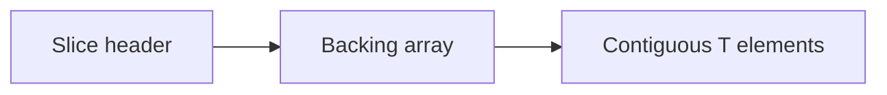

> **Reading Guide**: Sections 1-3 and 6 are essential first read (20 min).
> Sections 4-5 deepen understanding (15 min).
> Sections 7-12 are interview-specific — read closer to interview day.
> Section 13 is your comprehensive interview Q&A bank → [[questions/T04 Arrays & Slice Internals - Interview Questions]]
> Something not clicking? → [[simplified/T04 Arrays & Slice Internals - Simplified]]

---

## 1. Concept

A **Go array** is a fixed-length, value-typed block of **N (number of) elements of type T (type parameter or concrete type)**, with **size (number of elements)** baked into the type. A **Go slice** is a small **header (slice descriptor: pointer, length, capacity)** that refers to a contiguous backing **array (underlying storage)** — passed **by value (copies the header)** while often sharing the **heap (dynamically allocated memory)**-allocated array through the **pointer (memory address value)**.

---

## 2. Core Insight (TL;DR)

**The slice is not the data — it is a 24-byte (on 64-bit (word size: 8 bytes) machines) “window”** over a backing array: **`unsafe.Pointer` (untyped pointer to the first element)**, **`len` (length)**, and **`cap` (capacity)**. **Append may reuse or reallocate; only the returned slice is authoritative.** If you treat the **`append` (append built-in)** like a mutator, you will hit the **append trap (caller not seeing a new backing array)**. Arrays are full **value copies (pass-by-value copies the whole value)**; slice headers are cheap copies, but **aliasing (two references sharing storage)** and **garbage collection (GC) (automatic, tracing memory reclamation)** retention follow the backing array, not the short header.

---

## 3. Mental Model (Lock this in)

Think: **Array = a typed “brick” of fixed size. Slice = a movable frame on a whiteboard: you slide the frame (set `len`/`cap` windows) and sometimes replace the whole whiteboard (reallocate) when the frame outgrows the board.**

- **Array**: The **shape (static dimensions)** and **value semantics (each assignment copies the whole array)** are inseparable; `[4]int` and `[5]int` are different types, like `tuple` shapes that do not interconvert.
- **Slice header**: A **trilogy (three fields)** — *where* the data starts, *how many you may read* (`len`), *how many slots exist* (`cap`) from that start index.



```
  SLICE = [ ptr | len | cap ]  ──▶  [ e0 | e1 | ... | e_{cap-1} ]
                                  └────── visible via len ─────┘
                                  └──────── under cap, may be stale ─┘
```

> **Coming from PHP:** A **PHP array (ordered, dynamic, hash-backed)** is one multipurpose “bag” with integer and string keys. In **Go, array vs slice is explicit**: arrays are value-sized, rarely used on hot paths; **slices** are the default **contiguous (adjacent in memory) sequence**. No implicit resizing: growth is **`append` + assignment**, not `$a[] = x` “push” on the same live variable in all cases. Also, **“reference-like” sharing** is not **PHP’s copy-on-write (CoW (copy-on-write)) array semantics** — it is **shared backing** plus clear rules about **`append` and subslices (slice expressions producing new headers)**.

---

## 4. How It Actually Works (Internals)

### 4.1 The runtime slice struct

The **Go runtime (language execution environment, scheduler, memory allocator, and GC (garbage collector))** defines (see `src/runtime/slice.go` in the **Go source tree (Golang’s standard library and runtime sources)**):

```go
// Conceptual: exact field names/positions are runtime-internal.
type slice struct {
    array unsafe.Pointer
    len   int
    cap   int
}
```

- **`unsafe.Pointer` (pointer without type)**: points at element index 0 of the **backing array (storage slice overlays)** *for this header’s view* (after re-slicing, not always the true allocation base — see re-slicing).
- **`len`**: count of elements you may index: valid indices `0 .. len-1` per **for-range (for … range)** and `s[i]`.
- **`cap`**: elements available from the pointer: valid **slice expression (subscript range)** window `0 .. cap-1` from the same origin.

> **Mental size check (AMD64/ARM64)**: 8 + 8 + 8 = **24 bytes (slice header size on 64-bit (word size: 8 bytes) machines)**. On **32-bit (word size: 4 bytes)** systems the header is typically 12 bytes (plus possible alignment padding in structs).

**ABI (Application Binary Interface) / calling convention (how arguments are passed)**: the slice is passed **by value** — the **3-word struct (three register-sized fields typical)** is copied. That copy **aliases** the same **heap object (backing array allocation)** if the **pointer (address)** is unchanged.

### 4.2 Array internals

- **Type identity**: The array type **[N]T** (array of **N (number of) elements of type T**) embeds **N** in the type name. `[4]int` **≠** `[5]int`.
- **Size**: `unsafe.Sizeof([N]T) = N * sizeof(T)` (plus padding for alignment (address multiple of `alignof(T)`)).
- **Passing/assigning** copies the **entire (deep value copy of array bits)**; no hidden sharing.

**ASCII: array assignment**

```
Before:
  a := [3]int{1,2,3}     stack:  a = [1|2|3]
  b := a                 stack:  b = [1|2|3]  (independent copy)

After b[0] = 9:
  a = [1|2|3]  b = [9|2|3]   (no effect on a)
```

### 4.3 `make`, literals, and memory placement

- `make([]T, len, cap)`: allocates a new array, sets header: `array` to base, `len = len`, `cap = cap` (omitted cap → `cap = len`).
- **Composite literal (literal value constructing a value) `[]T{...}`** creates a new array and a slice header over it; **per-element storage** is contiguous.

### 4.4 Growth algorithm (append / slice growth) — **Go 1.18+** (version cut-off for formula change)

On **reallocation (allocating a new larger backing array)** due to `append` (or `append`-like growth paths):

1. Let **`oldcap` (old capacity)** be the prior **capacity (available slots from slice origin)**.
2. **Threshold (capacity regime boundary) = 256 (elements)** in current rules for generic growth.
3. If **`oldcap` < 256** → `newcap = oldcap * 2` (doubling).
4. If **`oldcap` ≥ 256** → `newcap = oldcap + (oldcap + 3*256) / 4` (smooths growth — transition from **~2×** toward **smaller multipliers (sub-quadratic (slower than doubling))** for large sizes).
5. **After** computing `newcap` as element count, the runtime **rounds up to a size class (allocator bucket)** in the **memory allocator (span-based size classes)** to reduce **fragmentation (free memory split into small unusable pieces)** and match **T (element type) alignment**.

**Reference multipliers (illustrative)**: 256 → ~2.0×, 512 → ~1.63×, 1024 → ~1.44×, 2048 → ~1.35×, 4096 → ~1.30× — the exact **Bytes (storage)** depend on `sizeof(T)` and **size class rounding (align to allocator buckets)**.

**Pre-1.18 (historical)**: **Double below 1024, multiply by 1.25 (125% (five-fourths) growth) at/above 1024** — an **abrupt (sharp threshold behavior)** change at 1024; **current policy** uses 256 and a **smooth (continuous-ish transition)** formula for large caps.

**ASCII: regime switch (schematic, element counts)**

```
oldcap:  128  → newcap 256  (2×)      [under threshold path]
oldcap:  200  → newcap 400  (2×)      [under threshold path]
oldcap:  300  → newcap = 300 + (300 + 768)/4 = 300 + 267 = 567
           then size-class rounding 567 → (rounded)*
```

*Exact post-rounding capacity depends on **type size and allocator (tcache (per-thread cache) / mheap (Go heap) span)**; treat numbers as “close to this,” not a promise you can count on in portable code (do not rely on exact capacities).

> **Coming from PHP:** **PHP** expands dynamic arrays and **hash tables (associative array backing)** for you, with its own C-level allocator and refcounts / CoW (copy-on-write) depending on **SAPI (Server Application Programming Interface), e.g. PHP-FPM (FastCGI Process Manager) vs CLI**. **Go** never silently enlarges a slice **variable**; **`append` returns a new header** and may allocate. **Tuning and retention** (GC pressure) is visible to you: **excess `cap` (over-capacity)** slot waste and **slices retaining huge arrays (GC root lifetimes)** are **your API surface (the operations you code)** to manage.

---

## 5. Key Rules & Behaviors

1. **Slice headers copy by value; backing array shares by pointer**. Mutations through one header can be read through another if they **alias (refer to the same address range with overlapping `len` windows)**.
2. **Valid indices** for read/write: `0 .. len-1`. Slicing can expose **up to** `cap` of *addressable* space for future `append`, but you **must not read** indices `len .. cap-1` as “present” data in the string/slice — that range is **extra storage (often stale (non-semantic retained values) or `T` zero value)** unless you have just grown `len` or you own a well-defined in-place write pattern.
3. **`append(s, v)`** may:
   - **Stay in place** if `len < cap` after append intent (same backing array) — all **aliases** to overlapping regions see the write where indices overlap, **if still within their `len`**; **growing `len` on the result only applies to the returned header**; **or**
   - **Reallocate (move elements to new allocation)** if there is not enough `cap` — **old headers keep old storage**; **returned** slice is the only one pointing at the new array for that result (unless you copy that header to others).
4. **Always** `s = append(s, x)` (or use the returned value) if growth is possible — **callee (called function) and caller (caller function) cannot assume in-place** growth without capturing the return.
5. **Three-index (full) slice form** `a[low:high:max]` (for **arrays (fixed-length)** or **slices (slice type)**) requires, relative to the operand’s `cap` (for slices) or length (for arrays), that **`0 ≤ low ≤ high ≤ max ≤ cap(source)`**; the result has **`len = high - low`** and **`cap = max - low`**. It **stops** `append` on the result from clobbering memory beyond `max-1` — a **safety mechanism (limit append arena)** in APIs.
6. **Nil (uninitialized) slice** `var s []T` has `s == nil`, `len=0`, `cap=0`. **Empty (non-nil) slice** can be `[]T{}` or `make([]T,0)` — not `== nil` for `== nil` check (the latter two are non-nil with zero length. Note: `reflect.ValueOf` behaviors differ; **JSON (JavaScript Object Notation) marshaling in `encoding/json`** treats `nil` and empty slices as `[]` in JSON arrays often — but **your nil checks/serialization contracts** may differ; see examples).
7. **Deleting (compacting) with pointers/structs with pointers** must **nil out (assign nil)** abandoned slots in `[0:cap)` that could otherwise **keep GC objects alive (spurious strong references)**.
8. The **`copy` (copy built-in)** copies `min(len(dst), len(src))` elements — it does not extend `len` of `dst`.

---

## 6. Code Examples (Show, Don't Tell)

### 6.1 Array vs slice basics

```go
var a [3]int = [3]int{1, 2, 3}
b := a
b[0] = 9

s := []int{1, 2, 3} // len=3 cap=3
t := s
t[0] = 9
```

**ASCII step-through**

```
Step 1: a := [3]int{1,2,3}
  a (value on stack): [1|2|3]

Step 2: b := a  (value copy; independent storage)
  a: [1|2|3]   b: [1|2|3]

Step 3: b[0] = 9
  a: [1|2|3]   b: [9|2|3]   <-- a unchanged (arrays do not share)

--- slices ---
Step 1: s := []int{1,2,3}   (new backing array, header points)
  heap backing:  [1|2|3]   s = [ptr──▶[0], len=3, cap=3]

Step 2: t := s   (header copy; same pointer+len+cap)
  t and s: both ptr──▶ same [1|2|3]

Step 3: t[0] = 9  (index within shared len; mutates heap)
  heap: [9|2|3]  — both s[0] and t[0] read 9
```

### 6.2 Append **within** vs **beyond** capacity (append trap)

**Within `cap` (stays on same allocation; returned header is still authoritative)**

```go
s := make([]int, 0, 4)
s = append(s, 1, 2, 3) // in-place: len=3, cap=4, same `ptr` field as before
s = append(s, 4)       // in-place: len=4, cap=4, fills backing completely
s = append(s, 5)       // len must grow beyond cap(4) → reallocate: `s` is new header
```

**ASCII**

```
After append up to 4 inside cap(4):
  ptr▶[1,2,3,4]  len=4 cap=4

After append(5) (grows past cap):
  NEW ptr▶[1,2,3,4,5, ...]  len=5  cap=≥5 (size-class)   OLD array eligible for GC if unreachable
```

**`append` and stale alias (reallocation splits views)**

```go
a := []int{1, 2, 3} // len=3, cap=3
b := a              // header copy, same `ptr/len/cap`
a = append(a, 4)    // realloc likely — `a` is NEW backing; `b` still [1,2,3] in OLD backing
// b[0]=1 still; a is [1,2,3,4] (cap rounded)
```

**ASCII — core trap pattern**

```go
func bad(in []int) { append(in, 99) } // wrong: must return
func good(in []int) []int { return append(in, 99) }
```

**Memory snapshot: why `append` “does nothing” in `bad` when realloc happens (pattern)**

```
Caller has: s = [ptr=a, len=0, cap=0]  // empty; append must allocate
bad(s): copies header by value: local `in` is a copy, append allocates NEW array, returns
        new header [ptr=b, len=1, cap=1]  — DROPPED; caller s unchanged; STALE header

`good` returns header → caller reassigns to capture new ptr/len/cap
```

> **Interviewer nugget (length vs capacity)**: **Mutations at indices `< len` through any alias that share the same underlying indices** are visible across those headers. You **may not** read `s[i]` for `i ≥ len(s)` even if `i < cap(s)`; that region can hold stale bits from `append` on **another alias** (same backing, different `len`).

### 6.3 Sub-slice sharing (GC retention + aliasing)

```go
buf := make([]int, 100) // 100 zeros, len=100 cap=100
win := buf[0:3]         // small window
_ = win
```

**ASCII**

```
buf header ──▶ [bbbbbbbb|........ huge region 100 ints ........]  (b in first 3 may be 0)
win header   ──▶ (same array base) but len=3 cap=100  still keeps ENTIRE 100 array alive
               <-- 'win' is tiny view but 'cap' is 100: append can use rest unless limited
To shrink cap view:  win2 := buf[0:3:3]  // cap forced to 3: separate visibility for append
```

**Three-index in action (limits append arena)**

```go
a := make([]int,0,8)
for i := 0; i < 3; i++ { a = append(a, i) } // 0,1,2; len3 cap8
b := a[0:2:2] // b: len=2, cap=2-0=2; prevents append on `b` from writing where `a[2]` lives
```

`a` is **len=3, cap=8**; `a[0:2:2]` is valid because **`0 ≤ 2 ≤ 2 ≤ cap(a)` (here 8)**.

**ASCII**

```
a:  ptr▶[0,1,2,_,_,_,_,_]  len3 cap8
b := a[0:2:2] -> ptr at same, len=2, cap=2
append to b: may reallocate on next append if len reaches cap(2) — cannot stomp a[2] arena by accident via b's default append limit to cap=2
```

### 6.4 `nil` vs **empty (non-nil) slice**

```go
var n []int
e := []int{}
m := make([]int, 0)
// len/cap: all 0; nil: only n is nil
```

**ASCII**

```
n:  ptr=nil, len=0, cap=0  |  n == nil  => true
e:  ptr=non-nil to empty zlen array OR sentinel per runtime; len=0, cap=0  |  e == nil => false
m:  similar to e (implementation detail of pointer) | m == nil => false
```

> **Practical diffs (JSON, APIs)**: Many JSON encoders emit `[]` for both, but if you use **`omitempty` (omit JSON field on zero value)**, only “nil/empty as missing” may differ in structs: pointer-to-slice fields vs `[]T` fields — you must know your struct tags and whether `nil` is required semantically. Use explicit pointers `*[]T` for optional arrays when modeling **optional JSON fields**.

**Tiny demo**

```go
type S struct{ Items []int `json:"items,omitempty"` }
var a S // Items nil: often omitted
b := S{Items: []int{}}  // may serialize `"items":[]` depending on encoders/versions — verify in your Go version; empty non-nil is still not "zero" the same as nil in some struct semantics
// Always add tests for your encoding contract.
```

### 6.5 `make([]T, len)` vs `make([]T, 0, cap)` (visible length vs reserved room)

```go
a := make([]int, 5)    // len=5 cap=5 — you may read/write a[0:5] now (zeros)
b := make([]int, 0, 5) // len=0 cap=5 — no visible elements yet; append up to 5 without realloc
```

**ASCII**

```
a:  ptr▶[0,0,0,0,0]  len=5 cap=5  // `make` with len sets *visible* length
b:  ptr▶[_,_,_,_,_]  len=0 cap=5  // backing exists but b[i] is invalid for i in 0..4 until len grows
```

> **When to use which:** Fixed-width buffer you will index by subscript now → `make(T, n)`. **Accumulator (append-only)** with an estimated upper bound → `make(T, 0, cap)`.

### 6.6 Pointer/struct-with-pointer "delete" leak

```go
type Node struct{ Name string; Next *Node }
// n1, n2, n3 are existing *Node values (pseudocode).
s := []*Node{n1, n2, n3}
// "remove" middle by compacting, forgetting to nil:
i := 1
s = append(s[:i], s[i+1:]...) // n2 might remain referenced at old last slot
```

**ASCII (before/after) — stale slot at old cap-1 index**

```
Before remove index1 from len3 cap4  :
  [ptr1|ptr2|ptr3| _ ]  (cap 4)
After append slice trick without copy shrink:
  [ptr1|ptr3| |ptr3?]  (len2 but cap still 4; last slot can STILL point to n2) <-- GC leak until overwritten
```

**Fix pattern**

```go
s[i] = nil
s = append(s[:i], s[i+1:]...)
// zero-nils abandoned tail if you will reuse the backing for something else, or
// s = s[: len(s) : cap(s) ]? better: for j := len; j<cap; j++ { s[j]= nil }  // careful, rare
// Often compact into new slice with `make` or `append` to fresh backing if necessary
```

### 6.7 Slice interview tricks: filter in-place, reverse, rotate

**Filter in-place (stable compact, O(n) time, O(1) extra space for indices)**

```go
func keepPositives(s []int) []int {
    w := 0
    for _, v := range s {
        if v > 0 {
            s[w] = v
            w++
        }
    }
    return s[:w]
}
```

**ASCII (conceptual)**

```
Input backing:  [0, 2, 0, 5, 0]  len=5
After:          [2, 5, *, *, *]  return slice len=2, cap=5
                                    * = stale (do not read past len) unless pointer type → nil slots
```

**Reverse in-place (two-index walk)**

```go
func reverse(s []int) {
    for i, j := 0, len(s)-1; i < j; i, j = i+1, j-1 {
        s[i], s[j] = s[j], s[i]
    }
}
```

**Rotate in-place (3-reverse: classic interview pattern)**

To rotate `k` steps left: reverse `[0:k)`, reverse `[k:n)`, reverse `[0:n)`.

```go
func rotLeft(s []int, k int) {
    if len(s) == 0 { return }
    k %= len(s)
    if k < 0 { k += len(s) }
    reverse(s[:k])
    reverse(s[k:])
    reverse(s)
}
// reverse is the helper above
```

**ASCII**

```
Start: [A B C D E F], k=2
R1:    [B A C D E F]   rev first k
R2:    [B A F E D C]   rev rest
R3:    [C D E F A B]   rev all  (left rotate by 2)
```

**Memory note:** in-place tricks **do not** shrink `cap`; a **huge** backing with **tiny** `len` can still **retain** storage until **GC** — use three-index or **copy to exact-sized** slice for **tight (minimal footprint)** when needed.

---

## 6.5. Practice Checkpoint

### Tier 1: Predict the output (2 min)

**Predict before running** — then use `go run` or the playground to verify.

```go
package main

import "fmt"

func main() {
	s := make([]int, 0, 2)
	a := s
	s = append(s, 1)
	b := s
	s = append(s, 2)
	c := s
	s = append(s, 3)
	fmt.Println("a:", a, "len", len(a), "cap", cap(a))
	fmt.Println("b:", b, "len", len(b), "cap", cap(b))
	fmt.Println("c:", c, "len", len(c), "cap", cap(c))
	fmt.Println("s:", s, "len", len(s), "cap", cap(s))
}
```

**After you run, trace each header (you should be able to draw four boxes):** which **slice headers** (from `a`, `b`, `c`, `s`) point at the **old 2-`cap` (capacity) backing** after the last `append`?

> **Check your reasoning:** the final `append` that introduces `3` is the one that is most likely to **reallocate (new backing array) **. Only the variable **`s` is reassigned to that new header. Earlier captures (`a`, `b`, `c`) are **stale in the interview sense: frozen at their capture time**, except they still alias older storage in ways `len`/`cap` make legal.

### Tier 2: Fix the bug (5 min)

**Buggy**: function appends in place but reallocation on large inputs silently loses updates to the caller; also subslices a huge file buffer to first line, retaining GB.

```go
func consume(lines []string, grow []string) { // want to return updated; bug
  lines = append(lines, grow...) // nolint
}
```

**Tasks**: 1) Return `[]string` and assign at call site. 2) Re-slice with three-index to drop backing retention if keeping only prefix.

### Tier 3: Build it (15 min)

1. **Implement in-place `removeAt(s []T, i int) []T` without leaking pointers.**
2. **Implement `rotate` by reverses (3-reverse trick) in-place.**
3. **Implement safe line reader using `data[:pos:pos]` to prevent append stomp in reused buffer.**

> Full solutions with explanations → [[exercises/T04 Arrays & Slice Internals - Exercises]]

---

## 7. Edge Cases & Gotchas

| # | Gotcha | Why | Fix |
|---|--------|-----|-----|
| 1 | **Append trap (caller not updated)** | `append` may allocate; returned header is the truth | `s = append(s, x)`; functions return new slice; **never ignore `append` return** |
| 2 | **Sub-slice memory leak (retained backing)** | **GC (garbage collection)** lifetimes: tiny header keeps huge array alive | `s[low:high:high]`; **copy into new** `make` slice of exact len **to shrink (allocation tradeoff) **; **pprof (Go profiling) heap profiles** to spot |
| 3 | **Three-index (full) slice to limit `cap` (capacity)** | Prevents `append` on a subview from clobbering indices outside `max-1` | `s[low:high:max]` with `max` chosen so `cap` of result is `max-low`; e.g. retaining only a prefix: `s[:i:i]` to “pin” the append arena on one prefix |
| 4 | **`nil` vs `[]T{}` in semantics** | `== nil` differs; some APIs/JSON encodings differ; optional field modeling | Pointers, explicit contracts, tests |
| 5 | **Pointer in backing not cleared** | "Removed" element **still a GC root in unused capacity** (until overwritten) | **Write `var z T; s[i]=z` for pointers, or set `nil`**, or **new smaller slice** |
| 6 | **Copy-on-grow (append split) ** | In-place if room; **splits (diverging headers) ** on growth | Reassign, document **ownership (who is allowed to `append` / `mutate`) ** of each slice name |

> **Coming from PHP:** `unset` / array_filter patterns don’t expose **stale `cap` (capacity slot) with pointer references** the same way — **PHP** manages memory for zvals; in **Go, you** must clear or resize to avoid **retained pointers in hidden capacity (GC leak via unused slice backing)**.

**ASCII: append split**

```
p := s1 with ptr▶A len2 cap2
q := s1
q = append(q, x) // realloc: q▶B new, p still▶A
// p and q now diverge — interview gold
```

---

## 8. Performance & Tradeoffs

| Pattern | **CPU (central processing unit) / copies** | **Heap / GC (garbage collection) pressure** | **When to prefer** |
|--------|---------------------------------------------|---------------------------------------------|--------------------|
| **Array `[N]T` on stack (when small and escapable)** | Zero indirection, fixed size, copy on assign (O(N) in element count) | **Stack (function-local) allocation** (often) | Known tiny fixed N, value semantics, hot structs |
| **Slice as `[]T` view** | Header copy (cheap), data via pointer | Shared backing, careful aliasing | Default API for variable sequences |
| **Pre-allocate `make(0, cap estimate)` (estimate-based reservation)** | Fewer reallocs (reallocation) / copies | Slightly over-provisioned memory; trade space for time | **Builder (accumulation) / parser buffers** |
| **Exact-size `make(len, len)` (no extra capacity) **| No extra hidden slots to clear | Tighter memory | Tight, known length |
| **Shallow new slice with `append([]T(nil), s...)` or `s2 := append([]T{}, s...)` (note copies)** | O(len) | New backing | Break aliasing, defensive copy (copy-on-write style, manual) |
| **Three-index cutting cap** | Can force realloc sooner on append; may add copy | Frees most of a huge backing sooner | Retaining only small view from a big buffer |
| **Iterative filter-in-place (two-pointer compact)** | O(n) single pass, minimal allocs | **In-place (reuse same backing)** | Big data where copies not affordable |

> **SLO (Service Level Objective) / tail latency (high-percentile latency) hint**: reallocation storms on append in tight loops show up as allocation rates; pre-size from estimates or from prior pass counting.

---

## 9. Common Misconceptions

| Misconception | Reality |
|--------------|---------|
| "Slices are reference types" | They are small **struct values**; the **indirection (pointer field)** is what shares memory — **"reference type"** talk is a mental shorthand, not official Go type system wording. |
| "Copying a slice deep-copies elements" | Only the **24-byte header (on 64-bit (word size: 8 bytes))** copies. Elements copy only by separate **`copy` built-in** or loop / `append` from **fresh base**. |
| "`append` mutates the receiver in the variable" | The **return value** is authoritative; in-place is **an optimization, not a contract (compiler/runtime does not guarantee in-place) **. |
| "Sub-slicing to smaller len frees memory" | **Not automatically**: **GC (garbage collection)** still sees **entire backing array (allocation unit)** as live if any slice header references it (unless you nil last references, split allocation, or copy out). |
| "Capacity equals logical length" | **`len` is the visible length. `cap` can be higher with reserved tail** — **do not read past `len`**. |
| "Arrays and slices are interchangeable" | **Types differ**: **[N]T** (array) is not **[]T** (slice); interfaces and **generics (type parameters)** observe this strictly. |
| "Deleting slice[i] reclaims slot immediately for GC" | For **pointer (reference) elements**, the slot in backing may still reference a heap object until cleared or fully overwritten. |

---

## 10. Related Tooling & Debugging

- **`go test -bench` (Go benchmark harness) + `-benchmem` (allocation metrics)**: see **allocs (allocation count) per op** and bytes/op for slice-heavy code.
- **`pprof` (Go profiling)**: `go test -cpuprofile` / `go test -memprofile` (CPU/memory (heap) profile); **`alloc_space` (Heap allocations by size)** to spot append churn.
- **`go build -gcflags="-m" (print escape analysis decisions)**: see **escape to heap (variable cannot live on the stack) **; large array/slice literals may **escape (cannot be stack-allocated) **.
- **Delve (Delve debugger) / `gdb` (GNU debugger)**: inspect a `[]T` (slice of T) in DWARF (Debug With Arbitrary Record Format) — confirm **`ptr/len/cap` (raw slice header fields) ** and **backing** separately.
- **Race detector**: `go test -race` — concurrent append/re-slice without synchronization is a data race; **`Mutex` (mutual exclusion lock)** / channels for shared slices.
- **`runtime/debug.SetGCPercent` (debugging knob) ** only for local experiments, not **SLA (Service Level Agreement) / production** — understand GC effects after slice retention fixes.

---

## 11. Interview Gold Questions

### Q1. "Explain the **append trap** and why a function that calls `append` on its parameter may not change the caller’s view."

**Answer nuance:** **Slice parameters copy the header. `append` returns a possibly new `ptr/len/cap` triple.** If reallocation happens, the returned header points to new memory; the caller’s original variable is unchanged. Even if in-place, if you grow past shared logical length among aliases, you must think about which headers see new `len`. The fix is **return `[]T` and reassign**, or use a **pointer-to-slice** (`*[]T`) as the parameter only when you must mutate the **caller’s binding in place** (less common, easy to get wrong), and **name return values clearly** otherwise.

**15-second (short) verbal:** "Append returns the slice. Realloc may change the pointer. I always capture the return; pure mutator assumptions are false."

### Q2. "What is a **full slice expression `s[low:high:max]`** and why is it in the language?"

**Answer:** It sets the result’s **`cap` to `max - low`**, limiting the addressable region for the new header so **`append` on a subview cannot overwrite beyond `max-1`**. It’s how packages like `bytes.Buffer` and parsers avoid accidental **clobbering (overwrite)** of other regions of a shared `[]byte` (byte slice) backing.

### Q3. "Array vs slice — when do you use **[N]T** (array), and what is the **cost model (big-O (asymptotic complexity) of copy)** of passing each?"

**Answer:** **Arrays** for very small, fixed, value semantics, **crypto (cryptographic) / SIMD (Single Instruction, Multiple Data)**-friendly fixed buffers, and **string (immutable byte sequence) ↔ [N]byte (byte array)** APIs that require fixed width. **Passing** an **[N]T (array) ** is **O(N) (linear in N elements) **. **A `[]T` (slice of T) ** is passed as an **O(1) (constant-time) ** **header (slice descriptor) **, sharing the backing until you **copy (duplicate elements) ** out. Tradeoffs: type safety and **stack (per-goroutine) **-friendly small arrays vs generality and aliasing for slices.

---

## 12. Final Verbal Answer

> *Say this out loud (about 30 seconds).*
>
> A **slice (Go dynamic view over storage) ** in **Go (Golang) ** is a **24-byte (on 64-bit (word size: 8 bytes) machines) header (roughly, pointer, **len (length)**, and **cap (capacity) ** fields) over a **contiguous (adjacent) backing array (one allocation) **. The **header (slice descriptor) ** is passed **by value (copy the 24 bytes) **, not by deep-copying **elements (values of type T) **, so **aliasing (shared backing) ** is normal. The **`append` (append built-in) ** can **reallocate (new backing) **, so I always **assign the return, `s = append(s, x)`**, to avoid the **append trap (dropped reallocated header) **. **In Go 1.18+ (and later) **, the growth math uses a **256 (element) capacity threshold (rule break) ** and a **smoother (softer) ** large-cap part, and then **round-up to a size class (allocator bucket) **; **pre-1.18 (earlier) **, interviews still cite a rough **2×/1.25× (double / one-and-a-quarter) ** split around **1024 (elements) **. A **sub-slice (re-slicing) ** of a **huge (large) backing (backing array) ** can keep the **whole (allocation) ** object alive in the **GC (garbage collector) **, so I use a **full slice (three-index slice) ** or **copy to an exact new slice (clone to length) **, and I **set removed pointer slots to nil (assign `nil`) ** in **`[]*T` (pointer slice) **-heavy code. I use a fixed-size **`[N]T` (array) ** when the length is a real part of the type, and a **`[]T` (slice) ** in most APIs.

---

## 13. Comprehensive Interview Questions

> Full interview question bank (10–15 questions) → [[questions/T04 Arrays & Slice Internals - Interview Questions]]

**Preview questions (answers in linked file):**

1. You append inside a helper but the caller’s slice never grows — what happened, and what’s the idiom to fix it?
2. A micro-service caches a 2 GiB (gibibyte) read buffer; you store `line := bigBuf[0:lineEnd]`; memory never drops after requests — why, and what two fixes are idiomatic?
3. After deleting `*Node` from a `[]*Node` using slice tricks, `runtime.MemStats` (memory statistics) still shows high **heap in-use (active allocations)** — what class of bug is this and the concrete mitigation?

---

> See [[Glossary]] for term definitions.
