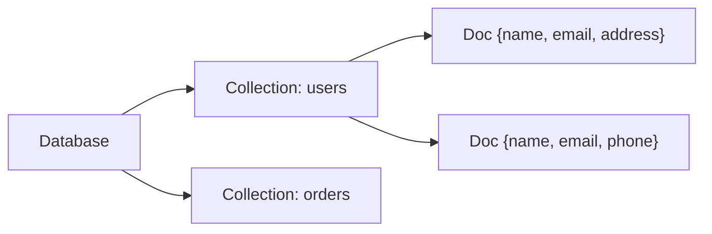

# T06 MongoDB with Go

> **Reading Guide**: Sections 1-3 and 6 are essential first read (25 min).
> Sections 4-5 deepen understanding (20 min).
> Sections 7-12 are interview-specific -- read closer to interview day.
> Section 13 is your comprehensive interview Q&A bank --> [[questions/T06 MongoDB - Interview Questions]]
> Something not clicking? --> [[simplified/T06 MongoDB - Simplified]]

---

## 1. Concept

MongoDB is a document-oriented NoSQL database that stores data as flexible, JSON-like BSON documents instead of rows and columns. In Go, you interact with it via the official `mongo-go-driver` (`go.mongodb.org/mongo/v2`).

---

## 2. Core Insight (TL;DR)

**MongoDB trades rigid schema for flexible documents**, meaning your application code owns the schema. The single most important thing: **design your schema around your query patterns, not your data relationships**. Embedding vs referencing is the fundamental decision that determines performance.

---

## 3. Mental Model (Lock this in)

Think of MongoDB as a **filing cabinet** where each drawer is a **collection** and each folder inside is a **document**. Unlike SQL tables where every row has identical columns, each folder can contain different papers -- but smart filing means similar folders are grouped together.



> **Coming from MySQL:** In MySQL, you design tables first (schema-on-write). In MongoDB, you design documents around how you'll query them (schema-on-read). A JOIN across 3 MySQL tables often becomes a single embedded document in MongoDB.

---

## 4. How It Actually Works (Architecture)

### Storage Engine: WiredTiger

MongoDB uses WiredTiger as its default storage engine since v3.2.

**Key internals:**
- **B-tree indexes** for efficient lookups (similar to MySQL InnoDB)
- **Document-level locking** (not collection-level) -- allows high concurrent write throughput
- **Write-Ahead Log (WAL)** called the **journal** for crash recovery
- **Snappy compression** by default for data and indexes

### BSON (Binary JSON)

MongoDB stores documents as BSON (Binary JSON), which extends JSON with:
- Typed fields (int32, int64, Decimal128, Date, ObjectId, Binary)
- More efficient parsing than text JSON
- 16 MB maximum document size

### Go Driver Architecture

```
Application Code
       |
   mongo.Client  (one per process, thread-safe)
       |
   Connection Pool  (default maxPoolSize=100 per server)
       |
   mongo.Database
       |
   mongo.Collection
       |
   CRUD Operations (Find, InsertOne, UpdateOne, etc.)
```

The `mongo.Client` maintains a connection pool per server. **Create ONE client at application startup and reuse it everywhere.** This is the #1 mistake new Go+MongoDB developers make.

> **Coming from MySQL:** This is identical to `sql.DB` in Go -- you create one, it manages a pool internally. The difference: MongoDB's client also handles replica set discovery and server selection automatically.

---

## 5. Key Rules & Behaviors

1. **One `mongo.Client` per process** -- it's thread-safe with built-in connection pooling
2. **Always use `context.Context` with timeouts** -- never `context.Background()` for operations
3. **`bson.D` preserves order, `bson.M` does not** -- use `bson.D` for commands where order matters (like `$sort`)
4. **ObjectId is generated client-side** -- 12 bytes: 4 timestamp + 5 random + 3 counter
5. **16 MB document limit** -- use GridFS for larger files
6. **Indexes are critical** -- MongoDB scans the entire collection without them (COLLSCAN)
7. **Embed when data is read together; reference when data is shared or unbounded**
8. **Write concern `majority`** ensures durability across replica set
9. **Read preference `secondaryPreferred`** distributes read load but may return stale data
10. **Transactions exist (since v4.0)** but are expensive -- design to avoid needing them

---

## 6. Code Examples (Show, Don't Tell)

### Connecting to MongoDB

```go
package main

import (
    "context"
    "fmt"
    "log"
    "time"

    "go.mongodb.org/mongo/v2"
    "go.mongodb.org/mongo/v2/options"
)

func main() {
    ctx, cancel := context.WithTimeout(context.Background(), 10*time.Second)
    defer cancel()

    client, err := mongo.Connect(ctx, options.Client().ApplyURI("mongodb://localhost:27017"))
    if err != nil {
        log.Fatal(err)
    }
    defer client.Disconnect(ctx)

    // Always ping after connect to verify
    if err := client.Ping(ctx, nil); err != nil {
        log.Fatal("MongoDB not reachable:", err)
    }

    collection := client.Database("myapp").Collection("users")
    fmt.Println("Connected, collection:", collection.Name())
}
```

### CRUD Operations

```go
// INSERT
type User struct {
    ID    primitive.ObjectID `bson:"_id,omitempty"`
    Name  string             `bson:"name"`
    Email string             `bson:"email"`
    Age   int                `bson:"age"`
}

result, err := collection.InsertOne(ctx, User{
    Name:  "Rahul",
    Email: "rahul@example.com",
    Age:   30,
})
// result.InsertedID contains the generated ObjectId
```

```
Step 1: InsertOne called
  Go struct serialized to BSON: {name: "Rahul", email: "rahul@example.com", age: 30}
  _id auto-generated: ObjectId("...") <-- client-side, not server

Step 2: BSON sent over wire to MongoDB server
  WiredTiger writes to journal (WAL) first, then to data files

Step 3: result.InsertedID = ObjectId("...")
  This is available immediately, no round-trip needed for the ID
```

### Query with Filter and Projection

```go
// FIND with filter
filter := bson.D{{"age", bson.D{{"$gte", 25}}}}
opts := options.Find().SetProjection(bson.D{{"name", 1}, {"email", 1}})

cursor, err := collection.Find(ctx, filter, opts)
if err != nil {
    log.Fatal(err)
}
defer cursor.Close(ctx)

var users []User
if err := cursor.All(ctx, &users); err != nil {
    log.Fatal(err)
}
```

### Aggregation Pipeline

```go
// Group users by age bracket and count
pipeline := mongo.Pipeline{
    {{"$match", bson.D{{"age", bson.D{{"$gte", 18}}}}}},
    {{"$group", bson.D{
        {"_id", bson.D{{"$floor", bson.D{{"$divide", bson.A{"$age", 10}}}}}},
        {"count", bson.D{{"$sum", 1}}},
        {"avgAge", bson.D{{"$avg", "$age"}}},
    }}},
    {{"$sort", bson.D{{"_id", 1}}}},
}

cursor, err := collection.Aggregate(ctx, pipeline)
```

> **Coming from MySQL:** Aggregation pipelines are MongoDB's equivalent of `GROUP BY` + `HAVING` + subqueries. Each stage transforms the data stream. Think of it as a Unix pipe: `grep | awk | sort`.

---

## 6.5. Practice Checkpoint

### Tier 1: Predict the Output (2 min)

```go
filter := bson.M{"name": "Rahul", "age": bson.M{"$gt": 25}}
```

What MongoDB query does this produce? What happens if `name` field doesn't exist in some documents?

### Tier 2: Fix the Bug (5 min)

```go
func getUsers(ctx context.Context) ([]User, error) {
    client, _ := mongo.Connect(ctx, options.Client().ApplyURI("mongodb://localhost:27017"))
    collection := client.Database("app").Collection("users")
    cursor, _ := collection.Find(ctx, bson.M{})
    var users []User
    cursor.All(ctx, &users)
    return users, nil
}
```

This function is called on every HTTP request. What are the three critical bugs?

### Tier 3: Build It (15 min)

Build a simple Go program that:
1. Connects to MongoDB
2. Creates a `products` collection with an index on `category`
3. Inserts 5 products with `name`, `price`, `category`
4. Uses an aggregation pipeline to find the average price per category
5. Properly handles context timeouts and cleanup

> Full solutions with explanations --> [[exercises/T06 MongoDB - Exercises]]

---

## 7. Edge Cases & Gotchas

### Gotcha 1: Creating a new client per request

```go
// BAD - creates 100 connections per 100 requests
func handler(w http.ResponseWriter, r *http.Request) {
    client, _ := mongo.Connect(r.Context(), opts)
    defer client.Disconnect(r.Context())
    // ... use client
}

// GOOD - reuse global client
var mongoClient *mongo.Client // initialized once at startup

func handler(w http.ResponseWriter, r *http.Request) {
    coll := mongoClient.Database("app").Collection("users")
    // ... use coll
}
```

> **Coming from MySQL:** Same pattern as `sql.DB` -- one pool, many goroutines.

### Gotcha 2: Using `bson.M` where order matters

```go
// BAD - map iteration order is random in Go
sort := bson.M{"createdAt": -1, "name": 1}

// GOOD - bson.D preserves insertion order
sort := bson.D{{"createdAt", -1}, {"name", 1}}
```

### Gotcha 3: Forgetting context timeouts

```go
// BAD - hangs forever if MongoDB is down
cursor, err := coll.Find(context.Background(), filter)

// GOOD - fails fast after 5 seconds
ctx, cancel := context.WithTimeout(context.Background(), 5*time.Second)
defer cancel()
cursor, err := coll.Find(ctx, filter)
```

### Gotcha 4: Not closing cursors

```go
cursor, _ := coll.Find(ctx, filter)
// BAD - cursor stays open on server, leaks resources

cursor, _ := coll.Find(ctx, filter)
defer cursor.Close(ctx) // GOOD - always close
```

### Gotcha 5: Nil BSON values

```go
// BAD - causes "WriteXXX can only write while positioned on Element"
var filter bson.D // nil
cursor, _ := coll.Find(ctx, filter)

// GOOD - empty filter selects all documents
filter := bson.D{} // empty, not nil
cursor, _ := coll.Find(ctx, filter)
```

---

## 8. Performance & Tradeoffs

| Aspect | Embedding | Referencing |
|--------|-----------|-------------|
| Read speed | Fast (single read) | Slower (multiple reads or $lookup) |
| Write speed | Slower (larger docs) | Faster (smaller docs) |
| Data duplication | Yes | No |
| Document size risk | Can hit 16MB limit | No risk |
| Consistency | Atomic (single doc) | Requires transactions |
| Best for | 1:few, read-heavy | 1:many, write-heavy |

| Index Type | Use Case | Trade-off |
|-----------|----------|-----------|
| Single field | Simple equality/range | Low overhead |
| Compound | Multi-field queries | Order matters (leftmost prefix) |
| Text | Full-text search | High storage, slow updates |
| TTL | Auto-expire documents | Only on date fields |
| Hashed | Shard key distribution | No range queries |

---

## 9. Common Misconceptions

| Misconception | Reality |
|---------------|---------|
| MongoDB is schemaless | Documents still have implicit schema; use JSON Schema validation for enforcement |
| MongoDB can't do JOINs | `$lookup` in aggregation is a LEFT JOIN; but design to avoid needing it |
| MongoDB is always faster than SQL | Depends on query patterns; poorly indexed MongoDB is slower than well-tuned MySQL |
| Transactions aren't supported | Multi-document ACID transactions exist since v4.0, but are expensive |
| ObjectId is a UUID | ObjectId is 12 bytes with embedded timestamp; UUID is 16 bytes, fully random |
| MongoDB is not suitable for FinTech | Major FinTech companies use it; with proper write concern and transactions it provides strong durability |

---

## 10. Related Tooling & Debugging

- **`mongosh`**: Interactive MongoDB shell for ad-hoc queries
- **`explain()`**: Analyze query execution plan (equivalent to MySQL `EXPLAIN`)
  ```js
  db.users.find({age: {$gt: 25}}).explain("executionStats")
  ```
  Look for `COLLSCAN` (bad) vs `IXSCAN` (good)
- **MongoDB Compass**: GUI for visualizing documents, indexes, and query plans
- **`mongostat` / `mongotop`**: Real-time server metrics
- **Go driver logging**: Set `options.Client().SetMonitor()` for command monitoring
- **Atlas Performance Advisor**: Automatic index recommendations (cloud-hosted)

---

## 11. Interview Gold Questions

### Q1: "When would you choose embedding vs referencing in MongoDB?"

**Answer:** Embed when the related data is always accessed together, the relationship is 1:few (not unbounded), and you need atomic writes. Reference when the related data grows unboundedly (e.g., user's order history), is accessed independently, or is shared across multiple documents. The key insight: MongoDB optimizes for read patterns, so schema design follows access patterns, not entity relationships.

**Interview tip:** Interviewers want to hear that you think about access patterns first, not just "normalize vs denormalize."

### Q2: "How do you handle the 16MB document limit?"

**Answer:** Three strategies: (1) Use referencing for unbounded arrays to prevent document growth; (2) Use the Bucketing Pattern -- group related items into fixed-size sub-documents (e.g., 100 events per bucket); (3) Use GridFS for large binary files, which chunks them into 255KB pieces. The real answer: if you're hitting 16MB, your schema design needs rethinking.

### Q3: "How does indexing work in MongoDB, and what's a compound index's leftmost prefix rule?"

**Answer:** MongoDB uses B-tree indexes similar to MySQL. A compound index on `{a, b, c}` can serve queries on `{a}`, `{a, b}`, or `{a, b, c}`, but NOT `{b}` or `{c}` alone. This is the leftmost prefix rule. Index selection: use `explain()` to verify `IXSCAN` vs `COLLSCAN`, and check the `rejectedPlans` to see what MongoDB considered.

---

## 12. Final Verbal Answer

"MongoDB is a document-oriented database that stores BSON documents instead of rows. In Go, we use the official mongo-go-driver with a single, reused client instance managing connection pooling. The key design principle is modeling documents around query patterns -- embed for 1:few relationships accessed together, reference for unbounded or independently accessed data. For performance, proper indexing is essential -- compound indexes follow the leftmost prefix rule, and explain() is your primary diagnostic tool. In production, always use context timeouts, write concern majority for durability, and be mindful of the 16MB document limit. For complex analytics, the aggregation pipeline provides SQL-equivalent GROUP BY and JOIN capabilities through stages like $match, $group, and $lookup."

---

## 13. Comprehensive Interview Questions

> Full interview question bank (15 questions) --> [[questions/T06 MongoDB - Interview Questions]]

Preview:
1. "Explain the difference between embedding and referencing in MongoDB schema design" [COMMON]
2. "How does the mongo-go-driver handle connection pooling?" [COMMON]
3. "Walk me through designing a schema for an e-commerce platform in MongoDB" [ADVANCED]

---

> See [[Glossary]] for term definitions.
