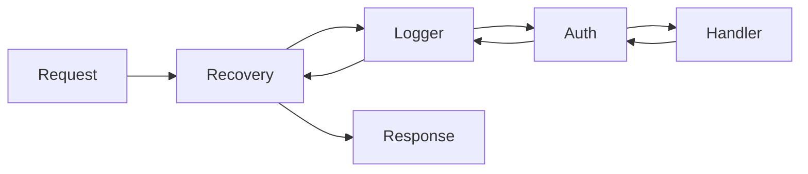

# T05 GIN Framework with Go

> **Reading Guide**: Sections 1-3 and 6 are essential first read (20 min).
> Sections 4-5 deepen understanding (15 min).
> Sections 7-12 are interview-specific -- read closer to interview day.
> Section 13 is your comprehensive interview Q&A bank --> [[questions/T05 GIN Framework - Interview Questions]]
> Something not clicking? --> [[simplified/T05 GIN Framework - Simplified]]

---

## 1. Concept

Gin is a high-performance HTTP web framework for Go, built on top of `httprouter`. It provides a martini-like API with up to 40x faster performance thanks to its radix tree router and zero-allocation path parsing.

---

## 2. Core Insight (TL;DR)

**Gin is a thin, fast layer on top of Go's `net/http` with three killer features:** radix tree routing (O(log n) path matching), middleware chaining (conveyor belt pattern with `c.Next()`), and structured request binding (JSON/XML/form to struct via tags). Everything else -- database, auth, templates -- is your choice.

---

## 3. Mental Model (Lock this in)

Think of Gin as a **conveyor belt in a factory**. A request arrives at one end. It passes through **middleware stations** (logging, auth, rate limiting) in order. Each station can inspect, modify, or reject the item. If it passes all stations, it reaches the **handler** (the worker), gets processed, and the response travels back through the stations in reverse.



> **Coming from Go net/http:** In raw `net/http`, you manually chain handlers with `http.HandlerFunc` wrappers. Gin formalizes this with `c.Next()` for explicit chain continuation, `c.Abort()` to stop the chain, and `c.Set()`/`c.Get()` for passing data between middleware. The `gin.Context` replaces `http.Request` + `http.ResponseWriter` as your primary interface.

---

## 4. Architecture & Design

### Router: Radix Tree (httprouter)

Gin uses `httprouter`'s radix tree (compact trie) for route matching:

```
Routes registered:
  GET /users
  GET /users/:id
  GET /users/:id/orders
  GET /products

Radix tree:
  /
  ├── users
  │   └── /:id
  │       └── /orders
  └── products
```

- **O(log n) lookup** regardless of route count (vs linear scan in standard mux)
- **Zero memory allocation** during path matching -- pre-compiled tree
- **Parametric routes** via `:param` and wildcard via `*path`
- Routes are **method-specific** -- `GET /users` and `POST /users` are separate tree entries

### Middleware Chain Execution

```
Request arrives
  │
  ▼
gin.Engine.ServeHTTP()
  │
  ▼
Find route in radix tree → get handler chain []gin.HandlerFunc
  │
  ▼
Execute chain sequentially:
  middleware1(c) ──── c.Next() ─┐
                                ▼
  middleware2(c) ──── c.Next() ─┐
                                ▼
  handler(c)                    │
                                ▼
  middleware2: post-Next() code ◄┘
                                ▼
  middleware1: post-Next() code ◄┘
  │
  ▼
Response sent
```

The `gin.Context.index` field tracks the current position in the handler chain. `c.Next()` increments the index and calls the next handler. `c.Abort()` sets index to `math.MaxInt8 / 2`, stopping further execution.

### gin.Context Internals

`gin.Context` is the most important type. It wraps:
- `http.Request` and `http.ResponseWriter`
- URL params (from radix tree matching)
- A key-value store (`Keys map[string]any`) for middleware-to-handler data passing
- Binding/validation helpers
- JSON/XML/String response writers
- Error collection (`Errors []*Error`)

**Critical:** `gin.Context` is **not goroutine-safe**. If you need to use it in a goroutine, copy it first: `cCopy := c.Copy()`.

---

## 5. Key Rules & Behaviors

1. **One `gin.Engine` per application** -- create with `gin.New()` (bare) or `gin.Default()` (with Logger + Recovery)
2. **Use `gin.ReleaseMode`** in production: `gin.SetMode(gin.ReleaseMode)` -- disables debug logging
3. **Middleware order matters** -- Recovery first, then Logger, then Auth, then business logic
4. **`c.Next()` is optional** -- without it, remaining handlers still execute; `c.Next()` just lets you run code AFTER downstream handlers
5. **`c.Abort()` stops the chain** but does NOT return from the current handler -- you must `return` explicitly after `c.Abort()`
6. **`c.JSON()` writes response AND sets Content-Type** -- calling it twice causes double-write
7. **`gin.Context` is NOT goroutine-safe** -- use `c.Copy()` before spawning goroutines
8. **Route params (`:id`) vs query params (`?id=`)** -- different extraction methods: `c.Param("id")` vs `c.Query("id")`
9. **Struct binding validates AND deserializes** -- use `c.ShouldBindJSON(&obj)` (returns error) not `c.BindJSON(&obj)` (auto-responds 400)
10. **Group routes with `router.Group()`** for shared middleware prefixes

---

## 6. Code Examples (Show, Don't Tell)

### Basic Setup

```go
package main

import (
    "net/http"
    "github.com/gin-gonic/gin"
)

func main() {
    gin.SetMode(gin.ReleaseMode)

    r := gin.New()
    r.Use(gin.Recovery()) // catch panics
    r.Use(gin.Logger())   // request logging

    r.GET("/ping", func(c *gin.Context) {
        c.JSON(http.StatusOK, gin.H{"message": "pong"})
    })

    r.Run(":8080") // defaults to 0.0.0.0:8080
}
```

### Route Groups + Middleware

```go
func main() {
    r := gin.New()
    r.Use(gin.Recovery(), gin.Logger())

    // Public routes
    public := r.Group("/api/v1")
    {
        public.POST("/login", loginHandler)
        public.POST("/register", registerHandler)
    }

    // Protected routes with auth middleware
    protected := r.Group("/api/v1")
    protected.Use(authMiddleware())
    {
        protected.GET("/users/:id", getUserHandler)
        protected.PUT("/users/:id", updateUserHandler)
        protected.DELETE("/users/:id", deleteUserHandler)
    }

    r.Run(":8080")
}
```

### Custom Middleware (Timing + Auth)

```go
func timingMiddleware() gin.HandlerFunc {
    return func(c *gin.Context) {
        start := time.Now()
        c.Next() // process request
        duration := time.Since(start)
        c.Header("X-Response-Time", duration.String())
    }
}

func authMiddleware() gin.HandlerFunc {
    return func(c *gin.Context) {
        token := c.GetHeader("Authorization")
        if token == "" {
            c.AbortWithStatusJSON(http.StatusUnauthorized, gin.H{
                "error": "missing authorization header",
            })
            return // MUST return after Abort
        }

        userID, err := validateToken(token)
        if err != nil {
            c.AbortWithStatusJSON(http.StatusUnauthorized, gin.H{
                "error": "invalid token",
            })
            return
        }

        c.Set("userID", userID) // pass to downstream handlers
        c.Next()
    }
}
```

```
Step 1: Request arrives with Authorization: "Bearer abc123"

Step 2: timingMiddleware starts, records start time
  c.Next() called → moves to authMiddleware

Step 3: authMiddleware reads header, validates token
  c.Set("userID", 42) → stored in gin.Context.Keys map
  c.Next() called → moves to handler

Step 4: Handler runs
  userID, _ := c.Get("userID") → retrieves 42
  Writes JSON response

Step 5: Control returns to authMiddleware (post-Next code: none here)

Step 6: Control returns to timingMiddleware (post-Next code)
  duration calculated, X-Response-Time header set
```

### Request Binding and Validation

```go
type CreateUserRequest struct {
    Name  string `json:"name"  binding:"required,min=2,max=100"`
    Email string `json:"email" binding:"required,email"`
    Age   int    `json:"age"   binding:"required,gte=18,lte=120"`
}

func createUserHandler(c *gin.Context) {
    var req CreateUserRequest
    if err := c.ShouldBindJSON(&req); err != nil {
        c.JSON(http.StatusBadRequest, gin.H{"error": err.Error()})
        return
    }
    // req is validated and populated
    c.JSON(http.StatusCreated, gin.H{"user": req})
}
```

> **Coming from Go net/http:** In raw net/http, you manually `json.NewDecoder(r.Body).Decode(&req)` then validate each field. Gin combines deserialization + validation in one call using `go-playground/validator` struct tags.

---

## 6.5. Practice Checkpoint

### Tier 1: Predict the Output (2 min)

```go
r := gin.New()
r.Use(func(c *gin.Context) {
    fmt.Println("A-before")
    c.Next()
    fmt.Println("A-after")
})
r.GET("/test", func(c *gin.Context) {
    fmt.Println("Handler")
    c.JSON(200, gin.H{"ok": true})
})
```

What prints when `GET /test` is called? What if `c.Abort()` is called instead of `c.Next()`?

### Tier 2: Fix the Bug (5 min)

```go
func authMiddleware() gin.HandlerFunc {
    return func(c *gin.Context) {
        token := c.GetHeader("Authorization")
        if token == "" {
            c.JSON(http.StatusUnauthorized, gin.H{"error": "no token"})
            // Bug: what's missing here?
        }
        c.Next()
    }
}
```

Why does this middleware allow unauthorized requests through?

### Tier 3: Build It (15 min)

Build a Gin API with:
1. A `/health` endpoint returning `{"status": "ok"}`
2. A request-timing middleware that logs duration
3. A protected `/api/users` group with a simple token-check middleware
4. GET `/api/users/:id` that returns a mock user with proper error handling for invalid IDs
5. POST `/api/users` with struct binding and validation

> Full solutions with explanations --> [[exercises/T05 GIN Framework - Exercises]]

---

## 7. Edge Cases & Gotchas

### Gotcha 1: Not returning after c.Abort()

```go
// BAD - handler still executes code after Abort
func authMiddleware() gin.HandlerFunc {
    return func(c *gin.Context) {
        if !isValid(c) {
            c.AbortWithStatusJSON(401, gin.H{"error": "unauthorized"})
            // Code below STILL runs! Abort only prevents NEXT handlers
        }
        c.Set("user", getUser(c)) // executes even after Abort!
        c.Next()
    }
}

// GOOD - return immediately after Abort
func authMiddleware() gin.HandlerFunc {
    return func(c *gin.Context) {
        if !isValid(c) {
            c.AbortWithStatusJSON(401, gin.H{"error": "unauthorized"})
            return // prevents further code in THIS function
        }
        c.Set("user", getUser(c))
        c.Next()
    }
}
```

### Gotcha 2: Using gin.Context in goroutines

```go
// BAD - data race on gin.Context
func handler(c *gin.Context) {
    go func() {
        time.Sleep(5 * time.Second)
        log.Println(c.Request.URL) // c may be reused by another request!
    }()
    c.JSON(200, gin.H{"ok": true})
}

// GOOD - copy context for goroutine use
func handler(c *gin.Context) {
    cCopy := c.Copy()
    go func() {
        time.Sleep(5 * time.Second)
        log.Println(cCopy.Request.URL) // safe
    }()
    c.JSON(200, gin.H{"ok": true})
}
```

> **Coming from Go net/http:** In raw net/http, `*http.Request` is safe to read concurrently. But `gin.Context` wraps mutable state (Keys, index, Errors), so it must be copied.

### Gotcha 3: Double response write

```go
// BAD - writes response twice
func handler(c *gin.Context) {
    if err := doSomething(); err != nil {
        c.JSON(500, gin.H{"error": err.Error()})
        // Missing return! Falls through to success response
    }
    c.JSON(200, gin.H{"ok": true}) // http: superfluous response.WriteHeader call
}
```

### Gotcha 4: BindJSON vs ShouldBindJSON

```go
// c.BindJSON(&obj)    → auto-responds 400 on error, sets Content-Type to text/plain
// c.ShouldBindJSON(&obj) → returns error, you control the response

// GOOD - full control over error response format
if err := c.ShouldBindJSON(&req); err != nil {
    c.JSON(400, gin.H{"error": err.Error(), "code": "VALIDATION_FAILED"})
    return
}
```

---

## 8. Performance & Tradeoffs

| Feature | Gin | net/http (stdlib) | Echo | Chi |
|---------|-----|-------------------|------|-----|
| Router | Radix tree | ServeMux (linear) | Radix tree | Radix tree |
| Speed | ~40x faster | Baseline | ~comparable | ~comparable |
| Middleware | Built-in chain | Manual wrapping | Built-in | Built-in |
| Binding/Validation | Built-in | Manual | Built-in | Manual |
| Dependencies | httprouter + validator | None | Minimal | Minimal |
| Learning curve | Low | Lowest | Low | Low |

**When to use Gin:** REST APIs with validation, middleware-heavy services, rapid development
**When NOT to use Gin:** Simple internal services (stdlib is fine), WebSocket-heavy apps (use gorilla/websocket directly), gRPC services (use google.golang.org/grpc)

---

## 9. Common Misconceptions

| Misconception | Reality |
|---------------|---------|
| Gin replaces net/http | Gin wraps net/http; `gin.Engine` implements `http.Handler` |
| Gin handles concurrency differently | Same goroutine-per-request model as net/http |
| You need Gin for production Go APIs | stdlib is fine for simple APIs; Gin adds convenience, not necessity |
| c.Next() is required in middleware | Without c.Next(), remaining handlers still execute; c.Next() lets you run post-processing code |
| Gin is not suitable for microservices | It is widely used in microservices; Kissht uses it across 200+ services |
| Gin's validator is Gin-specific | It uses go-playground/validator, which works standalone too |

---

## 10. Related Tooling & Debugging

- **`gin.DebugMode`**: Shows route registration at startup -- useful during development
- **`gin.Logger()`**: Colored request logging with latency, status, path
- **`gin.Recovery()`**: Catches panics, returns 500, prevents process crash
- **Custom recovery**: Replace with `gin.CustomRecovery(handler)` for structured error responses
- **Swagger/OpenAPI**: Use `swaggo/gin-swagger` for auto-generated API docs from annotations
- **Testing**: Use `httptest.NewRecorder()` + `gin.CreateTestContext()` for unit testing handlers
- **Profiling**: Attach `pprof` to Gin with `github.com/gin-contrib/pprof`

---

## 11. Interview Gold Questions

### Q1: "How does Gin's routing differ from Go's default HTTP mux?"

**Answer:** Go's `DefaultServeMux` uses a map for exact path matching and falls back to longest-prefix matching -- it's O(n) in worst case and doesn't support path parameters natively. Gin uses httprouter's radix tree (compressed trie) which provides O(log n) lookups, built-in path parameters (`:id`), wildcards (`*path`), and method-specific trees. The key difference: Gin resolves routes at near-zero allocation cost because the tree is pre-compiled at startup.

**Interview tip:** Mention that Go 1.22+ improved ServeMux with pattern matching, but Gin's radix tree is still faster for large route sets.

### Q2: "Explain the middleware execution lifecycle in Gin"

**Answer:** Middleware in Gin forms a handler chain (slice of `HandlerFunc`). When a request arrives, Gin resolves the route and executes handlers sequentially. Each handler can call `c.Next()` to yield to the next handler, then resume after it returns -- creating a Russian-doll nesting pattern. `c.Abort()` prevents remaining handlers from executing by setting the chain index to a sentinel value. Code before `c.Next()` runs during the request phase; code after runs during the response phase. This makes timing middleware trivial.

---

## 12. Final Verbal Answer

"Gin is a high-performance Go HTTP framework built on httprouter's radix tree for O(log n) route matching. Its core abstraction is the middleware chain -- handlers execute sequentially, and c.Next() creates a before/after lifecycle for each middleware. gin.Context wraps the request, response, and a key-value store for passing data between middleware. For request handling, ShouldBindJSON validates and deserializes in one call using go-playground/validator tags. In production, set ReleaseMode, order middleware carefully -- Recovery first, then Logger, then Auth -- and remember that gin.Context is not goroutine-safe. It's used extensively in FinTech microservice architectures like Kissht's 200+ service fleet."

---

## 13. Comprehensive Interview Questions

> Full interview question bank (12 questions) --> [[questions/T05 GIN Framework - Interview Questions]]

Preview:
1. "How does Gin's router differ from Go's default ServeMux?" [COMMON]
2. "Explain the middleware chain execution model" [COMMON]
3. "When would you NOT use Gin?" [TRICKY]

---

> See [[Glossary]] for term definitions.
