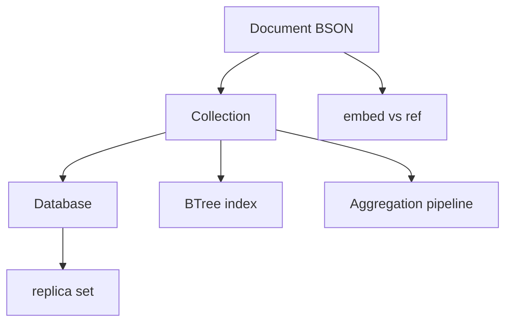

# MongoDB — Visual Map

> Visual-only reference for [[databases/MongoDB]].
> No prose — just diagrams, layouts, and cheat tables.

---

## Concept Map



---

## Data Structure Layouts

```
BSON document (simplified on disk / wire)
+--------+--------+--------+ ... ordered field seq
| int32  | nul-t   | nul-t   | type+name+value pairs
| length | cstring | cstring | (binary, nested doc, array, etc.)
+--------+---------+---------+

B-tree index (logical)
              [P50]
            /        \
     [P20,P30]      [P70,P80]
   leaves point to document locations / keys as designed per storage engine

Replica set
        +--------+
        |Primary |  writes (w/ majority rules)
        +--------+
        /    |    \
   Secondary Secondary Arbiter(optional, votes only)
   read+async apply      tie-break, no data
```

---

## Decision Table

| Need to... | Use | Why |
|---|---|---|
| 1:1 or 1:few, always read together | embed subdocument/array | Single read; atomic single-doc updates |
| 1:many, independent lifecycles | reference `_id` in other collection | Smaller parent docs; avoid unbounded array growth |
| File > 16MB binary | GridFS (chunks + files) | Document cap 16MB; GridFS streams |
| Key order in query/aggregation matters | `bson.D` (ordered) | Order-sensitive operators / duplicate keys |
| Unordered / map-like | `bson.M` | Unordered; typical for ad-hoc filters |

---

## Before/After Comparisons

```
COLLSCAN (no index)            IXSCAN (indexed predicate)
-------------------            ---------------------------
Full collection read           B-tree seek + range; fewer docs
High latency, CPU              planner picks index; verify with explain

Single-document update         Multi-document transaction
-------------------------     --------------------------
Atomic per doc                 Requires replica set, sessions; overhead
$set, arrayFilters patterns   multi-doc commit across collections
```

---

## Cheat Sheet

1. Max BSON document size: 16MB per document (design limit on wire and storage).
2. Default `maxPoolSize` in drivers is often 100; tune to workload and `mongod` `maxIncomingConnections`.
3. Write concern `w: majority` + `j: true` (journal) = durability / replication tradeoffs.
4. Read preference: `primary`, `primaryPreferred`, `secondary`, `nearest` — use with replica sets.
5. Aggregation pipeline: stages are ordered; `$match` early reduces documents for later stages.
6. ESR index rule: Equality fields, then Sort, then Range (compound index order).
7. `explain("executionStats")` for winning plan, `nReturned`, `totalDocsExamined`, `indexName`.
8. `hint()` forces index when planner choice is wrong (use sparingly).
9. Oplog backs replication; secondaries apply asynchronously unless causal consistency features used.
10. Transactions need `mongod` 4.0+ (replica set); multi-shard in 4.2+; sessions required.
11. `upsert: true` creates doc if filter misses; one doc per upsert.
12. GridFS: `chunks` + `files` collections; default chunk size 255KB.
13. Capped collections: fixed size, natural order; tailable cursors for tailing.
14. `partialFilterExpression` for sparse/partial indexes to reduce size and improve selectivity.

---
