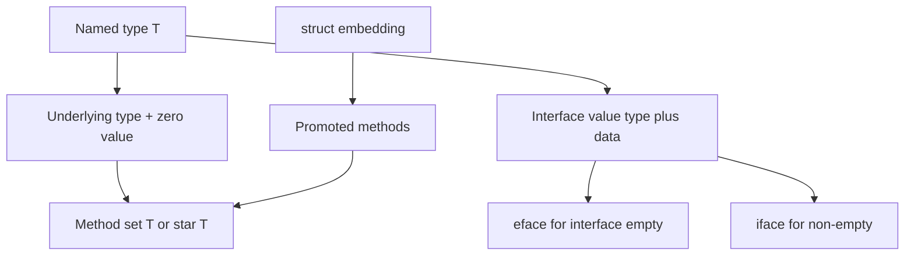

# T01 Go Type System & Value Semantics — Visual Map

> Visual-only reference for [[T01 Go Type System & Value Semantics]].
> No prose — just diagrams, layouts, and cheat tables.

---

## Concept Map



---

## Data Structure Layouts

```
eface: interface{} / any (empty method set) - two words
+------------------+------------------+
| _type  *Type     | data unsafe...   |
+------------------+------------------+

iface: non-empty interface - two words
+------------------+------------------+
| tab  *itab       | data unsafe...   |  itab: concrete type + method table
+------------------+------------------+

Method set (rules of thumb)
Receiver value T:        methods on T
Receiver pointer star T:  methods on T and star T
Variable of type T:      can call T methods; star T if addressable
```

---

## Decision Table

| Need to... | Use | Why |
|---|---|---|
| New distinct type, methods on int/string | `type X int` | Named type; own method set, not assignable to `int` without conversion |
| Alias only, refactor/search | `type X = int` | Same as `int`; interchangeable |
| Abstraction, tests, pluggable behavior | `interface` | Structural typing: satisfy by methods |
| Reuse fields + API without embedding struct name everywhere | `embedding` | Promoted fields and methods to outer type |

---

## Before/After Comparisons

```
nil interface                     Typed nil in interface
----------------                  ----------------------
var i fmt.Stringer = nil         var p *User = nil
i == nil  // true (both parts)  var s fmt.Stringer = p
                                s == nil  // false (type known, data nil)

Value receiver (T)              Pointer receiver (star T)
----------------                --------------------------
Copies T on call                Copies pointer on call; mutates *T
Method set: T only (for        Method set: T and *T (for T)
pointer-free patterns)         Larger structs: prefer *T
```

---

## Cheat Sheet

1. Named type `type T U` is distinct from `U` except operations allowed by spec (conversion rules).
2. Type alias `type T = U` is identical to `U` for all type identity and assignability.
3. Zero value: `false`, `0`, `""`, `nil` for ref types, struct with zero fields, etc.
4. `interface` holds `(type, data)`; `nil` interface means both are effectively unset.
5. Typed nil: interface value non-nil if dynamic type is set even if data is nil pointer.
6. Assignability: assign when `T` and `V` identical, or V implements T, or untyped to typed, etc. (see spec).
7. Comparable: comparable types only with `==` (structs if all fields comparable, arrays same length+type, etc.).
8. Slices, maps, functions are not comparable (except to nil for slice/map/chan/function as applicable).
9. Method set of `*T` includes all methods; method set of `T` is only value receivers (plus promoted rules).
10. `T` method call on addressable `T` can pass `&T` to pointer receiver (compiler sugar).
11. Embedding promotes fields/methods; outer name can shadow (resolution rules in spec).
12. `unsafe.Pointer` and `uintptr` are different; converting between is subtle and not general substitute.
13. Interface satisfaction is implicit: no `implements` keyword.
14. `any` is alias for `interface{}` (predeclared idiom in modern Go).

---
