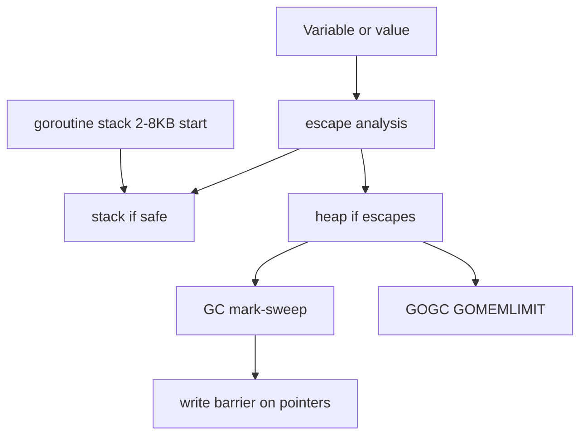

# T02 Go Memory Allocation & Value Semantics — Visual Map

> Visual-only reference for [[T02 Go Memory Allocation & Value Semantics]].
> No prose — just diagrams, layouts, and cheat tables.

---

## Concept Map



---

## Data Structure Layouts

```
Stack frame (conceptual, per call)
+----------------------------+
| return addr / frame pointer|
| local variables            |  fixed-size, LIFO, no GC scan per frame
| args / results             |
+----------------------------+

Slice header: reflect.SliceHeader (24 bytes, amd64)
+------------------+------------------+------------------+
| Data  uintptr    | Len   int        | Cap   int        |
+------------------+------------------+------------------+
| -> array element | # elements       | capacity         |
+------------------+------------------+------------------+

Goroutine stack growth (simplified)
2KB start -> 4KB -> 8KB ... (contiguous copy to larger block on overflow)
^ hot split / small frames favor stack; overflow triggers copy+grow
```

---

## Decision Table

| Need to... | Use | Why |
|---|---|---|
| Small aggregate, pass by value often | value (`T`) | Copy cost low; no aliasing if immutability by convention |
| Large struct, mutability, sync | `*T` | Single shared location; less copy overhead |
| Reusable temp buffer in hot path | `sync.Pool` | Reuse allocs; avoid per-request heap churn |
| Known max size or count up front | pre-allocate slice `make(T,0,cap)` | Fewer append reallocations; predictable |

---

## Before/After Comparisons

```
Variable stays on stack        Escapes to heap
-------------------------     ----------------
Returned pointer to local      Returned pointer to local
is invalid (C); in Go,          forces heap alloc (or compiler
that local escapes              proves lifetime via inline)

append within cap               append beyond cap
----------------                ----------------
Reuses same backing array       New larger array, copy old,
len grows; cap unchanged        update slice header
```

---

## Cheat Sheet

1. Stack allocation: cheap, LIFO, tied to call scope; size often known at compile time.
2. Heap: survives unknown lifetimes; every pointer escape can mean allocation.
3. Escape analysis decides stack vs heap; `go build -gcflags=-m` shows escape reports.
4. Common escapes: return `&`local, send pointer to channel, close over pointer, interface value holding pointer.
5. `new(T)` always allocates a single `T` on the heap.
6. Slice copy is O(n) in elements; header copy is O(1) (shallow).
7. GC is concurrent mark-sweep; write barriers keep pointers correct during mark.
8. `GOGC` (default 100) trades CPU vs memory; `GOMEMLIMIT` caps heap soft limit (Go 1.19+).
9. Goroutine stack starts small; growth copies stack (not segmented like some runtimes in older docs).
10. Value semantics: assignment copies the whole `T` for struct (see size vs pointer tradeoff).
11. `append` reuses cap until full; new backing when `len` would exceed `cap`.
12. `make([]T, len, cap)` allocates one array; slice header points into it.
13. Zero-size types may share one address; still subject to same semantic rules.
14. `atomic` and `sync` types: still reason about where backing memory lives and races.

---
