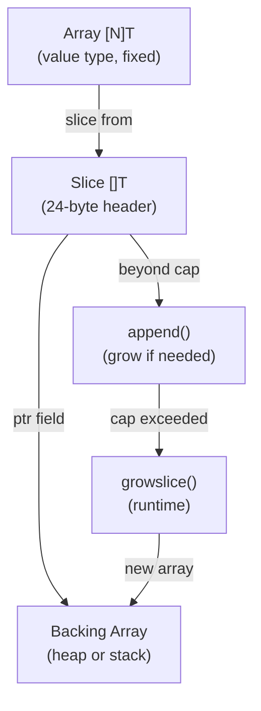

# T04 Arrays & Slice Internals — Visual Map

> Visual-only reference for [[T04 Arrays & Slice Internals]].
> No prose — just diagrams, layouts, and cheat tables.

---

## Concept Map



---

## Data Structure Layouts

### Slice Header
```
SliceHeader (24 bytes on 64-bit)
┌──────────────┬──────────┬──────────┐
│ ptr *array   │ len int  │ cap int  │
│ (8 bytes)    │ (8 bytes)│ (8 bytes)│
└──────┬───────┴──────────┴──────────┘
       │
       ▼
  [...backing array elements...]
```

### Array vs Slice in Memory
```
Array [5]int (value type, 40 bytes inline):
  [10][20][30][40][50]   ← entire thing is the value

Slice []int (header + backing):
  Header [ptr|len=3|cap=5] ──▶ [10][20][30][__][__]
  24 bytes                      backing array (may be larger)
```

### Sub-slice Sharing
```
  original: [ptr──────|len=5|cap=8] ──▶ [A][B][C][D][E][_][_][_]
  sub:      [ptr────────|len=3|cap=6] ──▶    [C][D][E][_][_][_]
                                              ^^^ same memory!
```

### Three-index Slice
```
  a[1:3:5]  →  len = 3-1 = 2,  cap = 5-1 = 4
  a[1:3:3]  →  len = 3-1 = 2,  cap = 3-1 = 2  (append forces new array)
```

---

## Decision Table

| Need to... | Use | Why |
|---|---|---|
| Fixed-size, compile-time known | `[N]T` array | Value type, stack, comparable, no indirection |
| Dynamic collection | `[]T` slice | Growable, pass header (24B), standard choice |
| Known final size | `make([]T, 0, n)` | Pre-allocate, avoid reallocations |
| Pre-fill with zeros | `make([]T, n)` | n elements at zero value, ready to index |
| Independent copy | `copy()` or `slices.Clone()` | Break shared backing array |
| Prevent append overwrite | `a[low:high:max]` | Limit capacity, force new array on append |
| Iterate with modification | Two-index in-place filter | O(1) extra space, nil tail for GC |

---

## Growth Formula (Go 1.18+)

```
  cap < 256:   newcap = oldcap * 2           (double)
  cap >= 256:  newcap += (newcap + 768) / 4  (smooth transition)

  Growth factors:
  256  → 2.00x
  512  → 1.63x
  1024 → 1.44x
  2048 → 1.35x
  4096 → 1.30x

  Final cap rounded UP to nearest memory size class.
```

---

## Before/After Comparisons

### Append Within vs Beyond Capacity
```
WITHIN (cap sufficient):
  Before: [ptr──|len=3|cap=5] ──▶ [1][2][3][_][_]
  append(s, 4)
  After:  [ptr──|len=4|cap=5] ──▶ [1][2][3][4][_]   ← SAME array

BEYOND (cap exceeded):
  Before: [ptr──|len=5|cap=5] ──▶ [1][2][3][4][5]
  append(s, 6)
  After:  [ptr──|len=6|cap=10] ──▶ [1][2][3][4][5][6][_][_][_][_]  ← NEW array
```

### nil Slice vs Empty Slice
```
  var s []int     →  [nil   | 0 | 0]   JSON: null     reflect: nil
  s := []int{}    →  [valid | 0 | 0]   JSON: []       reflect: non-nil
  s := make([]int, 0) → same as []int{}
```

---

## Cheat Sheet

1. Slice = 24-byte header: ptr + len + cap
2. Array = value type, size is part of type, full copy on assign/pass
3. Passing a slice copies the header (24B), not the backing array
4. append within cap: writes to shared array, updates local len
5. append beyond cap: new array, copy, old eligible for GC
6. Growth: 2x below 256, smoothly decreasing to ~1.25x for large slices
7. Sub-slice shares backing array — can leak memory (use copy/Clone)
8. Three-index `a[l:h:m]`: cap = m-l, prevents append overwrite
9. nil slice (var s []int) vs empty slice (s := []int{}) differ in JSON/nil-check
10. make([]T, n) = n zero elements; make([]T, 0, n) = empty with cap n
11. Delete element: shift left, reslice, nil out tail for pointer GC
12. []Struct is more cache-friendly than []*Struct (contiguous vs scattered)
13. Arrays are comparable (map keys OK); slices are NOT comparable
14. slices.Clone() (Go 1.21+) = cleaner alternative to make+copy
15. Always return slice from function after append — caller's header is stale

---
