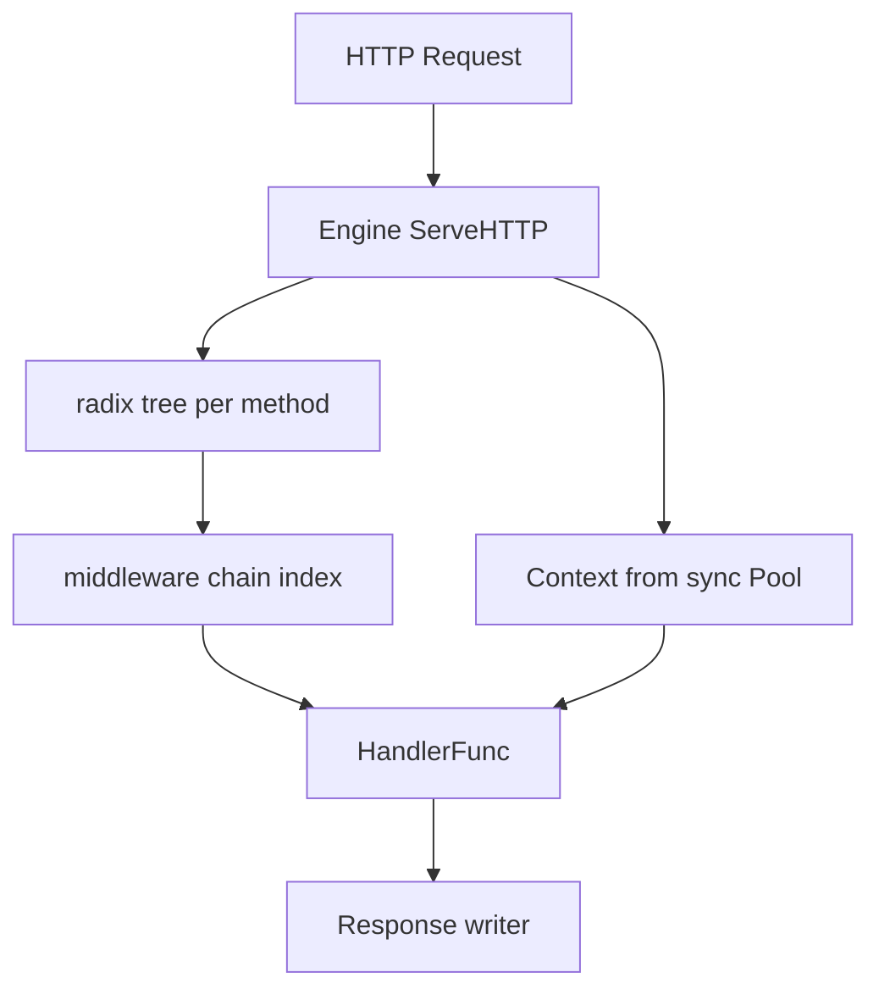

# T05 GIN Framework — Visual Map

> Visual-only reference for [[frameworks/T05 GIN Framework]].
> No prose — just diagrams, layouts, and cheat tables.

---

## Concept Map



---

## Data Structure Layouts

```
Radix tree (Gin: compressed trie, per HTTP method)
                    [root]
                   /  |  \
                 GET POST ...
                  |
              path segments merged where linear

Middleware chain
handlers = [Logger, Auth, H1, H2, userHandler]
              index 0 -> 1 -> 2 -> ... -> Next() advances

gin.Context (selected fields, conceptual)
+----------------------------+
| Request *http.Request        |
| Writer ResponseWriter        |
| Params, Keys map[string]     |
| index (middleware), engine   |
+----------------------------+  Created/acquired from pool; Reset on reuse
```

---

## Decision Table

| Need to... | Use | Why |
|---|---|---|
| Single handler, no routing extras | `net/http` | Minimal; `DefaultServeMux` linear scan |
| REST + middleware + param routes | `github.com/gin-gonic/gin` | Fast radix tree, ecosystem |
| IDL + streaming RPC | `google.golang.org/grpc` | gRPC, not HTTP router replacement |
| WebSocket upgrade | `gorilla/websocket` (or `nhooyr.io/websocket`) | Raw WS; often combine with Gin manually |

---

## Before/After Comparisons

```
DefaultServeMux (net/http)        Gin Engine radix tree
-------------------------         ----------------------
O(n) in registered patterns       O(m) m = path len segments
Simple map-style dispatch         Per-method tree; param routes

r.Run (":8080")                    http.Server + Shutdown
--------------                    ----------------------
Blocks; no graceful API           context cancel; Shutdown timeout
tied in Gin helper                for draining connections
```

---

## Cheat Sheet

1. `Default()` vs `New()`: with/without default Logger + Recovery.
2. Route registration: `GET/POST/Group` attach to `Engine` or `RouterGroup`.
3. `Use()` adds global middleware; group-level middleware for subtree only.
4. `c.Next()` hands off to next middleware; `c.Abort()` stops chain.
5. Path params: `:name` and `*wildcard` in route strings; `c.Param` reads.
6. `ShouldBind*`, `Bind*`: request binding; errors map to 400 on Bind with abort patterns.
7. `Context` is pooled: do not hold reference past handler return.
8. `TestMode` for testing; `httptest` for handler unit tests.
9. Radix tree: registered routes are prefix-compressed; method isolation per tree.
10. `c.JSON`/`c.String`: write with convenience; set status before body where needed.
11. `Run` uses `http.ListenAndServe` — no built-in graceful stop in one call.
12. For production: set `http.Server` with `ReadHeaderTimeout`, `IdleTimeout`, etc., and use `gin` as `Handler()`.
13. `sync.Pool` for `Context` reduces alloc pressure under high QPS.
14. `Static`/`StaticFS` for file serving; not same as API routing concerns.

---
