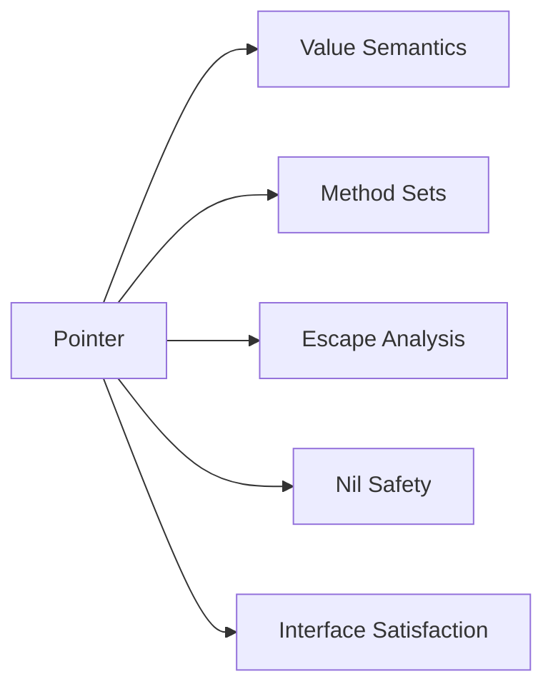

# T07 Pointers & Pointer Semantics — Visual Map

> Visual-only reference for [[T07 Pointers & Pointer Semantics]].
> No prose — just diagrams, layouts, and cheat tables.

---

## Concept Map



---

## Data Structure Layouts

**Pointer (64-bit) → heap/stack value**

```
[ 8 bytes: address ] -----> [ N bytes: value ]
     ^                        (struct, slice
     |                         header, etc.)
     |
  uintptr on stack or in iface
```

**Interface value (2 words)**

```
[ type descriptor ptr | data ptr (or sml value) ]
         |                      |
     itab/_type            *T or (ptr,val) for small iface
```

**`nil` pointer**

```
[ 0x0 ] -X-> (nowhere; deref = panic in unsafe cases)
         |
     typed nil: (*T)(nil) is not same as var x *T then x==nil
```

*Label:* `nil` interface = `(T=nil, V=nil)`; `nil` `*T` = zero address

---

## Decision Table

| Context | Use **pointer** `*T` | Use **value** `T` |
|--------|----------------------|-------------------|
| **Method receiver** | Mutate receiver; large struct; consistency if some methods need `*T` | Small, immutable, copy is cheap; `sync.Mutex` in struct (must be pointer receiver) |
| **Parameter** | Large struct, mutation, `nil` optional, avoid copy cost | Small POD, immutability, scalar-like types |
| **Return** | Return large struct w/o copy; return `nil` for “not found” | Small return values, value semantics, stack-friendly tiny types |
| **Rule of thumb** | Sharing/mutation, size, `nil` | Copy is cheap, no mutation |

---

## Before/After Comparisons

**Value receiver: each call gets a copy**

```
Before call:  caller's struct in addr A
                 |
                 v  (copy)
func (s T) f(): s' is a COPY — field writes don't affect caller
After call:   caller's struct unchanged
```

**Pointer receiver: one shared struct**

```
Before call:  caller's struct at addr A
                 |
                 v  (pass addr)
func (p *T) f(): *p is SAME — field writes go to A
After call:   caller's struct may be mutated
```

*Label:* method set: `*T` has both value and pointer methods; `T` only value methods (with exceptions for addressable `T`).

---

## Cheat Sheet

1. A pointer stores an address; width is machine word (e.g. 8 bytes on 64-bit).
2. `&x` takes address of `x` (if addressable); `*p` loads the value at `p`.
3. Value semantics: pass/copy `T` — no aliasing. Pointer semantics: `*T` can alias one allocation.
4. `nil` is representable for pointers, channels, funcs, maps, slices, interfaces, `*T` — each has typed nil rules.
5. Dereferencing `nil` `*T` → panic (except in some `unsafe` patterns).
6. `interface{}` is `(type, data)`; nil interface means both parts nil; typed `nil` pointer in interface is subtle (`==` surprises).
7. Method set of `T`: methods with receiver `T`. Method set of `*T`: `T` and `*T` receivers.
8. Large structs: often pass `*T` to avoid copy; tiny structs (e.g. `Point`) may stay as values.
9. Escape analysis: if a pointer to stack value escapes, value moves to heap.
10. `new(T)` / `&T{}` return `*T`; zero value: `*T` is `nil` for pointer, struct fields are zeroed.
11. Slices, maps, channels are reference-like headers; reassign the header without pointer only copies the header.
12. `copy` and assignment rules differ: slice copy is shallow; struct assignment is field-wise copy.
13. `unsafe.Pointer` + `uintptr` for FFI only — not for generic aliasing; GC moving invalidates misuse.
14. `reflect` and interfaces keep pointer identity for pointer dynamic values.
15. Prefer pointer receiver for `sync.Mutex` and other in-struct sync fields (must be same address every method).

---
