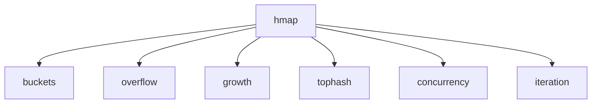

# T08 Map Internals — Visual Map

> [[T08 Map Internals]]

---

## Concept Map



---

## Data Structure Layouts

**`runtime.hmap`**

```
hmap
├── count
├── flags
├── B
├── noverflow
├── hash0
├── buckets
├── oldbuckets
├── nevacuate
└── extra
```

**`runtime.bmap` (8 K/V + overflow)**

```
bmap
├── tophash[8] byte
├── keys[8] K
├── values[8] V
└── overflow *bmap
```

```
# bucket: low B bits of hash (during grow: old table uses fewer bits)
b = hash & ((1 << B) - 1)
```

---

## Decision Table

| Situation | `make(map[K]V)` | `make(map[K]V, hint)` | `sync.RWMutex` + map | `sync.Map` |
|----------|-----------------|------------------------|----------------------|------------|
| Unknown final size | grow from empty | | | |
| Known ~upper bound (hint) | | prealloc ~hint entries | | |
| Many goroutines R/W | | | serialize + map | internal sync |
| Read-heavy / cache-typed workload | | | mutex typical | consider (profile) |
| Unsynchronized concurrent map | runtime **panic** (race) | same | **safe** (serialized) | **safe** (API) |

---

## Before / After: growth (4 → 8 buckets, incremental)

**Before (4 buckets, B=2)**

```
buckets:  [0][1][2][3]     each → bmap (×8) → overflow *
```

**After (8 buckets, B=3) — `oldbuckets` + incremental evac**

```
buckets:     [0][1][2][3][4][5][6][7]   ← new table
oldbuckets:  [0][1][2][3]                ← old table (draining)
# per op: ~1–2 buckets evacuated, not one giant copy
```

---

## Cheat Sheet

1. Backing type: **`hmap`**, not plain Go-visible struct in user code.
2. **2^B** regular buckets; **B** stored in `hmap` (`log2` bucket count).
3. **8** key/value slots per **`bmap`**; **overflow** chains for long runs.
4. **tophash**: 1 byte / slot — top bits of hash or empty / special.
5. Load factor **> 6.5** average keys/bucket **or** overflow pressure → **grow**.
6. **Incremental** evacuation: **1–2** old buckets per operation (amortized).
7. **Concurrent** unsynchronized map access → **data races**; runtime can **fatal panic**.
8. `&m[k]` **illegal** — **map value not addressable** (relocation on grow).
9. `nil` map **read** → **zero**; **write** → **panic: assignment to entry in nil map**.
10. Iteration order **intentionally** **randomized**; **no** spec guarantee.
11. `delete` clears cell; table **does not** **shrink**; memory may stay in place.
12. Reclaim memory: build **new** map, copy, drop old, or new scope of variable.
13. **`make` hint**: capacity hint, **not** `len` — reduces early realloc.
14. Strong concurrency: **`sync.Mutex` / `sync.RWMutex` + map**; **`sync.Map`** for niche patterns.
15. `len`/`delete`/assign trigger **opportunistic** evacuation work during **growth**.

---
