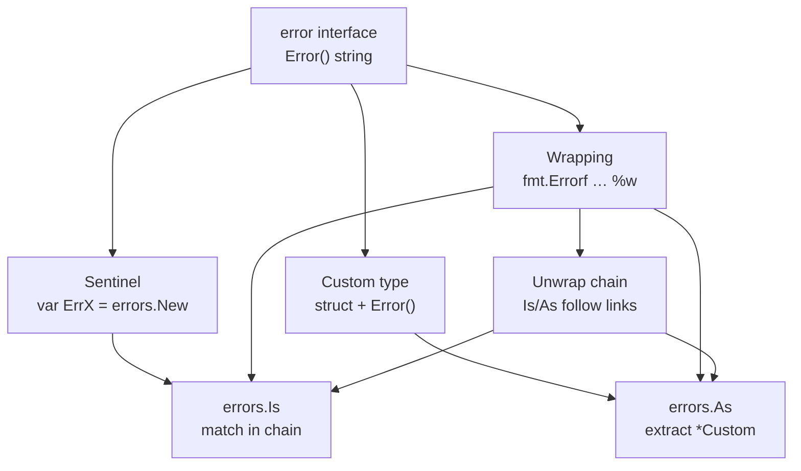

# T09 Error Handling Patterns — Visual Map (only)

> One-glance page for [[T09 Error Handling Patterns]] — no prose lessons, only **structure**.

---

## Mermaid concept map



---

## Error chain (ASCII)

```
  outer  ──Unwrap()──▶  middle  ──Unwrap()──▶  leaf (sentinel or concrete type)

  err := fn()   // "handler: %w" → "repo: %w" → ErrNotFound

  errors.Is(err, ErrNotFound)   --> true (walks chain)
  errors.As(err, &pe *PathError) --> first *PathError, if any
```

---

## Decision table: sentinel vs custom vs wrapping

| Need | Preferred tool | Smell if wrong |
|------|----------------|----------------|
| One fixed "this exact situation" for control flow | **Sentinel** + `errors.Is` | Comparing `err.Error() == "..."` after wraps |
| Fields (code, user id, field name) | **Custom type** + `errors.As` | Regex on `err.Error()` |
| Add layer context, keep root cause for `Is`/`As` | **`fmt.Errorf` + `%w`** | `fmt.Errorf("… %v", err)` then expecting `Is` to work on root |
| Log-only detail | `log` + `%v` (or `With` helpers) | Using `%w` when you *do not* want semantic chain |

---

## Cheat sheet: 12 facts

1. **`error` is an interface** — one method: **`Error() string`**.  
2. **Sentinels** are **values** (often `var Err…`) compared with **`errors.Is`**, not `==` on wrapped errors.  
3. **`%w`** in `fmt.Errorf` **preserves** **`Unwrap()`**; **`%v`** does **not** (no semantic link for the wrapper).  
4. **`errors.Is(err, t)`** walks **`Unwrap`**; works with **wrapping** and custom **`Is` methods** on target types.  
5. **`errors.As(err, &ptr)`** fills **`ptr`** with first match in **chain**; **`ptr` must be a pointer to interface or pointer to concrete type.  
6. **Custom errors** are usually `type MyErr struct` with **pointer** `Error()` for consistency with `As`.  
7. **Typed nil:** `return (*AppError)(nil)` as **`error`** is **not** a nil interface—**dynamically** typed, **statically** "nil pointer."  
8. **Return `nil, nil`** in `(T, error)`; for **error only**, `return nil` as **`error`**, not a typed `nil` pointer in an **`error` slot.  
9. **Wrap** at **module** / **IO** / **HTTP** boundaries to add **one line** of *what you were doing*.  
10. **Do not wrap** to **repeat** the same string twice or to **leak** tokens / PII.  
11. **`panic` is for programmer bugs** / "cannot proceed," not for **expected** file-not-found.  
12. **`errcheck`** (or `go vet` patterns) catches **dropped** **errors** — orthogonal to good **wrapping** design.

---

## Related

- [[T09 Error Handling Patterns]]  
- [[T09 Error Handling Patterns - Revision]]  
- [[T09 Error Handling Patterns - Interview Questions]]  
- [[T09 Error Handling Patterns - Simplified]]  
- [[T09 Error Handling Patterns - Exercises]]
