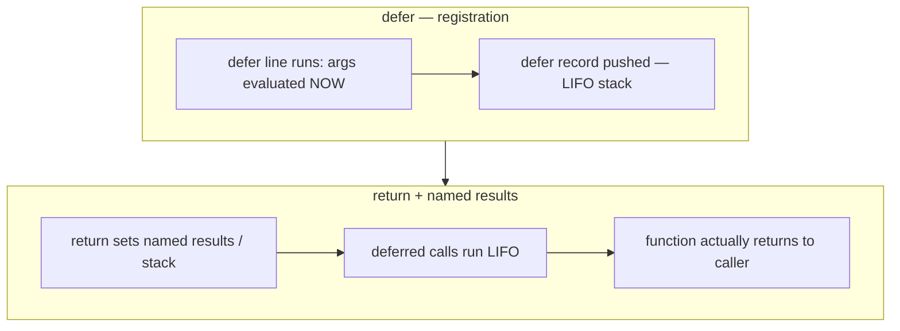
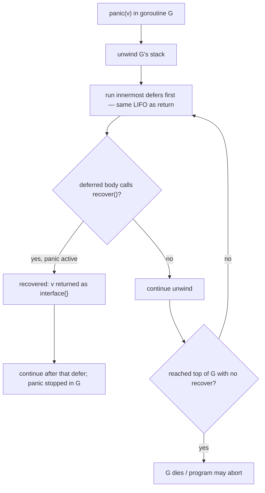

# T10 Defer, Panic & Recover Internals — Visual Map
#visuals #go #defer #panic

Back to: [[T10 Defer, Panic & Recover Internals]]

**Visual-only companion:** no prose tutorial here — use [[T10 Defer, Panic & Recover Internals - Simplified]] for plain English.

---

## Mermaid — Defer, args, returns



## Mermaid — Panic, unwind, recover



**Isolation note:** there is no edge from `panic` in **G1** to `recover` in **G2** — not shown as an arrow because it **does not exist**.

---

## ASCII — Defer stack (LIFO)

```
func f() {
    defer a()  // 3rd runs  ----\
    defer b()  // 2nd runs  ----+--- stack of defers
    defer c()  // 1st runs  ----/   (c runs first on exit)
    // ...
} // exit: c(), b(), a()
```

## ASCII — Panic flow + recover

```
call chain:  A -> B -> C
                     |
                 panic(x)
                     |
   unwind:    C's defers -> B's defers -> A's defers
                     |
         [defer in B: r := recover()  if r != nil  { ... handled ... }]
                     |
         if no recover: --> fatal / goroutine done
         if recover:   --> execution continues after that defer, in G
```

---

## Decision table — when to use what

| Situation | Prefer | Avoid |
|----------|--------|--------|
| **Cleanup** (file, lock, small finish-up) | **`defer`** next to `Open` / `Lock` in the **same** scope | **`defer` in a tight long loop** without a new func scope — leaks or delays |
| **Expected failure** (bad input, I/O) | **Return `error`**, `fmt.Errorf`, wrapping | **`panic` for business logic** |
| **Program invariant violated** (impossible state) | **`panic` in dev** / or log + return error in **libraries** (project rules vary) | **Swallowing** with `recover()` everywhere — hides bugs |
| **Goroutine safety** | **`defer`+`recover` inside the `go` body** (see [[T10 Defer, Panic & Recover Internals - Exercises]]) | Relying on **parent** to **recover child** — **won’t work** |
| **Force process exit** | `os.Exit` when you really mean "now" (tests, tools) | Expecting **`defer` cleanup** on that path — **won’t run** |

---

## Cheat sheet — 12 facts

1. **`defer` args** are evaluated at the **`defer` statement**, not when the call runs.
2. **Multiple defers** run in **LIFO** order in that function.
3. **Named return values** can be **observed/updated** by defers in the return window.
4. **`recover` is only** meaningful **during** panic **unwinding** in the **current goroutine**.
5. **`recover()`** in normal code path usually returns **`nil`**.
6. **Child goroutine panic** does not propagate to parent; **no cross-goroutine recover**.
7. **`panic` can take** any value; **`recover()`** returns `interface{}`.
8. **`os.Exit` / `exit`** bypass **all** defers in that process.
9. **Loop + single `defer`** stacks **N** cleanups for **one** return — classic **leak** / **order** bug.
10. **Open-coded / inlined defers** (compiler optimization) **reduce** **defer** overhead in **obvious** **scoped** **cases** (see main note in [[T10 Defer, Panic & Recover Internals]]).
11. Re-panicking after `recover` is the way to **log** and **rethrow** if needed.
12. **HTTP / servers** use **middleware** + **per-goroutine** `recover` so one handler does not take down the process.

---

**Also read:** [[T10 Defer, Panic & Recover Internals - Revision]] · **[[T10 Defer, Panic & Recover Internals - Interview Questions]]**
