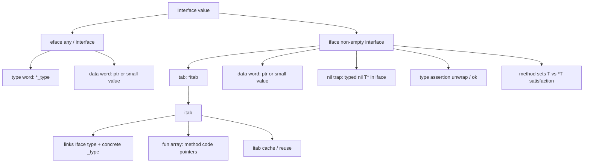

# T11: Interface Internals (iface & eface) — Visual Map

> Visual-only companion to [[T11 Interface Internals (iface & eface)]]. No prose deep-dive — use other T11 notes for stories.

---

## Mermaid — concepts



---

## ASCII — `eface` layout

```text
  eface (any)
  ┌──────────────┬──────────────┐
  │     _type    │     data     │
  └──────────────┴──────────────┘
        *                *
        │                └──► *T, string header, or small inline bits
        └──► runtime type descriptor for dynamic type
```

---

## ASCII — `iface` layout

```text
  iface (e.g. fmt.Stringer)
  ┌──────────────┬──────────────┐
  │     tab      │     data     │
  └──────────────┴──────────────┘
        *                *
        │                └──► pointer to concrete value (often)
        └──► *itab (see below)
```

---

## ASCII — `itab` with `fun[]`

```text
  itab (conceptual — field names vary by Go version)
  ┌────────────────────────────────────────────┐
  │ inter  *interfacetype   (which interface)  │
  │ _type  *_type           (concrete dynamic) │
  │ hash   uint32           (fast type checks) │
  │ ...     (cache link, flags, etc.)          │
  ├────────────────────────────────────────────┤
  │ fun[0]  code pointer for iface method #0   │
  │ fun[1]  code pointer for iface method #1   │
  │ fun[2]  ...                                │
  └────────────────────────────────────────────┘
         dispatch: call fun[i] with data word as receiver
```

---

## Decision table — interface vs concrete

| Situation | Prefer | Why (one line) |
|-----------|--------|----------------|
| Multiple implementations behind one API | **Interface** | Stable contract; dynamic dispatch via `itab` |
| Hot path, single known type | **Concrete** | No `itab` indirection; easier inlining |
| Testing / mocking | **Interface** | Swap fakes; **small** interface surface |
| Serialization / generic containers | **`any` (eface)** | Hold arbitrary **one** dynamic type |
| You need both `Read` and concrete `*File` methods | **Concrete** or **assert** | Interface exposes **only** interface methods |
| Public API for **your** package | **Interface** at **consumer** border often | Avoids locking users to concrete types |

---

## Cheat sheet — 12 facts

1. **`any` = `interface{}`** — stored as **eface** (`_type` + `data`).
2. **Non-empty interface** — **iface** (`tab` + `data`).
3. **`itab`** links **interface type** ↔ **concrete type** and holds **method slots** (`fun[]`).
4. **Nil interface:** both **type** and **data** nil **as interface** → `== nil` true.
5. **Typed nil:** `(*T)(nil)` in `interface` has **non-nil type word** → `== nil` **false**.
6. **Method dispatch** through iface: **index** into `itab.fun` for the interface method order.
7. **itab reuse** — runtime builds/caches `itab` per **(iface, concrete)** pair.
8. **Satisfaction** is **implicit** (structural) — method set match, no `implements`.
9. **`T` vs `*T` method sets** — pointer receiver methods **not** in `T`’s set.
10. **Type assertion** `x.(T)` — one result form **panics** if wrong; two-value **ok** is safe.
11. **Comparison** of two interface values: same dynamic type + **comparable** values; else **false** or **panic** if uncomparable.
12. **`*io.Reader`** — almost always wrong; implement **`io.Reader`**, take **concrete** or **interface**, not pointer **to** interface.

---

## Also see

- [[T11 Interface Internals (iface & eface) - Simplified]]
- [[T11 Interface Internals (iface & eface) - Revision]]
- [[T11 Interface Internals (iface & eface) - Interview Questions]]
