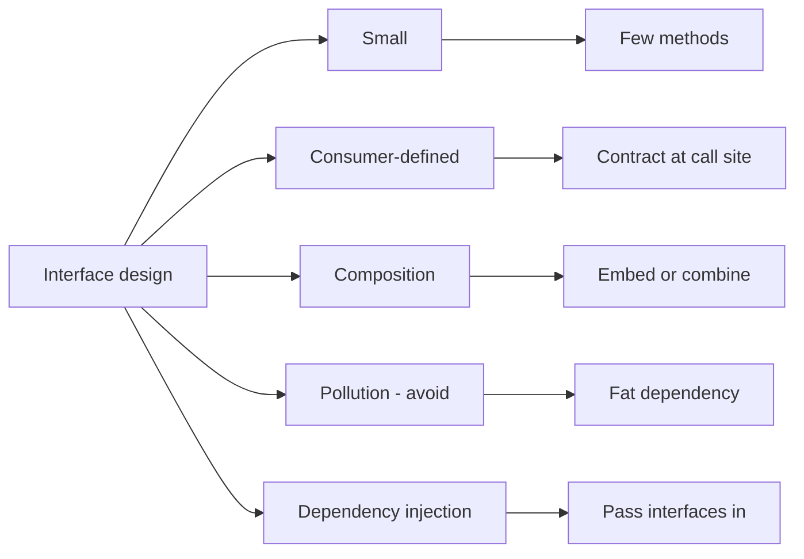

# T12: Interface Design Principles — Visual Map

> Visual-only companion for **[[T12 Interface Design Principles]]**. No long prose—patterns, pictures, and decisions.



## ASCII: fat interface vs slim interface

```text
FAT (one remote, every button)          SLIM (role per caller)
+--------------------------------+      +------------------+
| DatabaseService:               |      |  Reader: Get()   |
| Get* List* Create* Update*     |      +------------------+
| Archive* Delete* Bulk* Audit*  |      |  Writer: Save()  |
| Health* ...                    |      +------------------+
+--------------------------------+      |  Deleter: Del()  |
  every handler "imports" ALL            +------------------+
  mock needs ALL methods                 each handler: only its role
```

## Decision: create an interface, or not?

| Situation | Prefer | Skip / wait |
|-----------|--------|-------------|
| **Testing** a unit without a real DB/FS/HTTP | Small interface the package **needs** | — |
| **Multiple** real implementations (in-memory, file, S3) | `Storage` with `Get/Set/Delete` + wire in `main` | — |
| **Stable** method set used across packages | Public interface at **right** boundary | — |
| **One** struct, one use, no seam yet | — | YAGNI; use concrete type |
| **Churning** API weekly | — | Stabilize first, then extract |
| **Hiding** several return types | Return **interface** from factory (judgment call) | Returning interfaces “everywhere” for style |

## Cheat sheet — 12 facts (for **[[T12 Interface Design Principles]]**)

1. **Accept interfaces, return structs** is the default *shape* of good APIs.  
2. **Small** interfaces are easier to **mock** and to **read**.  
3. **Consumer-defined** = contract drawn where the **call** is, not the library’s ego.  
4. **Pollution** = bloated types everyone must pretend to use.  
5. **Implicit** satisfaction — if methods match, it **compiles**; no `implements`.  
6. **Composition** = combine small interfaces (`ReadCloser` style).  
7. **YAGNI** — no interface until a **seam** (test or second impl) exists.  
8. **Structural** typing: focus on **behavior**, not names on a declaration line.  
9. **`io.Reader`** is the textbook **small, stable** read contract.  
10. **Constructor injection** = pass dependencies **in**, build graphs in `main` / tests.  
11. **Testing** = swap real impl for **fake** on the **narrow** face you use.  
12. **`any` / empty interface** erases the contract; use **concrete** or **named** small interfaces.

---

Back to notes: `../simplified/T12 Interface Design Principles - Simplified.md` · questions: `../questions/`
