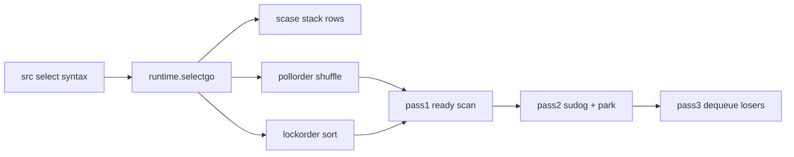

# T17 Select Statement Internals — Visual Map

> Visual-only reference for [[T17 Select Statement Internals]].
> No prose — diagrams and cheat tables.

---

## Concept Map



---

## Data Structure Layouts

```
scase (one arm)
┌────────────────────────────┐
│ c    *hchan   ───► ring/buf + queues + lock
│ elem unsafe.Pointer ─► payload / recv slot
└────────────────────────────┘

order scratch (uint16 slices)
┌──────────────────┬──────────────────┐
│ pollorder[0:n]   │ lockorder[0:n]   │
│ random case idx  │ sorted by &hchan│
└──────────────────┴──────────────────┘
```

---

## Decision Table

| Situation | Outcome |
|-----------|---------|
| First ready in pass1 | Complete op, unlock, return index |
| Nothing ready + `default` | Unlock, index `-1` |
| Nothing ready + no `default` | sudogs + `gopark` |
| `c == nil` | Case skipped |
| All cases nil + no `default` | Deadlock / forever block |
| `select {}` | Forever park |

---

## Before / After

```
BEFORE pollorder:  [case0, case1, case2]  (source text order)

AFTER shuffle:     [case2, case0, case1]  (example)

pass1 walk order:  inspect case2, then case0, then case1
```

---

## Cheat Sheet

1. **`selectgo`** — single runtime entry.
2. **`scase`** — `{c, elem}` per arm.
3. **`pollorder`** — randomized fairness walk.
4. **`lockorder`** — ascending `hchan` address lock sequence.
5. **`sellock` / `selunlock`** — paired bracketing.
6. **`default`** ⇒ **`block=false`** fast exit.
7. **Nil channel** — omitted from poll.
8. **Pass2** — `sudog` **per channel**, **`isSelect`** flag.
9. **Pass3** — remove losing waiters.
10. **Big `n`** — sort + lock cost hurts p99.
11. **No priority** — not source order.
12. **Closed recv** — ready (zero + ok=false after drain).

---
